2024 BAHRAIN GRAND PRIX

29 February - 02 March 2024

From The FIA Formula One Media Delegate Document 4

To All Teams, All Officials Date 29 February 2024

Time 10:00

Title Car Display Procedure

Description Car Display Procedure

Enclosed 2024 Bahrain Grand Prix - Car Presentation Display Procedure.pdf

Roman De Lauw

The FIA Formula One Media Delegate

2024 B G P AHRAIN RAND RIX

29 February – 02 March 2024

From The FIA Formula One Media Delegate

To All Officials, All Teams Date 29 February 2024

CAR PRESENTATION AND DISPLAY PROCEDURES

In addition to the requirements set out in Article 19 of the FIA Formula One Sporting Regulations, please note the following procedures for the Car Presentation and Display at this Competition:

The Car Presentation submissions are listed below.

Between 13:00 and 14:00 on Thursday, one car from each team must be positioned in the same way as previous events, with the other car positioned and available for viewing inside your garage. If only one car will carry the major aerodynamic and bodywork components and assemblies that have not been run at a previous Competition or TCC and are intended to be run at the Competition, this car must be the one displayed to media.

The car outside may be used for pit stop practice but when no pit stop practice is taking place the car must return to the same position. Teams selected for the presentation may not carry out pit stop practice during their allocated presentation timeslot.

At any Competition where it is raining during this presentation, we would ask you to leave the cars in position and use easy ups.

There must be enough space around the entire car on display to allow people to move safely and unhindered – for the avoidance of doubt, this means that any team equipment / infrastructure must not be positioned within 2m of the cars.

Photographers must stay in the fast lane of the pit lane in order to avoid overcrowding around the cars.

The presentations will take place at the below timings: • 13:05 – Car 1 • 13:25 – Car 10 • 13:45 – Car 63

Each team that is selected must have the technical representative indicated previously to the FIA available at these times.

Roman De Lauw

The FIA Formula One Media Delegate

1

Car Presentation – Bahrain Grand Prix

ORACLE RED BULL RACING

|  |  | Updated |  | Primary reason |  | Geometric differences compared to previous | Brief description on how the update works |  |
| --- | --- | --- | --- | --- | --- | --- | --- | --- |
|  |  | component |  | for update |  | version |  |  |
| 1 | Front Wing |  | Performance - Local Load |  | Re-optimised wing elements to better attain the pressure gradients and more stable load. |  |  | Load has beeen increased as pressure gradient targets were met, so this wing has more load than last years whilst maintaing the stability. |
| 2 | Nose |  | Performance - Flow Conditioning |  | Better fairing to the front wing elements and a better pressure control along the length. |  |  | Revised to fit the local changes in the front wing profiles and then tapered to meet the front bulkhead whislt observing the taper requirements to better condition the flow for bodywork downstreeam |
| 3 | Sidepod Inlet |  | Circuit specific - Cooling Range |  | A better inlet shape for the pressure field available to supply the primary heat exchangers |  |  | For greater efficiency, the inlet shape has been revised to better utilise the avaialble pressure to feed the radiators or primary heat exchangers downstream enabling the external profile to be less detrimental to the floor edge detail. |
| 4 | Floor Edge |  | Performance - Local Load |  | More aggressive geometry in the FEW to attain locally greater pressure differences |  |  | Taking inspiration from competitor cars, shapes creating more local load were derived whilst mainaining adequate stability. |
| 5 | Cooling Louvres |  | Circuit specific - Cooling Range |  | Attaining adequate ranges of exit areas to operate in the coolest and warmest ambinent conditions expected. |  |  | Placed to exploit naturally lower pressues exit areas with a range of mass flows for different circuit types and ambient condiitons to maintain system temperatures within the operational limits. |
| 6 | Coke/Engine Cover |  | Performance - Flow Conditioning |  | profiled to improve pressure upstream of the rear wing. |  |  | Better flow to the rear wing enables more efficient load to be generated for a given profile of rear wing. |
| 7 | Front Wing Endplate |  | Performance - Local Load |  | Less loss from the endplate roll-over for more load |  |  | Again taking inspiration from competitor designs, the endplate roll over has been better optimised for reduced local loss and thus more load. |

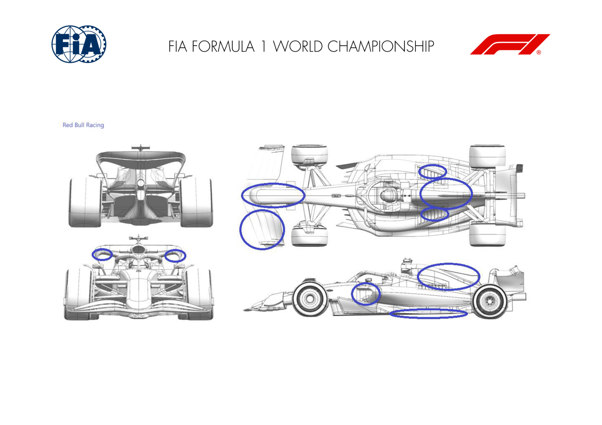

MERCEDES-AMG PETRONAS F1 TEAM

|  |  | Updated |  | Primary reason |  | Geometric differences compared to previous | Brief description on how the update works |  |
| --- | --- | --- | --- | --- | --- | --- | --- | --- |
|  |  | component |  | for update |  | version |  |  |
| 1 | Front Wing |  | Performance - Flow Conditioning |  | Detached forward element from nose and reduced forth element chord inboard. |  |  | Detached forward element improves flow to the rear of the car, improving floor performance. The small chord flap locally offloads the front wing, improving flow to the rear of the car. |
| 2 | Sidepod Inlet |  | Performance - Flow Conditioning |  | Triangular inlet. |  |  | Improves flow quality to the radiator, and also improves flow to the rear of the floor and hence increases floor load. |
| 3 | Floor Body |  | Performance - Local Load |  | Change in the fence camber and floor tunnel profile. |  |  | Changes generate increased local load which in turn increases mass flow under the floor; flow quality to the diffuser improved which improves rear floor load. |
| 4 | Coke/Engine Cover |  | Performance - Flow Conditioning |  | Softened engine cover shoulder. |  |  | Improves flow quality under the upper rear wing, which in turn improves upper wing load - also better management of cooling flow trajectory. |
| 5 | Beam Wing |  | Performance - Local Load |  | Improved section profiling. |  |  | Improved profiling of both beam wing elements has improved their pressure distribution and how they work together and with the diffuser - resulting in better wing efficiency. |
| 6 | Rear Wing |  | Performance - Local Load |  | Increased flap tip cut-out and reprofiling. |  |  | Cut-out and reprofiling cleans up the tip flow structures, which in turn improves tip and wing efficiency without losing wing load. |

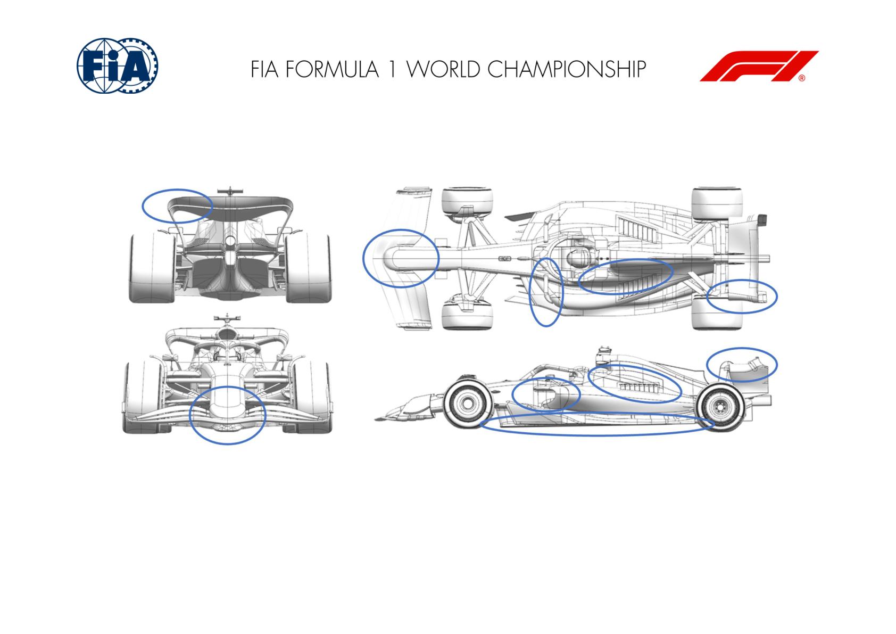

SCUDERIA FERRARI

|  |  | Updated |  | Primary reason |  | Geometric differences compared to previous | Brief description on how the update works |  |
| --- | --- | --- | --- | --- | --- | --- | --- | --- |
|  |  | component |  | for update |  | version |  |  |
| 1 | Sidepod Inlet |  | Performance - Flow Conditioning |  | The sidepod inlet has been reworked and raised, working in conjunction with the redesigned sidepod and coke undercut |  |  | This evolution is improving the flow in the undercut and interactions with the floor edge and the back of the car, whilst retaining the necessary cooling capacity. |
| 2 | Coke/Engine Cover |  | Performance - Flow Conditioning |  |  | The engine cover has been inflated, with a different cooling exit topology and a more prominent central exit. High and wide sidepod shoulder is a visible difference compared to the 2023 car |  | The cooling exit has been more biased towards the central section of the bodywork, still maintaining the needed modulation by using louvres, in order to increase the car overall efficiency |
| 3 | Rear Corner |  | Performance - Flow Conditioning |  | Rear suspension and rear corner have been adapted to suit the bodywork development, offering better inboard and outboard integration, as well as a re- optimized rear corner winglet system |  |  | In conjunction with the re-optimized flow features coming from the front end (coke / sidepod), the regression of the the suspension arms helps to deliver additional energy to the RBD furnitures that have been consequently re-optimzed as a system. |

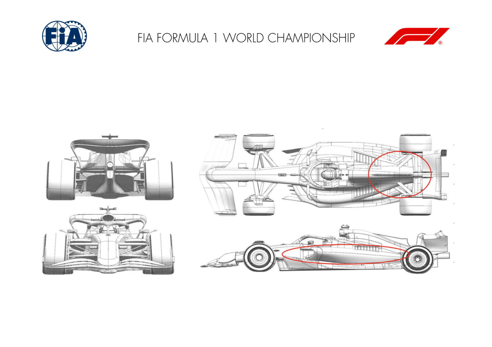

MCLAREN F1 TEAM

|  |  | Updated |  | Primary reason |  | Geometric differences compared to previous | Brief description on how the update works |  |
| --- | --- | --- | --- | --- | --- | --- | --- | --- |
|  |  | component |  | for update |  | version |  |  |
| 1 | Sidepod Inlet |  | Performance - Flow Conditioning |  | Modified Sidepod Inlet |  |  | Completely reshaped Sidepod Inlet and Chassis integration with the aim to improve Flow structure management in all conditions as well as cooling performance. |
| 2 | Coke/Engine Cover |  | Performance - Flow Conditioning |  | New Bodywork Shape |  |  | In conjunction with the Sidepod Inlet, the Bodywork has been redesigned to complement the changes as well improve interaction with the floor. |
| 3 | Floor Edge |  | Performance - Flow Conditioning |  | Floor Edge Modification |  |  | The floor edge has been redesigned to improve both floor loading as well as flow conditioning, resulting from an improved interaction with the modified Bodywork. |
| 4 | Rear Wing |  | Performance - Local Load |  | New Rear Wing Assembly |  |  | Both Rear Wing and Beam wing have been completely redesigned, resulting a gain of efficiency at a drag level suitable for this circuit. |

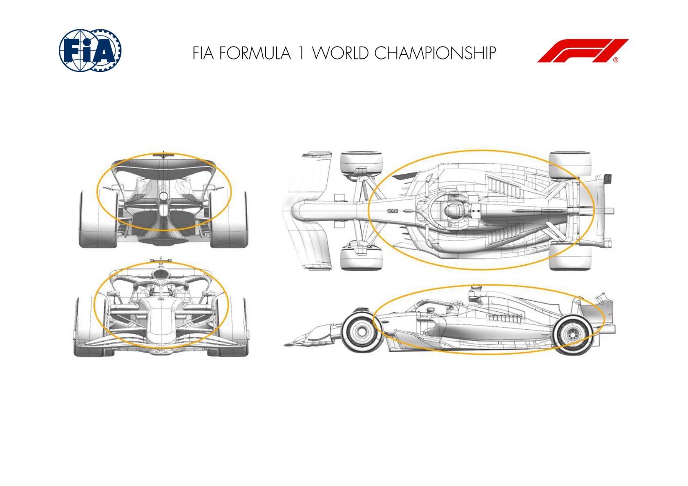

ASTON MARTIN ARAMCO COGNIZANT F1 TEAM

|  |  | Updated |  | Primary reason |  | Geometric differences compared to previous | Brief description on how the update works |  |
| --- | --- | --- | --- | --- | --- | --- | --- | --- |
|  |  | component |  | for update |  | version |  |  |
| 1 | Front Wing |  | Performance - Local Load |  | Front wing mounted to the nose on the second element. |  |  | The revised mounting position improves the loading distribution of the front wing and interaction with surrounding parts for better performance. |
| 2 | Nose |  | Performance - Local Load |  | Shorter nose compared to AMR23, to suit FW mounting change described above. |  |  | The revised mounting position improves the loading distribution of the front wing and interaction with surrounding parts for better performance. |
| 3 | Floor Body |  | Performance - Local Load |  | The leading edge of the floor is higher and other subtle change in the shape of the main floor. |  |  | Part of general re-optimisation of the floor geometry to improve the loading and how this is generated aiming to improve performance through the operating envelope. |
| 4 | Floor Edge |  | Performance - Local Load |  | The floor edge wing has a shorter chord. |  |  | Increased forward floor load local to the change in geometry which also improves the loading on the downstream geometry. |
| 5 | Sidepod Inlet |  | Performance - Flow Conditioning |  | The sidepod inlet is raised. |  |  | Continuation of the 2023 concept to manage the flow to the rear of the car whilst maintaining sufficient flow into the inlet to cool the car. |
| 6 | Coke/Engine Cover |  | Performance - Flow Conditioning |  | Undercut depth has increased, and the exit of the bodywork has a revised profile. |  |  | The undercut works in conjunction with the raised inlet to improve flow to the rear of the car. The exit of the bodywork is shaped to manage the position of the internal cooling flow downstream. |
| 7 | Rear Suspension |  | Performance - Mechanical Setup |  | Suspension member fairings to shroud the revised structural layout. |  |  | The geometry of the structures defines the fundamental layout of the surfaces which are then optimised to the surrounding flowfield. |
| 8 | Rear Corner |  | Performance - Local Load |  | Rear brake duct modified to suit the revised rear suspension layout from our supplier. |  |  | The rear suspension layout change required different geometry for local loading on the corner geometry and it's effect on the wake of the rear tyre. |
| 9 | Beam Wing |  | Performance - Local Load |  | Inboard both elements now mount to the crash structure. |  |  | Change made to improve the performance of the inboard region of the wing, removing the centre portion of the second element. |

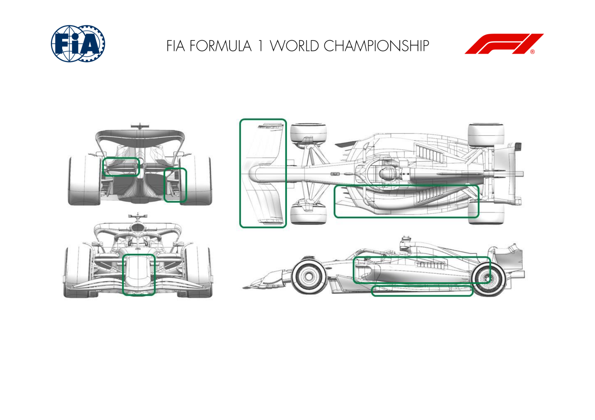

BWT ALPINE F1 TEAM

|  |  | Updated |  | Primary reason |  | Geometric differences compared to previous | Brief description on how the update works |  |
| --- | --- | --- | --- | --- | --- | --- | --- | --- |
|  |  | component |  | for update |  | version |  |  |
| 1 | Front Wing |  | Performance - Flow Conditioning |  | It is a completely revised front wing for 2024. |  | The front wing has revised span-wise loading to improve air flow further down the car. |  |
| 2 | Floor Edge |  | Performance - Flow Conditioning |  | The floor edges contain revised edge details. |  |  | The new floor edge geometry affects flow underneath the car to the diffuser for more performance. |
| 3 | Front Wing |  | Performance - Local Load |  |  | This is a new part since the pre-season test. A front wing gurney has been produced and made available on the trailing edge of the front wing flap. | Additional front wing load to allow higher aero balance if required. |  |

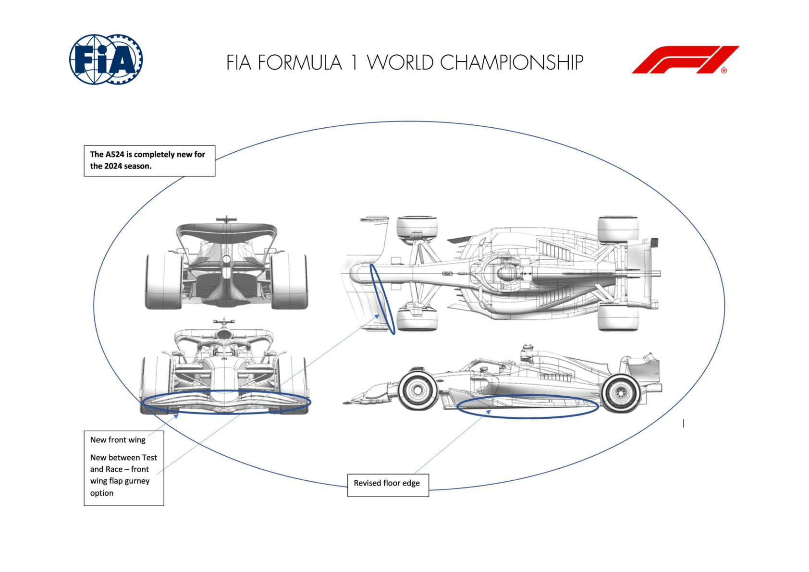

WILLIAMS RACING

|  |  | Updated |  | Primary reason |  | Geometric differences compared to previous | Brief description on how the update works |  |
| --- | --- | --- | --- | --- | --- | --- | --- | --- |
|  |  | component |  | for update |  | version |  |  |
| 1 | Front Wing |  | Performance - Local Load |  | The whole front wing geometry is new for 2024. Chord lengths, aerofoil profiles and connection to nosebox are all updated. |  |  | The front wing geometry works in conjunction with the new nosebox, front suspension and floor geometries to generate local load and to setup the flow for the rest of the car. |
| 2 | Nose |  | Performance - Local Load |  | The nosebox has a new profile and the detail around the connection to the front wing is new for FW46. |  |  | The nose geometry works in conjunction with the new front wing, front suspension and floor geometries to generate local load and to setup the flow for the rest of the car. |
| 3 | Front Suspension |  | Performance - Flow Conditioning |  |  | The layout of the front suspension is updated. Most notably, the trackrod position is changed and the front top wishbone is now split into two separate legs. |  | The front suspension outboard elements play an important role in working alongside the front wing, nose, chassis side panel and HALO/mirror setup to help condition the flow to the sidepods and floor. |
| 4 | Front Suspension |  | Performance - Mechanical Setup |  | The layout of the front suspension is updated. Most notably, the trackrod position is changed and the front top wishbone is now split into two separate legs. |  |  | Whilst being critically important to the aerodynamic behaviour of the car, the front suspension must also deliver a suitable car balance and steering feedback to the driver. Some of the mechanical details of the installation are updated accordingly for 2024. |
| 5 | Floor Body |  | Performance - Local Load |  | The entire floor geometry is updated for 2024. The details are primarily on the underside of the floor but the upper surface and floor edge (See below) are also updated to make the most of the high energy flow. |  |  | The floor body generates local load, conditions the flow ahead of the diffuser and rear wing. It also supports the car as it touches the ground on the straights and must survive the impacts to ensure that the car remains legal and robust throughout a race weekend. |
| 6 | Floor Fences |  | Performance - Flow Conditioning |  | The floor fences have been updated in position and curvature for FW46. |  |  | These devices condition the flow entetering the forward floor helping to produce local floor load and set up the flow ahead of the diffuser. |

| 7 | Floor Edge | Performance - Local Load |  | The floor edge has been substantilly updated for 2024. More elaborate and aggressive geometry is present for 2024. This captures the learning from FW45 and makes the most of the improved flow quality around the front of the car and the floor. | The floor edge produces local load and contributes to the overall flow field ahead of the rear brake duct furniture. |  |
| --- | --- | --- | --- | --- | --- | --- |
| 8 | Sidepod Inlet | Performance - Flow Conditioning | The sidepod inlet is new for 2024 and features an extended lip. |  |  | The sidepod inlet ensures good flow to the cooling system and helps condition the flow down the side of the car. |
| 9 | Diffuser | Performance - Local Load | The diffuser geometry is modified for 2024 to maximise the load from the onset flow. |  | The diffuser creates as much local load as possible by modifying the air volume. |  |
| 10 | Coke/Engine Cover | Circuit specific - Cooling Range |  | The coke and engine cover geometry is new for 2024 and features and aggressive slide from the front of the cooling inlet to the rear corner. A variety of louvres panels and centreline exits provide opportunity to adjust the flow through the cooling system. | The louvres adjust the total mass flow rate through the cooling system and allow the system to be tuned to circuit and environmental characteristics. |  |
| 11 | Beam Wing | Circuit specific - Drag Range |  | The beam wing is part of the overall rear wing assembly. For 2024 there are two elements to the beam wing, which helps adjust the drag and downforce for each circuit. The forward element in particular will be adjusted as required. | Provides options to quickly and efficiently trade downforce and drag to suit the track and prevailing conditions. |  |
| 12 | Rear Wing | Performance - Local Load |  | The rear wing assembly is new for FW46 and features the familiar disconnect between the flap element and the endplate. The whole geometry is new with updated profiles, chord and span. | Generates significant but efficient downforce and drag. Offers a range of upper gurney flaps as well as lower wing elements to tune downforce and drag. |  |
| 13 | Rear Suspension | Performance - Mechanical Setup | The FW46 features rear suspension geometry used by MGP in 2023. The outboard geometry is very similar to the FW45 but offers a small update to the leg positions and interface with the upright. |  |  | The rear suspension legs are an important aero flow control surface and help increase the performance of the brake duct furniture, diffuser and rear wing. They also determins the tyre presentation, which is critical for overall performance and tyre management. |

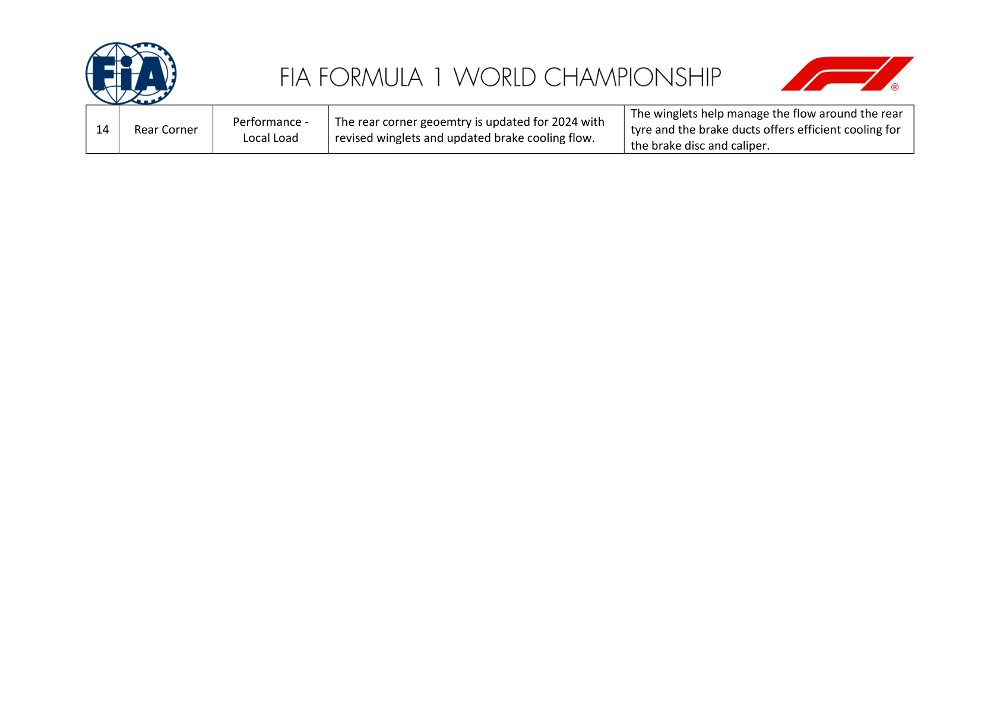

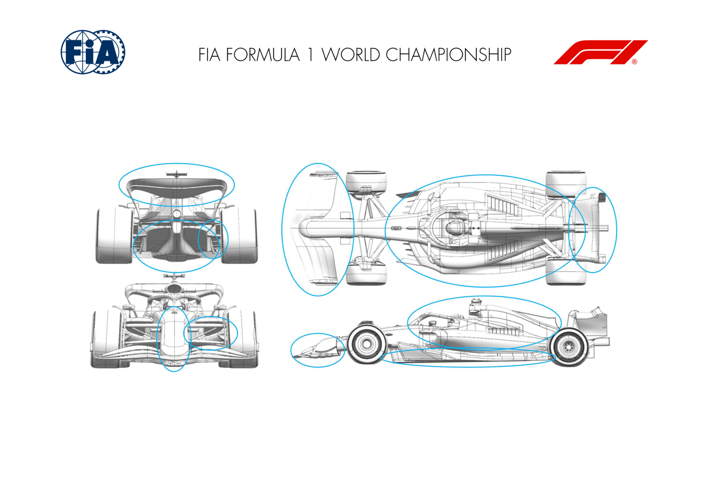

VISA CASH APP RB F1 TEAM

|  |  | Updated |  | Primary reason |  | Geometric differences compared to previous | Brief description on how the update works |
| --- | --- | --- | --- | --- | --- | --- | --- |
|  |  | component |  | for update |  | version |  |
| 1 | Nose |  | Performance - Local Load |  | The AT05 nose / front wing junctions have been modified. The geometry of the nose has also been extensively modified |  | The revised nose / front wing junctions generate more local load reduce losses |
| 2 | Front Wing |  | Performance - Local Load |  | The inboard sections of the FW have been modified in sympathy with the revised nose geometry. The first element of the mainplane has been extensively revised with elements two, three and four remaining closely similar to AT04. |  | The inboard front wing changes work in harmony with the nose geometry above to deliver higher local loading. |
| 3 | Front Suspension |  | Performance - Flow Conditioning |  | The front suspension has been extensively redesigned and a pull-rod element now controls front wheel movement compared to a push-rod on AT04. The trackrod remains in a low position ahead of the front lower wishbone, similar to AT04. |  | The pull-rod element, locating high on the upright outboard, requires a different front brake duct scoop. The inboard front suspension has been revised to work with the new nose geometry described above. |
| 4 | Front Corner |  | Performance - Flow Conditioning |  | The front brake duct assembly has been redesigned to accommodate the new pull-rod suspension. The scoop geometry itself is closely similar to AT04 but with greater separation now to the front top wishbone and pull-rod elements. |  | The scoop provides similar cooling flow to front brake discs and calipers but with a cleaner interaction with the outboard suspension elements, providing a better downstream flowfield. |

| 5 | Floor Body | Performance - Local Load | The floor has been redesigned with updates to the fences as well as floor roof surfaces. | All of the underfloor changes achieve greater and cleaner loading downstream. |
| --- | --- | --- | --- | --- |
| 6 | Floor Edge | Performance - Local Load | The floor edge features a similar floor edge wing to AT04 but modified to suit latest developments on the main floor itself. | The floor edge wing philosophy of AT04 carries over but with further development to extract more local load from this device, also aided by the upstream flow improvements described above. |
| 7 | Diffuser | Performance - Local Load | The diffuser has modifications based on upstream flow changes | The diffuser changes generate increased local load for improved rear axle grip. |
| 8 | Sidepod Inlet | Performance - Flow Conditioning | The sidepod inlet has been raised and the upper leading edge regressed. | The revised inlet geometry provides better quality flow to the sidepod radiators for an efficiency improvement of the cooling system. |
| 9 | Coke/Engine Cover | Performance - Flow Conditioning | The coke line has been pulled inboard compared to AT04. The upper sidepod has also increased in height with the upper engine cover surfaces dropping towards the rear floor. | The bodywork provides a better flowfield to the rear of the car. |
| 10 | Cooling Louvres | Performance - Flow Conditioning | Bodywork cooling louvres are very similar to AT04. | The size and position of these continue to work well on AT05 to allow greater flow through the radiator cores as required based on circuit demands and ambient conditions whilst minimising any adverse impact on rear downforce from the low energy cooling air that exits these devices. |
| 11 | Rear Wing | Performance - Local Load | Rear wing profiles have been redesigned to improve Cp profiles | Improved efficient load generation |

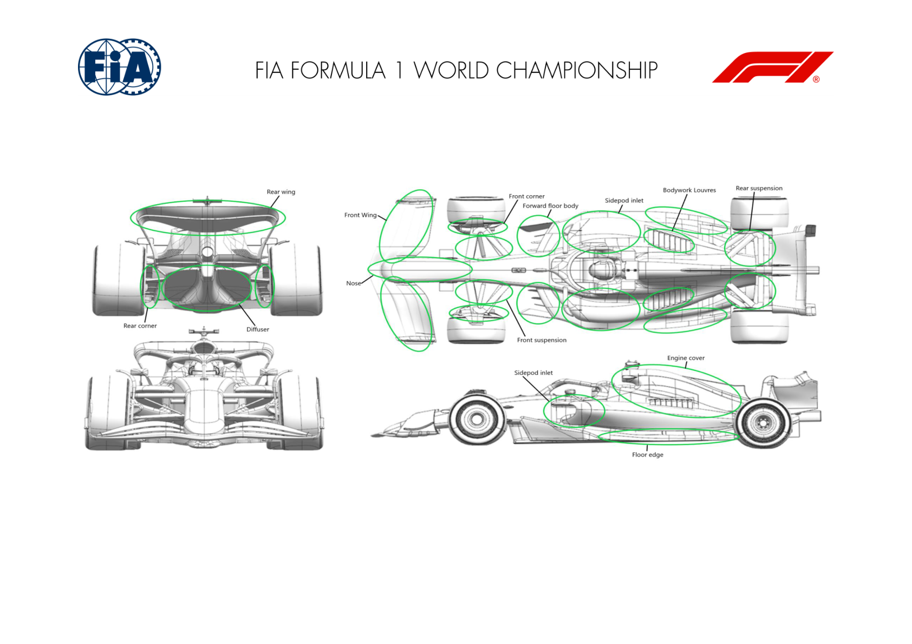

STAKE F1 TEAM KICK SAUBER

|  |  | Updated |  | Primary reason |  | Geometric differences compared to previous | Brief description on how the update works |  |
| --- | --- | --- | --- | --- | --- | --- | --- | --- |
|  |  | component |  | for update |  | version |  |  |
| 1 | Front Suspension |  | Performance - Flow Conditioning |  | Switched the front suspension geometry from push- rod to pull-rod |  | The change to pull-rod was mostly dictated by aerodynamic, not mechanical reasons. It allows to maximise the efficiency of the aero package throughout the whole car. |  |
| 2 | Coke/Engine Cover |  | Performance - Flow Conditioning |  | Aggressive redesign of engine cover and sidepods |  | Influenced by the changes at the front of the car (see above), we took an aggressive approach to redesigning the engine cover, the sidepod and the coke area to maximise downforce and aero efficiency. |  |
| 3 | Floor Body |  | Performance - Flow Conditioning |  | Complete redesign of the floor |  |  | As part of our redesign for 2024, we took a novel approach to the floor with some solutions, mostly in the main body part, aimed at generating increased downforce. |

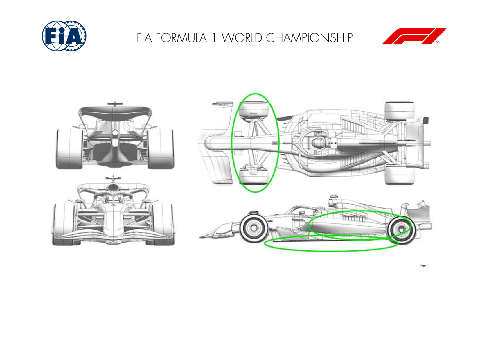

MONEYGRAM HAAS F1 TEAM

|  |  | Updated |  | Primary reason |  | Geometric differences compared to previous | Brief description on how the update works |
| --- | --- | --- | --- | --- | --- | --- | --- |
|  |  | component |  | for update |  | version |  |
| 1 | Front Wing Endplate |  | Performance - Flow Conditioning |  | Revised Front Wing Endplate and Side Vane |  | The revised Endplate design allows an improved flow conditioning, obtained with a new side vane design and revised lower slot layout, allowing to better control the front wheel wake. |
| 2 | Front Wing |  | Performance - Flow Conditioning |  | Optimized profile design, compliant with new front suspensions |  | The new Front Wing allows to increase the overall car load with improved flow conditioning impacting the front suspension and the rest of the car. |
| 3 | Sidepod Inlet |  | Performance - Flow Conditioning |  | The Sidepod Inlet is much higher compared to last year, allowing a larger undercut |  | The inlet is optimized for cooling performance. The wide-open area below favours flow delivery to the back end of the car. |
| 4 | Floor Body |  | Performance - Local Load |  | New Floor concept, with higher leading edge and new tunnel design |  | The new design allows an increased flow feed of floor and diffuser, permitting to generate more downforce and changing the balance between upper and lower floor flows. |
| 5 | Floor Fences |  | Performance - Local Load |  | The new floor body required a complete re-design of the floor fences |  | The fences are optimized for the new floor design, now generating local load and conditioning the flow impacting the floor edge and the diffuser. |

| 6 | Floor Edge | Performance - Local Load | New floor and bodywork required a re-design of the floor edge | The new design optimizes the different impacting flow and allows to gain performance by increased extraction and by the generated vortexes travelling downstream. |
| --- | --- | --- | --- | --- |
| 7 | Coke/Engine Cover | Performance - Flow Conditioning | New design of the engine cover | The new engine cover features additional centre cooling exits, allowing to reduce the louvers on the sidepods, thus limiting the low energy flow impacting the rear wing elements. |
| 8 | Front Suspension | Performance - Flow Conditioning | New Front Suspension design and updated covers | The new kinematics required new suspension member fairings, designed for efficiency and improved flow conditioning downstream. |
| 9 | Front Corner | Performance - Flow Conditioning | Updated internal and external design | The new internal ducting improves brake cooling performance. The external shape is designed to be compliant with the new suspensions, aiming to influence front wheel wake. |
| 10 | Rear Suspension | Performance - Flow Conditioning | Updated rear suspension with revised fairing design | The new floor and bodywork design imply different flow impacting on the rear suspensions: the new farings aim for efficiency and conditioning of the corner flow. |
| 11 | Rear Corner | Performance - Local Load | Revised internal and external design | The new internal design aims to improve brake cooling performance. Furthermore, the devices on the inboard face aim to improve local load and diffuser extraction. |

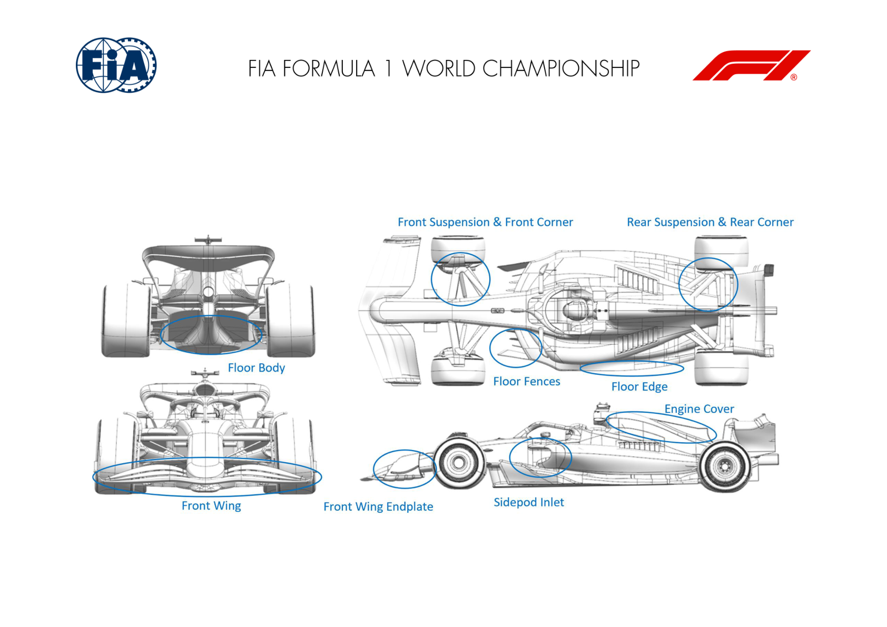
