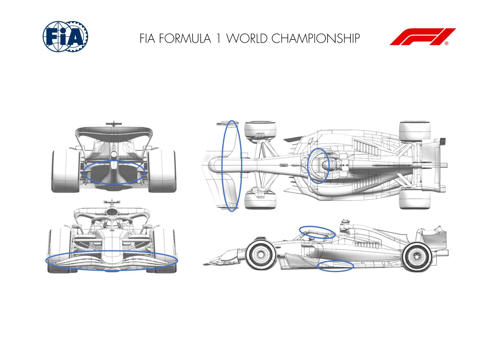
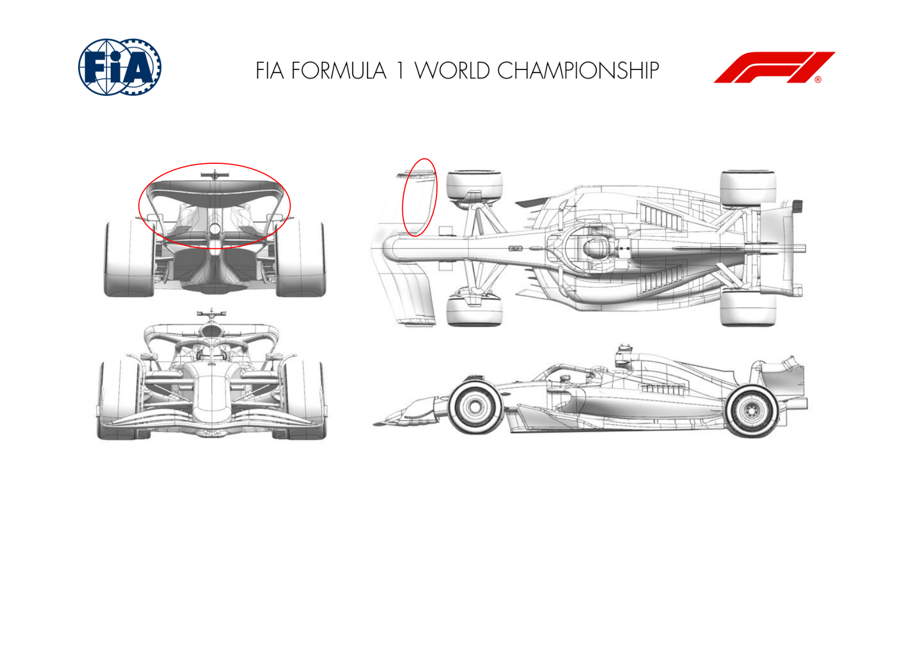
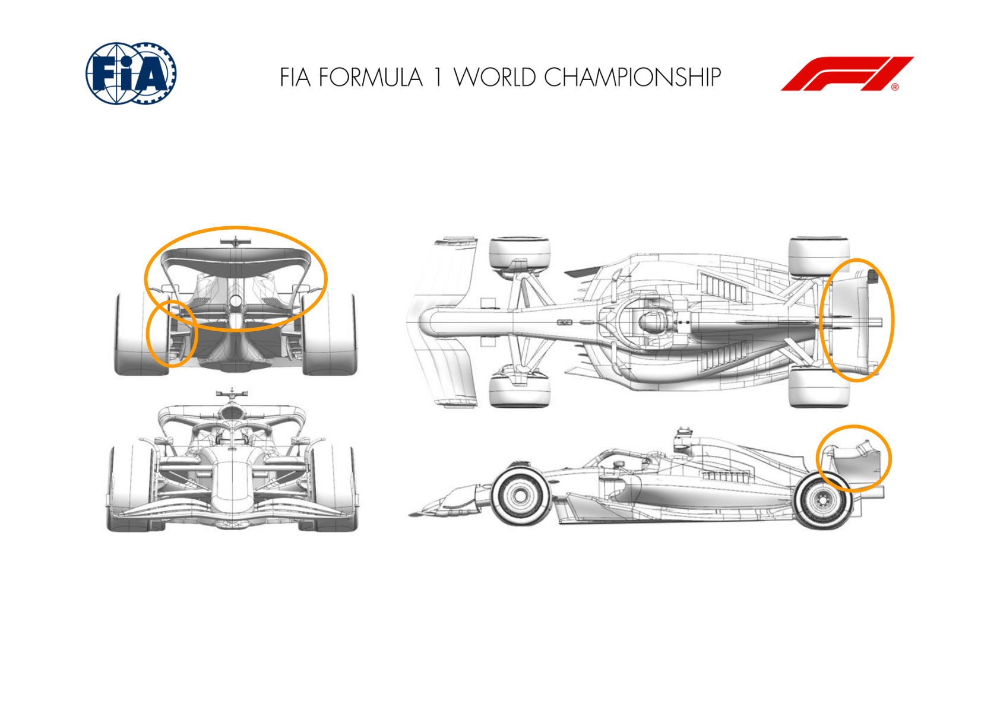
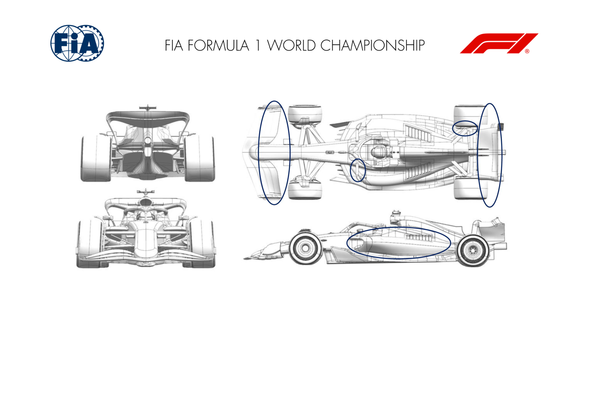
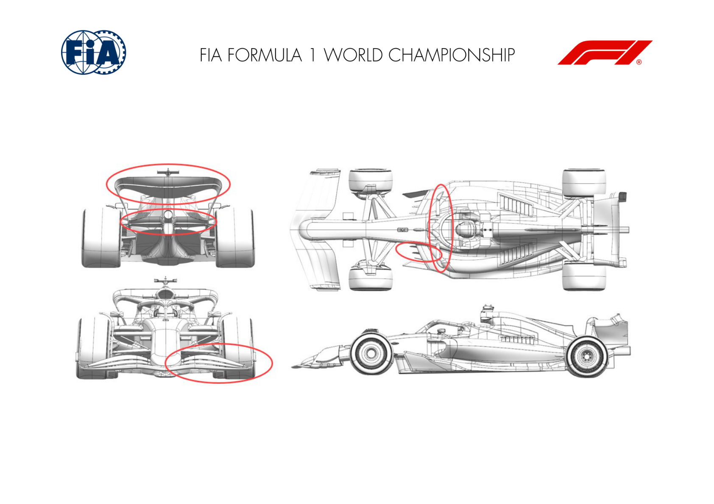
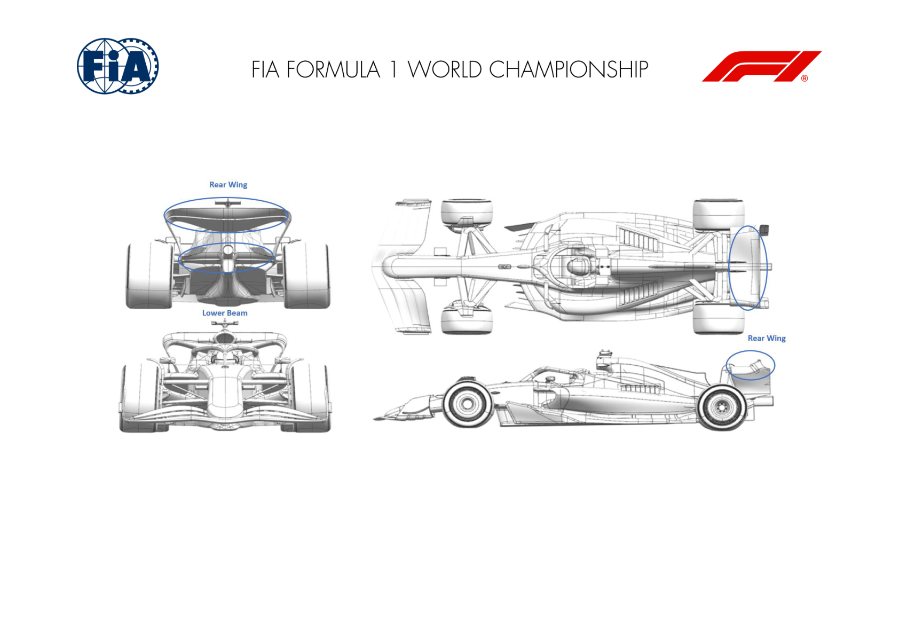

2024 BELGIAN GRAND PRIX

26 - 28 July 2024

From The FIA Formula One Media Delegate Document 9

To All Teams, All Officials Date 26 July 2024

Time 10:57

Title Car Presentation Submissions

Description Car Presentation Submissions

Enclosed 2024 Belgian Grand Prix - Car Presentation Submissions.pdf

Roman De Lauw

The FIA Formula One Media Delegate

Car Presentation – R14 Belgian Grand Prix

Red Bull Racing

No updates submitted for this event.

Car Presentation – 2024 Belgian Grand Prix

*Mercedes-AMG PETRONAS F1 Team*

| No. | Updated component | Primary reason for update | Geometric differences | Description |
| --- | --- | --- | --- | --- |
| 1 | Diffuser | Performance - Local Load | Subtle changes to diffuser roof profile. | Increased rear camber in the diffuser roof region increases local flow acceleration which in turn increase local downforce and drag. |
| 2 | Floor Edge | Performance – Local Load | Revised floor edge wing with additional flap element added over forward section. | The additional floor edge flap element drops the local pressure behind the fence systems which in turn increases forward floor load. |
| 3 | Beam Wing | Performance – Drag Reduction | Single element beam wing. | Single element, low camber beam wing designed to reduce local downforce and drag; suitable for high L/D track like Spa. |
| 4 | Front Wing | Circuit Specific – Balance Range | Low camber, small chord front wing flap. | Reduced chord and camber front wing flap element reduces local front wing load to allow a sensible car balance to be achieved when running low downforce rear wings (as Spa). |
| 5 | Halo | Performance – Drag Reduction | Removed flap element from Halo fairing. | Removing the Halo fairing flap reduces local downwash which in turns reduces drag by altering the onset flow to the rear of the car. |

Car Presentation – Belgian Grand Prix

*SCUDERIA FERRARI*

| No. | Updated component | Primary reason for update | Geometric differences | Description |
| --- | --- | --- | --- | --- |
| 1 | Front Wing | Circuit specific - Balance Range | Lower Downforce Front Wing Flap design and trims | The depowered front wing flap provides the required aero balance range associated to the optimum downforce level anticipated for Spa. Different trims are available, to allow modulation |
| 2 | Rear Wing | Circuit specific - Drag Range | Lower Downforce Top and Lower Rear Wing designs | This update features depowered Top and Lower Rear Wing profiles in order to adapt to Spa layout peculiarities and efficiency requirements |

Car Presentation – Belgian Grand Prix

McLaren Racing

| No. | Updated component | Primary reason for update | Geometric differences | Description |
| --- | --- | --- | --- | --- |
| 1 | Rear Wing | Circuit specific - Drag Range | Low Downforce Rear Wing | In anticipation of high isochronal circuits, a less loaded Rear Wing assembly is introduced for this event, with the aim of reducing drag efficiently. |
| 2 | Beam Wing | Circuit specific - Drag Range | Offloaded Beamwing | With the target to increase the operating range of the newly introduced low downforce wing, an offloaded Beam Wing has been designed to trade downforce and drag efficiently. |
| 3 | Rear Corner | Circuit specific - Drag Range | Low Drag Rear Brake Duct furniture | The rear brake duct furniture has been updated, adapting to the low downforce Rear Wing and Beam Wing configuration brought to this event. |

Car Presentation – Belgian Grand Prix

Aston Martin Aramco F1 Team

No updates submitted for this event.

Car Presentation - Belgian Grand Prix

BWT Alpine F1 Team

| No. | Updated component | Primary reason for update | Geometric differences | Description |
| --- | --- | --- | --- | --- |
| 1 | Front Wing | Performance - Local Load | Reprofiled front wing flap elements. | Compared to previous specification, the new front wing features different profiles to give the ability to cover the full balance range required for lower downforce races. |
| 2 | Coke/Engine Cover | Circuit specific - Cooling Range | Redesigned engine cover. | As part of our normal development cycle, this new engine cover is designed to improve our overall cooling efficiency by reviewing the channelling of the internal airflow. |
| 3 | Rear Corner | Circuit specific - Cooling Range | New inlet and exit ducts with new furniture. | As part of our normal development cycle, this new rear corner aims at giving more authority on the management of our rear brake temperature through a wider inlet duct as well as a larger exit duct. |
| 4 | Beam Wing | Circuit specific - Drag Range | New reprofiled single element rear beam wing. | The updated single element wing offers a small reduction in drag and will improve the aerodynamic efficiency of the car overall to extend our rear wing and beam wing range. |
| 5 | Rear Wing | Circuit specific - Drag Range | A lower camber rear wing assembly to suit the lift/drag requirements | At a given speed, the wing has less aerodynamic load and therefore drag than the rear wings used in previous events |
| 6 | Mirror | Performance - Flow Conditioning | New wing mirror stay geometry. Together with the above mentioned sidepod and the engine cover update we reprofiled the mirror stays to achieve better flow control and flow quality towards the rear of the car | ogether with the above mentioned sidepod and the engine |

Car Presentation - Belgian Grand Prix

WILLIAMS RACING

No updates submitted for this event.

Car Presentation – Belgian Grand Prix

Visa Cash App RB

| No. | Updated component | Primary reason for update | Geometric differences | Description |
| --- | --- | --- | --- | --- |
| 1 | Rear Corner | Circuit specific - Drag Range | Modified winglet profiles. | The winglets on the rear corner are replaced with a different arrangement, efficiently reducing downforce & drag and better suited to Spa & other low downforce circuits. |
| 2 | Beam Wing | Circuit specific - Drag Range | Biplane configuration with low incidence elements for use with certain wing levels. | The low incidence biplane configuration efficiently reduces load & drag for low downforce circuits, whilst continuing to provide low pressure for the diffuser. |
| 3 | Rear Wing | Circuit specific - Drag Range | Reduced camber, chord & incidence upper elements to achieve lower drag level target. | Low downforce circuits demand more efficient, less-loaded rear wings. Less cambered aerofoil sections at lower angles of incidence generate less downforce & less induced drag. |

Rear corner Rear wing

Beam wing

Car Presentation – 2024 Belgian Grand Prix

KICK F1 Team Sauber

| No. | Updated component | Primary reason for update | Geometric differences | Description |
| --- | --- | --- | --- | --- |
| 1 | Mirror | Performance - Local Load | Updated mirror geometry | The new mirror stays were designed to provide better flow control and flow quality for the rear end of the car. |
| 2 | Floor fence | Performance - Drag reduction | Reworked floor fences | The reworked floor fences deliver a local load step while maintaining good flow quality towards the end of the car. |
| 3 | Front wing | Performance - Flow Conditioning | Shorter chord flap | The smaller front flap reduces the load generated by the front wing to ensure that we can balance the low-drag rear wing introduced for this circuit. |
| 4 | Rear wing | Performance - Mechanical Setup | Redesigned upper flap | The re-profiled rear wing upper flap was designed for the low drag requirements seen in Spa. The new shape improves the aerodynamic efficiency of the car. |
| 5 | Beam Wing | Reliability | Redesigned beam wing profile | Together with the new upper flap mentioned above, the new beam wing is another step of aerodynamic efficiency designed specifically for low drag tracks like Spa. |

Car Presentation – 2024 Belgian Grand Prix

MONEYGRAM HAAS F1 TEAM

| No. | Updated component | Primary reason for update | Geometric differences | Description |
| --- | --- | --- | --- | --- |
| 1 | Rear Wing | Performance - Drag reduction | Less cambered Rear Wing profiles | This is a low drag Rear Wing configuration: it reduces the local load in an efficient way. In order to tune the drag level this Rear Wing is compatible with different Lower Beam options. |
| 2 | Beam Wing | Performance - Drag reduction | Less cambered Lower Beam profiles available. | This lower beam option reduces the camber of the profiles, allowing a further tuning option of the overall drag level of the car. |

