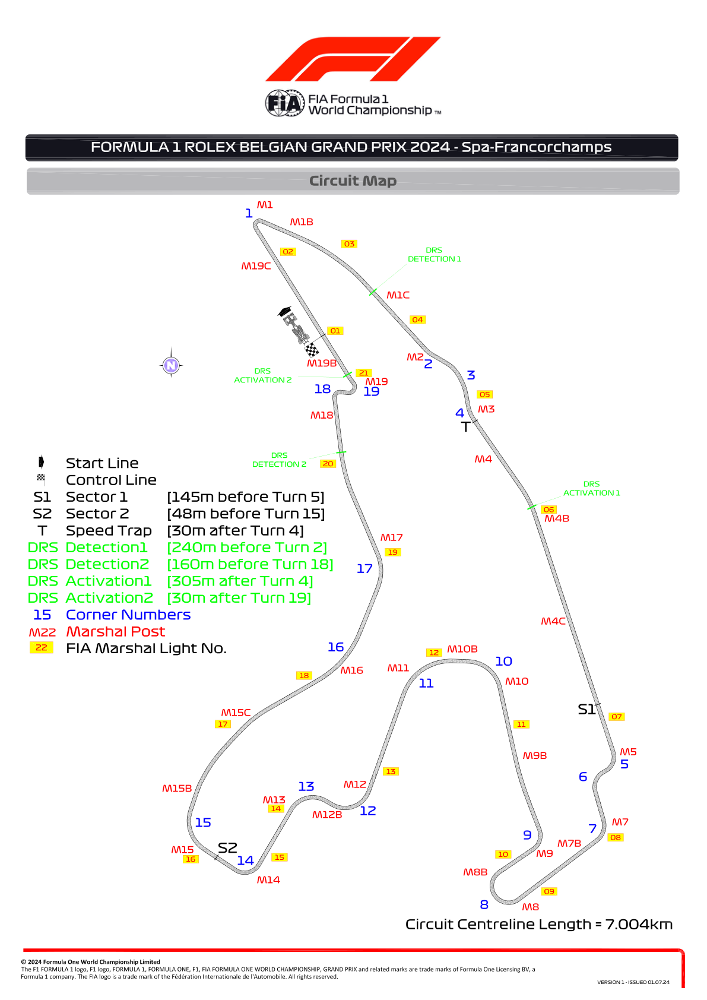
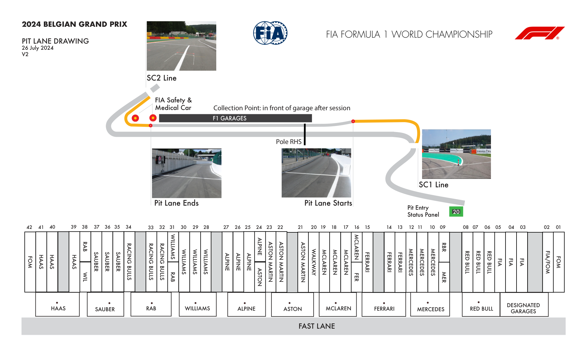
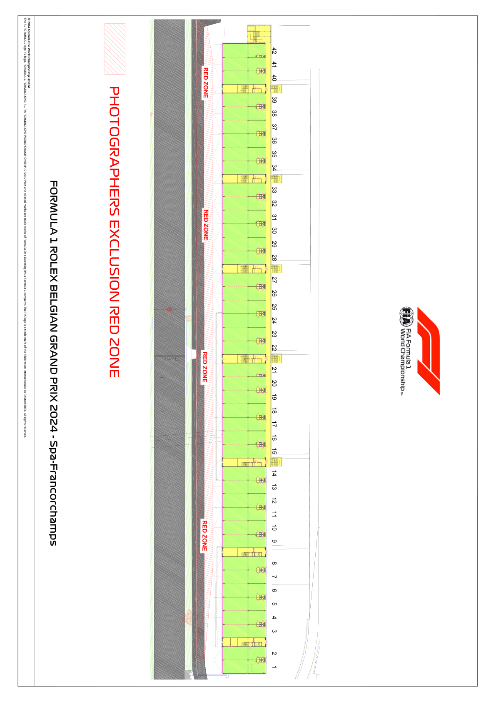

2024 BELGIAN GRAND PRIX

26 - 28 July 2024

From The FIA Formula One Race Director Document 8

To All Teams, All Officials Date 26 July 2024

Time 10:12

Title Event Notes - Circuit Map, Pit Lane Drawing and Red Zones V2

Description Event Notes - Circuit Map, Pit Lane Drawing and Red Zones V2

Enclosed Event Notes - Circuit Map, Pit Lane Drawing and Red Zones V2.pdf

Niels Wittich

The FIA Formula One Race Director

