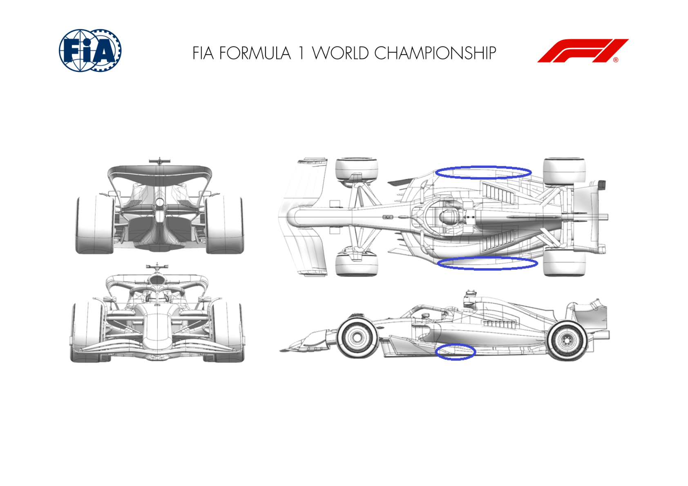
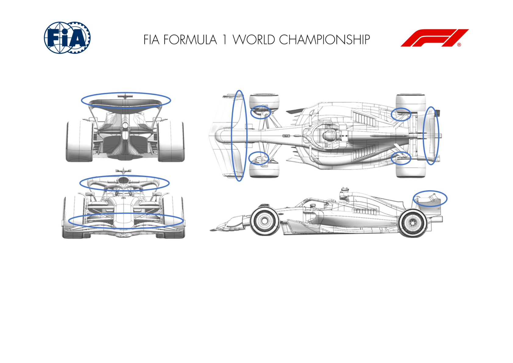
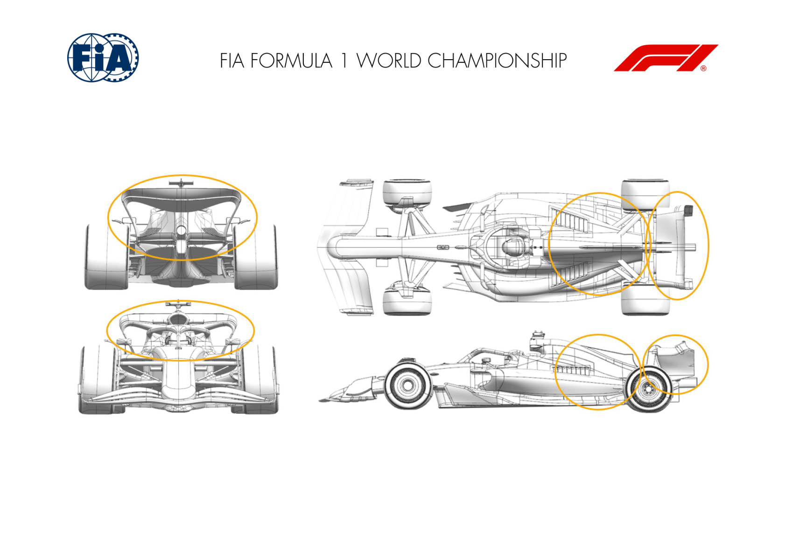
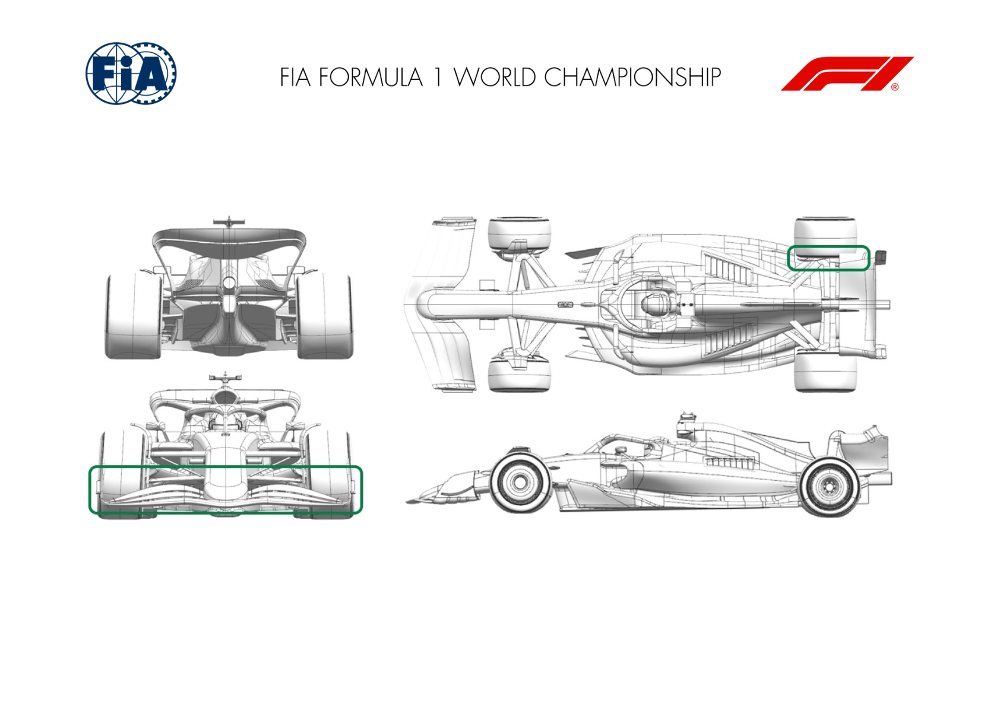

2024 BRITISH GRAND PRIX

05 - 07 July 2024

From The FIA Formula One Media Delegate Document 9

To All Teams, All Officials Date 05 July 2024

Time 09:56

Title Car Presentation Submissions

Description Car Presentation Submissions

Enclosed 2024 British Grand Prix - Car Presentation Submissions.pdf

Roman De Lauw

The FIA Formula One Media Delegate

Car Presentation – British Grand Prix

ORACLE RED BULL RACING

| No. | Updated component | Primary reason for update | Geometric differences | Description |
| --- | --- | --- | --- | --- |
| 1 | Floor Body | Performance - Flow Conditioning | Subtle re-profiling of the surface above and behind the lower SIS tube | Optimising the upper floor surface further based upon research and comparison with full scale results to get more energy thus presure to the floor edge wing. |
| 2 | Floor Edge | Performance - Local Load | Minor re-profiling of the edge wing with attendant detail | Given higher pressure upstream, the edge wing detail has been subtley changed to add more camber deriving more load whilst respecting the necessity for flow stability. Trimmed/ smaller chord flap, reduces front wing load to achieve sensible car balance if low downforce rear wing is chosen to run. |
| 1 | Rear Wing | Circuit specific - Drag Range | Reprofiled flap | Reducing local flap curvature reduces local flap load and offloads the mainplane - results in a lower downforce and lower drag upper wing. |
| 2 | Front Corner | Circuit specific - Cooling Range | Smaller front brake duct inlet and exit | Reducing the brake duct inlet and exit size reduces the mass flow feeding and cooling the brake disc and calliper. |
| 3 | Rear Corner | Performance - Local Load | Upper lip realignment | Better aligning the upper caketin lip to the local onset flow improves flow attachment through a range of conditions resulting in more local load. |

MERCEDES-AMG PETRONAS FORMULA ONE TEAM

4

SCUDERIA FERRARI

No updates submitted for this event.

MCLAREN FORMULA 1 TEAM

| No. | Updated component | Primary reason for update | Geometric differences | Description |
| --- | --- | --- | --- | --- |
| 1 | Rear Wing | Circuit specific - Drag Range | Lower Downforce Rear Wing | In anticipation of higher isochronal circuits, a less loaded Rear Wing assembly is introduced for this event, with the aim of reducing drag efficiently. |
| 2 | Beam Wing | Circuit specific - Drag Range | High load Beamwing | With the target to widen the operating range of the newly introduced low downforce wing, a high load Beam Wing has been designed to trade downforce and drag efficiently. |
| 3 | Beam Wing | Circuit specific - Drag Range | Mid load Beamwing | With the target to increase the operating range of the newly introduced low downforce wing, a mid load Beam Wing has been designed to trade downforce and drag efficiently. |
| 4 | Beam Wing | Circuit specific - Drag Range | Low load Beamwing | With the target to increase the operating range of the newly introduced low downforce wing, a low load Beam Wing has been designed to trade downforce and drag efficiently. |
| 5 | Coke/Engine Cover | Circuit specific - Cooling Range | Additional Cooling Exit | The new Bodywork features an additional cooling exit, allowing an increase in cooling massflow, resulting in both an increase in overall cooling capacity as well as efficiency. Changing the twist distribution of the wing modifies Modified twist distribution of the wing elements the spanwise loading to improve the overall |
| 1 | Front Wing |  | Load Performance - Local | changing the front view shape. performance of the wing and downstream interactions. The twin elements offer an improvement in The small element on the outboard face of the lip has alignment and downwash for improved wheel wake |
| 2 | Rear Corner |  | Load | been replaced with a twin arrangement. management increasing the load on surrounding geometry. |

ASTON MARTIN ARAMCO FORMULA ONE TEAM

BWT ALPINE F1 TEAM

No updates submitted for this event.

WILLIAMS RACING

No updates submitted for this event.

VISA CASH APP RB FORMULA ONE TEAM

| No. | Updated component | Primary reason for update | Geometric differences | Description |
| --- | --- | --- | --- | --- |
| 1 | Halo | Performance - Flow Conditioning | The winglet on the top of the Halo will be removed in some configurations. | The airflow around the Halo influences the downstream areas of the car including the rear wing, making removing it relevant in certain circumstances. |

STAKE F1 TEAM KICK SAUBER

| No. | Updated component | Primary reason for update | Geometric differences | Description |
| --- | --- | --- | --- | --- |
| 1 | Floor Fences |  | Performance – Flow Conditioning | An additional, alternative trim of the floor fences The different trim of the floor fences further optimises the flow of air in this crucial area of the car, improving the overall flow and aero efficiency of the package. The different expansion increases the floor suction |
| 1 | Floor Body |  | Load Performance - Flow | Modification of the expansion with this new floor and therefore the underfloor mass-flow, resulting in overall more load coming from the floor. The new floor geometry requires a different |
| 2 | Floor Fences |  | Conditioning Performance - Local | Alignment of the floor fences alignment of the front floor fences, as the direction of the incoming floor changes with the floor expansion. The new floor body has a different expansion and therefore requires an adaptation of the floor edge The new floor body required a modification of the floor |
| 3 | Floor Edge |  | Load Performance - Flow | wing, which is now more coherent with floor body edge as well and is able to extract more flow, resulting in a local load increase. This geometry allows to deliver a cleaner floe to the |
| 4 | Sidepod Inlet |  | Conditioning | Updated Inlet geometry, now with a longer higher lip rear end of the car, resulting in an overall performance increase. The new Sidepod Inlet geometry required changes that protrude quite backwards on the sidepod, which |
| 5 | Cover |  | Conditioning Performance - Flow | was therefore updated accordingly. The new sidepod of the sidepod is now able to accommodate some top cooling gills as well. The new Sidepod Inlet required a new rear stay of the position and was optimized to condition the top |
| 6 | Mirror Stay |  | Conditioning Performance - Local | mirror sidepod flow in order to increase the load of the rear end of the car. Different position and trim of the lower quadruplane The new floor required to optimize the flow around |
| 7 | Rear Corner |  | Load | (FIA geometry) the rear tyres as well. The improved incoming flow on |

MONEYGRAM HAAS F1 TEAM

the rear corner allows an increased expansion,

resulting in a higher local load.
