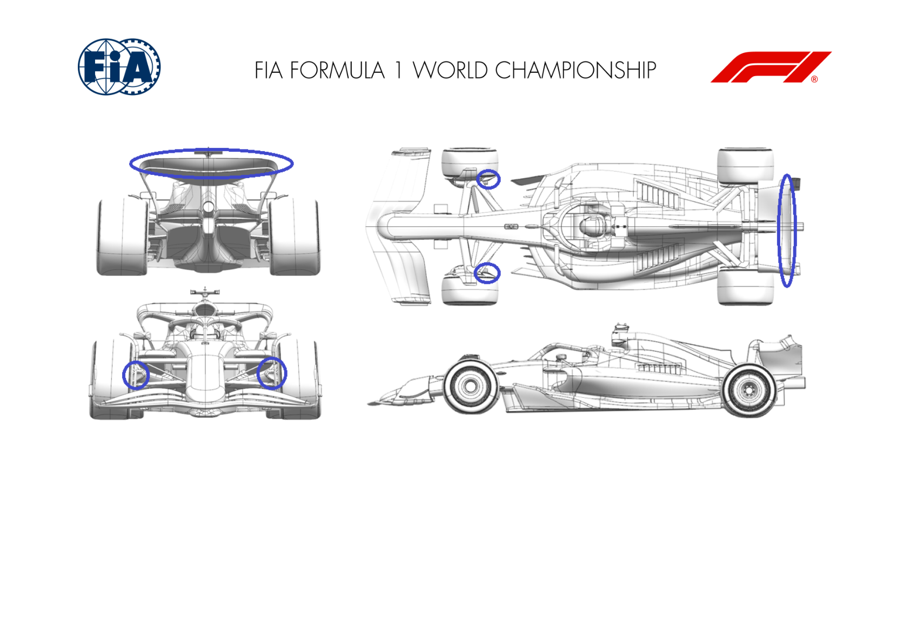
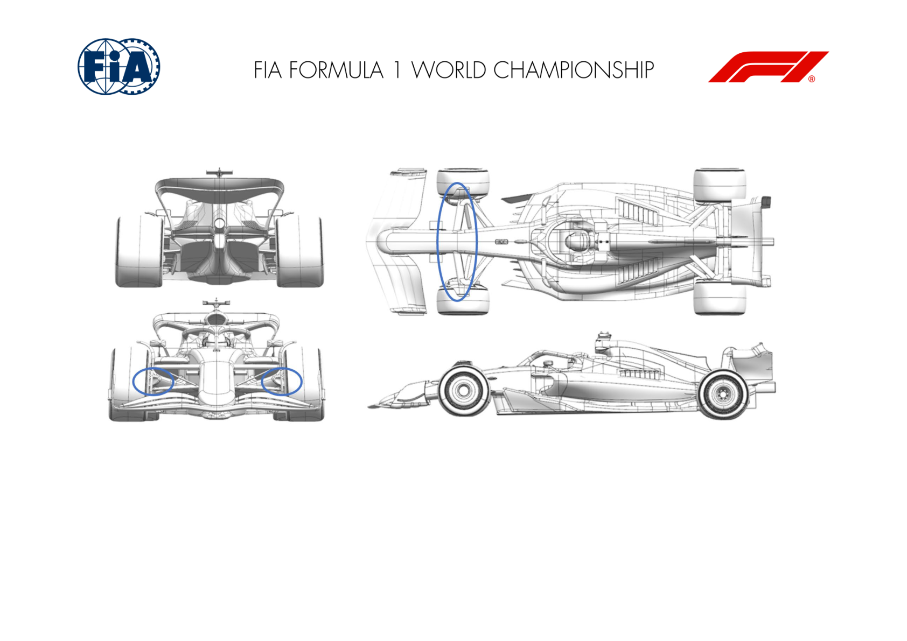
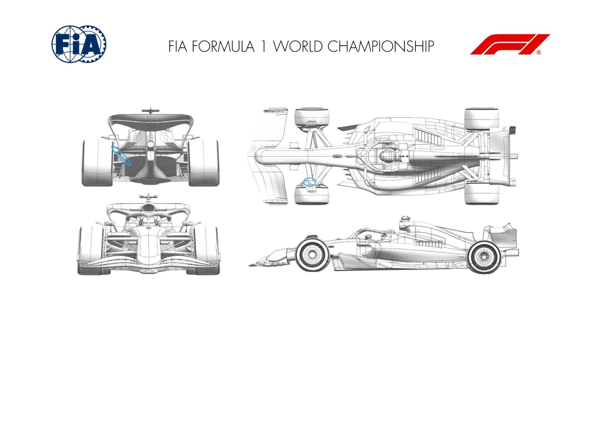
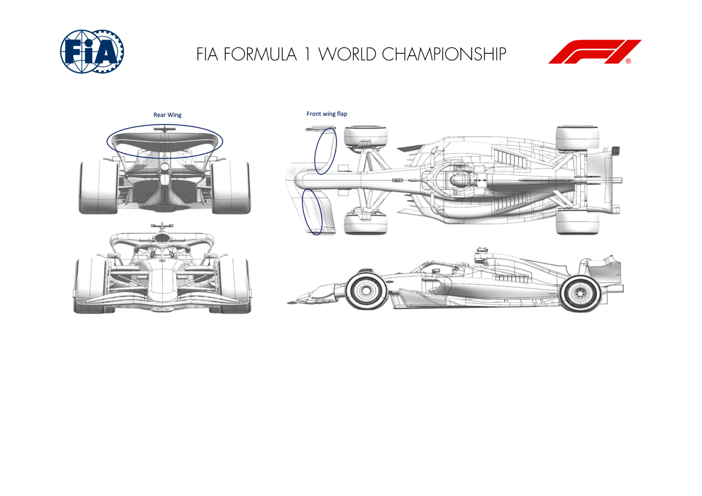
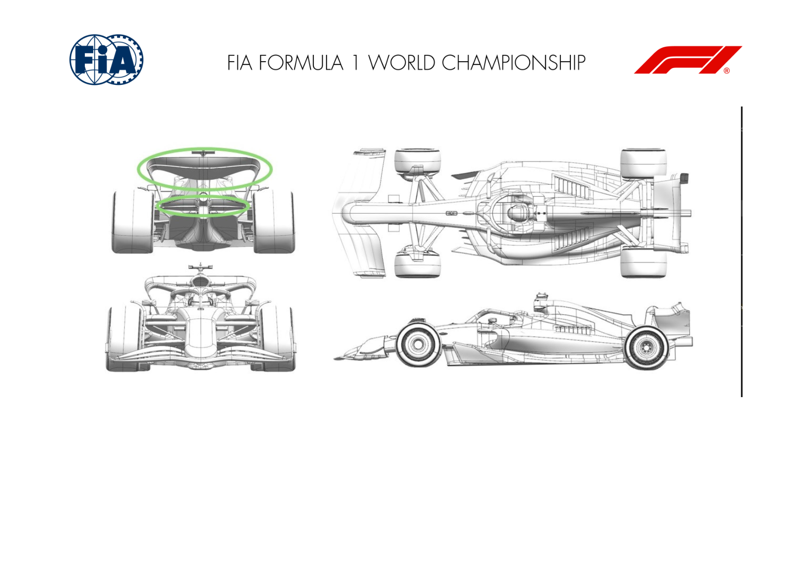
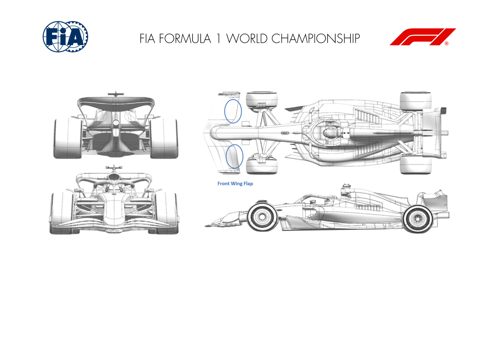

2024 CANADIAN GRAND PRIX

07 - 09 June 2024

From The FIA Formula One Media Delegate Document 10

To All Teams, All Officials Date 07 June 2024

Time 10:58

Title Car Presentation Submissions

Description Car Presentation Submissions

Enclosed 2024 Canadian Grand Prix - Car Presentation Submissions .pdf

Roman De Lauw

The FIA Formula One Media Delegate

Car Presentation – Canadian Grand Prix

ORACLE RED BULL RACING

| No. | Updated component | Primary reason for update | Geometric differences | Description |
| --- | --- | --- | --- | --- |
| 1 | Rear Wing | Performance - Local Load | Re-profiled rear wing flap across the span | Optimising the flap geometry in an interation from the previous design to extracxt locally more load whilst maintaining adequate flow stability for all the conditions encountered. |
| 2 | Front Corner | Reliability | a larger front brake cooling exit duct | The brake energy for the Montreal circuit is high enough to necessitate an enlarged exit duct from the front wheel bodywork, moving both inboard and upwards. |

MERCEDES-AMG PETRONAS FORMULA ONE TEAM

| No. | Updated component | Primary reason for update | Geometric differences | Description |
| --- | --- | --- | --- | --- |
| 1 | Front Suspension | Performance - Flow Conditioning | Realignment of track rod and lower wishbone forward leg. | Realigning both the track rod and the lower wishbone forward leg to the local onset flow from the front wing reduces boundary layer losses and hence improves the flow to the floor. |
| 2 | Front Corner | Circuit specific - Cooling Range | Increased inlet size. | Increasing the brake duct inlet size, increases mass flow to the disc, which in turn increases heat rejection from the disc to the air. |

SCUDERIA FERRARI

No updates submitted for this event.

MCLAREN FORMULA 1 TEAM

No updates submitted for this event.

ASTON MARTIN ARAMCO FORMULA ONE TEAM

| No. | Updated component | Primary reason for update | Geometric differences | Description |
| --- | --- | --- | --- | --- |
| 1 | Beam Wing |  | Performance - Local Load | Twist distribution is revised with lower tips. The spanwise loading of the beam wing is modified from the revised twist dirtibution which increases the load generated, particularly near the tips. |

BWT ALPINE F1 TEAM

No updates submitted for this event.

WILLIAMS RACING

| No. | Updated component | Primary reason for update | Geometric differences | Description |
| --- | --- | --- | --- | --- |
| 1 | Front Suspension | Performance - Mechanical Setup | A shorter steering arm is available for this event. This changes the ratio between steering wheel angle and road wheel angle and affects the drivers' ability to control of the car. |  |
| 2 | Rear Suspension | Performance - Mechanical Setup | A new rear pullrod is availale. Geometrically it is unchanged other than it provides a larger range of | The new pullrod design simply brings the car closer to the legal weight limit. It also allows the ride |

VISA CASH APP RB FORMULA ONE TEAM

| No. | Updated component | Primary reason for update | Geometric differences | Description |
| --- | --- | --- | --- | --- |
| 1 | Rear Wing | Performance - Local Load | The camber & incidence of the upper wing profiles is an evolution of the previous design. | The profile redesign provides more efficient downforce generation than the previous wing, whilst retaining the same range of drag suitable for high-speed circuits. |
| 2 | Front Wing | Circuit specific - Balance Range | Shorter chord and reduced incidence compared to previous flap. | This smaller front flap reduces the amount of overall load generated by the front wing assembly, in order to balance the low drag rear wings expected to be used at this circuit. |

STAKE F1 TEAM KICK SAUBER

| No. | Updated component | Primary reason for update | Geometric differences | Description |
| --- | --- | --- | --- | --- |
| 1 | Rear Wing |  | Circuit specific - Drag Range | Redesigned main plane and flap The new profile of the rear wing, with a reduced flap and redesigned main plane, fine-tune our aerodynamic profile for the low-drag requirements of the Canadian GP. |
| 2 | Beam Wing |  | Circuit specific - Drag Range | Redesigned beam wing profile Together with the main rear wing update, this reprofiled beam wing improves the aerodynamic performance in the situations expected to be encountered in Montreal. |

MONEYGRAM HAAS F1 TEAM

| No. | Updated component | Primary reason for update | Geometric differences | Description |
| --- | --- | --- | --- | --- |
| 1 | Front Wing |  | Circuit specific - Balance Range | Less cambered Front Wing Flap without IB hook Due to potential low front balance requirements a revised Front Wing Flap is available: the reduced camber lowers the front load and increase effieciency of the FW itself. |

