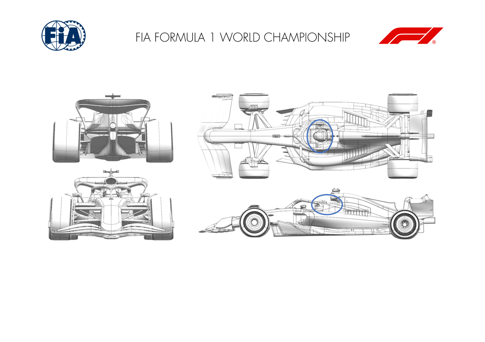
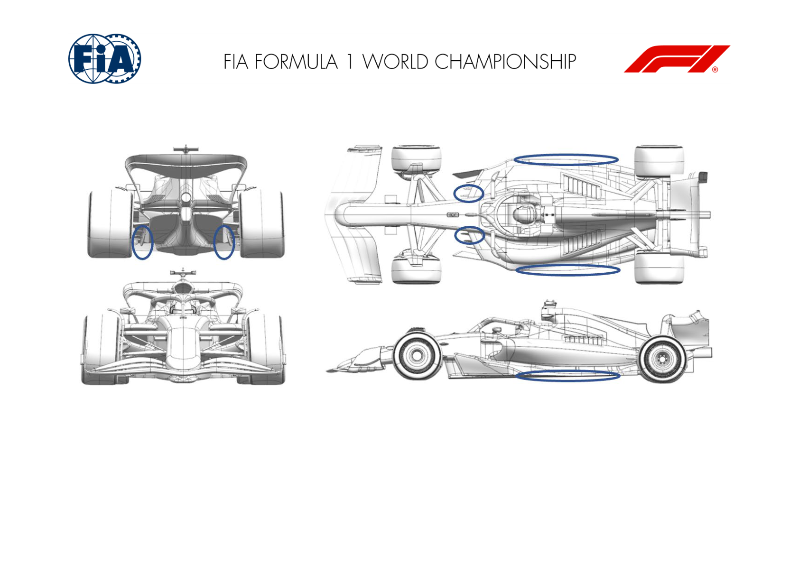
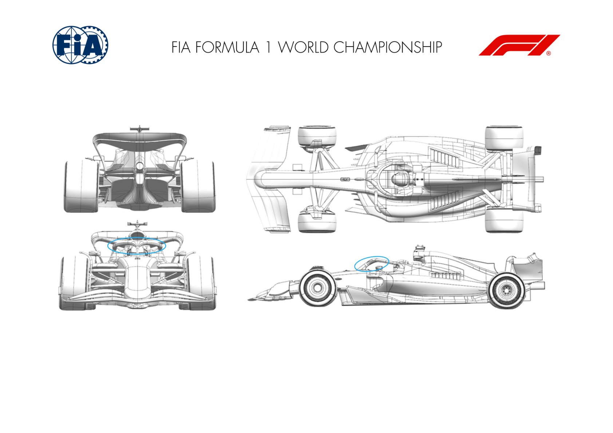
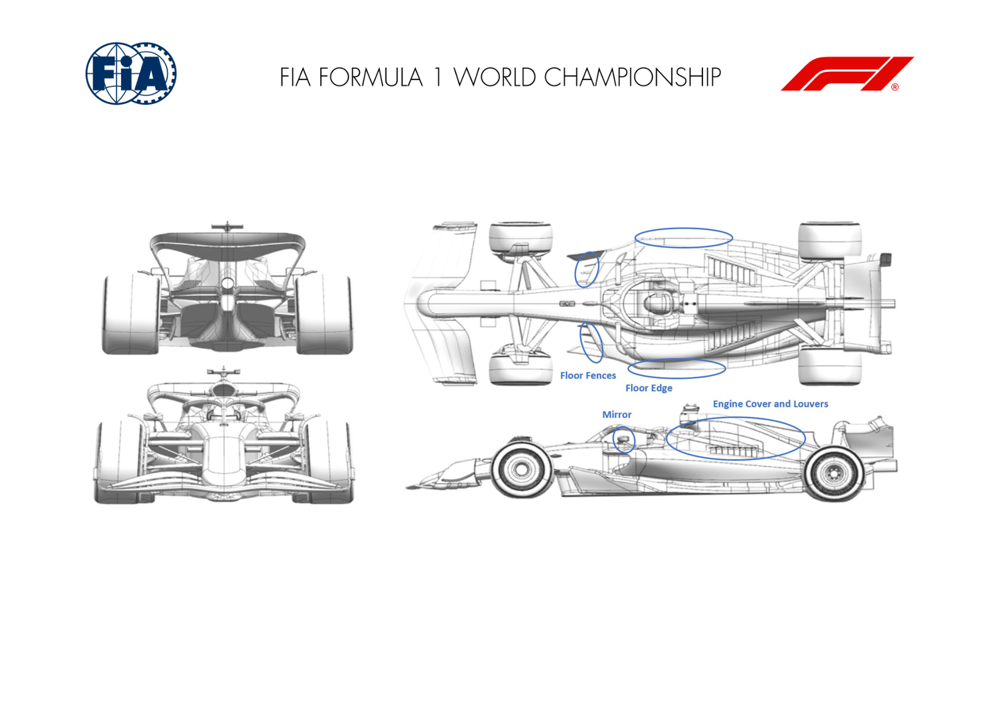

2024 CHINESE GRAND PRIX

19 - 21 April 2024

From The FIA Formula One Media Delegate Document 6

To All Teams, All Officials Date 19 April 2024

Time 08:52

Title Car Presentation Submissions

Description Car Presentation Submissions

Enclosed 2024 Chinese Grand Prix - Car Presentation Submissions.pdf

Roman De Lauw

The FIA Formula One Media Delegate

Car Presentation – Japanese Grand Prix

ORACLE RED BULL RACING

No updates submitted for this event.

MERCEDES-AMG PETRONAS F1 TEAM

| No. | Updated component | Primary reason for update | Geometric differences | Description |
| --- | --- | --- | --- | --- |
| 1 | Halo | Performance - Flow Conditioning | Small flick added either side of the cockpit, behind the Halo. | Generates small vortices, which help control the flow out of the cockpit, and in doing so improve flow to the rear wing assembly. |

SCUDERIA FERRARI

No updates submitted for this event.

MCLAREN FORMULA 1 TEAM

No updates submitted for this event.

ASTON MARTIN ARAMCO FORMULA ONE TEAM

No updates submitted for this event.

BWT ALPINE F1 TEAM

| No. | Updated component | Primary reason for update | Geometric differences | Description |
| --- | --- | --- | --- | --- |
| 1 | Floor Body |  | Performance - Flow Conditioning | Revised diffuser letterbox in the diffuser sidewall. Revised flow around the rear corner improves flow control around the rear tyre. |
| 2 | Floor Fences |  | Performance - Local Load | Heavily revised inboard front floor fence geometry. Significant change from flow to front of the floor gives an increase in overall downforce. |
| 3 | Floor Edge |  | Performance - Flow Conditioning | Revised floor edge wing. Different flow around the floor edge effecting performance further down the car. |

WILLIAMS RACING

| No. | Updated component | Primary reason for update | Geometric differences | Description |
| --- | --- | --- | --- | --- |
| 1 | Halo | Performance - Flow Conditioning | The geometry of the forward part of the HALO shroud is updated. | The new geoemtry cleans-up the flow around the HALO and better controls the losses from the cockpit opening. This helps improve the flow to the rear wing and beam wing and gives a small increase in aerodynamic efficiency. |

VISA CASH APP RB FORMULA ONE TEAM

| No. | Updated component | Primary reason for update | Geometric differences | Description |
| --- | --- | --- | --- | --- |
| 1 | Headrest |  | Performance - Flow Conditioning | The area of the headrest behind the driver's helmet has been reshaped. Airflow separation behind the driver's helmet is reduced, improving the flow quality downstream. |

Headrest

STAKE F1 TEAM KICK SAUBER

No updates submitted for this event.

MONEYGRAM HAAS F1 TEAM

|  | Updated component | Primary reason for update Performance - Flow | Geometric differences compared to previous version | Brief description on how the update works The new layout improves floor extraction and works in |
| --- | --- | --- | --- | --- |
| 1 | Floor Fences | Conditioning Performance - Local | Improved alignment of the front floor fences | combination with the new floor later edge, resulting in more downforce. This new geometry is designed to work in combination |
| 2 | Floor Edge Coke/Engine | Load Performance - Drag | Re-alignment of the floor edge devices | with the new front floor fences, with the aim to improve drivability. This configuration allows improved performance all |
| 3 | Cover | reduction Performance - Flow | Slimmer centre exit with larger cooling louver layout | over the cooling polar slope, as it reduces the lower energy flow impacting the rear end of the car. The incidence change on the rear corner elements |
| 4 | Rear Corner | Conditioning Performance - Flow | Rear Corner devices incidence change | improves the local flow features, resulting in an increase in local load. The new design shrinks the frontal size of the Mirror |
| 12 | Mirror | Conditioning | Slimmer Mirror housing | and therefore reduces its wake, minimizing the impact on the rear of the car. |

