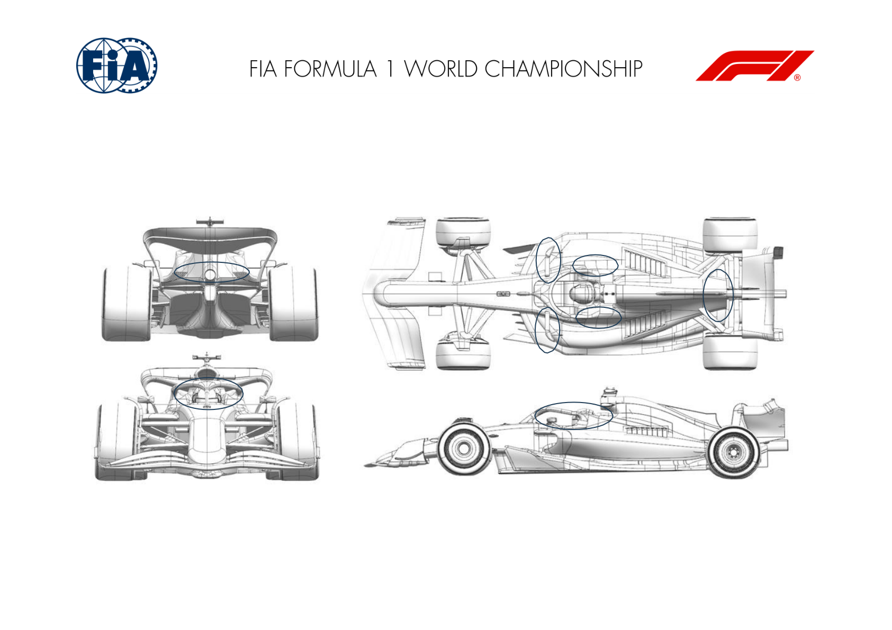
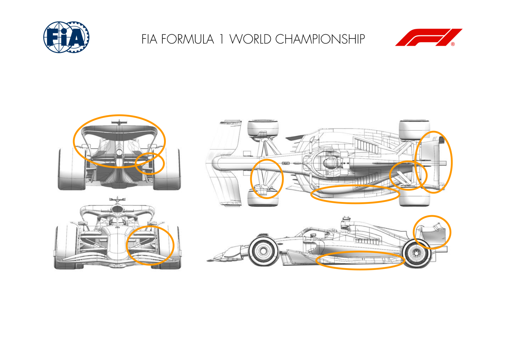
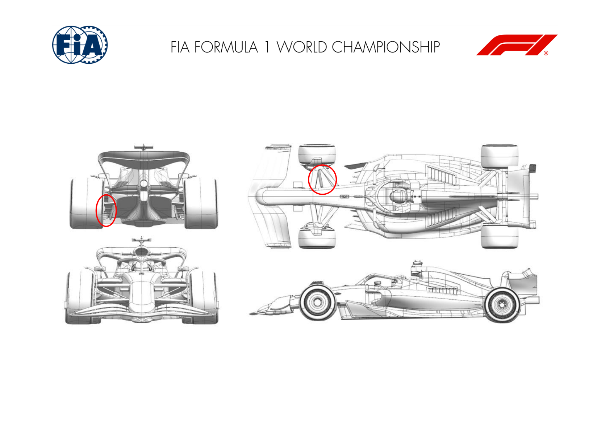
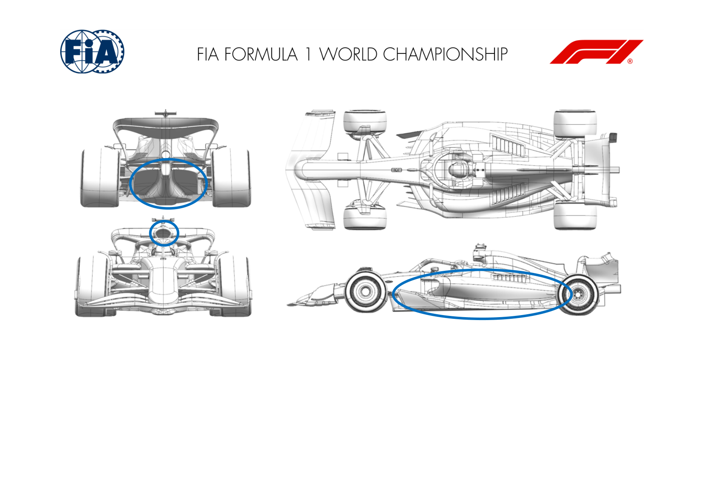
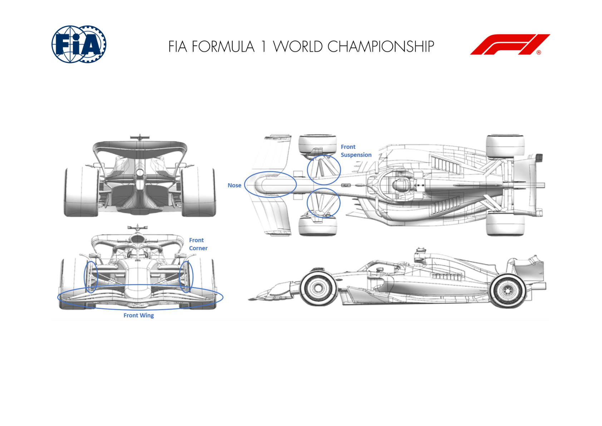

2024 DUTCH GRAND PRIX

23 - 25 August 2024

From The FIA Formula One Media Delegate Document 9

To All Teams, All Officials Date 23 August 2024

Time 09:53

Title Car Presentation Submissions

Description Car Presentation Submissions

Enclosed 2024 Dutch Grand Prix - Car Presentation Submissions.pdf

Roman De Lauw

The FIA Formula One Media Delegate

Car Presentation – Dutch Grand Prix

ORACLE RED BULL RACING

| No. | Updated component | Primary reason for update | Geometric differences | Description |
| --- | --- | --- | --- | --- |
| 1 | Coke/Engine Cover | Circuit specific - cooling range | Narrowed central exit | Cooling requirements for up-coming races implies the central exit can be narrower which cascades into the quarter panel to reduce blockage. |
| 2 | Halo | Performance – Flow Conditioning | Rearward fairing revised to re-orientate the vane | To improve the total pressure downstream the floor upper surfaces by better alignment to the local flow conditions. |
| 3 | Mirror stays | Performance -Flow Conditioning | Revised horizontal stay height and vertical stay angle | To improve the total pressure available downstream along the sidepod and to the floor upper surface again by better alignment to the local flow conditions. |

Car Presentation – 2024 Dutch Grand Prix

*Mercedes-AMG PETRONAS F1 Team*

No updates submitted for this event.

Car Presentation – Dutch Grand Prix

*SCUDERIA FERRARI*

No updates submitted for this event.

Car Presentation – Dutch Grand Prix

McLaren Formula 1 Team

| No. | Updated component | Primary reason for update | Geometric differences | Description |
| --- | --- | --- | --- | --- |
| 1 | Front Corner | Performance - Flow Conditioning | New Front Brake Scoop | The redesigned Front Brake Scoop results in an improvement of overall flow conditions downstream yielding a gain of aerodynamic load without compromising brake cooling performance. |
| 2 | Front Suspension | Performance - Flow Conditioning | Revised Front Suspension | To suit the altered flow conditions resulting from the new front brake scoop geometry, the front suspension has been modified, complementing the beneficial effect downstream. |
| 3 | Floor Edge | Performance - Local Load | Revised Floor Edge | The Floor Edge modification improves both local load generation around the floor edge as well as flow conditioning improving overall floor performance. |
| 4 | Rear Corner | Performance - Flow Conditioning | Modified Rear Suspension | The revised rear suspension shape results in an improvement of flow conditioning around the rear corner, diffuser and beam wing area. |
| 5 | Rear Wing | Circuit specific - Drag Range | New Higher Downforce Rear Wing | Suitable to the isochronal of this circuit, a completely new rear wing assembly has been designed, increasing overall wing efficiency. |
| 6 | Beam Wing | Circuit specific - Drag Range | New Higher Downforce Beam Wing | As required by the difference in Rear Wing Design, a new Beam Wing, suitable for the new high downforce Rear Wing Mainplane and Flap has been designed. |

Car Presentation – Dutch Grand Prix

Aston Martin Aramco F1 Team

No updates submitted for this event.

Car Presentation – Dutch Grand Prix

BWT Alpine F1 Team

| No. | Updated component | Primary reason for update | Geometric differences | Description |
| --- | --- | --- | --- | --- |
| 1 | Front Suspension | Performance - Flow Conditioning | Reprofiled front suspension leg | This updated upper leg suspension profile brings a better flow control and a healthier flow towards the rear of the car for an aero-performance benefit. |
| 2 | Rear Corner | Performance - Local Load | Rear Brake Duct furniture | The rear brake duct furniture has been updated with a new winglets arrangement in order to trade downforce and drag more efficiently. |

Car Presentation – Dutch Grand Prix

*Williams Racing*

| No. | Updated component | Primary reason for update | Geometric differences | Description |
| --- | --- | --- | --- | --- |
| 1 | Floor Body |  | Performance - Local Load | The floor body is fully updated as part of a We have reprofiled the front of the floor body and the local fence curvatures to offer a local load improvement and to also enhance the onset flow to the new floor edge wing geometry. completely new floor geometry. The height of the forward floor is increased, and the fences are pronounced finger geometry. |
| 2 | Diffuser |  | Performance - Local Load | The diffuser is also new with subtle reprofiling of some of the key features. Detail changes at the front of the floor have also created opportunities for flow field improvements to the rear of the car, which in turn have allowed us to extract more performance in this local area. |
| 3 | Sidepod inlet |  | Performance – Flow Conditioning | The sidepod inlet geometry is updated. The upper The modifications to the sidepod inlet region have surface is now longer than the lower surface, offered improvements in loss management from the creating a larger 'deck' alongside the cockpit front of the car and thus have unlocked performance opening improvements to the rest of the car. |
| 4 | Coke / Engine Cover |  | Performance – Flow Conditioning | The main sidepod region is a new geometry, which The changes to the sidepod and engine cover have been designed to complement and enhance the flow field improvements which have been unlocked from the previously described floor development work. compliments the revised sidepod inlet and floor geometries. The gully in the sidepod is less aggressive initially giving a longer forward deck, and the top body is now wider at the bottom edge. The cooling louvres and upper top body are unchanged. |
| 5 | Central air intake |  | Performance – Flow Conditioning | The main roll hoop geometry is revised, and the internal ducting and external aero surfaces are reprofiled to suit. The primary purpose of this update is to remove mass from the primary roll hoop structure. This has also permitted some optimisation to the associated aero surfaces, which are design to compliment the flow field improvements from the Sidepod Inlet and Coke/Engine Cover updates |

Car Presentation – Dutch Grand Prix

Visa Cash App RB

| No. | Updated component | Primary reason for update | Geometric differences | Description |
| --- | --- | --- | --- | --- |
| 1 | Rear Corner | Performance - Local Load | The geometry of the brake duct & winglets has been updated. | Lower brake cooling requirements allow duct area to be reduced, creating additional space for downforce-generating devices. |

Rear corner

Car Presentation – Dutch Grand Prix

Stake F1 Team KICK Sauber

No updates submitted for this event.

Car Presentation – 2024 Dutch Grand Prix

MONEYGRAM HAAS F1 TEAM

| No. | Updated component | Primary reason for update | Geometric differences | Description |
| --- | --- | --- | --- | --- |
| 1 | Front Wing | Performance - Flow Conditioning | New camber distribution, reduced inboard and increased mid span | This new load distribution reduced the FW load IB, favouring cleaner flow along the nose/chassis and concentrates the front load mid span. The connection to the endplate was also revised because of the new profiles. |
| 2 | Nose | Performance - Flow Conditioning | The nose covers also the first element of the Front Wing. | To achieve a cleaner central flow, the nose covers now also the first element of the Front Wing. In conjunction with the new Front Wing, this allows to achieve a more efficient central flow, delivering higher energy to the floor/bodywork. |
| 3 | Front Suspension | Performance - Flow Conditioning | Reprofiled upper wishbone. | Because of the revised Front Wing and Nose the upper wishbone needed a re-profiling to comply with the new incoming flow. |
| 4 | Front Corner | Performance - Flow Conditioning | Vertical deflector incidence changed | Because of the revised Front Wing and Nose the vertical deflector of the Front Corner needed to be re-aligned. |

