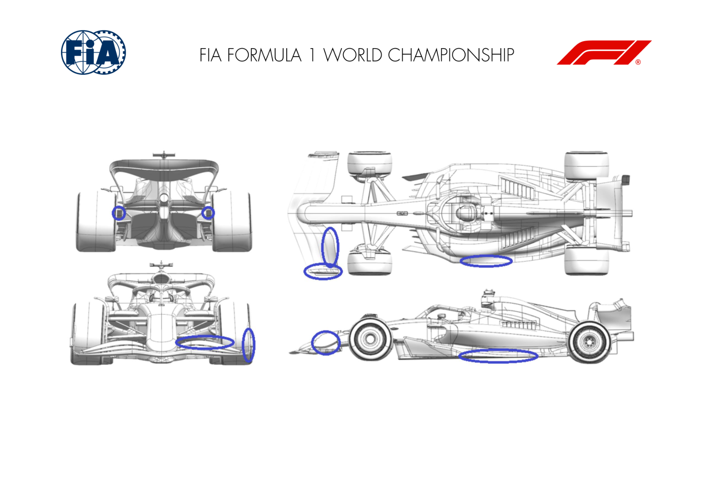
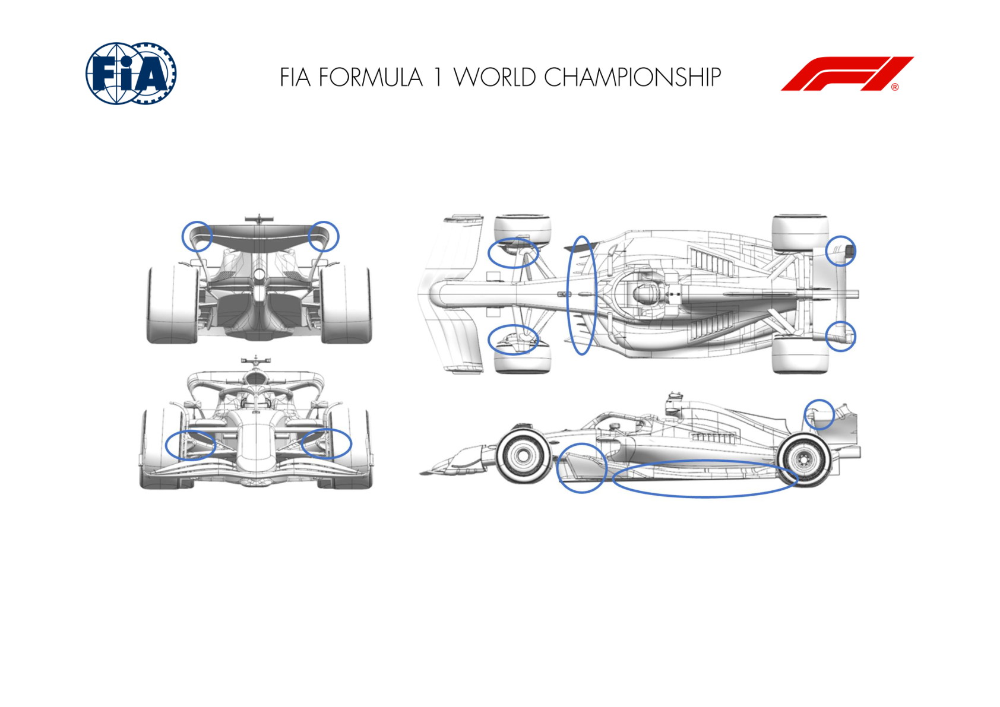
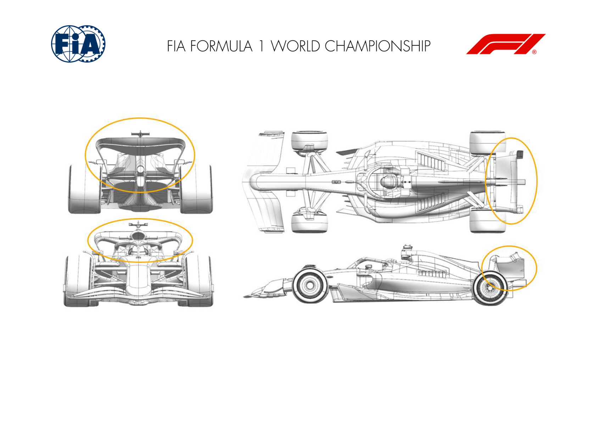
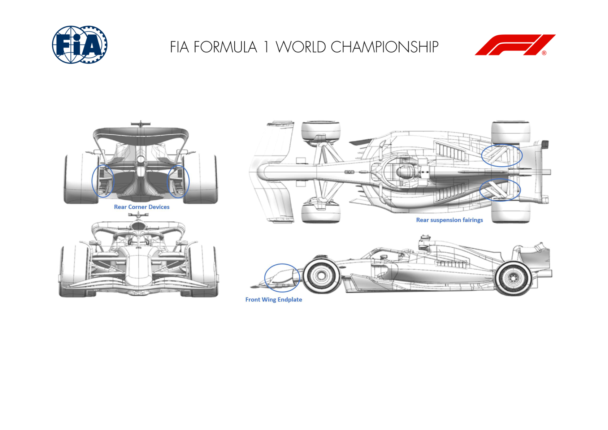

2024 EMILIA ROMAGNA GRAND PRIX

17 - 19 May 2024

From The FIA Formula One Media Delegate Document 10

To All Teams, All Officials Date 17 May 2024

Time 10:59

Title Car Presentation Submissions

Description Car Presentation Submissions

Enclosed 2024 Emilia Romagna Grand Prix - Car Presentation Submissions.pdf

Roman De Lauw

The FIA Formula One Media Delegate

Car Presentation – Emilia Romagna Grand Prix

ORACLE RED BULL RACING

| No. | Updated component | Primary reason for update | Geometric differences | Description |
| --- | --- | --- | --- | --- |
| 1 | Front Wing | Performance - Local Load | Endplate leading edge repositioned and profiles 3 and 4, flap elements redesigned to extend the chord. | More load has been extracted from the flap by extending the chord length. In changing the moving flap geometry, the fixed flap elements into the nosebox had to be revised as the parts cannot be treated in a modular fashion. The endplate leading edge revison improves the stability in yaw. |
| 2 | Floor Edge | Performance - Local Load | Shedding edges of the forward portion of the edge wing re-positioned. | From CFD research the shedding edges under the wing were re-positoned to extract locally more load whilst maintianing the flow stability criteria. |
| 3 | Rear Corner | Circuit specific - Cooling Range | rear wheel bodywork revised to improve the brake cooling exit condition. | More efficient rear brake cooling has been achieved by re-profiling the exit duct geometry for a given intake. By consequence the local winglets adjacent to the exit were re-optimised. |
| 4 | Floor Body | Performance - Flow Conditioning | the upper surface ahead of the edge wing has been slightly lowered | Again from CFD, the upper surface of the floor has been revised to improve the onset flow to parts downstream improving the load generated. |
| 5 | Nose | Performance - Local Load | fairings on the nosebox revised to meet the revised flap elements and the camera stubs revised | Consequentially to the flap elements revision, the nosebox fairings were revised to meet and blend the nosebox junction. Camera stubs have been revised to be better suited to the local flow. |

MERCEDES-AMG PETRONAS F1 TEAM

| No. | Updated component | Primary reason for update | Geometric differences | Description |
| --- | --- | --- | --- | --- |
| 1 | Floor Fences | Performance - Flow Conditioning | Small modification to fence alignment. | Improves flow quality to the rear of the floor, which in turn improves diffuser and rear load throughout the ride height range. |
| 2 | Floor Body | Performance - Local Load | Modification to the floor tunnel volume. | The tunnel volume change alters the trajectory of the fence and floor edge vortex systems, the result being increased local load. |
| 3 | Rear Wing | Circuit specific - Drag Range | Modification to upper wing tip shedding detail. | Increasing the length of the flap tip shedding edge results in more local load and upper wing efficiency suited to this circuit. |
| 4 | Beam Wing | Circuit specific - Drag Range | New biplane beam wing. | Biplaning the beam wing improves its local efficiency and also how it interacts with the upper wing and the diffuser. |
| 5 | Front Corner | Circuit specific - Cooling Range | Improved internal brake ducting. | Improved design of the internal duct feeding the front brake disc resulting in reduced pressure drop and increased mass flow. |

SCUDERIA FERRARI

| No. | Updated component | Primary reason for update | Geometric differences | Description |
| --- | --- | --- | --- | --- |
| 1 | Front Wing | Performance - Flow Conditioning | Updated flap profile, adjuster position and tip details | Minor front wing update with revised flap and tip loadings, aiming at improving performance and efficiency across the polar range. This goes in conjunction with the rest of the car upgrades |
| 2 | Rear Wing | Performance - Drag reduction | Swept flap tip and enlarged mainplane to endplate roll junction | Not specific to the Imola circuit requirements, the rear wing tip / mainplane roll junction have been re designed in order to improve the overall efficiency |
| 3 | Sidepod Inlet | Performance - Flow Conditioning | New P-shape inlet, forward top lip and updated cockpit device | The new bodywork features a new sidepod and inlet that improves flow quality over the floor edge. A new cockpit device has also been implemented on the side of the halo to manage better losses travelling downstream |
| 4 | Coke/Engine Cover | Performance - Flow Conditioning | Reduced volume and reworked cooling exit | The engine cover volume has been reduced, improving flow quality towards the back of the car. Cooling exit topology evolves but main modulation remains via gills arrangement. |
| 5 | Floor Edge | Performance - Flow Conditioning | Revised rearward slot and trailing edge volume | In conjunction with the bodywork evolution, a revised floor edge is introduced, turning the sidepod onset benefits into better flow energy delivery to the diffuser |
| 6 | Diffuser | Performance - Local Load | Updated channel profile and outboard diffuser expansion | Working together with the rest of the upgrade and the upstream changes, the diffuser expansion has been re-optimized and offers a load increase in return |

| No. | Updated component | Primary reason for update | Geometric differences | Description |
| --- | --- | --- | --- | --- |
| 7 | Rear Suspension | Performance - Local Load | Reprofiled rear top wishbone triangle fairing | Taking the benefits of the bodywork changes, rear suspension top wishbone fairing have been further developed, with positive interaction on rear wing and rear corner performance, resulting in a small load increase |

MCLAREN FORMULA 1 TEAM

| No. | Updated component | Primary reason for update | Geometric differences | Description |
| --- | --- | --- | --- | --- |
| 1 | Rear Wing | Circuit specific - Drag Range | More loaded Rear Wing Assembly | A new, more loaded Rear Wing Assembly has been designed with the aim of efficiently increasing Downforce suitable for low isochronal circuits. |
| 2 | Beam Wing | Circuit specific - Drag Range | More loaded Beam Wing Assembly. | In conjuction with the more loaded Rear Wing Assembly, a new Beamwing has been designed, which supports to increase the overall efficiency of the assembly. |

ASTON MARTIN ARAMCO FORMULA ONE TEAM

| No. | Updated component | Primary reason for update | Geometric differences | Description |
| --- | --- | --- | --- | --- |
| 1 | Front Wing | Performance - Local Load | Central section of the wing has a revised front view The changes create a revised loading distribution on the lower surface of the wing to improve performance through the operating range. shape and incidence to the first element along with some changes to the slot gap separator arrangement. |  |
| 2 | Nose | Performance - Local Load | The tip of the nose has some volume added to suit the FW changes. | The changes to the nose are cosmetic at the tip to suit the revised front wing surfaces and slot gap separator layout. |
| 3 | Floor Body | Performance - Local Load | The main body of the floor has evolved slightly with the fences and floor edge. | The revised shapes improve the flowfield under the floor increasing the local load generated on the lower surface and hence performance. |
| 4 | Floor Fences | Performance - Local Load | The fences are redistributed across the LE of the floor with revised curvature. | The revised shapes improve the flowfield under the floor increasing the local load generated on the lower surface and hence performance. |
| 5 | Floor Edge | Performance - Local Load | Small changes to the details of the floor edge wing and the main floor inboard of this. | The revised shapes improve the flowfield under the floor increasing the local load generated on the lower surface and hence performance. |
| 6 | Diffuser | Performance - Local Load | The diffuser is a slightly modified shape with revised top surface. | The changes to the shape modify the expansion in the diffuser to improve flow characteristics and the load generated on the surfaces. |
| 7 | Coke/Engine Cover | Performance - Local Load | Revised central trim to the centre of the engine cover, smaller than the previous trimmed version. | This is a cooling option and reduces the massflow allowed to exit in this area, use will depend on the cooling requirements of the event. |
| 8 | Rear Suspension | Performance - Local Load | The external fairings are revised, but the structural components are not changed. | The rear suspension and corner work together to improve the flow around the rear wheel to generate load and increase car performance |

| No. | Updated component | Primary reason for update | Geometric differences | Description |
| --- | --- | --- | --- | --- |
| 9 | Rear Corner | Performance - Local Load | Reduced inlet area and a revised inboard face with a more distinct exit and revised vanes. | The rear suspension and corner work together to improve the flow around the rear wheel to generate load and increase car performance |

BWT ALPINE F1 TEAM

| No. | Updated component | Primary reason for update | Geometric differences | Description |
| --- | --- | --- | --- | --- |
| 1 | Floor Edge | Performance - Flow Conditioning | Floor flank 'stay' will be tested on Friday that increases floor stiffness in front of the rear tyre. | This reduces floor deflection at high-speed, which affects the flow around the rear tyres. This will be tested on one car on Friday |

WILLIAMS RACING

| No. | Updated component | Primary reason for update | Geometric differences | Description |
| --- | --- | --- | --- | --- |
| 1 | Floor Body | Reliability | There are no geometric differences to the aerodynamic surfaces but the laminate has been changed to reduce the mass of the floor. | The update only delivers a mass reduction, which is done without compromising the aerodynamic performance of the floor. Reduced weight improves the performance in all regards. |

VISA CASH APP RB FORMULA ONE TEAM

No updates submitted for this event.

STAKE F1 TEAM KICK SAUBER

| No. | Updated component | Primary reason for update | Geometric differences | Description |
| --- | --- | --- | --- | --- |
| 1 | Floor Fences |  | Performance - Flow Conditioning | Floor fences forward extension, changes to forward floor volume The extension of the floor fences, as well the redefined surface in the front part, increases downforce and improves the aerodynamic efficiency of the package. |

MONEYGRAM HAAS F1 TEAM

| No. | Updated component | Primary reason for update | Geometric differences | Description |
| --- | --- | --- | --- | --- |
| 1 | Front Wing Endplate |  | Performance - Flow Conditioning | Re-shaped FW Endplate Aim of this geometrical change is to influence the flow impacting the front tyre, by reducing the wake of the tyre itself and re-directing high energy flow towards the rear end of the car. |
| 2 | Rear Suspension |  | Performance - Flow Conditioning | Re-shaped top wishbone fairings The top wishbone fairings were reshaped to be more compliant with the incoming flow and with the updated brake drum devices. |
| 3 | Rear Corner |  | Performance - Local Load | Lower winglet layout The FIA prescribed lower winglet cluster was re- positioned to better work in conjunction with the diffuser and also to extract more local load. |

