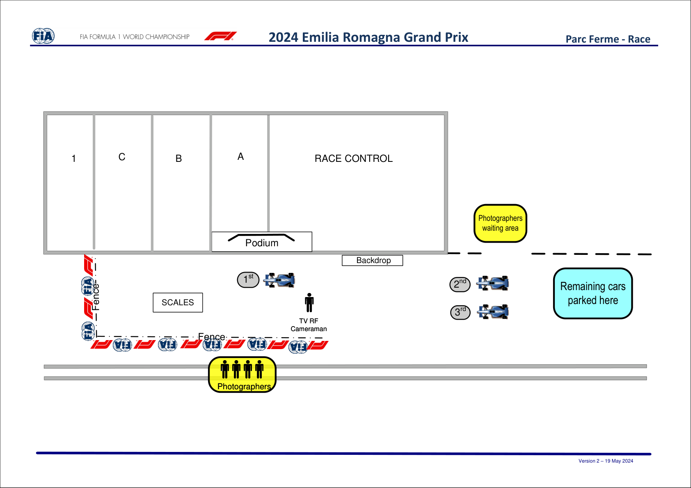

2024 EMILIA ROMAGNA GRAND PRIX

17 - 19 May 2024

From The FIA Formula One Media Delegate Document 44

To All Teams, All Officials Date 19 May 2024

Time 10:57

Title Post-Race Procedure

Description Post-Race Procedure

Enclosed 2024 Emilia Romagna Grand Prix - Post-Race Procedure.pdf

Roman De Lauw

The FIA Formula One Media Delegate

2024 EMILIA ROMAGNA GRAND PRIX

17 – 19 May 2024

From The FIA Formula One Media Delegate

To All Officials, All Teams Date 19 May 2024

NOTE TO TEAMS: POST-RACE INTERVIEWS & PODIUM CEREMONY PROCEDURE

In addition to the provisions of the FIA Formula One Sporting Regulations – Appendix 5 Podium Ceremony,

the Podium Ceremony procedure detailed below must be followed.

Post-Race Interview and Podium Ceremony Procedure:

• The master of ceremonies will be appointed by the FIA to conduct and take responsibility for the

entire podium ceremony.

• After taking the chequered flag the top three (3) drivers should return to the Pit Lane where they will

find the 1,2,3 boards in front of the FIA garage.

• Other than the team mechanics (with cooling fans if necessary), officials, FIA pre-approved television

crews and photographers, no one else will be allowed in the designated area at this time (no team

PR personnel, driver physios must wait outside the cool down room until the podium ceremony has

concluded following the instructions given to all teams by the Media Delegate). The interview area

must remain clear from any team personnel who must remain in the fast lane when they are

not working on the car. At the sole discretion of the FIA Media Delegate, the team-embedded photographer of the winning driver may also be permitted in the designated area. All other

photographers must remain outside of the designated area for the duration of the Parc Fermé and

Podium procedure.

• Competitors are reminded of Article 63.2 of the Sporting Regulations – “For the duration of the Post

Race Interviews and Podium Ceremony Procedure, the Drivers finishing in race in positions 1, 2, 3

must remain attired only in their Driving Suits, 'done up' to the neck, not opened to the waist.”

• Drivers will be weighed by the FIA. Each Driver must be fully attired while they are weighed (e.g.:

Helmet, Gloves, etc.). Water will be available in the parc fermé area after the driver has been

weighed.

• The post-race interviews will take place in the pit lane, and the interviewer will be selected by the

Commercial Rights Holder.

• At the end of the interviews, the winning car must be pushed back in front of the screen.

• Drivers must not interfere with parc fermé protocols in any way.

• Once the interviews have been completed, the Drivers will be immediately escorted to the cool down

room on the first floor of the Pit Garage Complex.

• Each Driver will be given their Pirelli Cap.

• The drivers will then be escorted to the Podium area where the 1, 2, 3 Rostrum and Dias will be

located.

• When the Drivers are ready, an announcement for the Podium Ceremony will take place with the 3rd

and 2nd placed Drivers introduced to move to their respective Podium Dias steps.

• The Winning Driver will then be announced who will move to his position on the Podium.

1

• The National Anthems will then take place and flags will be displayed.

• Dignitaries will present the trophies on the podium as arranged by the Master of Ceremonies.

• Each driver or representative must accept their trophy and presentations will take place in the

following order:

Winning Driver (On the Podium) o FIA Medal for the Winning Driver (On the Podium) o A representative of the Winning Constructor (On the Podium) o 2nd Place Driver (On the Podium) o 3rd Place Driver (On the Podium) o • Following the Podium Ceremony, the top three (3) drivers will be escorted by the FIA Media Delegate

to the TV pen, located in front of the Race Control Tower, where they may be accompanied by their

press officers.

• At the end of the TV pen, the top three (3) drivers will go to the FIA Press Conference, located on

the ground floor of the pit building.

• Drivers from 4th and beyond must proceed directly to the TV pen after they have been weighed in

the Parc Fermé. Each Driver must remain fully attired until after they have been weighed (e.g.:

Helmet, Gloves, etc.).

• Any Driver from 4th and beyond who does not have a session for the written media organised after

the race must be available for interview at the written media zone adjacent to the TV pen once their

TV interviews have concluded.

• Drivers who retire during the race are required to go to the TV pen (and written media pen if they do

not have a session for the written media organised after the race) as soon as they have come back

into the paddock.

Please see the attached Post Race Podium Ceremony and Parc Fermé Diagram.

Roman De Lauw

The FIA Formula One Media Delegate

2

