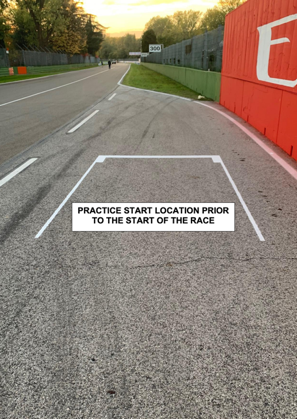
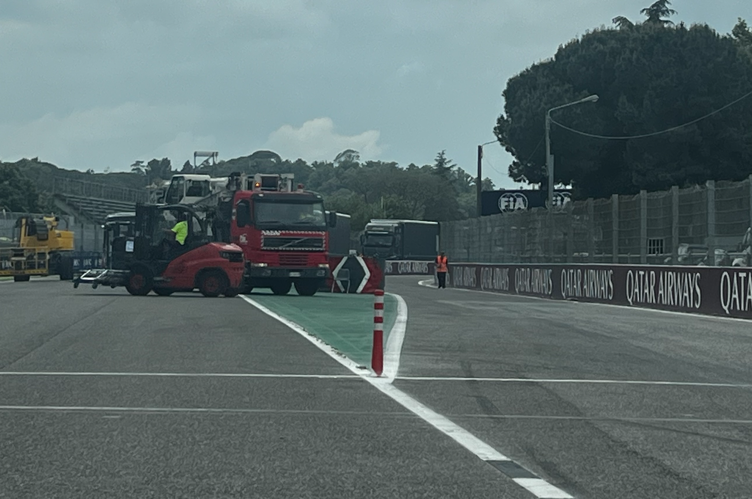

2024 EMILIA ROMAGNA GRAND PRIX

17 - 19 May 2024

From The FIA Formula One Race Director Document 4

To All Teams, All Officials Date 16 May 2024

Time 13:26

Title Race Director's Event Notes

Description Race Director's Event Notes

Enclosed 2024 Emilia Romagna Grand Prix - Event Notes.pdf

Niels Wittich

The FIA Formula One Race Director

2024 E R G P MILIA OMAGNA RAND RIX

17 – 19 May 2024

From The FIA Formula One Race Director

To All Officials, All Teams Date 16 May 2024

EVENT NOTES General Instructions

1) Observing yellow flags

1.1 Single waved: Drivers reduce their speed and be prepared to change direction. It must be clear that a driver has reduced speed and, in order for this to be clear, a driver would be expected to have braked earlier and/or discernibly reduced speed in the relevant marshalling sector.

1.2 Double waved: Any driver passing through a double waved yellow marshalling sector must reduce speed significantly and be prepared to change direction or stop. In order for the stewards to be satisfied that any such driver has complied with these requirements it must be clear that he has not attempted to set a meaningful lap time. Furthermore, during qualifying, any driver in a double yellow sector will have that lap time cancelled.

1.3 Double Waved during VSC or SC: Any driver passing through a double waved yellow marshalling sector during a VSC or SC, in addition to the requirements in 1.2 above, must remain positive of the SECU delta time in the sector concerned.

2) Laps during Qualifying and Reconnaissance Laps

In order to ensure that cars are not driven unnecessarily slowly on in laps during and after the end of qualifying or during reconnaissance laps when the pit exit is opened for the race, drivers must stay below the maximum time set by the FIA between the Safety Car lines shown on the pit lane map.

Teams and Drivers will be informed of the maximum time after the second practice session.

For the safe and orderly conduct of the Event, other than in exceptional circumstances accepted as such by the Stewards, any driver that exceeds the maximum time from the Second Safety Car Line to the First Safety Car Line on ANY lap during and after the end of the qualifying session, including in-laps and out-laps, may be deemed to be going unnecessarily slowly. For the avoidance of doubt, this does not supersede Article 33.4 and Article 37.5 of the FIA Formula One Sporting Regulations, which apply to the entire Circuit, furthermore this includes the pit lane as well. Incidents will normally be investigated after the qualifying session.

3) Parc Fermé

The Parc Fermé cameras must be always uncovered and operational during the Event.

4) Lapping during the race

The ISC requires drivers who are caught by another car to allow the faster driver past at the first available opportunity.

The F1 marshaling system will be set to give a pre-warning when the faster car is within 3.0s of the car about to be lapped, this should be used by the team of the slower car to warn their driver he is soon going to be lapped and that allowing the faster car through should be considered a priority.

1

When the faster car is within 1.2s of the car about to be lapped blue flags will be shown to the slower car (in addition to blue light panels, blue cockpit lights and a message on the timing monitors) and the driver must allow the following driver to overtake at the first available opportunity.

5) Article 40.8

In accordance with the provisions of Article 40.8, upon request by the Technical Delegate, the Teams are required to connect the umbilical to the cars and close the HV contactors (TR 5.26.5) for the sole purpose of checking the car ERS safety status, every morning immediately after the covers are removed and the cars are under parc fermé conditions.

Event Specific Instructions

6) FIA Outside Scales Times

Should the outside scales be set-up at the pit-lane entrance, these will be available for teams to use at any time outside the curfew times and the Parc Fermé cover-up times, except for the 30 minutes preceding the start of the Qualifying session and if there are support competitions using the pit lane.

7) Specific Technical Procedures

Please note that the FIA have introduced an Appendix Index File which contains all the relevant and active Appendix documents, Technical and Sporting Directives. The latest version of this Index file (“2024 Formula 1 Appendix – iss 1 – 2024-01-15.xlsx”) and all relevant documents can be found on the FIA SFTP site.

Competitors are hereby required to ensure compliance with these directives for the safe and orderly conduct of the Event.

8) Support Races team barrier placement and Movements

Team barrier placement prior to and during all support category practice sessions and races: No more than four (4) meters from the garages.

Please ensure that your pit stop gantry arms are moved back towards the garage during all support category activities.

It is not permitted to push cars to the weighing area at any time a support category is in the pit lane.

Support Crews and Trolleys will be released into Pit Lane no earlier than 20 minutes prior to the opening of Pit Exit for their respective sessions.

Support Category competition vehicles will be released from the marshalling area no earlier than 15 minutes prior to the opening of Pit Exit for their respective sessions.

9) Practice starts

9.1 During the Free Practice Sessions, practice starts may only be carried out on the asphalt on the RHS before the pit exit lights.

9.2 For the time the pit exit is open for the race, practice starts may only be carried out after the pit exit where a box is painted.

2

Drivers must leave adequate room on their left for other drivers to pass.

9.3 In accordance with article 38.3 of the FIA Formula 1 Sporting Regulations, practice starts may be carried out on the track after the end of each free practice session.

10) Article 34.8

(…) Any car(s) driven to the end of the pit lane prior to the start or re-start of a free practice session, qualifying session or sprint qualifying session must form up in a line in the fast lane and leave in the order they got there (…)

For the avoidance of doubt, ISC Appendix L, Chapter IV, Article 5d) states that:

Cars in either the fast lane or working lane may not overtake other cars in the fast lane except in exceptional circumstances.

In this context a “stopped car” is one which has an obvious mechanical problem.

11) Lines at the Pit Entry and Pit Exit

In accordance with Chapter 4, Article 4 and 6 of Appendix L to the ISC drivers must follow the procedures at pit entry and pit exit.

Additionally, drivers must keep to the right of the bollard at the pit entry when they are entering the

pits.

12) Post-Qualifying drivers weighing

Any driver who finished participating in the qualifying sessions after Q1 and Q2 must proceed through the pit lane directly to the FIA scales immediately after they have returned to their team’s garage. The drivers may not drink anything or do anything which increases their weight before it is recorded by the FIA. Any driver, who stops on the track during the qualifying sessions and is not required to visit the Medical Centre, must proceed to the FIA scales to get his weight recorded before returning to his team. Drivers who finish within the top 10 must proceed to the FIA scales immediately when out of their cars without contact with any other person.

13) DRS

DRS Detection will be automatically disabled in each individual zone if any of the light panels in that zone are displaying yellow. The zones and corresponding light panels are as follows:

a) DRS Activation 1: Panels 19, 1, 2, 3, 4

14) Track Limits

In accordance with the provisions of Article 33.3, the white lines define the track edges. During Qualifying and the Race, each time a driver fails to stay within the track limits, this will result in that lap time being invalidated by the Stewards.

3

15) Unsafe or Unknown ERS Status

If the status of the ERS changes to unsafe or unknown, the relevant team will be required to send mechanics at the end of the session to the area at the beginning of the pit lane building. They will then be driven to their car with a car.

16) Fire extinguishers around the circuit

Indicated by white boards with a red fire extinguisher attached to the debris fences.

17) Places to remove cars from the track

Indicated by fluorescent orange panels/paintings on the barriers.

18) Removing cars from the grid

Cars may be removed from the grid through the gates adjacent to grid positions 11 and 32.

19) Race Suspension

In case of a race suspension, cars will be stopped in the fast lane of the pits in the vicinity of the start tower.

20) Car number light panels for the start

On the right-hand side of the grid.

21) Changes to the Circuit

• New double kerb installed in Turn 2 on LHS.

• New double kerb installed in Turn 3 on RHS.

• New double kerb installed in Turn 4 on LHS.

• New double kerb installed in Turn 5 on LHS.

• New double kerb installed in Turn 6 on RHS.

• At the beginning of the kerb in Turn 6 on RHS an asphalt patch has been installed to remove the step

between kerb and verge.

• Between Turn 7 and Turn 8 on RHS two drain covers have been replaced with a French drain.

• New double kerb installed in Turn 9 on LHS.

• Reduction of the asphalt run-off in the exit of Turn 9 on RHS.

• New double kerb installed in Turn 11 on RHS.

• New double kerb installed in Turn 12 on RHS.

• Reduction of the asphalt run-off between Turn 12 and Turn 13 on LHS.

• New double kerb installed at the exit of Turn 15 on RHS.

• Reduction of the asphalt run-off in Turn 15 on RHS.

• New double kerb installed in Turn 19 on LHS.

Niels Wittich

The FIA Formula One Race Director

4
