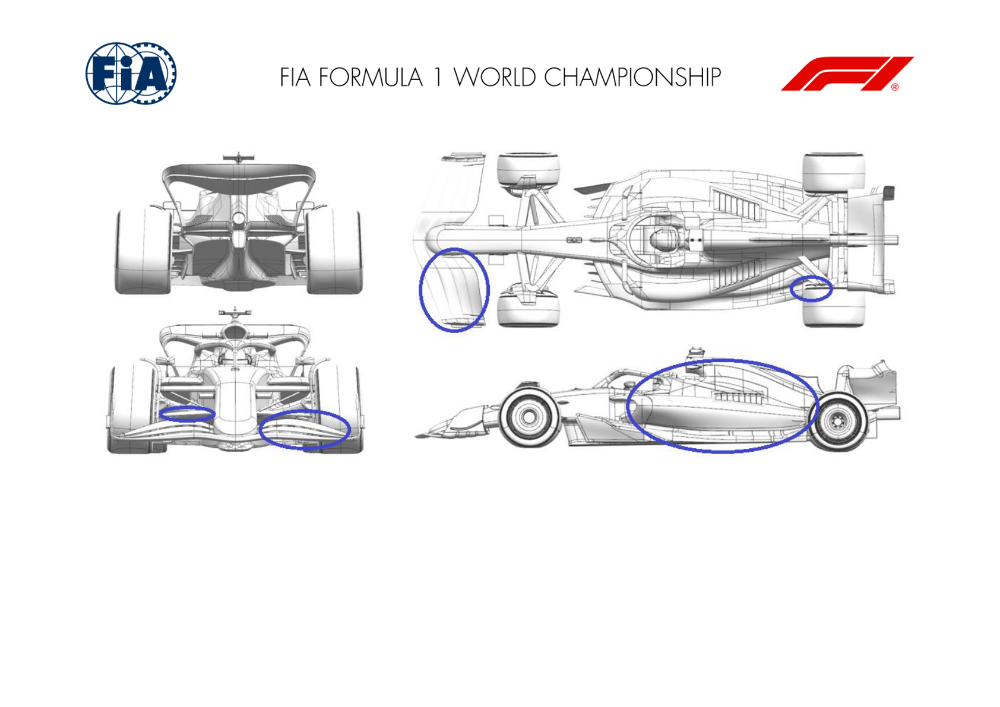
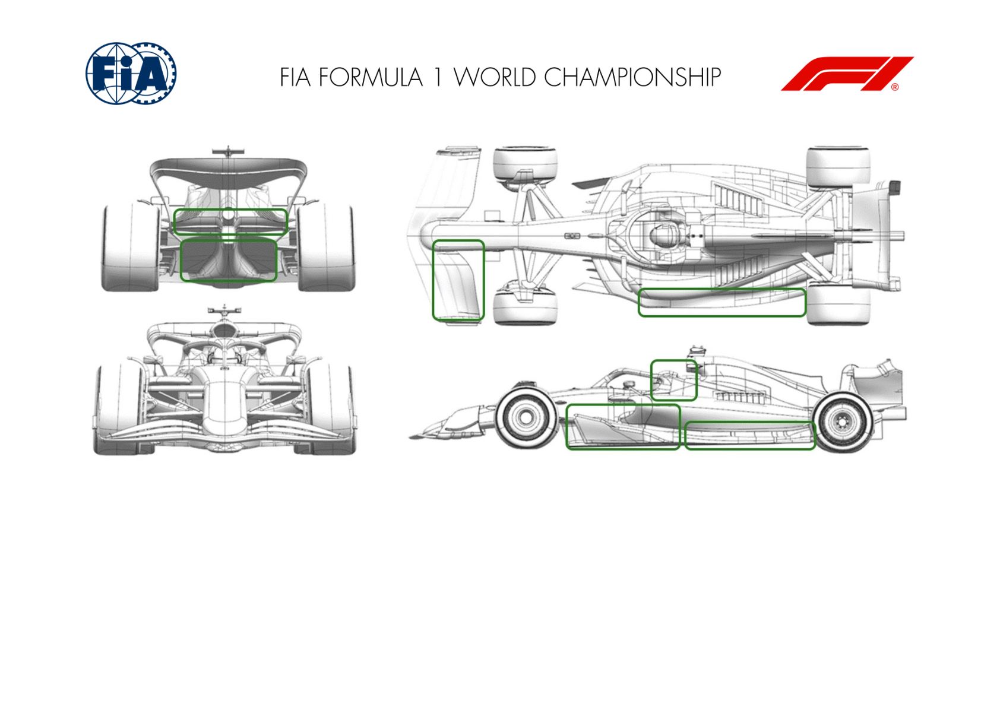
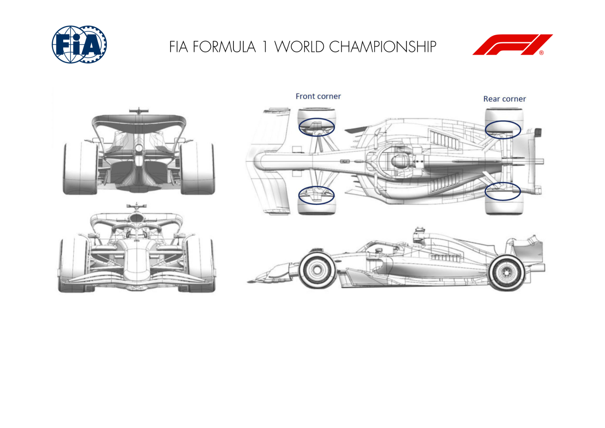

2024 HUNGARIAN GRAND PRIX

19 - 21 July 2024

From The FIA Formula One Media Delegate Document 10

To All Teams, All Officials Date 19 July 2024

Time 10:59

Title Car Presentation Submissions

Description Car Presentation Submissions

Enclosed 2024 Hungarian Grand Prix - Car Presentation Submissions .pdf

Roman De Lauw

The FIA Formula One Media Delegate

Car Presentation – Hungarian Grand Prix

ORACLE RED BULL RACING

| No. | Updated component | Primary reason for update | Geometric differences | Description |
| --- | --- | --- | --- | --- |
| 1 | Coke/Engine Cover | Circuit specific - Cooling Range | re-sculpted sidepods and engine cover revising the central exit and louvre exits | better cooling efficiency is attained for a high ambient temperature and relatively slow circuit with the revised geometry by reducing the load losses in such conditions from the exits. |
| 2 | Halo | Circuit specific - Cooling Range | Revised fairings towards the rearward mounts to suit the topbody downstream | A knock on effect of the topbody changes required a revision to the Halo fairings to eliminate mismatches in the local surfaces |
| 3 | Rear Corner | Performance - Local Load | Revised wrap-around profile of the wheel bodywork | Changes to the profile of the wrap-around upstream of the inatakes have given improvements in brake and caliper cooling intake pressures for better efficiencies. |
| 4 | Front Wing | Performance - Local Load | New profiles based upon previous designs affecting all four elements | Knowledge from the previous wings has allowed us to extract more load form revised profiles without affecting flow stability and protect downstream consequences. |
| 5 | Front Corner | Performance - Flow Conditioning | Revised front lower wishbone forward leg shroud profile | A further optimisation of the front lower wishbone forward leg shroud to provide higher pressure downstream. |

MERCEDES-AMG PETRONAS FORMULA ONE TEAM

| No. | Updated component | Primary reason for update | Geometric differences | Description |
| --- | --- | --- | --- | --- |
| 1 | Rear Corner | Performance - Local Load | Lower defector endplate trim. | Trimming the lower deflector endplate reduces local flow losses and therefore improves rear downforce through a range of ride heights. |

SCUDERIA FERRARI

| No. | Updated component | Primary reason for update | Geometric differences | Description |
| --- | --- | --- | --- | --- |
| 1 | Floor Body | Performance - Flow Conditioning | Reworked floor underbody | As a further evolution of the upgrade brought in Spain, this minor geometrical modification aims at enhancing flow structure and aero loads stability across the full operating envelope |

MCLAREN FORMULA 1 TEAM

No updates submitted for this event.

ASTON MARTIN ARAMCO FORMULA ONE TEAM

| No. | Updated component | Primary reason for update | Geometric differences | Description |
| --- | --- | --- | --- | --- |
| 1 | Front Wing | Circuit specific - Balance Range | A new Flap for the wing introduced at Silverstone with more aggression. | The more aggressive design increases the load on the wing to balance the car with the higher loaded rear wing which will be used at this event. |
| 2 | Halo | Performance - Local Load | The vanes attached to the Halo are revised with one that now joins the bodywork top deck. | The vanes around the cockpit are designed to control the position of some of the lower energy flow from this surrounding area. |
| 3 | Floor Body | Performance - Local Load | The main body of the floor has evolved slightly in most places with the fences and floor edge. | The revised shapes improve the flowfield under the floor increasing the local load generated on the lower surface and hence performance. |
| 4 | Floor Fences | Performance - Local Load | The fences are redistributed across the LE of the floor with revised curvature and leading edge profiles.. | The revised shapes improve the flowfield under the floor increasing the local load generated on the lower surface and hence performance. |
| 5 | Floor Edge | Performance - Local Load | Small changes to the details of the floor edge wing and the main floor inboard of this. | The revised shapes improve the flowfield under the floor increasing the local load generated on the lower surface and hence performance. |
| 6 | Diffuser | Performance - Local Load | The diffuser is a slightly modified shape with boat surface. | The changes to the shape modify the expansion in the diffuser to improve flow characteristics and the load generated on the surfaces. |
| 7 | Beam Wing | Performance - Local Load | Revised beam wing with more raised second element outboard. | The changes to the OB of the beam wing effects the balance of performance between the floor and rear wing for improved performance. |

BWT ALPINE F1 TEAM

| No. | Updated component | Primary reason for update | Geometric differences | Description |
| --- | --- | --- | --- | --- |
| 1 | Rear Corner | Circuit specific - Cooling Range | New inlet and exit ducts with new furniture. | As part of our normal development cycle, this new rear corner aims at giving more authority on the management of our rear brakes temperature through a wider inlet duct as well as a larger exit duct. |

WILLIAMS RACING

| No. | Updated component | Primary reason for update | Geometric differences | Description |
| --- | --- | --- | --- | --- |
| 1 | Coke/Engine Cover | Circuit specific - Cooling Range | A new central exit duct for the cooling system is available. It is physically larger than those run previously. | This new larger exit simply results in a larger air mass flow rate through the cooling system. This increases the cooling to the PU and GBox fluids but comes at the cost of downforce and drag performance. It will be fitted if the ambient conditions demand it. |

VISA CASH APP RB FORMULA ONE TEAM

| No. | Updated component | Primary reason for update | Geometric differences | Description |
| --- | --- | --- | --- | --- |
| 1 | Front Corner | Circuit specific - Cooling Range | Updated internal ducting. | The duct modifications improve the flow management through the brake system, ensuring that the incoming mass flow is distributed in the correct proportions to the individual items than need cooling. |
| 2 | Rear Corner | Performance - Local Load | The geometry of the winglets on the rear corner has been updated. Additional downforce is generated, suitable for high-downforce circuits such as Hungary. |  |

STAKE F1 TEAM KICK SAUBER

| No. | Updated component | Primary reason for update | Geometric differences | Description |
| --- | --- | --- | --- | --- |
| 1 | Sidepod Inlet | Performance - Flow Conditioning | Revised sidepod inlet geometry | Combined with the reworked engine cover, the new sidepod inlet delivers better flow quality down the side of the car. |
| 2 | Coke/Engine Cover | Performance - Flow Conditioning | Engine cover top surface re-designed | Bodywork and sidepod were changed together to improve the quality of the flow reaching the floor edge and the rear of the car. |
| 3 | Floor Body | Performance - Flow Conditioning | Reworked floor height and shape, combined with re- optimized floor fences. | The new front floor shape combined with the reworked fences deliver additionnal local load whilst maintaining a good flow quality for the rear floor. |
| 4 | Floor Edge | Performance - Local Load | Closed floor edge slot | The new floor edge delivers a local load increase whilst maintaining the vorticity level in the diffuser under control. |
| 5 | Rear Corner | Performance - Local Load | New brake scoop duct, deflectors geometries and associated suspension fairings | The new corner and rear suspension covers delivered a step of performance when combined with the new bodywork and floor, both in local load and in the surrounding area. |
| 6 | Rear Suspension | Performance - Flow Conditioning | New rear suspension fairings associated to the new rear corner. | The fairings were part of the new corner described above. They were realigned to the changes onset a clean flow for the rear floor and rear corner devices. |
| 7 | Halo | Performance - Flow Conditioning | Revised halo design combined with a new deflector | Halo design revised to improve the flow quality along the bodywork with an improved control of the cockpit losses. |

| No. | Updated component | Primary reason for update | Geometric differences | Description |
| --- | --- | --- | --- | --- |
| 8 | Mirror | Performance - Flow Conditioning | Updated mirror geometries | Together with the sidepod inlet and the engine cover update we adapted the mirror stays to achieve better flow control and flow quality towards the rear end. |
| 9 | Headrest | Performance - Flow Conditioning | Raised headrest shoulders | Together with the sidepod inlet update which is slightly raised we adapted the headrest shoulder towards the sidepod / engine cover for a smooth transition. |

MONEYGRAM HAAS F1 TEAM

| No. | Updated component | Primary reason for update | Geometric differences | Description |
| --- | --- | --- | --- | --- |
| 1 | Coke/Engine Cover | Circuit specific - Cooling Range | Larger Engine Cover Cooling Exit | This option represents a cooling option: wider central exit allows more heat rejection. Option designed to minimize the Aero penalty. |
| 2 | Cooling Louvres | Circuit specific - Cooling Range | Set of Sidepod top and engine cover louvers | Further cooling options with the possibility to fit louvres on the Sidepod top (most efficient ones as on top of the radiators) and a range of louvres on the new Engine cover to fine tune the potential cooling requirements. |
