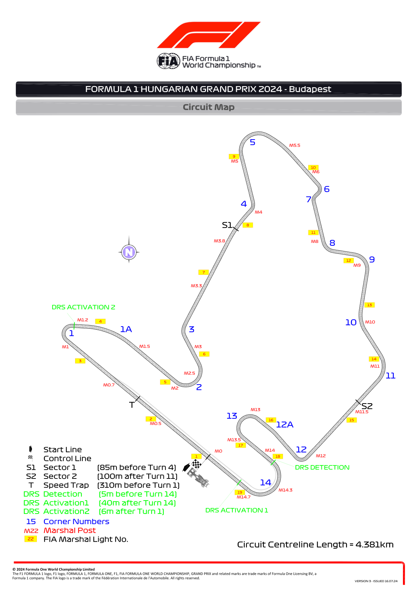
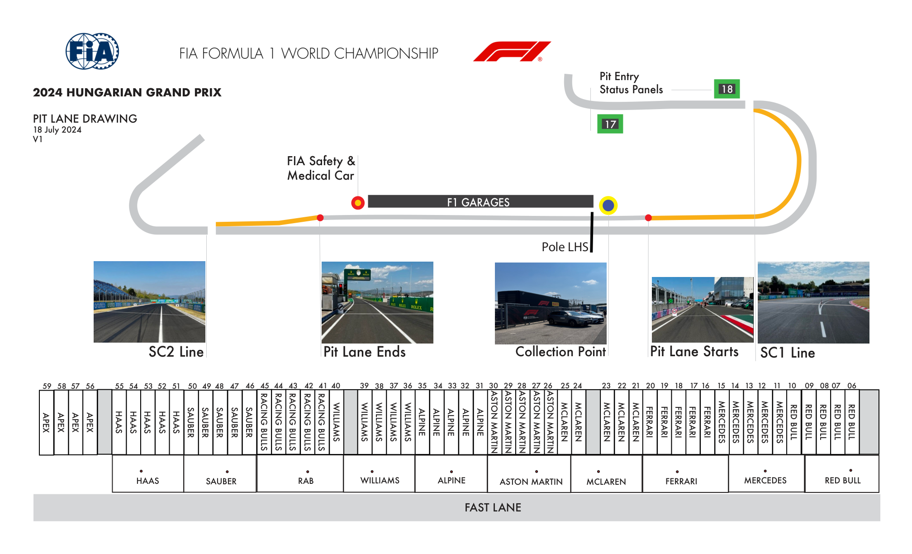
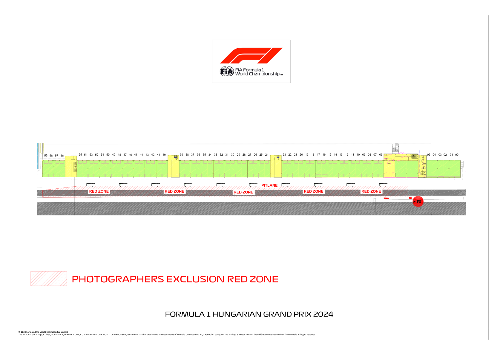

2024 HUNGARIAN GRAND PRIX

19 - 21 July 2024

From The FIA Formula One Race Director Document 3

To All Teams, All Officials Date 18 July 2024

Time 15:38

Title Event Notes - Circuit Map, Pit Lane Drawing and Red Zones

Description Event Notes - Circuit Map, Pit Lane Drawing and Red Zones

Enclosed Event Notes - Circuit Map, Pit Lane Drawing and Red Zones.pdf

Niels Wittich

The FIA Formula One Race Director

