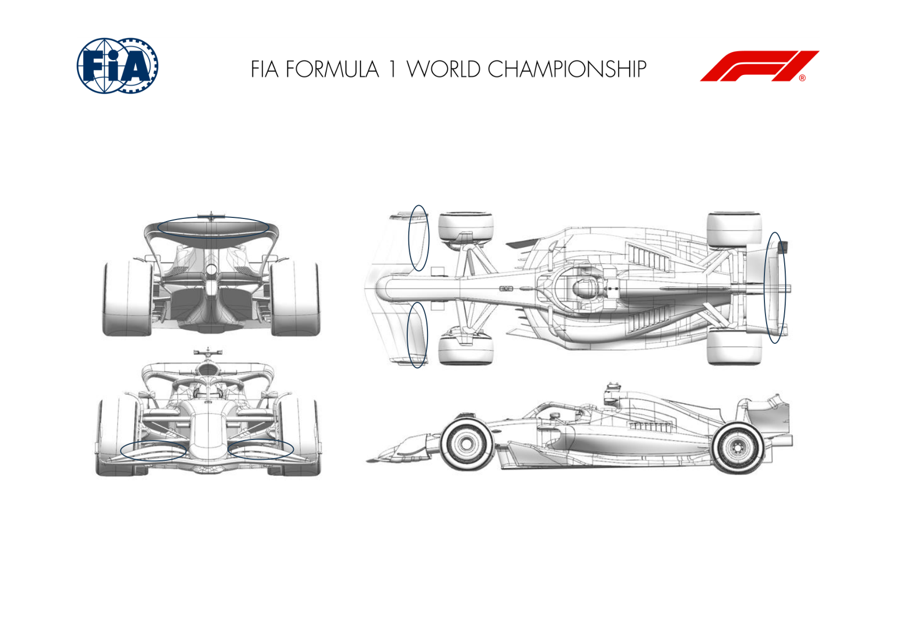
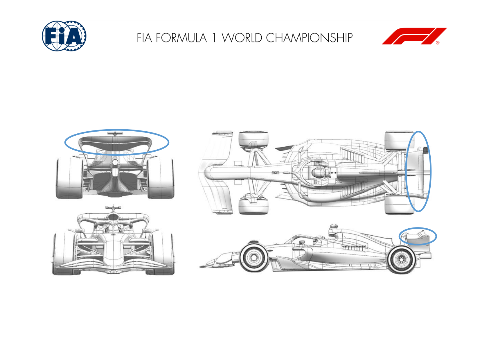
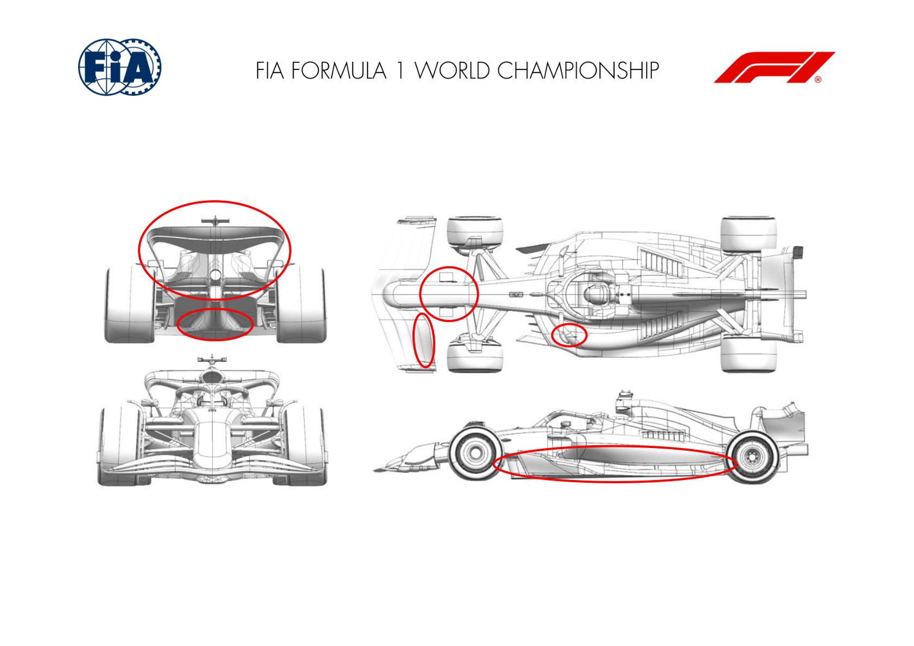
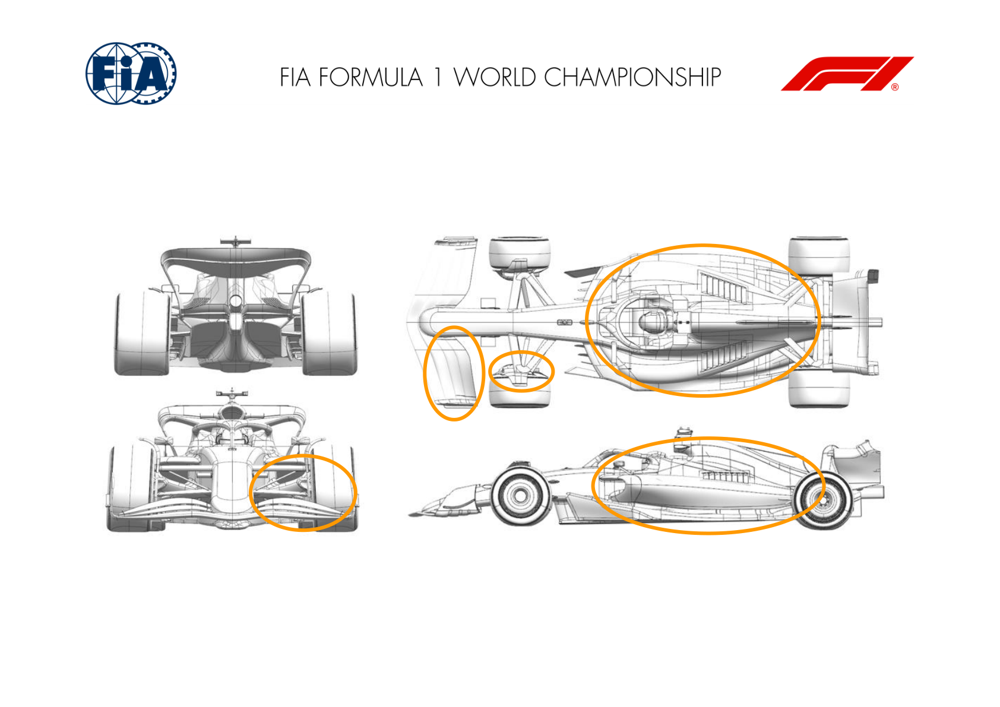
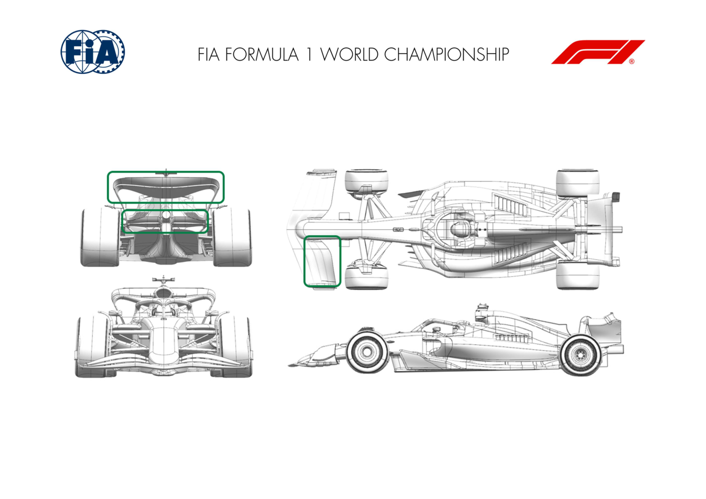
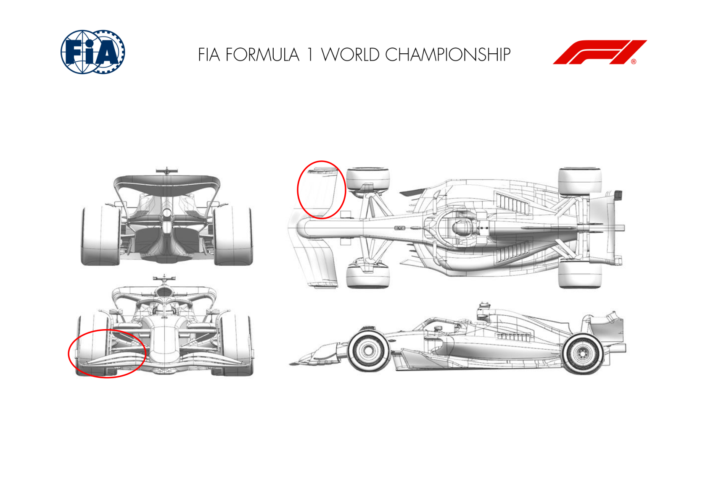
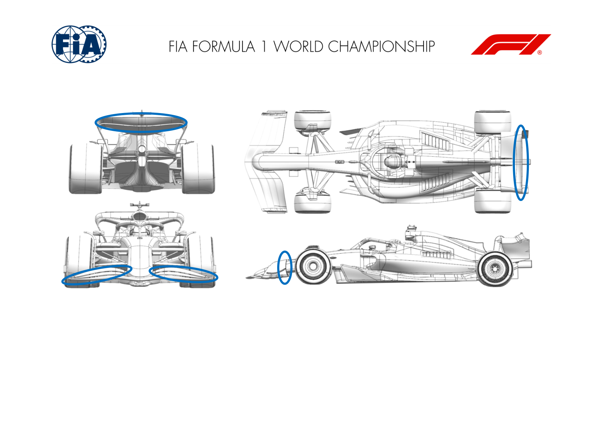
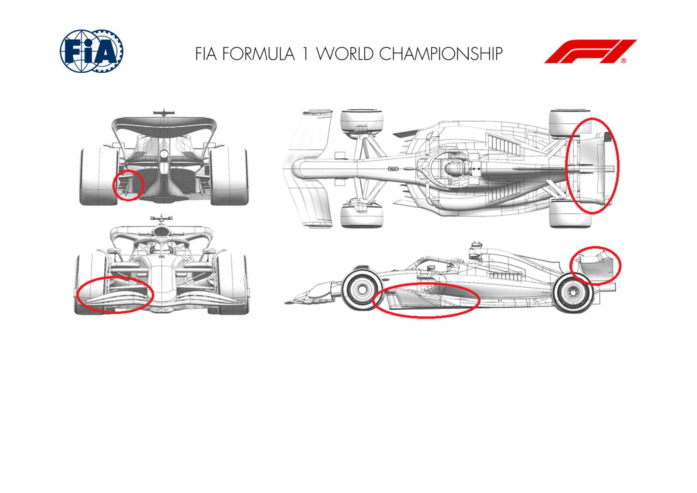
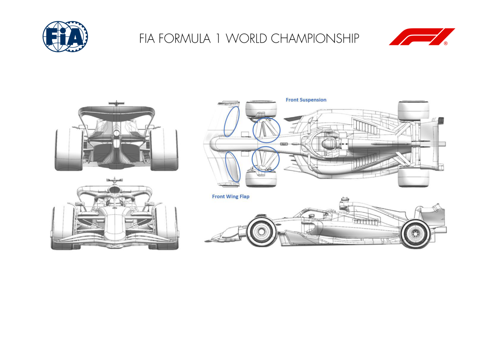

2024 ITALIAN GRAND PRIX

30 August - 01 September 2024

From The FIA Formula One Media Delegate Document 8

To All Teams, All Officials Date 30 August 2024

Time 10:45

Title Car Presentation Submissions

Description Car Presentation Submissions

Enclosed 2024 Italian Grand Prix - Car Presentation Submissions.pdf

Roman De Lauw

The FIA Formula One Media Delegate

Car Presentation – Italian Grand Prix

Red Bull Racing

| No. | Updated component | Primary reason for update | Geometric differences | Description |
| --- | --- | --- | --- | --- |
| 1 | Front Wing | Circuit specific - Drag Range | Reduced chord of the last element. | In order to achieve the targeted range of aerobalance with the level of rear wing, the second flap element has been trimmed to reduce the lift at a given speed. |
| 2 | Rear Wing | Circuit specific - Drag Range | Reduced chord of the last element. | In order to achieve the targeted aerodynamic drag the flap chord has been trimmed to reduce the load and therefore the drag. |

Car Presentation – 2024 Italian Grand Prix

*Mercedes-AMG PETRONAS F1 Team*

| No. | Updated component | Primary reason for update | Geometric differences | Description |
| --- | --- | --- | --- | --- |
| 1 | Rear Wing | Performance - Drag reduction | Subtle change to wing tip detail. | Flap tip backed off and camber reduced to drop local downforce and drag; suitable for a high L/D track like Monza. |
| 2 | Rear Wing | Performance - Drag reduction | Reduced chord flap. | Both chord and camber reduced on the flap to drop local downforce and drag; suitable for a high L/D track like Monza. |

Car Presentation – Italian Grand Prix

*SCUDERIA FERRARI*

| No. | Updated component | Primary reason for update | Geometric differences | Description |
| --- | --- | --- | --- | --- |
| 1 | Front Wing | Circuit specific - Balance Range | Lower Downforce Front Wing Flap design and trims | The depowered front wing flap provides the required aero balance range associated to the optimum downforce level anticipated for Monza. Different trims are available, to allow modulation |
| 2 | Nose | Performance - Flow Conditioning | Nose camera repositioning | Minor optimisation of the nose camera position for a better interaction between front wing upwash and front suspension legs, offering an improved flow quality downstream |
| 3 | Mirror | Performance - Flow Conditioning | Shorter mirror stay | Minor update, a shorter mirror stay will be introduced for this event. As for the nose camera update, primary aim is to improve flow quality towards the back of the car |
| 4 | Floor Fences | Performance - Flow Conditioning | Redistribution of fences profiles and camber Not event specific, this update features updated front floor fences targeting an improvement of the losses travelling downstream. The reshaped boat and tunnel expansion have been subsequently reoptimized, together with the floor edge loading and vortex shedding into the diffuser, which also receives the benefit of the deeper undercut. |  |
| 5 | Floor Body | Performance - Flow Conditioning | Reshaped boat and tunnel expansion |  |
| 6 | Floor Edge | Performance - Flow Conditioning | Reshaped floor edge and introduction of a cutout in plan view |  |
| 7 | Diffuser | Performance - Flow Conditioning | Redesigned boat keel and diffuser expansion |  |
| 8 | Coke/Engine Cover | Performance - Flow Conditioning | Deeper undercut |  |

| No. | Updated component | Primary reason for update | Geometric differences | Description |
| --- | --- | --- | --- | --- |
| 9 | Rear Wing | Circuit specific - Drag Range | Lower Downforce Top and Lower Rear Wing designs | This update features depowered Top and Lower Rear Wing profiles in order to adapt to Monza layout peculiarities and efficiency requirements. Both a new design and the carry-over of last year’s geometries (TRW and LRW) will be available. |

Car Presentation – Italian Grand Prix

McLaren Formula 1 Team

| No. | Updated component | Primary reason for update | Geometric differences | Description |
| --- | --- | --- | --- | --- |
| 1 | Front Corner | Circuit specific - Cooling Range | High Cooling Front Brake Duct | To cope with the specific demands of this circuit, the Front Corner geometry has been revised, with the primary aim of increasing Brake Cooling performance while maintaining aerodynamic efficiency. |
| 2 | Front Wing | Circuit specific - Balance Range | New Front Wing Flap | The Front Wing Flap has been redesigned to extend the available aerobalance range, which could be a requirement given the specific circuit layout. |
| 3 | Coke/Engine Cover | Performance - Flow Conditioning | New Sidepod Shape | The new Sidepod results in an improvement in flow conditioning, beneficial for overall aerodynamic performance, mainly on the rear of the car. |

Car Presentation – Italian Grand Prix

Aston Martin Aramco F1 Team

| No. | Updated component | Primary reason for update | Geometric differences | Description |
| --- | --- | --- | --- | --- |
| 1 | Front Wing | Circuit specific - Balance Range | A new flap for the front wing with reduced incidence. | The less aggressive design decreases the load on the wing to balance the car with the lower loaded rear wing which will be used at this event. |
| 2 | Beam Wing | Circuit specific - Drag Range | Smaller beam wing with a short chord second element. | This beam wing has lower loading than the previous version and works in conjunction with the upper wing for this event to achieve the required drag range. |
| 3 | Rear Wing | Performance - Local Load | Upper rear with less aggressive sections, this assy has two options of flap. | This is a less aggressive upper wing cascade with lower load and drag than previous versions for use at this circuit efficiency. |

Car Presentation – Italian Grand Prix

BWT Alpine F1 Team

| No. | Updated component | Primary reason for update | Geometric differences | Description |
| --- | --- | --- | --- | --- |
| 1 | Front Wing | Circuit specific - Balance Range | Reprofiled front wing flap | This less loaded flap has been introduced to cover the required balance range when running lower rear wing levels as it is typically the case at this track. |

Car Presentation – Italian Grand Prix

*Williams Racing*

| No. | Updated component | Primary reason for update | Geometric differences | Description |
| --- | --- | --- | --- | --- |
| 1 |  | Front Wing Endplate | Circuit specific - Drag Range | Part of the trailing edge of the front wing This reduces drag but also affects the local load and the endplate is removed and the dive plane is flow structures from the front wing endplate. In Monza, reoriented. this is an efficient way of improving lap time. |
| 2 | Front Wing |  | Circuit specific – Balance Range | A smaller and reprofiled rearward flap for the front wing is available This revised geometry helps reduce local load on the front wing to provide the total front load required to balance the small rear wings that are used at this circuit. |
| 3 | Rear Wing |  | Circuit specific - Drag Range | An optional trim is available to the rear wing upper flap. This reduces the chord length of the flap. This optional trim will be used depending on how we want to balance downforce and drag during the weekend. This trim simply reduces the area of the rear wing and therefore provides less downforce and less drag, which may be efficient for Monza |

Car Presentation – Italian Grand Prix

Visa Cash App RB

| No. | Updated component | Primary reason for update | Geometric differences | Description |
| --- | --- | --- | --- | --- |
| 1 | Front Wing | Circuit specific - Balance Range | Shorter chord flap compared to previous low- balance components. | This smaller front flap reduces the amount of overall load generated by the front wing assembly, to balance the low drag rear wings used at this circuit. |
| 2 | Floor Body | Performance - Local Load | Profile changes to the main underfloor. | Increased local downforce generation and management of the flow structures and losses as they travel downstream to minimise their impact. |
| 3 | Rear Wing | Circuit specific - Drag Range | Reduced camber, chord & incidence upper elements to achieve lower drag level target. | Low downforce circuits demand more efficient, less-loaded rear wings. Less cambered aerofoil sections at lower angles of incidence generate less downforce & less induced drag. |
| 4 | Beam Wing | Circuit specific - Drag Range | Chord reduction to lower element. | Reduces the load generated by the Beam Wing to allow further tuning of wing level to suit low downforce circuits. |
| 5 | Halo | Performance - Flow Conditioning | Refinements to shape of Halo fairing. Improves the losses shed from the Halo and their impact downstream. |  |
| 6 | Mirrors | Circuit specific - Drag Range | Simplified geometry around the main mirror body. | Removal of specific elements around the mirror body which generate downforce & drag at a ratio which is less efficient than that required at Monza. |

Rear wing Front wing Halo

Beam wing

Mirrors

Floor body

Car Presentation – Italian Grand Prix

Stake F1 Team KICK Sauber

| No. | Updated component | Primary reason for update | Geometric differences | Description |
| --- | --- | --- | --- | --- |
| 1 | Front Wing | Circuit specific - Balance Range | Low balance front wing flap design | The smaller front wing flap reduced the load generated by the front wing to ensure that we can rebalance the low-drag rear wing introduced for this circuit. |
| 2 | Floor Body | Performance - Local Load | Redesigned forward floor body | The revised forward floor body increases local load while maintaining the cleanliness of the flow reaching the rear end. |
| 3 | Diffuser | Performance - Flow Conditioning | Small change on diffuser sidewall design | This change helps to increase high energy flow into the diffuser and at the same time to better control the tyre jet. |
| 4 | Rear Wing | Circuit specific - Drag Range | Low drag rear wing assembly | This new low drag RW assembly reduces efficiently load. We can combine the main plane with a more loaded optional flap to tune load and drag. |

Car Presentation – 2024 Italian Grand Prix (Monza)

MONEYGRAM HAAS F1 TEAM

| No. | Updated component | Primary reason for update | Geometric differences | Description |
| --- | --- | --- | --- | --- |
| 1 | Front Wing | Circuit specific - Balance Range | Low camber Front Wing Flap | A specific Front Wing Flap design for low balance, to be coupled with the low drag Rear Wing introduced in Spa. |
| 2 | Front Suspension | Performance - Flow Conditioning | Re-profiled Lower wishbone and pushrod fairing | This step completes the front suspension fairing update, which started in Zandvoort together with the introduction of the new Front Wing. The re profiling of the remaining suspension members allows them to be more compliant with the incoming flow. |

