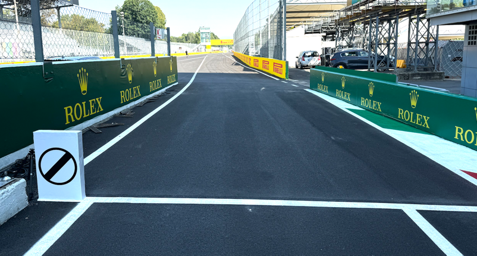
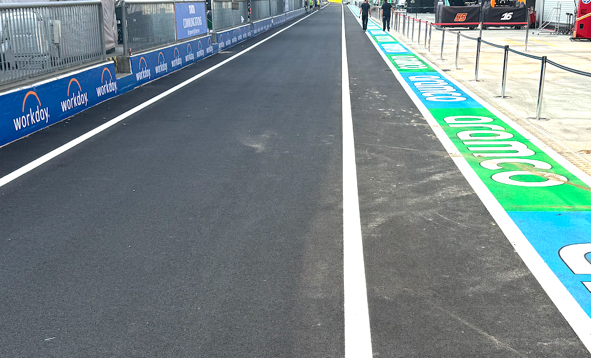
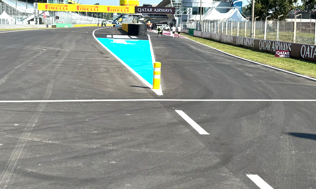
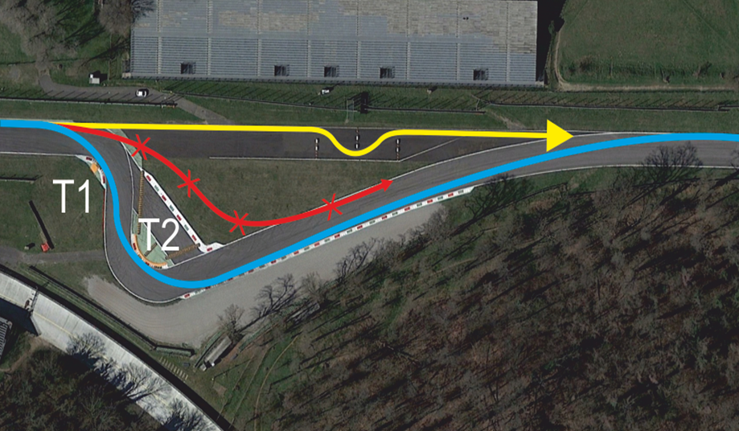
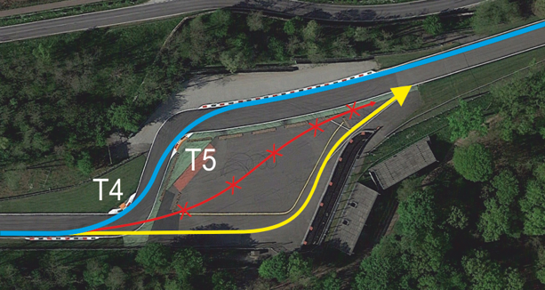

2024 ITALIAN GRAND PRIX

30 August - 01 September 2024

From The FIA Formula One Race Director Document 16

To All Teams, All Officials Date 30 August 2024

Time 16:01

Title Race Director's Event Notes V2

Description Race Director's Event Notes V2

Enclosed 2024 Italian Grand Prix - Event Notes V2.pdf

Niels Wittich

The FIA Formula One Race Director

2024 I G P TALIAN RAND RIX

30 August – 01 September 2024

From The FIA Formula One Race Director

To All Officials, All Teams Date 30 August 2024

EVENT NOTES V2 (changes in light blue) General Instructions

1) Observing yellow flags

1.1 Single waved: Drivers reduce their speed and be prepared to change direction. It must be clear that a driver has reduced speed and, in order for this to be clear, a driver would be expected to have braked earlier and/or discernibly reduced speed in the relevant marshalling sector.

1.2 Double waved: Any driver passing through a double waved yellow marshalling sector must reduce speed significantly and be prepared to change direction or stop. In order for the stewards to be satisfied that any such driver has complied with these requirements it must be clear that he has not attempted to set a meaningful lap time. Furthermore, during qualifying, any driver in a double yellow sector will have that lap time cancelled.

1.3 Double Waved during VSC or SC: Any driver passing through a double waved yellow marshalling sector during a VSC or SC, in addition to the requirements in 1.2 above, must remain positive of the SECU delta time in the sector concerned.

2) Laps during Qualifying and Reconnaissance Laps

In order to ensure that cars are not driven unnecessarily slowly on in laps during and after the end of qualifying or during reconnaissance laps when the pit exit is opened for the race, drivers must stay below the maximum time set by the FIA between the Safety Car lines shown on the pit lane map.

Teams and Drivers will be informed of the maximum time after the second practice session.

For the safe and orderly conduct of the Event, other than in exceptional circumstances accepted as such by the Stewards, any driver that exceeds the maximum time from the Second Safety Car Line to the First Safety Car Line on ANY lap during and after the end of the qualifying session, including in-laps and out-laps, may be deemed to be going unnecessarily slowly. For the avoidance of doubt, this does not supersede Article 33.4 and Article 37.5 of the FIA Formula One Sporting Regulations, which apply to the entire Circuit, furthermore this includes the pit lane as well. Incidents will normally be investigated after the qualifying session.

3) Parc Fermé

The Parc Fermé cameras must be always uncovered and operational during the Event.

4) Lapping during the race

The ISC requires drivers who are caught by another car to allow the faster driver past at the first available opportunity.

The F1 marshaling system will be set to give a pre-warning when the faster car is within 3.0s of the car about to be lapped, this should be used by the team of the slower car to warn their driver he is soon going to be lapped and that allowing the faster car through should be considered a priority.

1

When the faster car is within 1.2s of the car about to be lapped blue flags will be shown to the slower car (in addition to blue light panels, blue cockpit lights and a message on the timing monitors) and the driver must allow the following driver to overtake at the first available opportunity.

5) Article 55.14

“In order to avoid the likelihood of accidents before the safety car returns to the pits, from the point at which the lights on the car are turned out drivers must proceed at a pace which involves no erratic acceleration or braking nor any manoeuvre which is likely to endanger other drivers or impede the restart”.

6) Article 40.8

In accordance with the provisions of Article 40.8, upon request by the Technical Delegate, the Teams are required to connect the umbilical to the cars and close the HV contactors (TR 5.26.5) for the sole purpose of checking the car ERS safety status, every morning immediately after the covers are removed and the cars are under parc fermé conditions.

Event Specific Instructions

7) FIA Outside Scales Times

Should the outside scales be set-up at the pit-lane entrance, these will be available for teams to use at any time outside the curfew times and the Parc Fermé cover-up times, except for the 30 minutes preceding the start of the Qualifying session and if there are support competitions using the pit lane.

8) Specific Technical Procedures

Please note that the FIA have introduced an Appendix Index File which contains all the relevant and active Appendix documents, Technical and Sporting Directives. The latest version of this Index file (“2024 Formula 1 Appendix – iss 1 – 2024-01-15.xlsx”) and all relevant documents can be found on the FIA SFTP site.

Competitors are hereby required to ensure compliance with these directives for the safe and orderly conduct of the Event.

9) Support Races team barrier placement and Movements

Team barrier placement prior to and during all support category practice sessions and races: No more than (3) three meters from the garages.

Please ensure that your pit stop gantry arms are moved back towards the garage during all support category activities.

It is not permitted to push cars to the weighing area at any time a support category is in the pit lane.

Support Crews and Trolleys will be released into Pit Lane no earlier than 20 minutes prior to the opening of Pit Exit for their respective sessions.

Support Category competition vehicles will be released from the marshalling area no earlier than 15 minutes prior to the opening of Pit Exit for their respective sessions.

2

10) Practice starts

10.1 During each Free Practice session, practice starts may be only carried out on the RHS after the pit exit lights but before the end of the pit wall.

10.2 During the time the pit exit is open for the race, practice starts may be carried out on the RHS after the end of the pit wall but before the dotted white line across the pit exit. During this time any driver passing a car which has stopped to carry out a practice start may cross the white line that is referred to in 12.1 below.

11) Article 34.8 SR

(…) Any car(s) driven to the end of the pit lane prior to the start or re-start of a free practice session, qualifying session or sprint qualifying session must form up in a line in the fast lane and leave in the order they got there (…)

It is noted that a car will be considered to be “in the fast lane” when a tyre has crossed the solid white line separating the fast lane from the inner lane, in this context crossing means that all of a tyre should be beyond the far side, with respect to the garages, of the line separating the fast lane from the inner lane.

For the avoidance of doubt, ISC Appendix L, Chapter IV, Article 5b) states that:

Once a car has left its garage or pit stop position it should blend into the fast lane as soon as it is safe to do so, and without unnecessarily impeding cars which are already in the fast lane.

Thus, after the start or re-start of a free practice session, qualifying session, or sprint qualifying session, if there is a suitable gap in a queue of cars in the fast lane, such that a driver can blend into the fast lane safely and without unnecessarily impeding cars already in the fast lane, they are free to do so.

Furthermore, it is noted that during a free practice session, qualifying session, or sprint qualifying session a car driving in the inner lane, parallel to the fast lane, will not be considered to have blended into the fast lane at the earliest opportunity.

Additionally, ISC Appendix L, Chapter IV, Article 5d) states that:

Cars in either the fast lane or working lane may not overtake other cars in the fast lane except in exceptional circumstances.

In this context a “stopped car” is one which has an obvious mechanical problem.

12) Lines at the Pit Entry and Pit Exit

12.1 In accordance with Chapter 4, Article 4 and 6 of Appendix L to the ISC drivers must follow the

3

procedures at pit entry and pit exit. 12.2 For safety reasons drivers must keep to the right of the bollard at the pit entry when they are entering the pits.

12.3 For safety reasons, the line that is at pit exit, includes the line painted on the track at pit exit and continuing after SC2 line.

13) Post-Qualifying drivers weighing

Any driver who finished participating in the qualifying sessions after Q1 and Q2 must proceed through the pit lane directly to the FIA scales immediately after they have returned to their team’s garage. The drivers may not drink anything or do anything which increases their weight before it is recorded by the FIA. Any driver, who stops on the track during the qualifying sessions and is not required to visit the Medical Centre, must proceed to the FIA scales to get his weight recorded before returning to his team. Drivers who finish within the top 10 must proceed to the FIA scales immediately when out of their cars without contact with any other person.

14) DRS

DRS Detection will be automatically disabled in each individual zone if any of the light panels in that zone are displaying yellow. The zones and corresponding light panels are as follows:

a) DRS Activation 1: Panels 9, 10, 11, 12, 13

b) DRS Activation 2: Panels 1, 2, 3

15) Track Limits

In accordance with the provisions of Article 33.3, the white lines define the track edges. During

Qualifying and the Race, each time a driver fails to negotiate with the track limits, this will result in

that lap time being invalidated by the Stewards.

16) Escape Roads

16.1 Escape Road at Turn 1 – Turn 2

Four rows of polystyrene blocks have been placed in the escape road at the first chicane. In order to ensure the cars are able to re-join the track safely any driver using the escape road must go around the end of each of these rows and re-join the track at the end of the escape road. Drivers may only use the grass if it is clearly unavoidable.

4

16.2 Escape Road at Turn 4 – Turn 5

Any driver going straight and who misses Turn 4 and passes the shaded area to the right or any driver crossing the shaded area before the apex kerb of Turn 5 must stay to the right of the yellow line and the bollard, he may re-join the track at the far end of the asphalt run-off area after the exit of Turn 5.

17) Unsafe or Unknown ERS Status

If the status of the ERS changes to unsafe or unknown, the relevant team will be required to send mechanics in front of the race control during the session. They will then be picked up by a two race control scooters that will drive them to their car. Additionally, a race control car will be available only after the end of a session to bring the relevant mechanics to their car.

18) Entering Fast Lane during all Practice Sessions

If any Free Practice Sessions or Qualifying Session is suspended, cars may only enter the Fast Lane after the re-start time is confirmed via the official messaging system.

19) Fire extinguishers around the circuit

Indicated by white boards with a red fire extinguisher attached to the debris fences.

20) Places to remove cars from the track

Indicated by fluorescent orange panels/paintings on the barriers.

21) Removing cars from the grid

22) Cars may be removed from the grid through the gates adjacent to grid positions 6 and through pit exit.

23) Race Suspension

In case of a race suspension, cars will be stopped in the fast lane of the pits in front of the pit exit lights.

24) Car number light panels for the start

On the right-hand side of the grid.

5

25) Changes to the Circuit

• The track has been fully resurfaced. • All kerbs have been replaced with new kerbs. • The bollards in the run-off in Turn 2 on LHS have been replaced with a 2.5m wide gravel strip. • Between Turn 4 and Turn 5 on RHS a 2.5m wide gravel strip has been installed with a distance of 1m from the track edge.

Niels Wittich

The FIA Formula One Race Director

6
