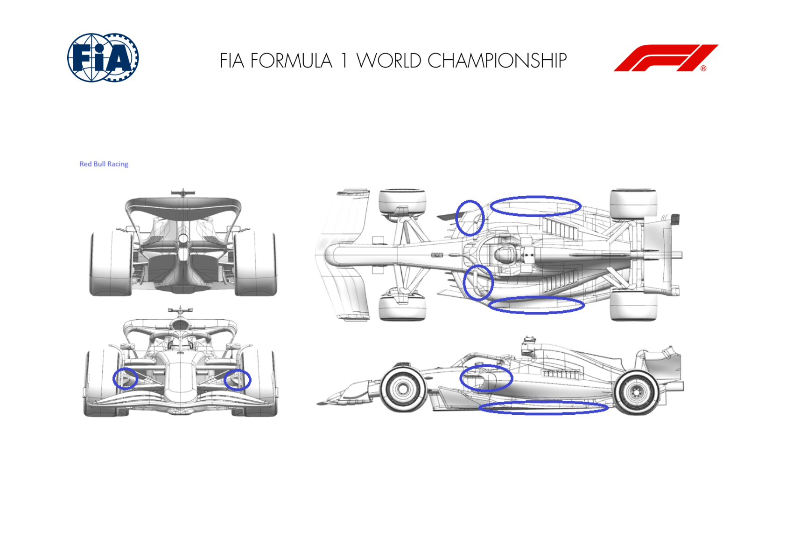
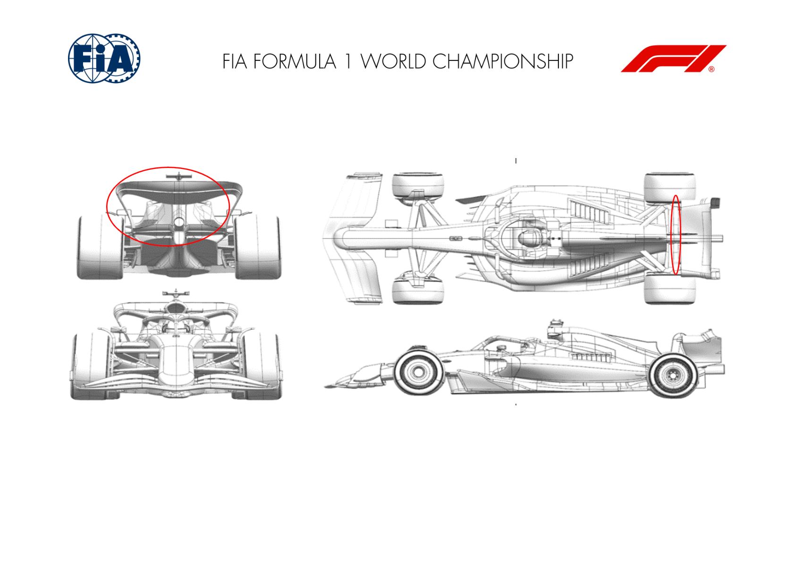
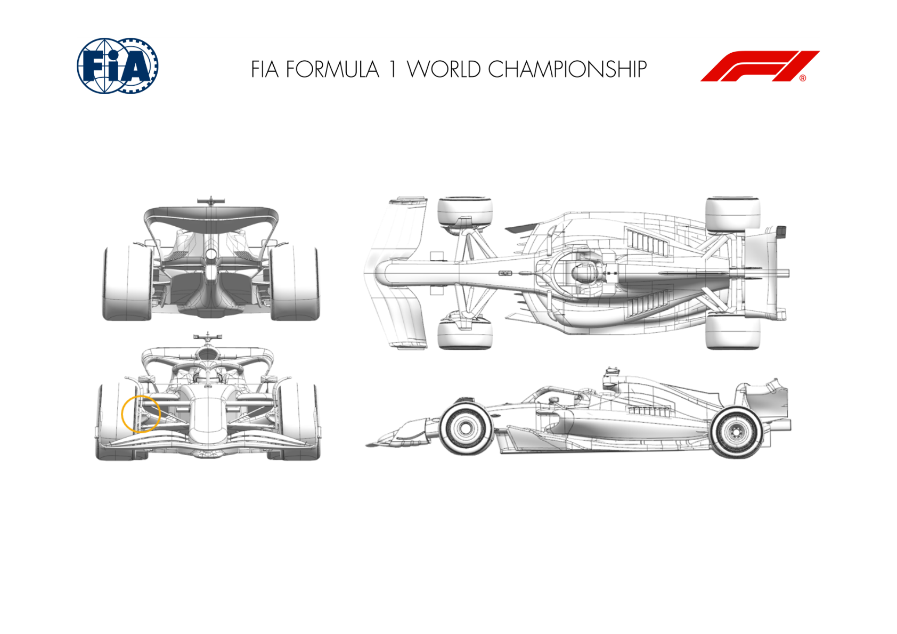
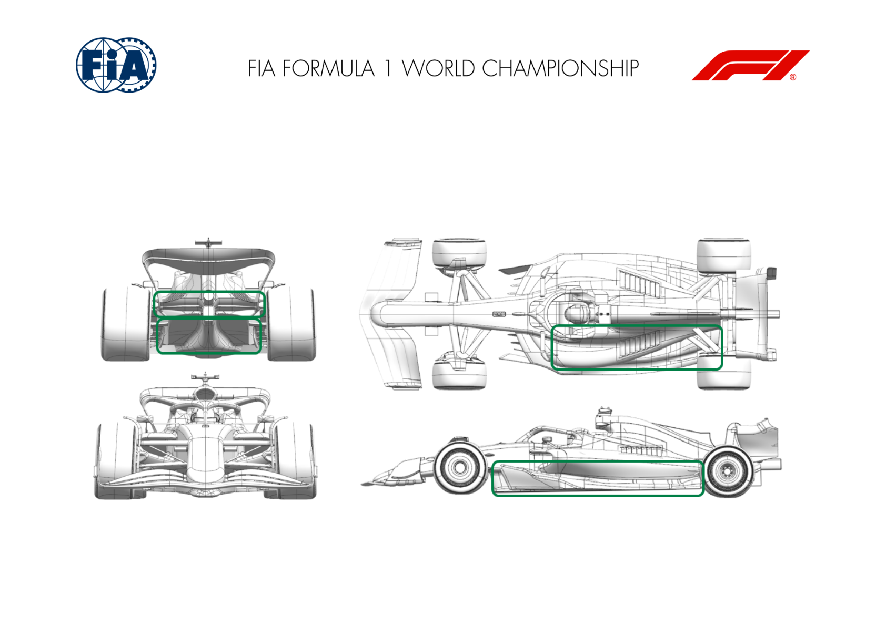
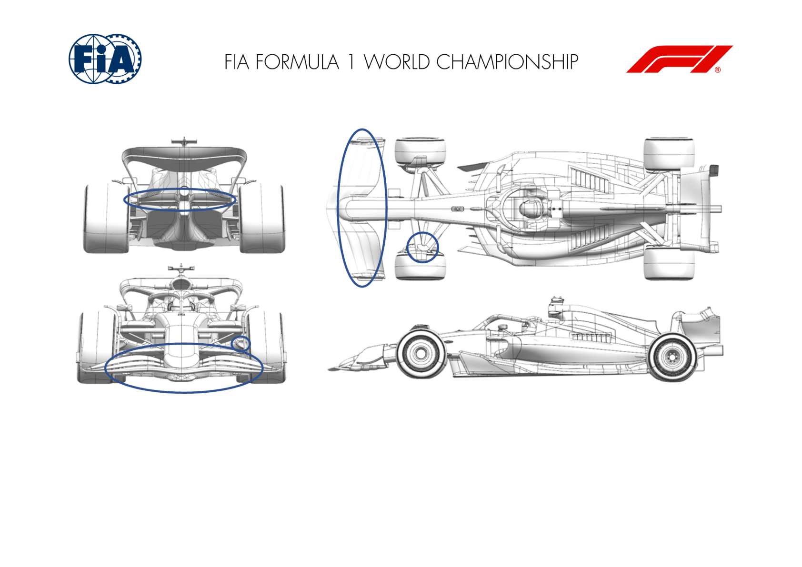
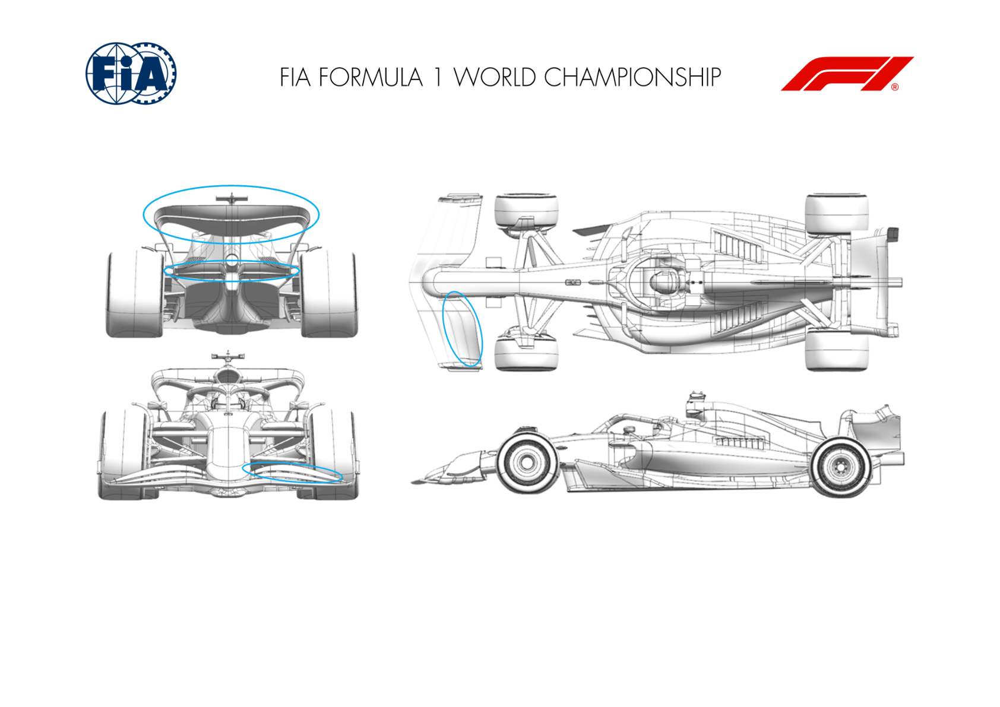
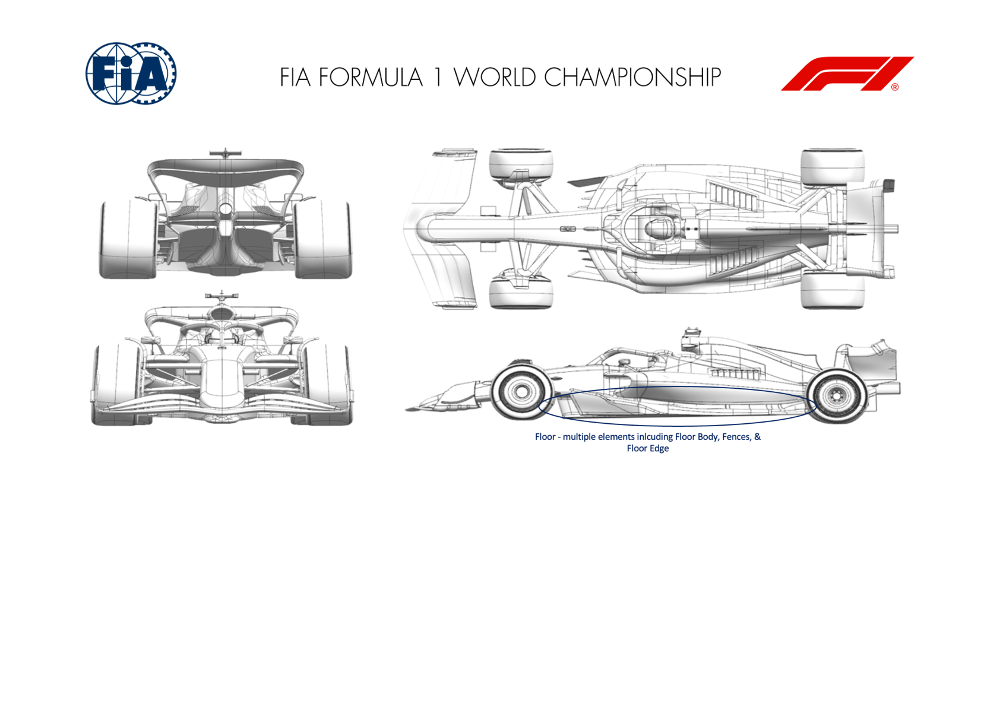
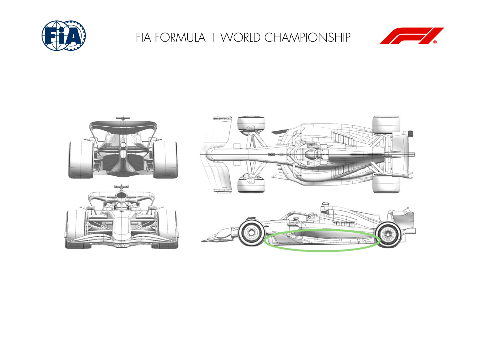

2024 JAPANESE GRAND PRIX

05 - 07 April 2024

From The FIA Formula One Media Delegate Document 12

To All Teams, All Officials Date 05 April 2024

Time 08:47

Title Car Presentation Submissions

Description Car Presentation Submissions

Enclosed Japanese GP - Car Presentation Submissions.pdf

Roman De Lauw

The FIA Formula One Media Delegate

Car Presentation – Japanese Grand Prix

ORACLE RED BULL RACING

|  | Updated component |  | Primary reason for update | Geometric differences compared to previous version | Brief description on how the update works |  |
| --- | --- | --- | --- | --- | --- | --- |
| 1 | Sidepod Inlet | Performance - Local Load |  | Redistributed inlet areas for the sidepod mounted primary heat exchangers |  | seeking the most effcient locations in terms of pressure inlet for the area, we then need less exit area which is beneficial downstream. |
| 2 | Floor Body | Performance - Local Load |  | further optimsation of the floor surface incurring no mechanical changes above the floor |  | with better understanding of the pressure distribution, subtle surface changes have exploited the flow characteristics to extract more load locally whilst maintianing flow stability |
| 3 | Floor Edge | Performance - Local Load |  | Increased camber and plan view area. |  | given knowledge of the flow and pressure feeding the floor edge wing, more camber has been applied to generate more local load whilst maintaining an adequate level of stability. |
| 4 | Front Corner | Circuit specific - Cooling Range |  | Smaller inlet and exit ducts for the front brakes with re-optimised locally geometries to accommodate |  | The low brake energy demands of Suzuka allow a reduction of inlet and therefore exit ducts which is more efficient than blanking the ducts used at earlier events. |

MERCEDES-AMG PETRONAS F1 TEAM

No updates submitted for this event.

SCUDERIA FERRARI

|  | Updated component |  | Primary reason for update | Geometric differences compared to previous version | Brief description on how the update works |  |
| --- | --- | --- | --- | --- | --- | --- |
| 1 | Rear Wing | Circuit specific - Drag Range |  | Higher Downforce Top Rear Wing and Lower Beam Wing designs |  | Anticipating possible rain and low grip conditions, a more loaded top rear wing together with a more loaded lower beam wing, fully carried over designs from 2023, will be part of the downforce selection pool for this event. |
| 2 | Rear Suspension | Performance - Flow Conditioning |  | Reprofiled rear top wishbone rearward leg fairing |  | Not specific to the Suzuka circuit layout, this minor rear suspension fairing upgrade features a longer chord profile, with local flow conditioning improvements and positive interaction with surrounding components, bringing a small efficiency increase. |

MCLAREN FORMULA 1 TEAM

|  | Updated component |  | Primary reason for update | Geometric differences compared to previous version | Brief description on how the update works |  |
| --- | --- | --- | --- | --- | --- | --- |
| 1 | Front Corner | Circuit specific - Cooling Range |  | Low Cooling Front Brake Duct |  | As this circuit features reduced brake cooling requirements, the front brake duct geometry has been modified trading brake cooling massflow for aerodynamic performance. |

ASTON MARTIN ARAMCO FORMULA ONE TEAM

|  | Updated component |  | Primary reason for update | Geometric differences compared to previous version | Brief description on how the update works |  |
| --- | --- | --- | --- | --- | --- | --- |
| 1 | Floor Body | Performance - Local Load |  | The main body of the floor has evolved slightly with the fences and floor edge. |  | The revised shapes improve the flowfield under the floor increasing the local load generated on the lower surface and hence performance. |
| 2 | Floor Fences | Performance - Local Load |  | The fences are redistributed across the LE of the floor with revised curvature. |  | The revised shapes improve the flowfield under the floor increasing the local load generated on the lower surface and hence performance. |
| 3 | Floor Edge | Performance - Local Load |  | The chord of the floor edge wing is reduced compared to the previous version. |  | The revised shapes improve the flowfield under the floor increasing the local load generated on the lower surface and hence performance. |
| 4 | Diffuser | Performance - Local Load |  | The diffuser is a slightly modified shape with revised top surface. |  | The changes to the shape modify the expansion in the diffuser to improve flow characteristics and the load generated on the surfaces. |

BWT ALPINE F1 TEAM

|  | Updated component |  | Primary reason for update | Geometric differences compared to previous version | Brief description on how the update works |  |
| --- | --- | --- | --- | --- | --- | --- |
| 1 | Front Wing | Performance - Drag reduction |  | New shape of all front wing elements and new end plate arrangement. |  | More offloaded outboard front wing which gives an efficient drag saving compared to the previous wing. |
| 2 | Front Corner | Performance - Flow Conditioning |  | Revised ducting arrangement of the front brake drum. |  | Makes better use of the inlet flow in conjunction with the aformentioned new front wing compared to the previous version. |
| 3 | Beam Wing | Performance - Local Load |  | Traditional non-biplane rear beam wing. |  | Offloads the beam wing and top rear wing to increase load in the floor compared to the previous version. |

WILLIAMS RACING

|  | Updated component |  | Primary reason for update | Geometric differences compared to previous version | Brief description on how the update works |  |
| --- | --- | --- | --- | --- | --- | --- |
| 1 | Front Wing Endplate | Performance - Flow Conditioning |  | The rearmost 2 elements are reprofiled and their junction with the endplate is heavily modified. |  | The updated geometry changes the control of the front tyre flow structures. This affects the flow field further rearward on the car, improving both the overall downforce of the car and the characteristics of the downforce delivery. |
| 2 | Rear Wing | Circuit specific - Drag Range |  | This rear wing has smaller upper elements. |  | These revised wing elements provide an efficient drop in downforce and drag. They work with the new beam wing to directly lower the load generated by the rear wing assembly. This is an optional setup for this weekend. |
| 3 | Beam Wing | Circuit specific - Drag Range |  | The new beam wing has a small area than the previous version. |  | These revised beam wing provides an efficient drop in downforce and drag. It works with the new upper wing elements to directly lower the load generated by the rear wing assembly. This is an optional setup for this weekend. |

VISA CASH APP RB FORMULA ONE TEAM

|  | Updated component |  | Primary reason for update | Geometric differences compared to previous version | Brief description on how the update works |
| --- | --- | --- | --- | --- | --- |
| 1 | Floor Body | Performance - Local Load |  | The profiles of the floor fences and the shape of the underfloor have been updated. | All of the underfloor changes achieve greater local load from the underfloor whilst maintaining or improving the flow quality downstream. |
| 2 | Floor Edge | Performance - Local Load |  | The profile & incidence of the Floor Edge & wing has been modified. | In combination with the above changes, the Floor Edge Wing has been modified to increase loading of the underfloor. |

STAKE F1 TEAM KICK SAUBER

|  | Updated component |  | Primary reason for update | Geometric differences compared to previous version | Brief description on how the update works |
| --- | --- | --- | --- | --- | --- |
| 1 | Floor Body | Performance - Flow Conditioning |  | New design of the floor body and edges, mostly in the front and middle sections | The new floor, with extended fences and redesigned front and middle parts, improves the airflow and the stability of the car, improving aerodynamic efficiency of the whole package. |

MONEYGRAM HAAS F1 TEAM

No updates submitted for this event.
