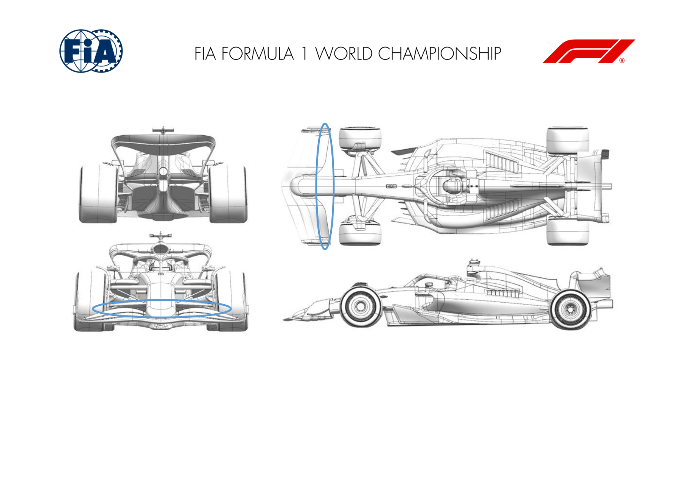
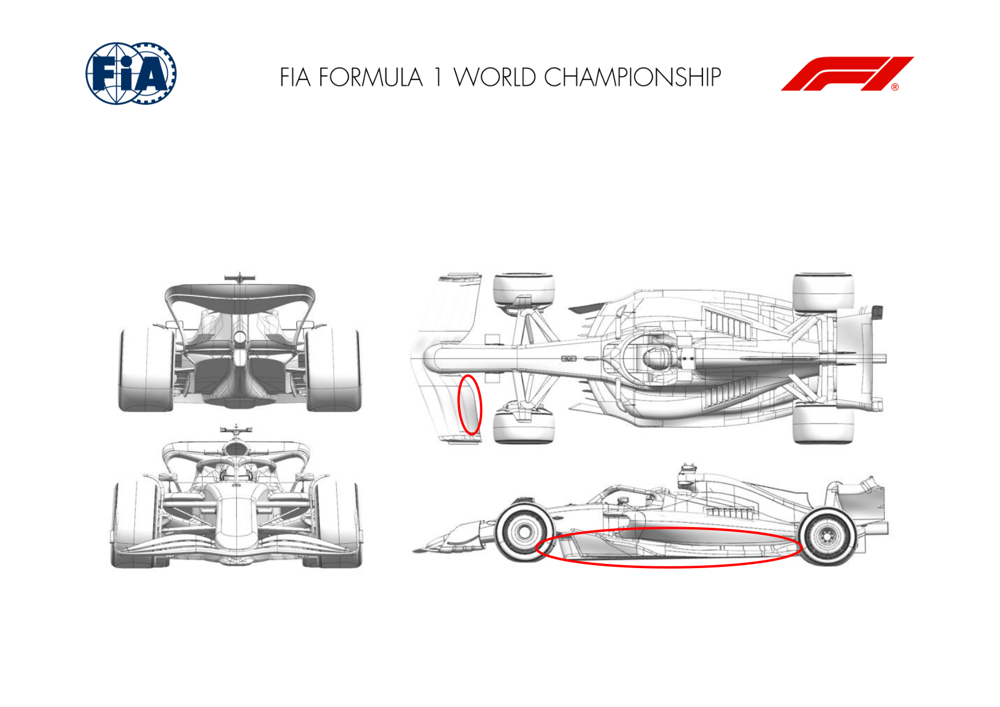
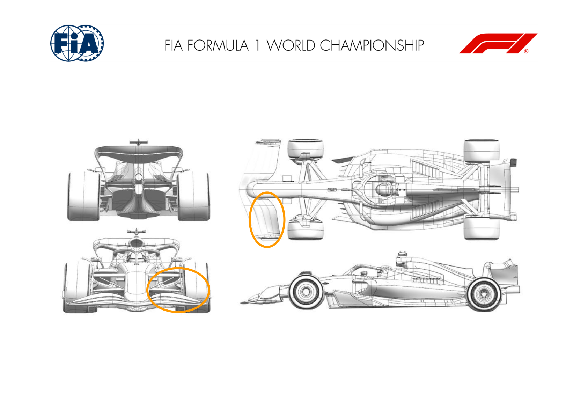
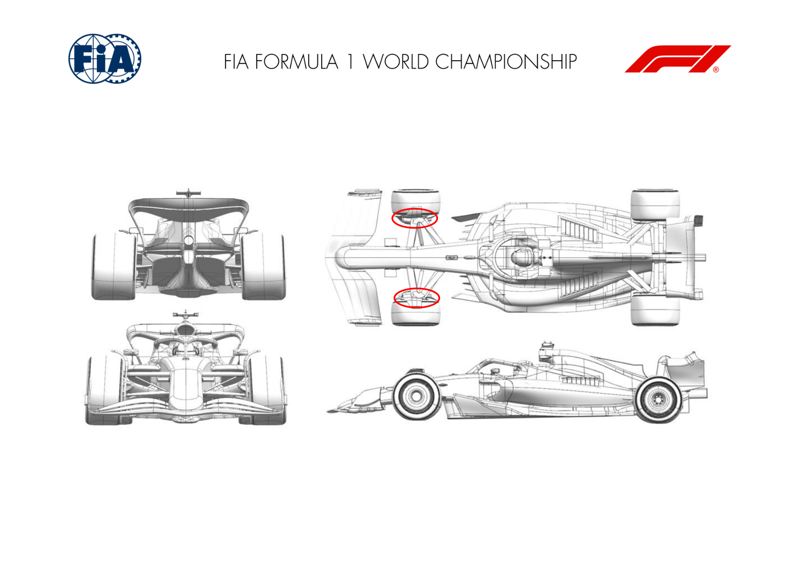
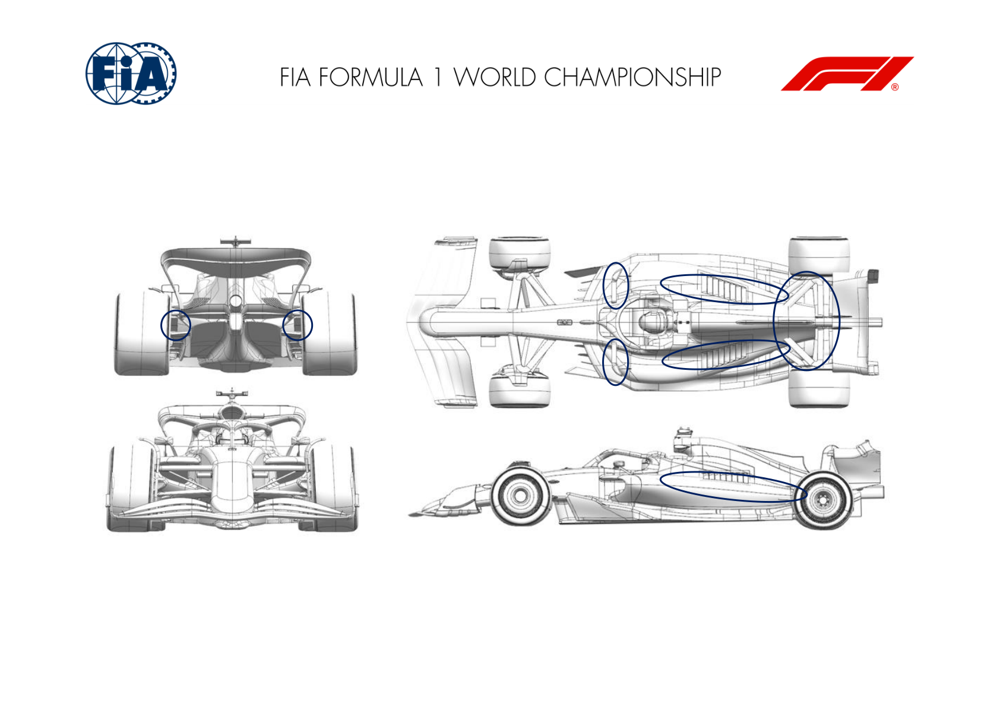
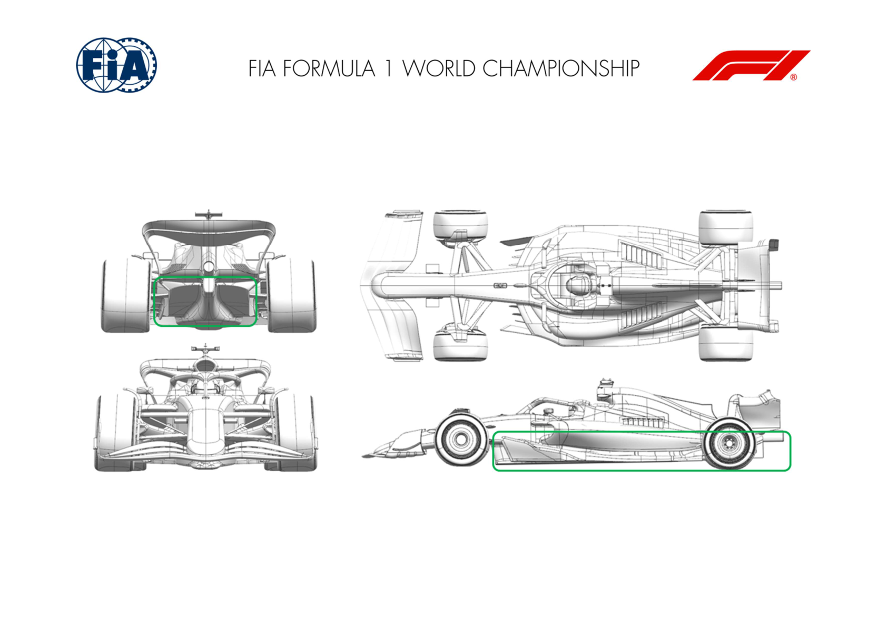
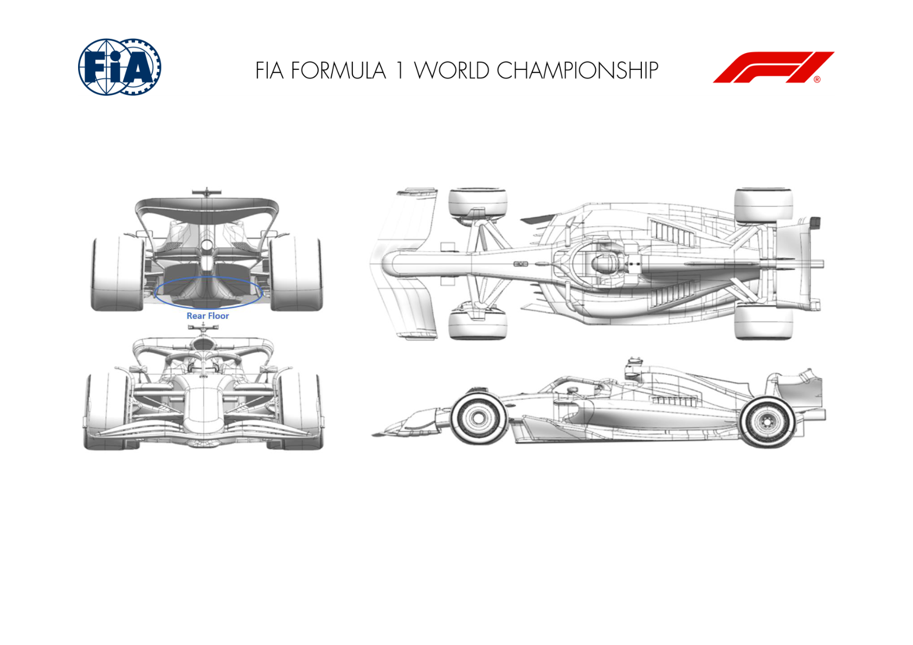

2024 LAS VEGAS GRAND PRIX

21 - 23 November 2024

From The FIA Formula One Media Delegate Document 7

To All Teams, All Officials Date 21 November 2024

Time 15:50

Title Car Presentation Submissions

Description Car Presentation Submissions

Enclosed 2024 Las Vegas Grand Prix - Car Presentation Submissions.pdf

Roman De Lauw

The FIA Formula One Media Delegate

Car Presentation – R22 USA Las Vegas Grand Prix

Red Bull Racing

| No. | Updated component | Primary reason for update | Geometric differences | Description |
| --- | --- | --- | --- | --- |
| 1 | Front Wing | Circuit specific - Balance Range | Reduced camber and chord front wing flap elements | Lower load front wing flap elements with reduced chord length and curvature (camber) to balance the expected rear wing level of the Las Vegas circuit. |
| 2 | Floor Fences | Performance - Flow Conditioning | Revised forward floor fence leading edge detail of the second fence from the chassis | By elevating the upper edge of the second (inside to out) forward floor fence, a small vortex can be shed to benefit the floor edge downstream. |

Car Presentation – 2024 Las Vegas Grand Prix

*Mercedes-AMG PETRONAS F1 Team*

| No. | Updated component | Primary reason for update | Geometric differences | Description |
| --- | --- | --- | --- | --- |
| 1 | Front Wing | Circuit specific - Balance Range | Trailing edge of flap trimmed. | Trimming the trailing edge of the flap has been done to reduce front wing assembly load and achieve a sensible aero balance when running a low downforce, low drag rear wing suited to Vegas. |

Car Presentation – Las Vegas Grand Prix

*SCUDERIA FERRARI*

| No. | Updated component | Primary reason for update | Geometric differences | Description |
| --- | --- | --- | --- | --- |
| 1 | Front Wing | Circuit specific - Balance Range | Lower Downforce Front Wing Flap design and trims | The depowered front wing flap provides the required aero balance range associated to the optimum downforce level anticipated for Las Vegas. Different trims are available, to allow modulation |
| 2 | Floor Fences | Performance - Flow Conditioning | Redistribution of fences profiles and camber Not event specific, this update features reworked front floor fences targeting an improvement of the losses travelling downstream. The front floor body volume has subsequently reoptimized, together with the floor edge loading and vortex shedding into the diffuser. |  |
| 3 | Floor Body | Performance - Flow Conditioning | Reshaped front volume / expansion |  |
| 4 | Floor Edge | Performance - Flow Conditioning | Reshaped floor edge |  |

Car Presentation – Las Vegas Grand Prix

McLaren Formula 1 Team

| No. | Updated component | Primary reason for update | Geometric differences | Description |
| --- | --- | --- | --- | --- |
| 1 | Front Wing | Circuit specific - Balance Range | New Front Wing Flap | The Front Wing Flap has been redesigned to extend the available aerobalance range, which could be a requirement given the specific circuit layout. |

Car Presentation – Las Vegas Grand Prix

Aston Martin Aramco F1 Team

| No. | Updated component | Primary reason for update | Geometric differences | Description |
| --- | --- | --- | --- | --- |
| 1 | Front Wing | Circuit specific - Balance Range | A new front wing flap with less incidence and a reduction in mid-span chord. | The flap is less loaded than the other version hence reducing overall wing load to balance the car with reduced rear wing levels. |

Car Presentation – Las Vegas Grand Prix

BWT Alpine F1 Team

| No. | Updated component | Primary reason for update | Geometric differences | Description |
| --- | --- | --- | --- | --- |
| 1 | Front Corner | Performance - Flow Conditioning | Optimisation of the front corner surface | Update on the front drum fence surface offering a better local flow conditioning, a better interaction with front suspension and overall a better build quality. |

Car Presentation – Las Vegas Grand Prix

*Williams Racing*

Car Presentation – Las Vegas Grand Prix

Visa Cash App RB

| No. | Updated component | Primary reason for update | Geometric differences | Description |
| --- | --- | --- | --- | --- |
| 1 | Coke/Engine Cover | Performance - Flow Conditioning | The ramp down behind the sidepods has been lowered. Lowering the top deck of the bodywork improves the high-energy flow brought to the rear of the car. |  |
| 2 | Rear Suspension | Other - Local flow alignment | Suspension leg orientations have been modified. Suspension profiles have been realigned to the flow direction of the updated engine cover. |  |
| 3 | Rear Corner | Performance - Local Load | The geometry of the winglets on the rear corner has been updated. Winglet profiles are modified to improve flow attachment and increase generated load. |  |
| 4 | Mirror | Circuit specific - Drag Range | A modification to the housing of the mirrors run at Monza. | The circuit requires a low-downforce configuration, so the Monza mirrors make a re-appearance with a further housing modification to clean up the flow. |

Car Presentation – Las Vegas Grand Prix

Stake F1 Team KICK Sauber

| No. | Updated component | Primary reason for update | Geometric differences | Description |
| --- | --- | --- | --- | --- |
| 1 | Floor Body | Performance - Local Load | The main body of the floor has changed completely compared to its predecessor. | the flow characteristics under the floor by rearranging vortices and maintaining losses under control. |
| 2 | Floor Fences | Performance - Local Load | Together with the floor body the fences were redesigned. | the flow characteristics under the floor by rearranging vortices and maintaining losses under control. |
| 3 | Floor Edge | Performance - Local Load | Revised floor edge design as part of the new floor concept. | the flow characteristics under the floor by rearranging vortices and maintaining losses under control. |
| 4 | Diffuser | Performance - Local Load | Diffuser top and sidewalls were updated as part of the new floor concept. | the flow characteristics under the floor by rearranging vortices and maintaining losses under control. |

Car Presentation – 2024 Las Vegas Grand Prix

MONEYGRAM HAAS F1 TEAM

| No. | Updated component | Primary reason for update | Geometric differences | Description |
| --- | --- | --- | --- | --- |
| 1 | Floor Body | Performance - Local Load | Rear floor expansion shape modification | This geometry aims to improve the underbody flow expansion with the car close to the ground, extracting more performance in these conditions. |

