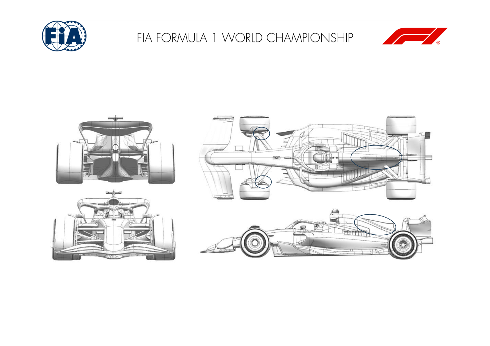
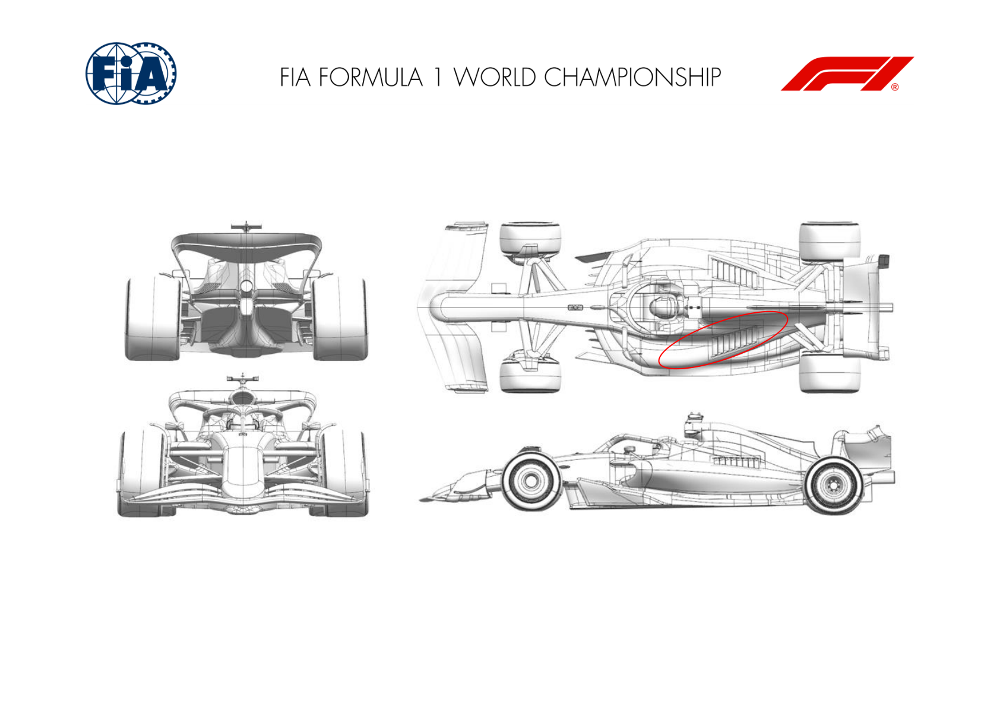
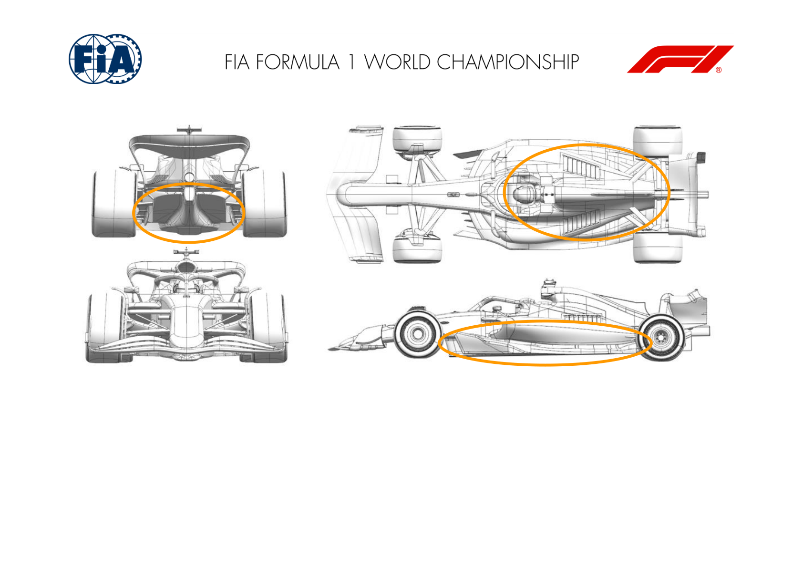
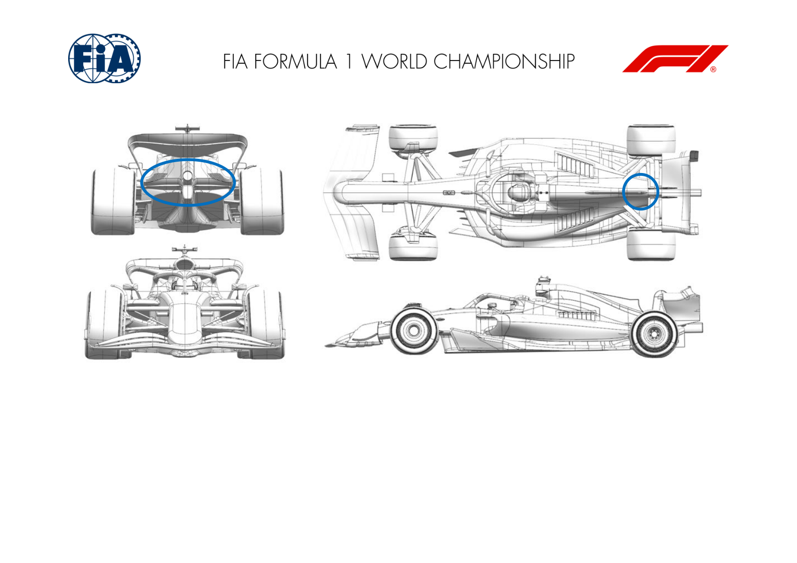
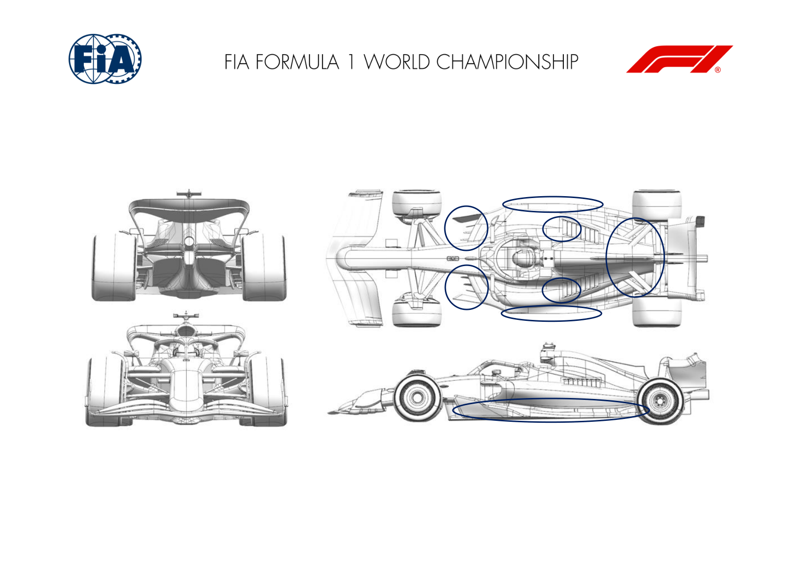

2024 MEXICO CITY GRAND PRIX

25 - 27 October 2024

From The FIA Formula One Media Delegate Document 9

To All Teams, All Officials Date 25 October 2024

Time 09:50

Title Car Presentation Submissions

Description Car Presentation Submissions

Enclosed 2024 Mexico City Grand Prix - Car Presentation Submissions.pdf

Cameron Kelleher

The FIA Formula One Media Delegate

Car Presentation – Mexico City Grand Prix

Red Bull Racing

| No. | Updated component | Primary reason for update | Geometric differences | Description |
| --- | --- | --- | --- | --- |
| 1 | Coke/Engine Cover | Circuit specific - Cooling Range | Enlarged volume of the central topbody. | Given the ambient conditions unique to this circuit, RBR need a larger PU cooling exit and have chosen to alter the central part of the topbody to achieve the anticipated capacity. |
| 2 | Front Corner | Circuit specific - Cooling Range | Enlarged volume of the exit duct | Again, to cope with the brake energies and ambient conditions, a larger exit duct has been prepared to enhance the cooling capacity. |

Car Presentation – Mexico City Grand Prix

Mercedes-AMG PETRONAS F1 Team

No updates submitted for this event.

Car Presentation – Mexico City Grand Prix

SCUDERIA FERRARI

| No. | Updated component | Primary reason for update | Geometric differences | Description |
| --- | --- | --- | --- | --- |
| 1 | Cooling Louvres | Circuit specific - Cooling Range | Additional bodywork exit louvres | Specific to the requirements of the Mexico City circuit, these new bodywork exit louvres are extending the top end of the engine cooling capacity, at the expense of car efficiency |

Car Presentation – Mexico City Grand Prix

McLaren Formula 1 Team

| No. | Updated component | Primary reason for update | Geometric differences | Description |
| --- | --- | --- | --- | --- |
| 1 | Coke/Engine Cover | Circuit specific - Cooling Range | High Cooling Sidepod and Engine Cover | To provide sufficient power unit cooling in the particular ambient conditions observed in Mexico, the sidepod and engine cover have been revised to increase air flow through the cooling ducts. |
| 2 | Cooling Louvres | Circuit specific - Cooling Range | High Cooling Louvres | As part of the high cooling sidepod design, the cooling louvre area has been increased, enabling the increase in air flow required. |
| 3 | Floor Body | Performance - Local Load | Revised Floor | The floor design has been heavily revised, with geometric changes in all areas, resulting in an increase of aerodynamic load across all conditions. |

Car Presentation – Mexico City Grand Prix

Aston Martin Aramco F1 Team

No updates submitted for this event.

Car Presentation – Mexico City Grand Prix

BWT Alpine F1 Team

No updates submitted for this event.

Car Presentation – Mexico City Grand Prix

Williams Racing

| No. | Updated component | Primary reason for update | Geometric differences | Description |
| --- | --- | --- | --- | --- |
| 1 | Beam Wing |  | Circuit specific - Drag Range | Optional trailing edge trim is available for the RLW. This is simply a reduction in chord length The trimmed chord increases the efficiency of the overall rear wing assembly. Drag and downforce are both reduced but in a way that may be efficient in Mexico. |
| 2 | Coke/Engine Cover |  | Circuit specific - Cooling Range | Larger bodywork with larger central exit area. To cover the increased PU cooling requirements in Mexico that result from the altitude, a larger bodywork exit is available to increase the air flow through the coolers. |

Car Presentation – Mexico City Grand Prix

Visa Cash App RB

| No. | Updated component | Primary reason for update | Geometric differences | Description |
| --- | --- | --- | --- | --- |
| 1 | Floor Fences | Performance - Flow Conditioning | Modifications to the camber of the floor fences. | Improves the quality of the vortex formation on the fences, reducing the aerodynamic losses downstream. |
| 2 | Floor Edge | Performance - Local Load | The floor edge wing profiles have been modified. The aerodynamic load generated along the edge of the floor is increased. |  |
| 3 | Coke/Engine Cover | Circuit specific - Cooling Range | Enlarged cooling exit at rear of bodywork. | Opening up the back of the engine cover reduces the pressure behind the radiators to increase the flow through them, providing additional engine cooling. |
| 4 | Cooling Louvres | Circuit specific - Cooling Range | Optional louvre panel on top deck of bodywork. | Further reduction in radiator back-pressure possible with additional openings on the top of the sidepods. |

Car Presentation – Mexico City Grand Prix

Stake F1 Team KICK Sauber

No updates submitted for this event.

Car Presentation – Mexico City Grand Prix

MONEYGRAM HAAS F1 TEAM

No updates submitted for this event.
