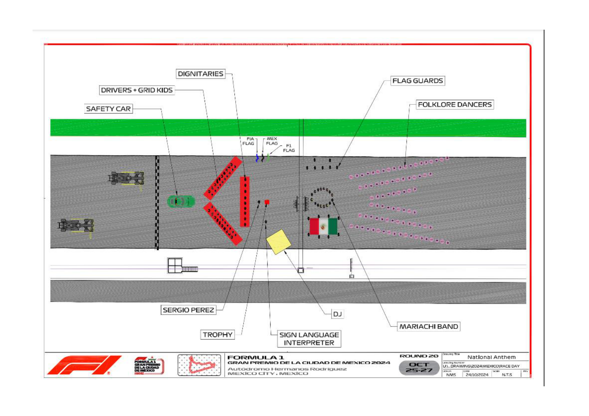

2024 MEXICO CITY GRAND PRIX

25 - 27 October 2024

From The FIA Formula One Media Delegate Document 36

To All Teams, All Officials Date 27 October 2024

Time 09:40

Title Pre-Race Procedure

Description Pre-Race Procedure

Enclosed 2024 Mexico City Grand Prix - Pre-Race Procedure.pdf

Cameron Kelleher

The FIA Formula One Media Delegate

2024 M C G P EXICO ITY RAND RIX

25 – 27 October 2024

From The FIA Formula One Media Delegate

To All Officials, All Teams Date 27 October 2024

NOTE TO TEAMS: PRE-RACE PROCEDURE

Please find below a summary of the requirements for the Pre-Race activities and National Anthem, which must be followed in order to ensure the orderly running of these procedures.

13:42:00 Drivers move to National Anthem Position. For the duration of the National Anthem all Drivers must remain attired only in their race suits.

13:44:00 The National Anthem.

Failure to comply with these procedures will be reported to the Stewards. Please see the attached National Anthem Diagram.

Cameron Kelleher

The FIA Formula One Media Delegate

