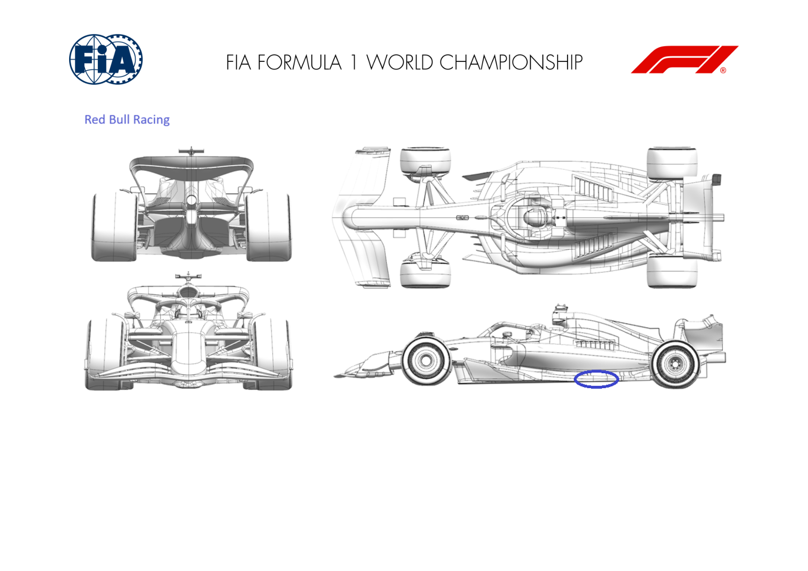
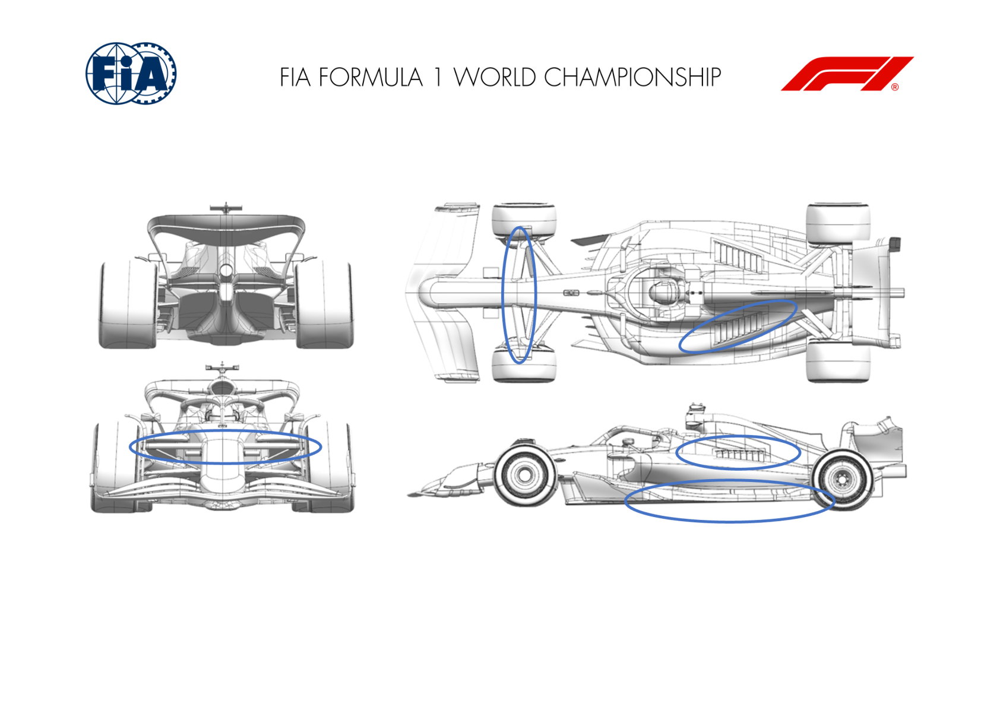
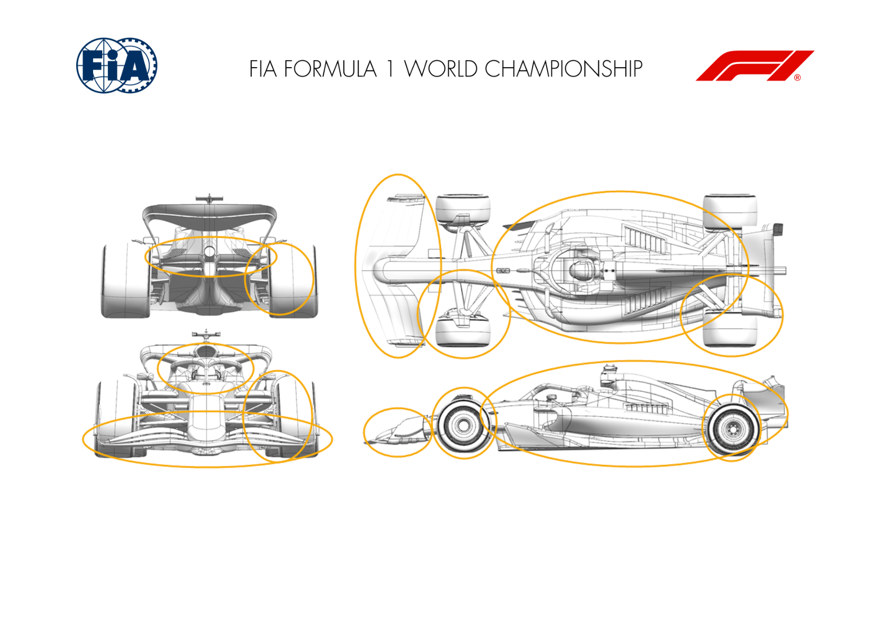
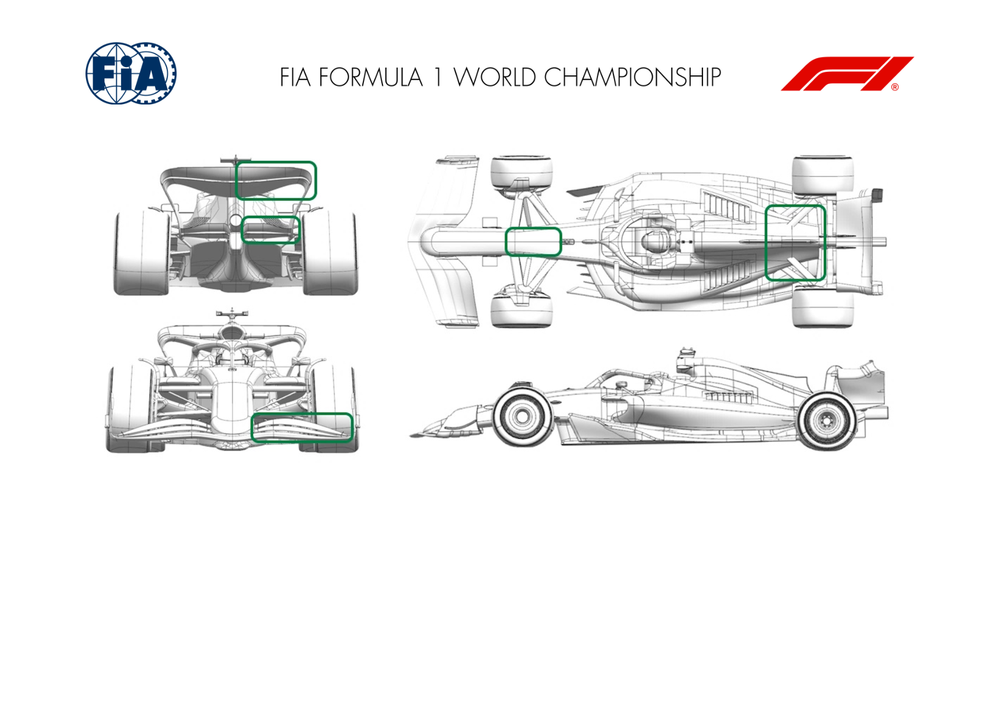
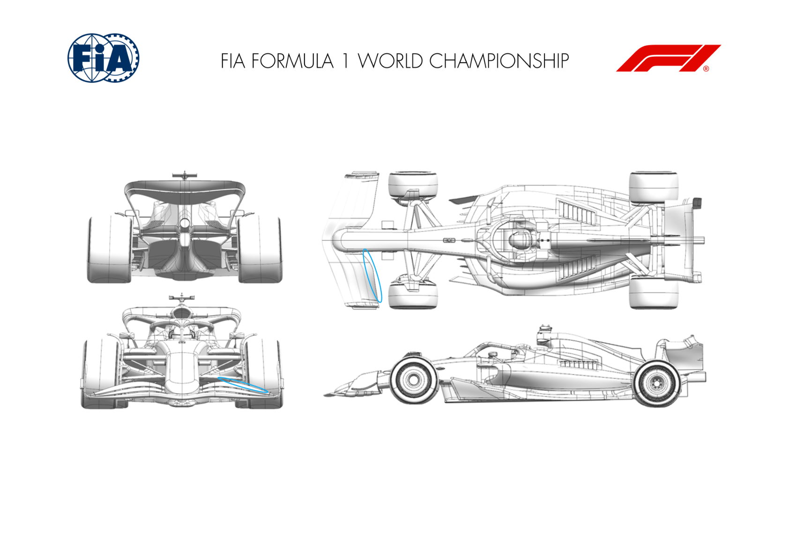
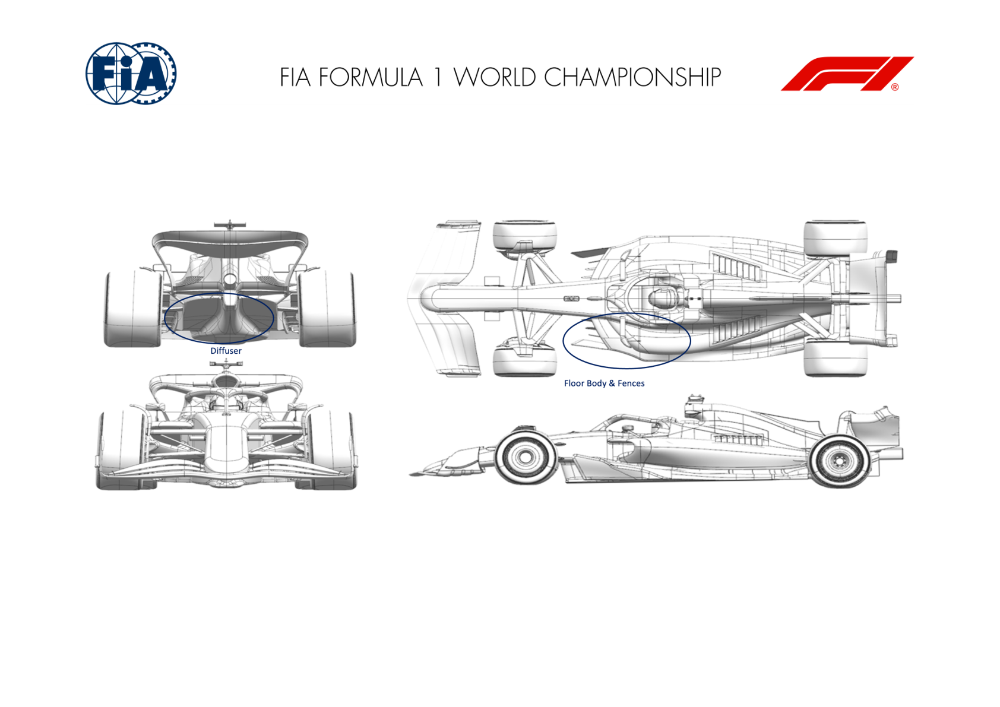
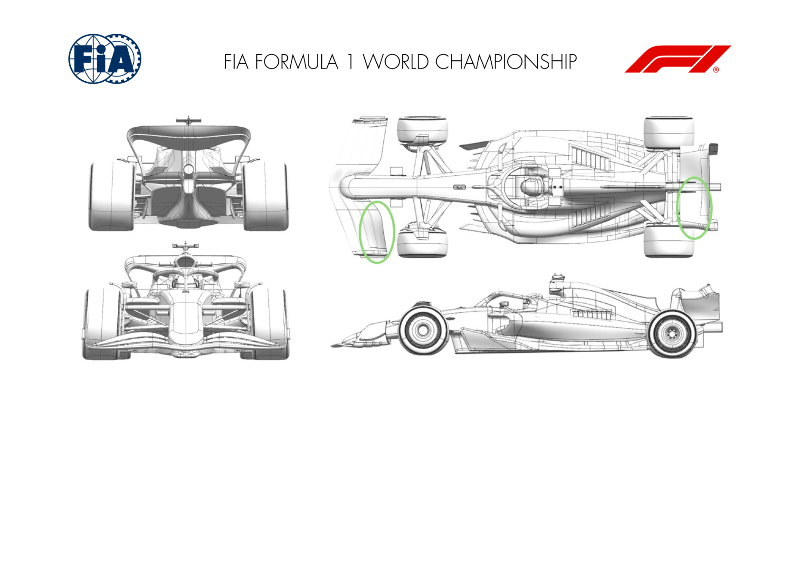
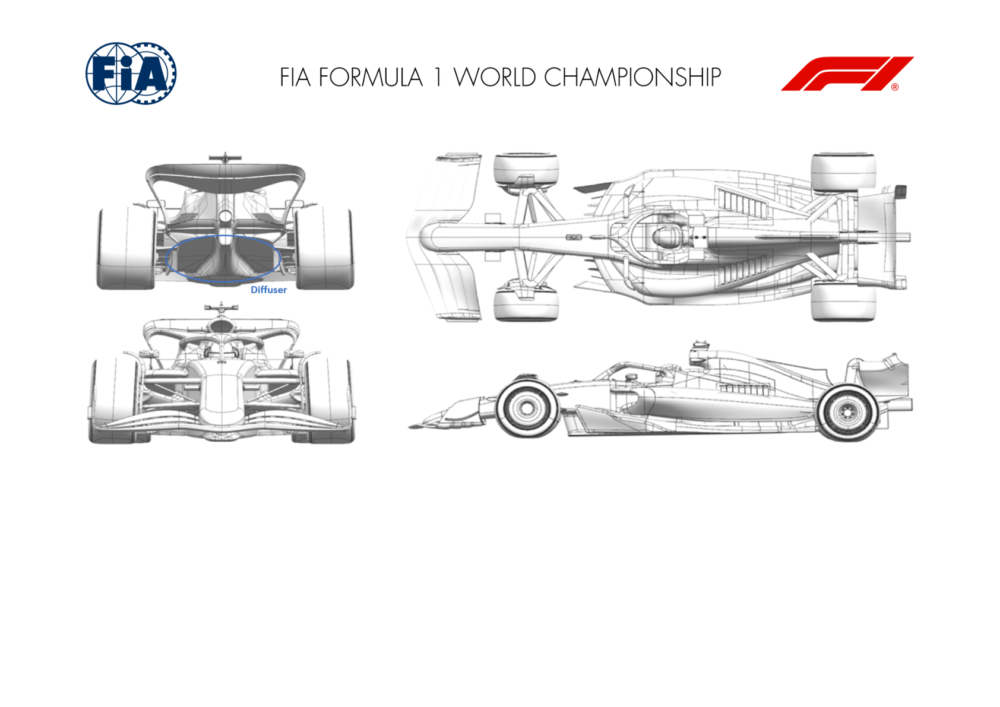

2024 MIAMI GRAND PRIX

03 - 05 May 2024

From The FIA Formula One Media Delegate Document 10

To All Teams, All Officials Date 03 May 2024

Time 09:55

Title Car Presentation Submissions

Description Car Presentation Submissions

Enclosed 2024 Miami Grand Prix - Car Presentation Submissions.pdf

Roman De Lauw

The FIA Formula One Media Delegate

Car Presentation – Miami Grand Prix

ORACLE RED BULL RACING

|  | Updated component |  | Primary reason for update | Geometric differences compared to previous version | Brief description on how the update works |  |
| --- | --- | --- | --- | --- | --- | --- |
| 1 | Floor Edge | Reliability |  | A support for the FEW has been removed in order to save weight. |  | Not pursued for aerodynamic reasons, but in order to save weight given adequate stiffness, one for the edge wing supports has been removed. |

MERCEDES-AMG PETRONAS F1 TEAM

|  | Updated component |  | Primary reason for update | Geometric differences compared to previous version | Brief description on how the update works |  |
| --- | --- | --- | --- | --- | --- | --- |
| 1 | Floor Body | Performance - Local Load |  | Changes to floor roof volume and floor edge detail (more vanes added to the floor edge wing). |  | Floor roof changes increase local floor load and also improve flow to the rear of the car and diffuser. Floor edge changes drop the pressure locally, in turn increasing fwd floor load. |
| 2 | Cooling Louvres | Circuit specific - Cooling Range |  | More cooling louvres added to engine cover panel. |  | More louvres to increase exit area and allow more mass flow through the sidepods, increasing the cooling range for Miami. |
| 3 | Front Wing | Circuit specific - Balance Range |  | Reduce chord front wing flap. |  | Reducing the flap chord reduces front wing load, allowing us to run and balance and a smaller (low drag) rear wing. |
| 4 | Front Suspension | Performance - Flow Conditioning |  | Small tweak to track rod angle of attack. |  | Realignment of the track rod faring to the local flow, reducing the local pressure peak and improve flow to the rear of the car. |

SCUDERIA FERRARI

No updates submitted for this event.

MCLAREN FORMULA 1 TEAM

|  | Updated component |  | Primary reason for update | Geometric differences compared to previous version | Brief description on how the update works |  |
| --- | --- | --- | --- | --- | --- | --- |
| 1 | Front Wing | Performance - Flow Conditioning |  | New, completely revised Front Wing. |  | The completely revised Front Wing Geometry results in a significant improvement of flow control which in conjunction with the updated Front Corner and Front Suspension, results in an overall load gain. |
| 2 | Front Suspension | Performance - Flow Conditioning |  | New Front Suspension Geometry |  | The new front suspension has been designed to suit the new front wing and to support and enhance the improvement in flow condition. |
| 3 | Front Corner | Performance - Flow Conditioning |  | Revised Front Brake Duct and Winglet |  | The new front brake duct has been designed to suit the new front wing and to support and enhance the improvement in flow condition. |
| 4 | Floor Body | Performance - Local Load |  | Completely revised Floor |  | The revised floor has been designed in conjunction with the new Sidepod Inlet and Bodywork to increase overall load in all conditions. |
| 5 | Sidepod Inlet | Performance - Flow Conditioning |  | Revised Sidepod Inlet |  | The revised Sidepod Inlet has been designed to complement the change in onset flow and in conjunction with the bodywork results in an improved flow to the rear of the car. |
| 6 | Coke/Engine Cover | Performance - Flow Conditioning |  | New Bodywork and Engine Cover |  | The new Bodywork and Engine Cover results in an improvement in efficiency and flow conditioning in conjunction with the Sidepod Inlet. |
| 7 | Cooling Louvres | Performance - Flow Conditioning |  | Updated Louvre Range |  | With the revised Bodywork Shape, the cooling louvre range has been updated, to suit the change in overall flow field. |

| No. | Updated component | Primary reason for update | Geometric differences | Description |
| --- | --- | --- | --- | --- |
| 8 | Rear Suspension | Performance - Flow Conditioning | Updated Rear Suspension | The Rear Suspension has been updated to suit the change in onset flow condition and to improve load generation through the new Rear Brake Duct Geometry. |
| 9 | Rear Corner | Performance - Local Load | Revised Rear Brake Duct and Winglets | The new Rear Brake Duct geometry benefits from an improvement in onset flow and results in an overall gain in load. |
| 10 | Beam Wing | Circuit specific - Drag Range | Offloaded Beamwing | A new, offloaded Beamwing has been designed, which trades loading between Beamwing and Rear Wing efficiently, suitable to the track characteristics. |

ASTON MARTIN ARAMCO FORMULA ONE TEAM

|  | Updated component |  | Primary reason for update | Geometric differences compared to previous version |  | Brief description on how the update works |  |
| --- | --- | --- | --- | --- | --- | --- | --- |
| 1 | Front Wing | Circuit specific - Balance Range |  | Front wing flap with less aggressive profiles. |  |  | This flap is lower loaded to reduce the amount of front downforce in proportion to the lower level rear wings typically run at this track. |
| 2 | Coke/Engine Cover | Circuit specific - Cooling Range |  | Engine cover with larger exit area at the rear of the bodywork. |  |  | The larger exit area increases the massflow inside the bodywork and hence through the coolers to allow operation in higher ambient conditions. Setup option so will depend on conditions. |
| 3 | Rear Wing | Circuit specific - Drag Range |  | Rear wing with reduced front view area and less aggressive profiles. |  |  | This rear wing is part of the rear wing assy that positions the car in the drag range required for optimum performance at this circuit. |
| 4 | Beam Wing | Circuit specific - Drag Range |  | Single element beam wing. |  |  | This beam wing is part of the rear wing assy that positions the car in the drag range required for optimum performance at this circuit. |
| 5 | Chassis Scoop | Driver Cooling |  |  | Adding a driver cooling inlet to the top of the legbox, this is larger than the one evaluated in winter testing. |  | Captures external air and feed this through the chassis into the internal legbox to provide a cooling airflow over the driver. |

BWT ALPINE F1 TEAM

No updates submitted for this event.

WILLIAMS RACING

|  | Updated component |  | Primary reason for update | Geometric differences compared to previous version |  | Brief description on how the update works |  |
| --- | --- | --- | --- | --- | --- | --- | --- |
| 1 | Front Wing | Performance - Local Load |  |  | There is a new option to trim the trailing edge of the rearward element of the front wing cascade. This simply makes the chord shorter. There is a further option to modify the upper surface of the same trailing edge region by fitting a small packer. |  | These geometry options both reduce the local load produced by the front wing and are optional items to tune the aerobalance of the car. They can be used independently or together, depending on the load reduction required to balance the car. |

VISA CASH APP RB FORMULA ONE TEAM

|  | Updated component |  | Primary reason for update | Geometric differences compared to previous version | Brief description on how the update works |
| --- | --- | --- | --- | --- | --- |
| 1 | Floor Body | Performance - Local Load |  | The height and shape of the forward floor has been updated, with the fences modified to suit. | The changes made across the forward floor and fences modify the load distribution of the forward floor, generating additional local load whilst minimising negative effect on downstream flow quality. |
| 2 | Diffuser | Performance - Local Load |  | The diffuser has been reshaped in the inlet area. | Local flow quality around the diffuser inlet is improved, giving a local load increase and better flow quality in to the diffuser. |

STAKE F1 TEAM KICK SAUBER

|  | Updated component |  | Primary reason for update | Geometric differences compared to previous version | Brief description on how the update works |
| --- | --- | --- | --- | --- | --- |
| 1 | Front Wing | Circuit specific - Balance Range |  | Reduced-profile top two flaps for the front wing | Working with the low-profile rear wing flap, this combination adapts the car to the low-drag requirements of this specific circuit, maximising the package's performance. |
| 2 | Rear Wing | Circuit specific - Balance Range |  | Low-profile flap trim | Working with the low-profile front wing flaps, this combination adapts the car to the low-drag requirements of this specific circuit, maximising the package's performance. |

MONEYGRAM HAAS F1 TEAM

|  | Updated component |  | Primary reason for update | Geometric differences compared to previous version | Brief description on how the update works |
| --- | --- | --- | --- | --- | --- |
| 1 | Floor Body | Performance - Local Load |  | More aggressive diffuser expansion with a small Gurney-flap on the trailing edge. | This new geometry increases floor extraction and allows as well a better control of the local flow features, resulting overall in more downforce. |

