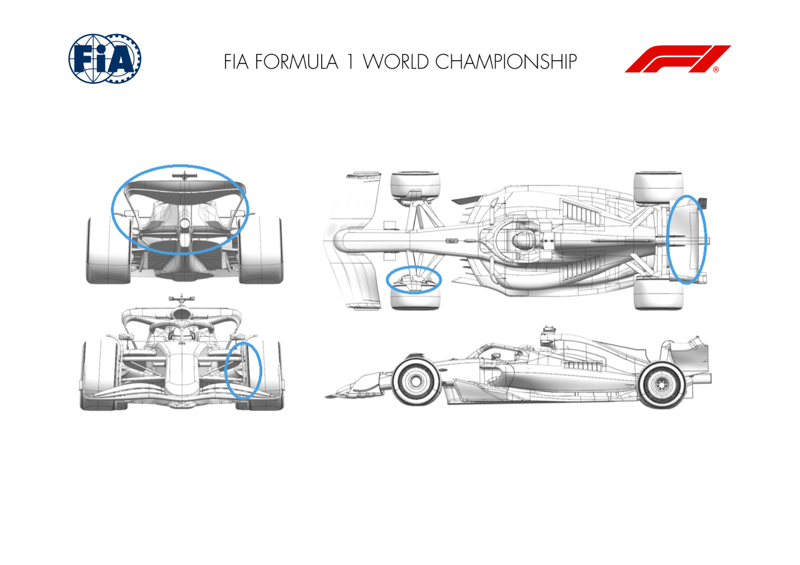
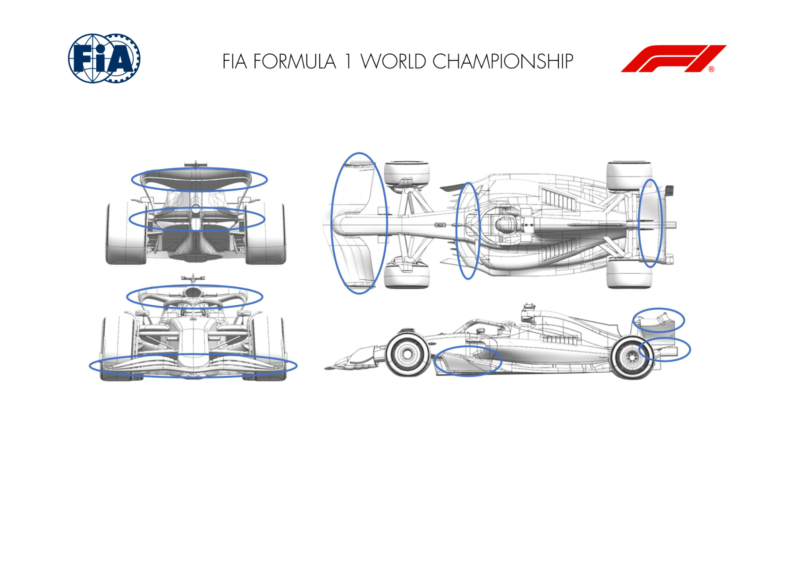
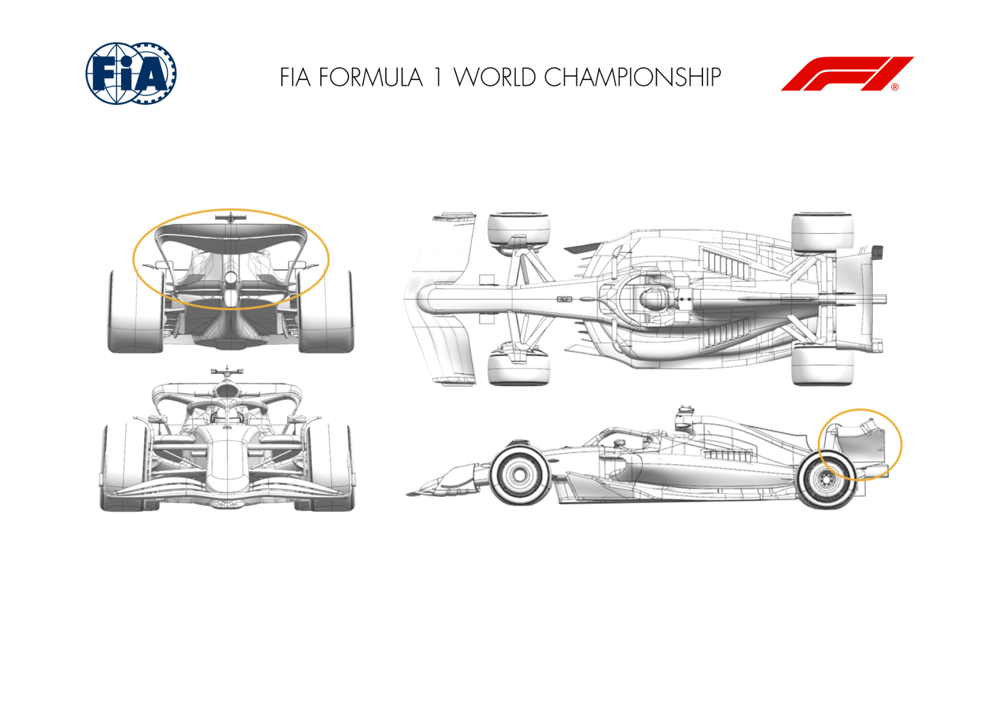
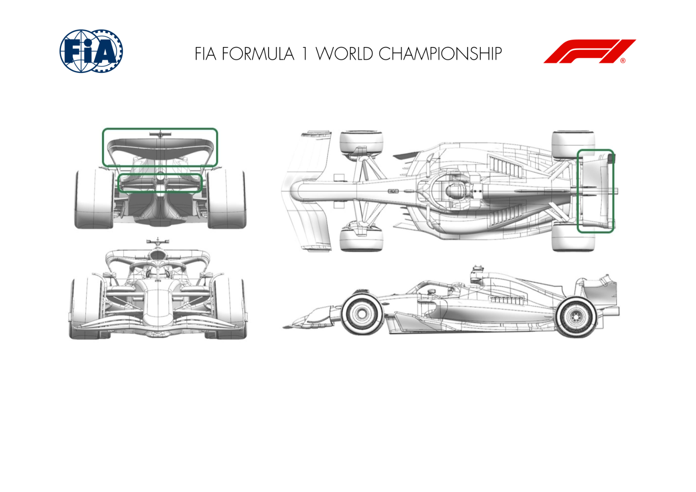
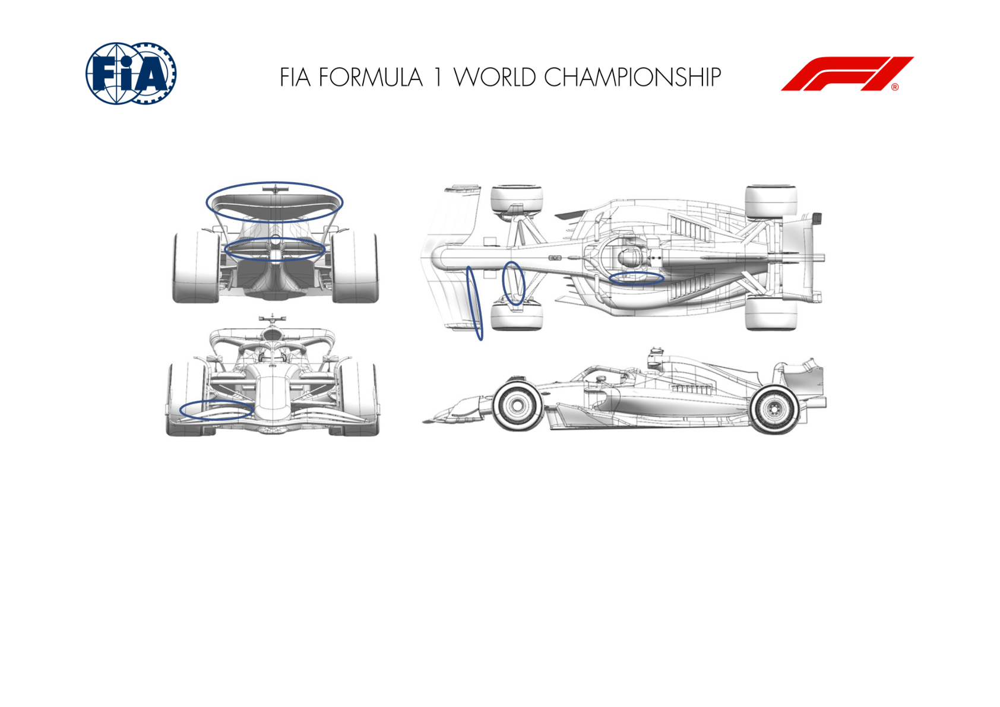
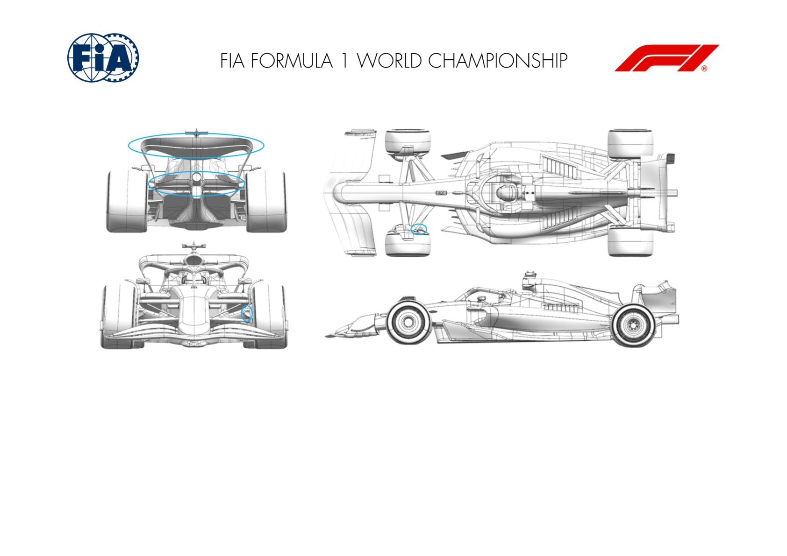
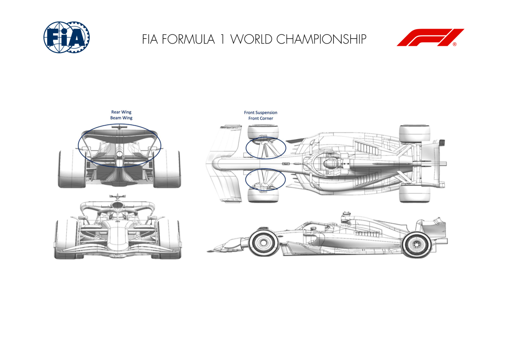
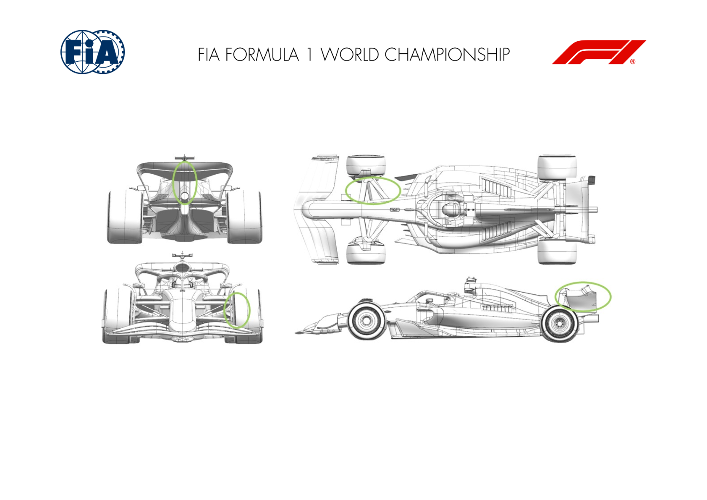
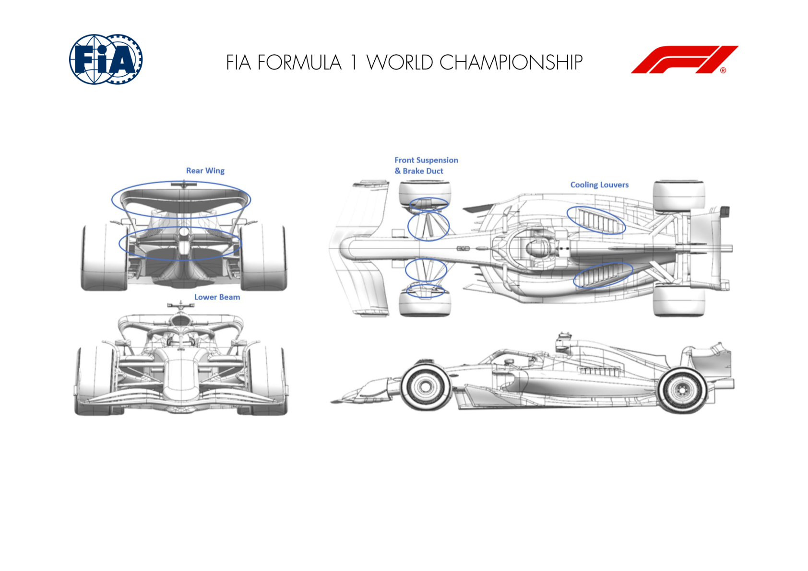

2024 MONACO GRAND PRIX

24 - 26 May 2024

From The FIA Formula One Media Delegate Document 8

To All Teams, All Officials Date 24 May 2024

Time 10:51

Title Car Presentation Submissions

Description Car Presentation Submissions

Enclosed 2024 Monaco Grand Prix - Car Presentation Submissions.pdf

Roman De Lauw

The FIA Formula One Media Delegate

Car Presentation – Monaco Grand Prix

ORACLE RED BULL RACING

| No. | Updated component | Primary reason for update | Geometric differences | Description |
| --- | --- | --- | --- | --- |
| 1 | Rear Wing | Circuit specific - Balance Range | Enlarged upper rear wing by chord and camber | steeper and deeper rear wing of greater chord and camber fulfilling the permitted volume to extract most load for a given air speed, a high downforce rear wing |
| 2 | Beam Wing | Circuit specific - Balance Range | Enlarged beam wing by chord and camber | same for the lower rear wing, increased camber to extract maximum load at a given air speed, a high downforce beam or lower rear wing. |
| 3 | Front Corner | Circuit specific - Cooling Range | Enlarged inlet and exit ducting for the brake cooling | The low air speed of Monaco combined with the high brake energy necessitates enlarged inlet and exit ducting, both lying inbaord of the wheel. |
| 4 | Front Corner | Reliability | Frtont top wishbone fairing notch for steering The lock requirement for Monaco necessitates a small notch in the upper front wishbone fairing. |  |

MERCEDES-AMG PETRONAS FORMULA ONE TEAM

| No. | Updated component | Primary reason for update | Geometric differences | Description |
| --- | --- | --- | --- | --- |
| 1 | Rear Wing | Circuit specific - Drag Range | Increase camber upper rear wing | Increasing the camber of the wing elements increases local downforce and drag; wing is track specific and suited to Monaco. |
| 2 | Rear Wing | Circuit specific - Drag Range | Increase camber beam wing | Increasing the camber of the beam wing elements increases local downforce and drag; wing is track specific and suited to Monaco. |
| 3 | Floor Body | Performance - Local Load | Increased floor inboard leading edge volume | Increasing the local inboard floor volume increases the local flow acceleration in this area which in turn generates more load. |
| 4 | Front Wing | Performance - Flow Conditioning | Larger chord inboard flap and redistribution of main plane chord | Increasing inboard flap chord has increased the balance range of the front wing; redistribution of the outboard element chord has altered tip vorticity and improved tyre wake control. |

SCUDERIA FERRARI

| No. | Updated component | Primary reason for update | Geometric differences | Description |
| --- | --- | --- | --- | --- |
| 1 | Rear Wing | Circuit specific - Drag Range | Higher Downforce Top Rear Wing and Lower Rear Wing designs | Introduction of more loaded Top and Lower Rear Wing main and flap profiles. This update is track specific, with the aim to cover the low aerodynamic efficiency requirements of the Monaco street circuit. |

MCLAREN FORMULA 1 TEAM

| No. | Updated component | Primary reason for update | Geometric differences | Description |
| --- | --- | --- | --- | --- |
| 1 | Rear Wing | Circuit specific - Drag Range | More loaded Rear Wing Assembly | A new, more loaded Rear Wing Assembly has been designed with the aim of efficiently increasing Downforce at high downforce circuits. |
| 2 | Beam Wing | Circuit specific - Drag Range | More loaded Beam Wing Assembly. | In conjuction with the more loaded Rear Wing Assembly, a new Beamwing has been designed, which supports to increase the overall efficiency of the assembly. |

ASTON MARTIN ARAMCO FORMULA ONE TEAM

| No. | Updated component | Primary reason for update | Geometric differences | Description |
| --- | --- | --- | --- | --- |
| 1 | Rear Wing | Performance - Local Load | There is a new rear wing with more aggressive geometry. | The more aggressive wing increases local suction for increased loads, and is acceptable due to the lower efficiency of this circuit geometry. |
| 2 | Beam Wing | Performance - Local Load | There is a new beam wing with more aggressive geometry. | The more aggressive wing increases local suction for increased loads, and is acceptable due to the lower efficiency of this circuit geometry. |

BWT ALPINE F1 TEAM

| No. | Updated component | Primary reason for update | Geometric differences | Description |
| --- | --- | --- | --- | --- |
| 1 | Front Wing | Circuit specific - Balance Range | Front wing flap option with more aggressive cambered profiles. | This flap is higher loaded to increase the amount of front downforce in proportion to the higher level rear wings typically run at this track. |
| 2 | Front Suspension | Performance - Mechanical Setup | New trackrod fairing and supports to suit Monaco. Outboard mounting position which is further rearward. | This modification gives greater road wheel angle for the same steering wheel angle compared to the standard outboard trackrod position. The higher maximum road wheel angle is required due to the specific circuit characteristics. |
| 3 | Rear Wing | Circuit specific - Drag Range | More loaded top rear wing main plane suited for track characteristics and high downforce nature. | The top rear wing features more load with the sole aim of tackling the high downforce nature of the Circuit de Monaco and offering optimal downforce level for best lap-time. |
| 4 | Beam Wing | Circuit specific - Drag Range | In conjunction with the aforementioned top rear wing update, the beam wing has more load with double element style. | The double element beam wing features more load with the sole aim of tackling the high downforce nature of the Circuit de Monaco and offering optimal downforce level for best lap-time. |
| 5 | Halo | Performance - Flow Conditioning | Realignment of the halo vanes on either side of the cockpit, behind the Halo. | To provide a more outwashing flow out of the cockpit which aims to improve the flow to the rear wing and rear beam wing assembly. |

WILLIAMS RACING

| No. | Updated component | Primary reason for update | Geometric differences | Description |
| --- | --- | --- | --- | --- |
| 1 | Rear Wing | Circuit specific - Drag Range | A new high downforce rear wing is available at this event. The upper elements have a larger area, particularly at the outboard region of the mainplane. | The wing is simply larger than others we have run so far this year. As a result it delivers more downforce and drag, which is appropriate for a circuit like Monaco. |
| 2 | Beam Wing | Circuit specific - Drag Range | A new high downforce beam wing accompanies the The beam wing generates some local load courtesy of the updated geoemtry. It also supports the larger upper elements and contributes to the overal downforce delivery of the rear wing system. new upper elements. The difference are subtle but are designed to compliment the increased loading of the upper elements. It has a longer chord and a higher angle of attack than the medium downforce version that has run previously. |  |
| 3 | Front Corner | Circuit specific - Cooling Range | Larger front brake duct scoop exits are available to The larger duct exit draws more air flow through the duct to increase the cooling of the front brake and caliper assembly. The internal duct distributes the cooling flow to the disc and caliper. increase front brake and caliper cooing if required. Alternative internal ducting options are also available to trade disc and caliper cooling as required. |  |

VISA CASH APP RB FORMULA ONE TEAM

| No. | Updated component | Primary reason for update | Geometric differences | Description |
| --- | --- | --- | --- | --- |
| 1 | Front Suspension | Performance - Flow Conditioning | The profiles of the suspension members have been modified and adjusted in incidence. | The updates improve the flow attachment on the suspension legs, which sit in a region of high upwash from the front wing and can be prone to separation. |
| 2 | Front Corner | Circuit specific - Cooling Range | The front brake cooling duct has been enlarged. | The duct modifications allow additional airflow through the brake cooling system, increasing the rate at which heat is removed from the brakes. |
| 3 | Rear Wing | Circuit specific - Drag Range | The camber & indidence of the upper wing profiles is increased. | A max-downforce 'full box' rear wing configuration the increase in camber & incidence of the section generates additional downforce at the expense of a higher overall drag level. |
| 4 | Beam Wing | Circuit specific - Drag Range | A 2-element beam wing with high incidence & camber. | As with the Upper Rear Wing, this makes use of the available height in the legality box to create a highly-loaded beam wing suitable for high downforce circuits, whilst aerodynamically supporting the upper wing. |

STAKE F1 TEAM KICK SAUBER

| No. | Updated component | Primary reason for update | Geometric differences | Description |
| --- | --- | --- | --- | --- |
| 1 | Rear Wing |  | Performance - Flow Conditioning | Single pylon rear wing This new concept of rear wing, with a single pylon compared to the previous, double-pylon setup, will improve aero efficiency in Monaco, but also form the basis of future developments of the rear wing for other races. |
| 2 | Rear Wing Endplate |  | Circuit specific - Drag Range | Detached tips of the RW end plate The new design of the endplate, with detached tips, allows us to maximise efficiency in the very perculiar circumstances of Monaco. |
| 3 | Beam Wing |  | Circuit specific - Drag Range | New beat wing design The new beam wing, introduced alongside our new RW concept, is designed to provide maximum load and answer the Monaco circuit's specific aerodynamics requirements. |
| 4 | Front Suspension |  | Circuit specific - Drag Range | Redesigned front suspension covers This update, which changes the surface of the front suspension covers, is a track-specific update aimed at maximising aero performance in Monaco. |
| 5 | Front Corner |  | Circuit specific - Cooling Range | Redesigned front brake duct The new front brake ducts answer Monaco's specific cooling needs, while also improving the overall aero flow from the front corners towards the rear of the car. |

MONEYGRAM HAAS F1 TEAM

| No. | Updated component | Primary reason for update | Geometric differences | Description |
| --- | --- | --- | --- | --- |
| 1 | Front Suspension |  | Reliability | Trackrod shroud modification to allow the steering lock required. Necessary tweak to the Trackrod shroud to fulfil the lock angles requirements of this circuit. |
| 2 | Front Corner |  | Circuit specific - Cooling Range | Brake duct exit modification The change consists in a removal of the brake duct exit scoop conditioner, allowing a higher brake cooling level, required in this circuit. |
| 3 | Cooling Louvres |  | Circuit specific - Cooling Range | Wider cooling louvers apertures New design of a cooling louver layout. This option changes only the louvers keeping the engine cover unchanged, allowing higher cooling levels. |
| 4 | Rear Wing |  | Circuit specific - Drag Range | More cambered Upper Rear Wing Due to the low efficiency requirements in Montecarlo, increasing downforce is almost always a lap time gain. This Wing pushes the geometry to the limit of possible achievable load inside the allowed rule box. |
| 5 | Beam Wing |  | Circuit specific - Drag Range | More cambered Lower Rear Wing More pushed lower beam for the same reason as for the Upper Rear Wing, main aim is to increase downforce to improve lap time. |

