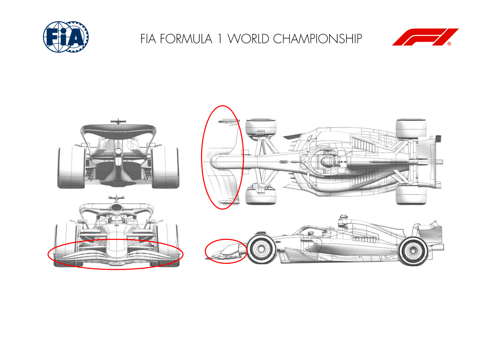
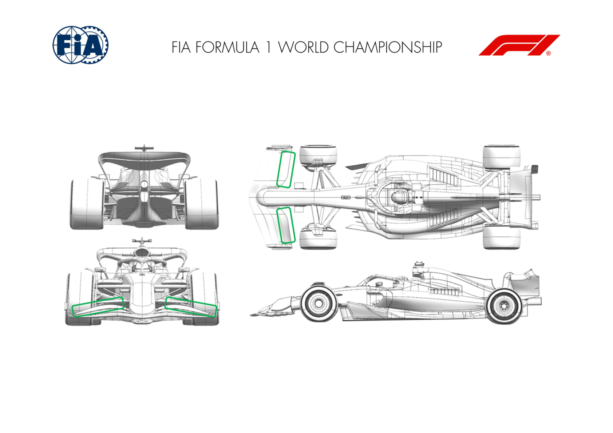

2024 QATAR GRAND PRIX

29 November - 01 December

From The FIA Formula One Media Delegate Document 9

To All Teams, All Officials Date 29 November 2024

Time 14:00

Title Car Presentation Submissions

Description Car Presentation Submissions

Enclosed 2024 Qatar Grand Prix - Car Presentation Submissions.pdf

Cameron Kelleher

The FIA Formula One Media Delegate

Car Presentation – R23 Qatar Grand Prix

Red Bull Racing

No updates submitted for this event.

Car Presentation – 2024 Qatar Grand Prix

*Mercedes-AMG PETRONAS F1 Team*

No updates submitted for this event.

Car Presentation – Qatar Grand Prix

*SCUDERIA FERRARI*

No updates submitted for this event.

Car Presentation – Qatar Grand Prix

McLaren Formula 1 Team

No updates submitted for this event.

Car Presentation – Qatar Grand Prix

Aston Martin Aramco F1 Team

No updates submitted for this event.

Car Presentation – Qatar Grand Prix

BWT Alpine F1 Team

| No. | Updated component | Primary reason for update | Geometric differences | Description |
| --- | --- | --- | --- | --- |
| 1 | Front Wing | Performance – Local Load | Reprofiled front wing elements, including a first element detached from the nose | The reprofiling of all front wing elements, mainly inboard offers a better flow management as well as local load gains through the car operating envelope. |
| 2 | Nose | Performance – Flow Conditioning | Shorter nose | The nose has been shortened to be compatible with the new front wing geometry and its detached first element, offering healthier flow interaction. |

Car Presentation – Qatar Grand Prix

*Williams Racing*

No updates submitted for this event.

Car Presentation – Qatar Grand Prix

Visa Cash App RB

No updates submitted for this event.

Car Presentation – Qatar Grand Prix

KICK Sauber F1 Team

| No. | Updated component | Primary reason for update | Geometric differences | Description |
| --- | --- | --- | --- | --- |
| 1 | Front Wing | Circuit specific - Balance Range | Trimmed down version of the current front wing flap design. | Trimmed down version allows us to extend our potential balance range of the already existing front wing flap. |

Car Presentation – 2024 Qatar Grand Prix

MONEYGRAM HAAS F1 TEAM

No updates submitted for this event.
