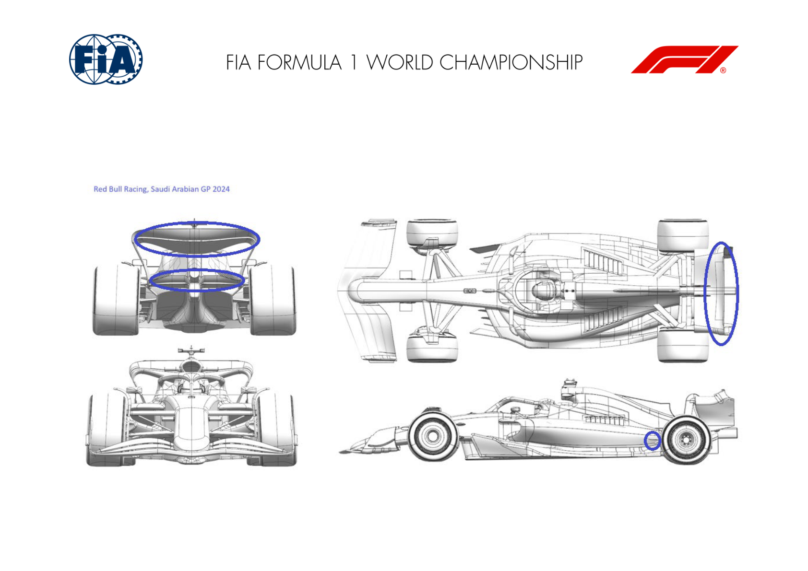
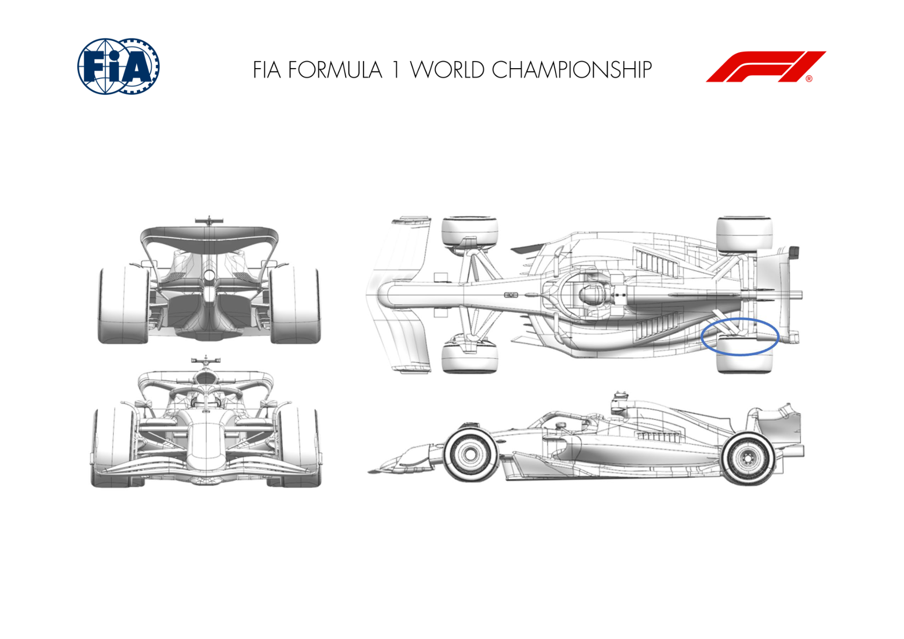
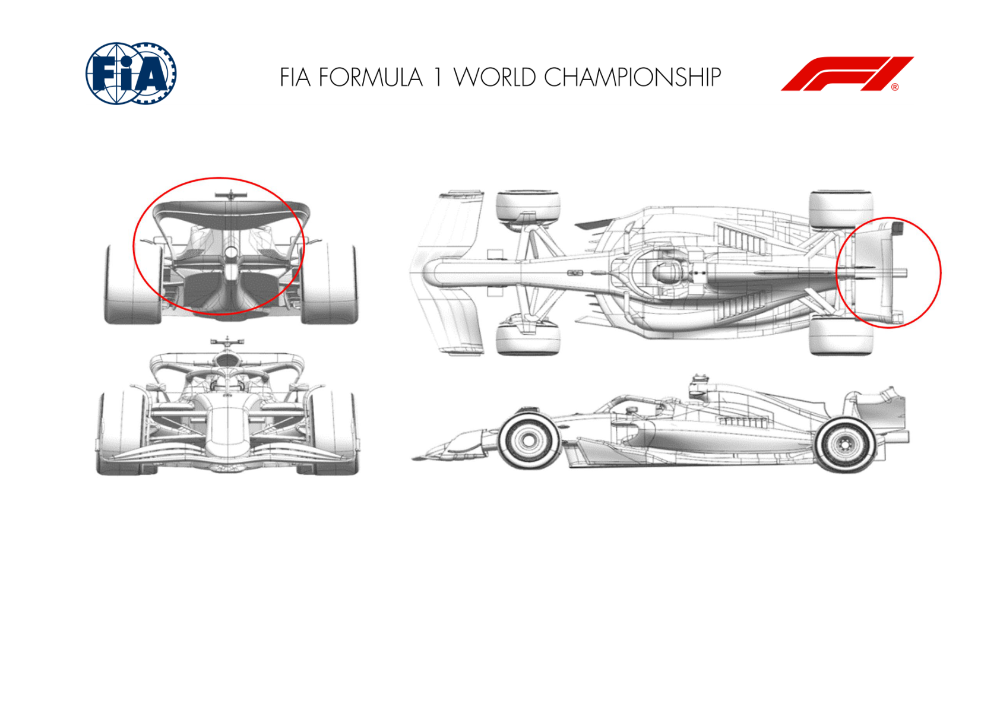
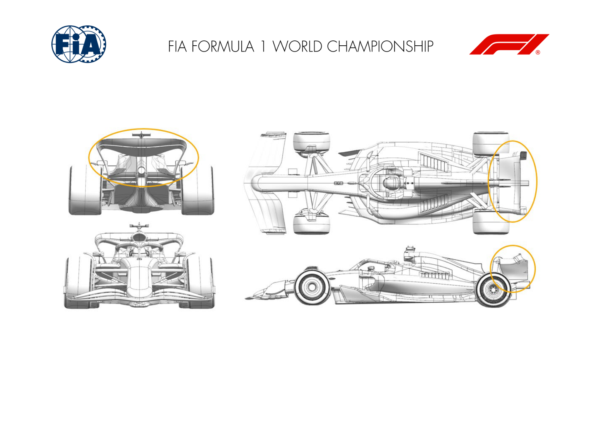
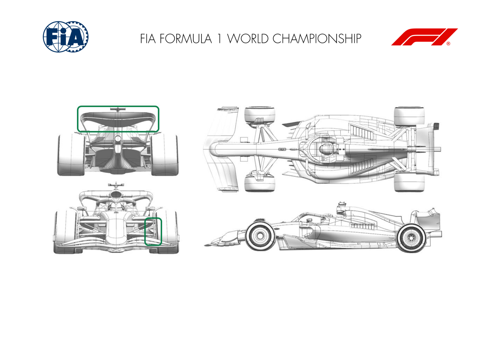
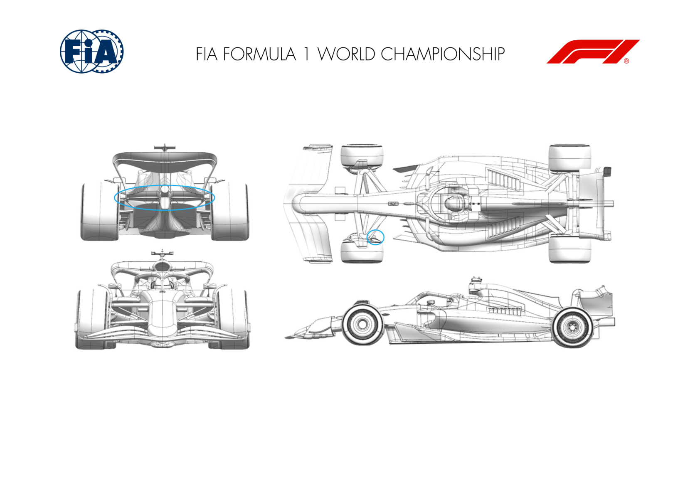
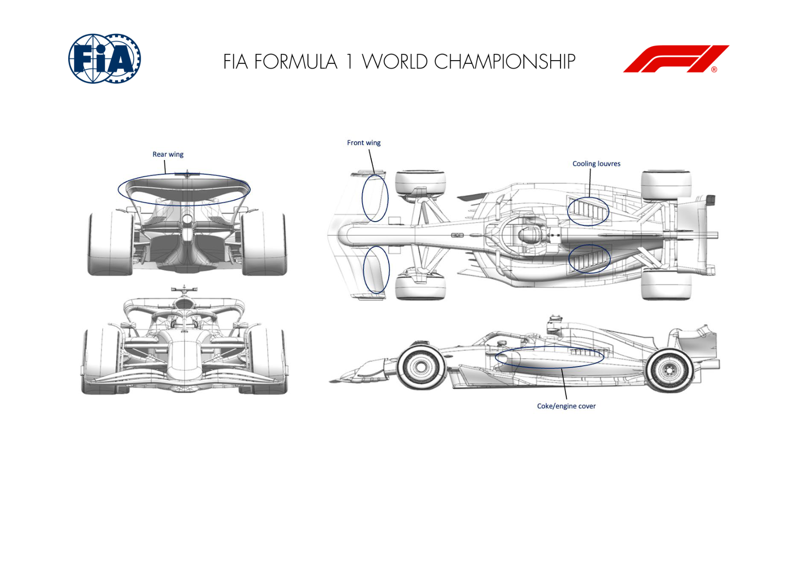

2024 SAUDI ARABIAN GRAND PRIX

07 - 09 March 2024

From The FIA Formula One Media Delegate Document 9

To All Teams, All Officials Date 07 March 2024

Time 14:20

Title Car Presentation Submissions

Description Car Presentation Submissions

Enclosed 24_SAU Car Presentation Submissions.pdf

Roman De Lauw

The FIA Formula One Media Delegate

Car Presentation – Saudi Arabian Grand Prix

ORACLE RED BULL RACING

| No. | Updated component | Primary reason for update | Geometric differences | Description |
| --- | --- | --- | --- | --- |
| 1 | Coke/Engine Cover | Circuit specific - Cooling Range | bodywork panel forming a suspension aperture and cooling exit has been reduced in exit size | given the average speed of Jeddah as well as the absence of a series of low speed corners, the cooling exit area can be redued whilst keeping the PU within its operational limits. |
| 2 | Rear Wing | Circuit specific - Drag Range | A lower camber rear wing assembly to suit the lift/drag requirements. | At a given speed, the wing has less aerodynaamic load and therefore drag than the design used in Bahrain, hence the phrase lower drag rear wing. Ultimately the PU will balance out against the drag, albeit at a higher air speed. |
| 3 | Beam Wing | Circuit specific - Drag Range | A reduced camber beam or lower rear wing Again aimed at a lower drag level for a given air speed as expalined above. |  |

MERCEDES-AMG PETRONAS F1 TEAM

| No. | Updated component | Primary reason for update | Geometric differences | Description |
| --- | --- | --- | --- | --- |
| 1 | Rear Corner | Performance - Local Load | Lower deflector rotation | Reduced loading on the forward element, which leads to improved robustness of the lower deflector throughout the ride height range. |

SCUDERIA FERRARI

| No. | Updated component | Primary reason for update | Geometric differences | Description |
| --- | --- | --- | --- | --- |
| 1 | Rear Wing | Circuit specific - Drag Range | Lower downforce top rear wing design | Fully carried over from 2023 car and specific to lower downforce tracks, this update features depowered Top Rear Wing profiles in order to adapt to Jeddah circuit layout peculiarities and efficiency requirements |
| 2 | Beam Wing | Circuit specific - Drag Range | Depowered lower beam. 2 variations will be made available, including single element arrangement | As for the top Rear Wing update, these modulations are targetting the optimum aerodynamic efficiency around Jeddah circuit layout peculiarities |

MCLAREN F1 TEAM

| No. | Updated component | Primary reason for update | Geometric differences | Description |
| --- | --- | --- | --- | --- |
| 1 | Rear Wing | Circuit specific - Drag Range | Lower Drag Rear Wing Assembly | New lower Drag Rear Wing Assembly, with an offloaded Mainplane and Flap, resulting in an efficient reduction of Downforce and Drag. |
| 2 | Beam Wing | Circuit specific - Drag Range | New upper and lower Beamwing Element | This new Beamwing Geometry features a new upper and lower element, which, as a result of the interaction with the upper Rear Wing assembly, leads to an efficient reduction of Downforce and Drag. |

ASTON MARTIN ARAMCO COGNIZANT F1 TEAM

| No. | Updated component | Primary reason for update | Geometric differences | Description |
| --- | --- | --- | --- | --- |
| 1 | Front Corner | Performance - Flow Conditioning | Revised scoop shape with inlet and exit changes. Also incorporates modified stays to the rear deflector. | The geometry modifies the flow around the tyre and improves the wake shape to reduce the effect on the parts of the car downstream. |
| 2 | Rear Wing | Circuit specific - Drag Range | Less aggressive rear wing cascade, with two different flap options. | Part of standard development to provide a wing with less load and hence drag to suit the characteristics of this circuit. |

BWT ALPINE F1 TEAM

No updates submitted for this event.

WILLIAMS RACING

| No. | Updated component | Primary reason for update | Geometric differences | Description |
| --- | --- | --- | --- | --- |
| 1 | Beam Wing | Circuit specific - Drag Range | A trim to the trailing edge of the wing to reduce the chord length. | The reduction in size of the beam wing simply reduces the downforce and drag of the rear wing assembly to deliver a drag level appropriate for the Jeddah circuit. |
| 2 | Front Corner | Circuit specific - Cooling Range | A smaller exit for the front brake duct is available. This reduces the exit area relative to the version used in Bahrain. | The smaller duct exit limits the cooling flow rate through the front brake system. This adjusts the brake temperatures into a range that suits the Jeddah circuit. |

VISA CASH APP RB F1 TEAM

| No. | Updated component | Primary reason for update | Geometric differences | Description |
| --- | --- | --- | --- | --- |
| 1 | Coke/Engine Cover |  | Performance - Flow Conditioning | Compared to Race 01, the shape & slope of the top deck of the bodywork has been modified. Flow quality passing over the bodywork is improved before it passes to the rear of the car. |
| 2 | Cooling Louvres |  | Circuit specific - Cooling Range | Compared to Race 01, cooling louvres are created on the top-deck of the bodywork to increase cooling range. Optional. Increase airflow through the radiators. |
| 3 | Front Wing |  | Circuit specific - Balance Range | Flap chord trim to tune balance range for lower rear wing levels. Optional. Front wing load is reduced by reducing the loaded area of the flap. |
| 3 | Rear Wing |  | Circuit specific - Drag Range | Reduced camber and incidence rear wing to adjust drag level. Optional. Rear wing load and drag is reduced by aerodynamically unloading the upper rear wing elements. |

STAKE F1 TEAM KICK SAUBER

No updates submitted for this event.

MONEYGRAM HAAS F1 TEAM

No updates submitted for this event.
