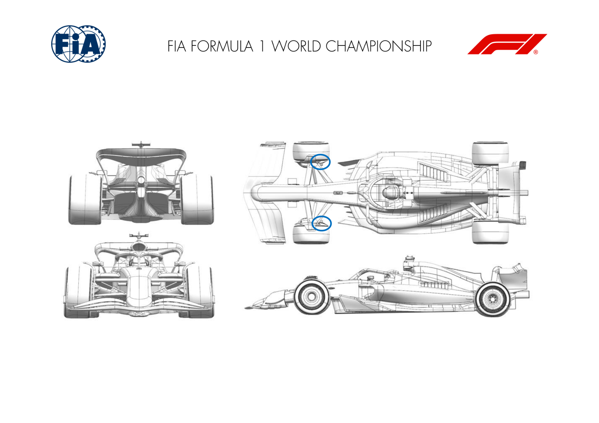
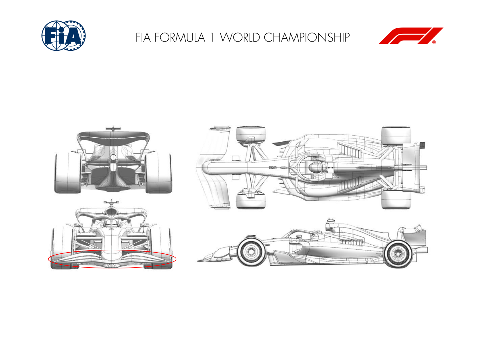
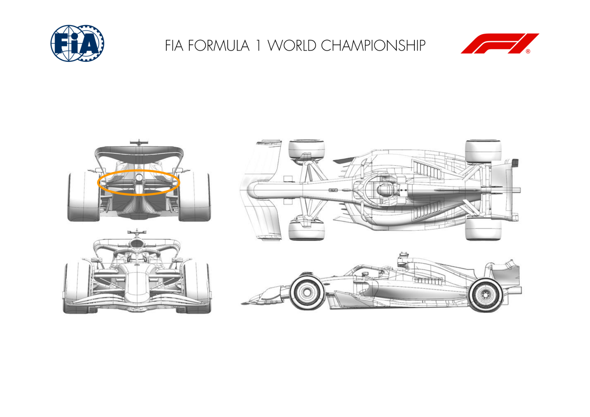
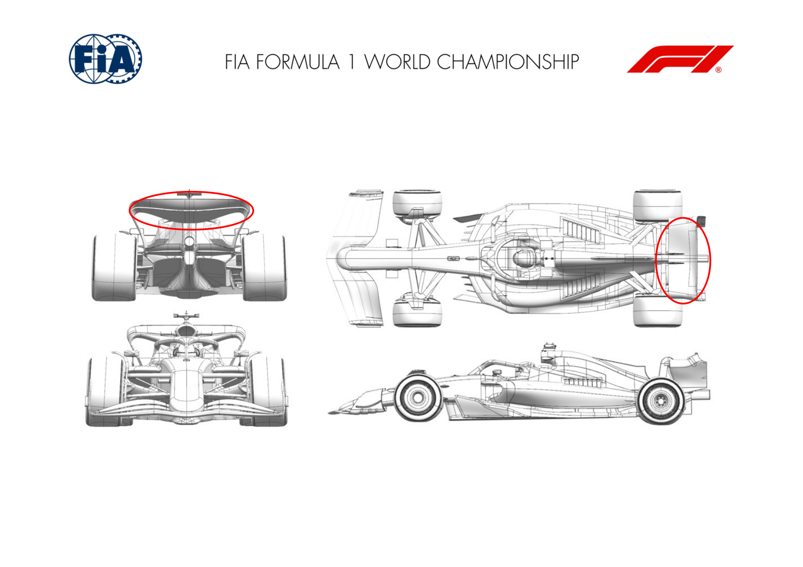
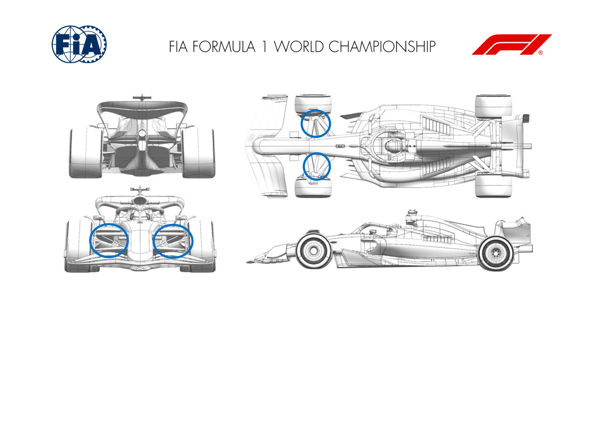

2024 SINGAPORE GRAND PRIX

20 - 22 September 2024

From The FIA Formula One Media Delegate Document 10

To All Teams, All Officials Date 20 September 2024

Time 14:49

Title Car Presentation Submissions

Description Car Presentation Submissions

Enclosed 2024 Singapore Grand Prix - Car Presentation Submissions.pdf

Roman De Lauw

The FIA Formula One Media Delegate

Car Presentation – Singapore Grand Prix

Red Bull Racing

| No. | Updated component | Primary reason for update | Geometric differences | Description |
| --- | --- | --- | --- | --- |
| 1 | Front Corner | Circuit specific - Cooling Range | Enlarged front brake duct exit geometry | To attain more front brake material cooling, a larger exit duct has been designed and made to cope with the demands of Singapore. |

Car Presentation – Singapore Grand Prix

Mercedes-AMG PETRONAS F1 Team

No updates submitted for this event.

Car Presentation – Singapore Grand Prix

SCUDERIA FERRARI

| No. | Updated component | Primary reason for update | Geometric differences | Description |
| --- | --- | --- | --- | --- |
| 1 | Front Wing | Performance - Flow Conditioning | Revised 3rd and 4th element spanwise loading distribution, updated tip details | Not specific to the Singapore circuit, this front wing upgrade offers performance and downstream flow features improvements over a wider polar range |

Car Presentation – Singapore Grand Prix

McLaren Formula 1 Team

| No. | Updated component | Primary reason for update | Geometric differences | Description |
| --- | --- | --- | --- | --- |
| 1 | Beam Wing | Circuit specific - Drag Range | Higher Downforce Beam Wing | As required by the track characteristics a more loaded Beam Wing has been designed which efficiently increases overall aerodynamic load. |

Car Presentation – Singapore Grand Prix

Aston Martin Aramco F1 Team

| No. | Updated component | Primary reason for update | Geometric differences | Description |
| --- | --- | --- | --- | --- |
| 1 | Front Wing | Circuit specific - Balance Range | A more aggressive flap with increased incidence mid- span. | The increased aggression of the flap increases the load generated by the front wing to balance the rear wing level expected to be run at this event. |

Car Presentation – Singapore Grand Prix

BWT Alpine F1 Team

| No. | Updated component | Primary reason for update | Geometric differences | Description |
| --- | --- | --- | --- | --- |
| 1 | Rear Wing | Performance - Local Load | Reprofiled top rear wing main plane suited for track characteristics and its high downforce nature | The top rear wing has been reprofiled to increase rear wing loading with the aim of improving lap time at such low efficiency track. |

Car Presentation – Singapore Grand Prix

Williams Racing

| No. | Updated component | Primary reason for update | Geometric differences | Description |
| --- | --- | --- | --- | --- |
| 1 | Front Suspension |  | Performance - Flow Conditioning | Front wishbones, track rod and pushrod These changes condition the flow ahead of the surfaces that were updated for the Dutch GP. The revised onset flow helps deliver more local load from the previous update. some of the brake duct surfaces, boot panels, and chassis leg fairings compliment the revised leg geometries. |

Car Presentation – Singapore Grand Prix

Visa Cash App RB

| No. | Updated component | Primary reason for update | Geometric differences | Description |
| --- | --- | --- | --- | --- |
| 1 | Front Wing | Circuit specific - Balance Range | Increased camber & chord flap compared to previous components. | This larger front flap increases the amount of overall load generated by the front wing assembly, to provide the balance range necessary for high downforce, high-balance circuits. |

Front wing

Car Presentation – Singapore Grand Prix

Stake F1 Team KICK Sauber

No updates submitted for this event.

Car Presentation – Singapore Grand Prix

MONEYGRAM HAAS F1 TEAM

No updates submitted for this event.
