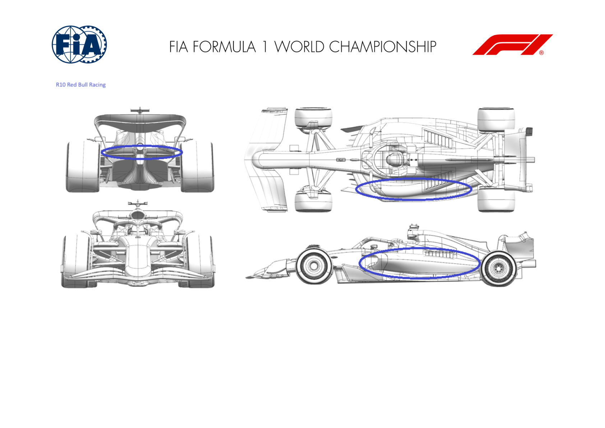
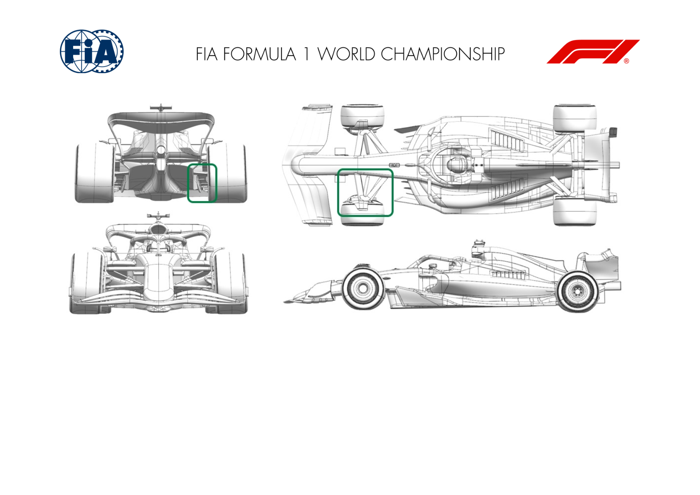
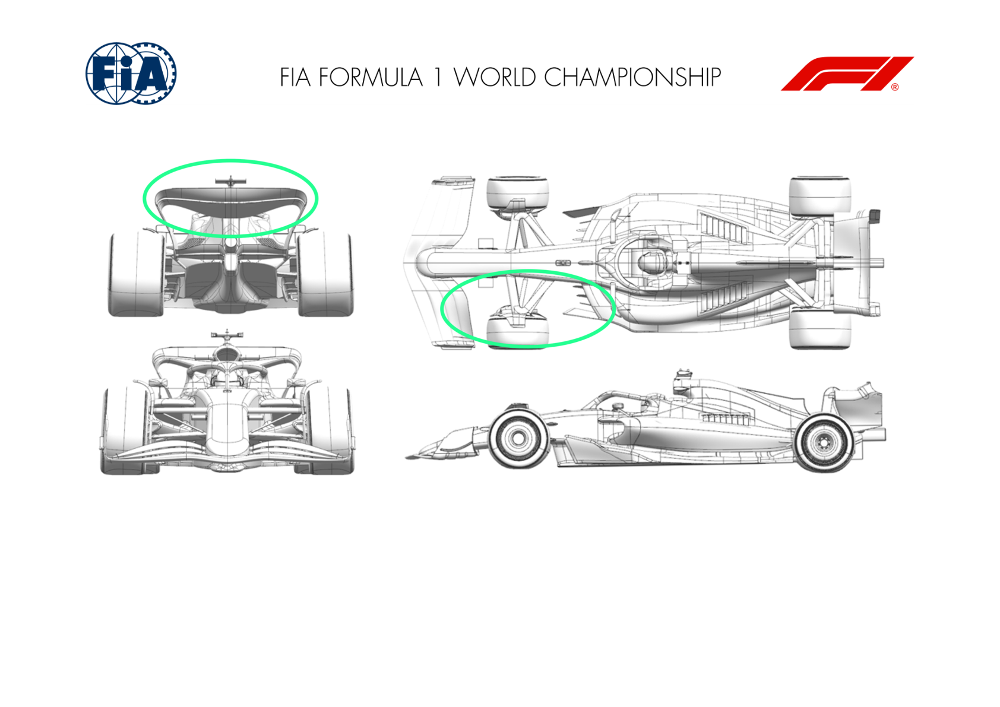

2024 SPANISH GRAND PRIX

21 - 23 June 2024

From The FIA Formula One Media Delegate Document 9

To All Teams, All Officials Date 21 June 2024

Time 10:53

Title Car Presentation Submissions

Description Car Presentation Submissions

Enclosed 2024 Spanish Grand Prix - Car Presentation Submissions.pdf

Roman De Lauw

The FIA Formula One Media Delegate

Car Presentation – Spanish Grand Prix

ORACLE RED BULL RACING

| No. | Updated component | Primary reason for update | Geometric differences | Description |
| --- | --- | --- | --- | --- |
| 1 | Sidepod Inlet | Circuit specific - Cooling Range | Revised sidepod inlet geometries | with potentially warm races ahead in Europe, the sidepod inlet geometries have been revised based upon simualtion results to exploit higher pressure inlet air for greatest cooling efficiency and therefore least number of exit louvre openings. |
| 2 | Coke/Engine Cover | Circuit specific - Cooling Range | Change to the engine cover side panels to match the new sidepod inelt profiles Changes to this region of the car wwere triggered by the new sidepod inlet geometry. |  |
| 3 | Floor Body | Circuit specific - Cooling Range | Floor altered to meet the new engine cover split line. The floor assembly change is to accommodate the engine cover and sidepod inlet changes |  |
| 4 | Beam Wing | Performance - Local Load | beam wing elements have been extruded into a revised endplate geometry | To exploit available air pressure the beam wing span has been increased to meet a new endplate offering more local load |
| 5 | Rear Wing Endplate | Performance - Local Load | Lower third of the endplate has moved outboard Accommodates a wider span beam wing as described above. |  |

MERCEDES-AMG PETRONAS FORMULA ONE TEAM

No updates submitted for this event.

SCUDERIA FERRARI

| No. | Updated component | Primary reason for update | Geometric differences | Description |
| --- | --- | --- | --- | --- |
| 1 | Rear Wing | Circuit specific - Drag Range | Higher Downforce Top Rear Wing and Lower Rear Wing designs | Introduction of more loaded Top and Lower Rear Wing main and flap profiles. Allowing different modulations, this update extends the car polar in order to offer more possibilities on mid/high downforce tracks. |
| 2 | Coke/Engine Cover | Performance - Flow Conditioning | Increased Sidepod / Coke undercut | The new bodywork features a reworked undercut that improves flow quality over the floor edge and towards the back of the car. |
| 3 | Floor Fences | Performance - Flow Conditioning | Redistributed floor fences camber | Aim of redistributing front floor fence loading was to improve flow quality delivered to the rear floor / diffuser |
| 4 | Floor Body | Performance - Flow Conditioning | Lowered front floor roof | Working in conjunction with the updated front floor fences arrangement, with the objective of improving flow quality towards the back of the car |
| 5 | Floor Edge | Performance - Local Load | Rearward floor edge volume increased | This minor geometrical update is an optimization around the improved flow energy coming from upstream, returning local load gains whilst controlling the vorticity release in the diffuser |
| 6 | Diffuser | Performance - Local Load | Reworked diffuser / boat / keel expansion | Benefitting from tidier upstream flow structures, the diffuser expansion, together with boat and keel volumes optimization, has allowed to extract more local load gains Following the geometry introduced in Imola, the cockpit device has been further optimized and is |
| 7 | Halo | Conditioning | Updated halo trailing edge and cockpit device | another step at improving the management of the losses travelling downstream |

MCLAREN FORMULA 1 TEAM

No updates submitted for this event.

ASTON MARTIN ARAMCO FORMULA ONE TEAM

| No. | Updated component | Primary reason for update | Geometric differences | Description |
| --- | --- | --- | --- | --- |
| 1 | Front Suspension | Performance - Local Load | Suspension fairings with revised twist distribution. | The update to the front corner geometry improves the local interactions between the suspension fairings and the external duct to improve local load. |
| 2 | Front Corner | Performance - Local Load | Brake duct scoop and exit update to a new shape. | The update to the front corner geometry improves the local interactions between the suspension fairings and the external duct to improve local load. |
| 3 | Rear Corner | Performance - Local Load | Lower deflector position modified with a different lower edge trim applied. | The revised position of the lower deflector in combination with the changes to the lower edge offer increased load on the device and surrounding areas. |

BWT ALPINE F1 TEAM

No updates submitted for this event.

WILLIAMS RACING

No updates submitted for this event.

VISA CASH APP RB FORMULA ONE TEAM

| No. | Updated component | Primary reason for update | Geometric differences | Description |
| --- | --- | --- | --- | --- |
| 1 | Front Corner | Circuit specific - Cooling Range | The front brake cooling duct has been reverted to the specificiation used prior to Monaco. | The reduced brake cooling requirement for Spain vs Monaco or Canda allows smaller ducts to be used. With less air needed for cooling, that energy can be used for efficient downforce generation elsewhere on the car. |
| 2 | Coke/Engine Cover | Performance - Flow Conditioning | The engine cover top surface and lower surface in the area of the sidepods has been reprofiled. | The combined change of bodywork & sidepod inlet helps to condition the flow over the top of the bodywork and around the side to improve the flow to the rear of the car and to the floor edge, improving the performance of the floor and rear wing. |
| 3 | Sidepod Inlet | Performance - Flow Conditioning | The sidepod leading edge has been reprofiled to suit the new bodywork. | In combination with the bodywork, this helps improve flow quality passing down the side of the car. |
| 4 | Floor Body | Performance - Local Load | The height and shape of the forward floor has been updated, with the fences modified to suit. | The changes made across the forward floor and fences modify the load distribution of the forward floor, generating additional local load whilst minimising any negative effects on downstream flow quality. |
| 5 | Rear Wing | Performance - Local Load | A new rear wing for medium-high downforce tracks. Rear wing profiles have been redesigned to improve the pressure coefficient (Cp) profiles for efficiency. | Improved efficient load generation of the rear wing, targeting a drag level of interest at this & future events. |

| No. | Updated component | Primary reason for update | Geometric differences | Description |
| --- | --- | --- | --- | --- |
| 6 | Beam Wing | Circuit specific - Drag Range | Compared to Monaco, the camber & incidence of the elements is reduced, positioning this wing as an intermediate step between that used at previous high & medium downforce circuits. | The loading of the beam wing is designed to work in combination with the upper wings expected to be used at Spain, to target the appropriate drag level and provide aerodynamic support to the upper wing and diffuser. |

STAKE F1 TEAM KICK SAUBER

| No. | Updated component | Primary reason for update | Geometric differences | Description |
| --- | --- | --- | --- | --- |
| 1 | Rear Wing |  | Performance - Flow Conditioning | Redesigned pylon, main plane and flap with detached outboard tips. Together with the previously introduced mono pylon, the updated rear wing is linked to the new generation of rear wings and is characterised by a new version of flap, improving the aerodynamic efficiency of the car. |
| 2 | Front Corner |  | Performance - Flow Conditioning | Redesigned exit ducts of the front brake duct. The updated front brake ducts are being introduced to further improve the aerodynamic flow and answer the cooling needs of the car in this weekend's race. |

MONEYGRAM HAAS F1 TEAM

| No. | Updated component | Primary reason for update | Geometric differences | Description |
| --- | --- | --- | --- | --- |
| 1 | Rear Impact Structure |  | Local Load | Upwashing Flick on RIS trailing edge Introduction of a small winglet on the RIS, which increases the local upwash resulting in a marginal load increase. |
