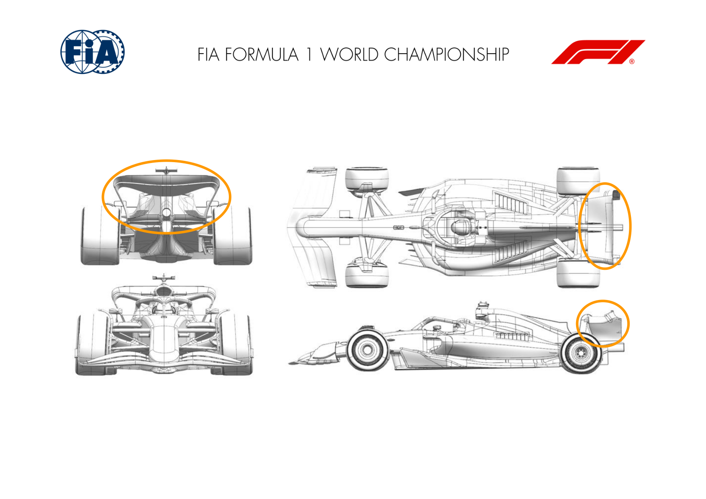
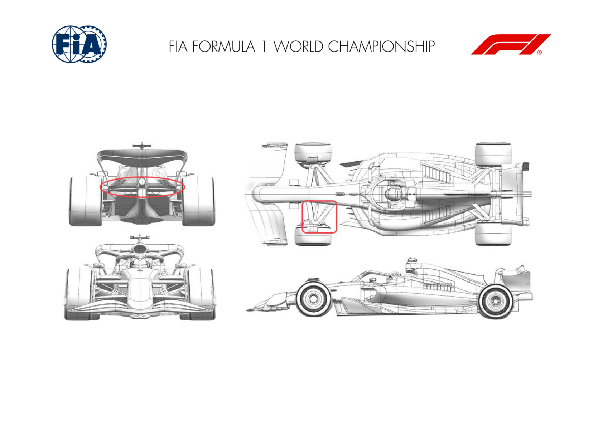

2024 SÃO PAULO GRAND PRIX

01 - 03 November 2024

From The FIA Formula One Media Delegate Document 6

To All Teams, All Officials Date 01 November 2024

Time 08:51

Title Car Presentation Submissions

Description Car Presentation Submissions

Enclosed 2024 Sao Paulo Grand Prix - Car Presentation Submissions.pdf

Roman De Lauw

The FIA Formula One Media Delegate

Car Presentation – R21 Brazilian Grand Prix

Red Bull Racing

No updates submitted for this event.

Car Presentation – 2024 São Paulo Grand Prix

*Mercedes-AMG PETRONAS F1 Team*

No updates submitted for this event.

Car Presentation – São Paulo Grand Prix

*SCUDERIA FERRARI*

No updates submitted for this event.

Car Presentation – Brazilian Grand Prix

McLaren Formula 1 Team

| No. | Updated component | Primary reason for update | Geometric differences | Description |
| --- | --- | --- | --- | --- |
| 1 | Rear Wing | Circuit specific - Drag Range | Redesigned Medium-Downforce Rear Wing | Suitable to the isochronal of this circuit, a new rear wing assembly has been designed, increasing overall wing efficiency over the existing medium downforce wing. |
| 2 | Beam Wing | Circuit specific - Drag Range | High Downforce Beam Wing | As required by the difference in rear wing design, a new beam wing, suitable for the new medium downforce rear wing mainplane and flap has been designed to maximise overall load generated by the assembly. |
| 3 | Beam Wing | Circuit specific - Drag Range | Low Downforce Beam Wing | To complement the new rear wing assembly and to extend the range of circuits where the achieved load and efficiency is suitable, a less loaded beam wing has been designed. |

Car Presentation – Brazilian Grand Prix

Aston Martin Aramco F1 Team

No updates submitted for this event.

Car Presentation – Brazil Grand Prix

BWT Alpine F1 Team

No updates submitted for this event.

Car Presentation – Brazil Grand Prix

*Williams Racing*

No updates submitted for this event.

Car Presentation – Brazil Grand Prix

Visa Cash App RB

No updates submitted for this event.

Car Presentation – Brazilian Grand Prix

Stake F1 Team KICK Sauber

| No. | Updated component | Primary reason for update | Geometric differences | Description |
| --- | --- | --- | --- | --- |
| 1 | Front Suspension | Performance - Mechanical Setup | New outboard suspension pick up points | The new OB suspension provides more freedom in our mechanical setup. Re-optimized suspension fairings around this kinematics and the latest front wing are part of the update. |
| 2 | Beam Wing | Circuit specific - Balance Range | Tandem Beam wing | A new beam wing configuration which increases the efficiency of the beam wing system has been brought to this event. |

Car Presentation – 2024 Brazilian Grand Prix

MONEYGRAM HAAS F1 TEAM

No updates submitted for this event.
