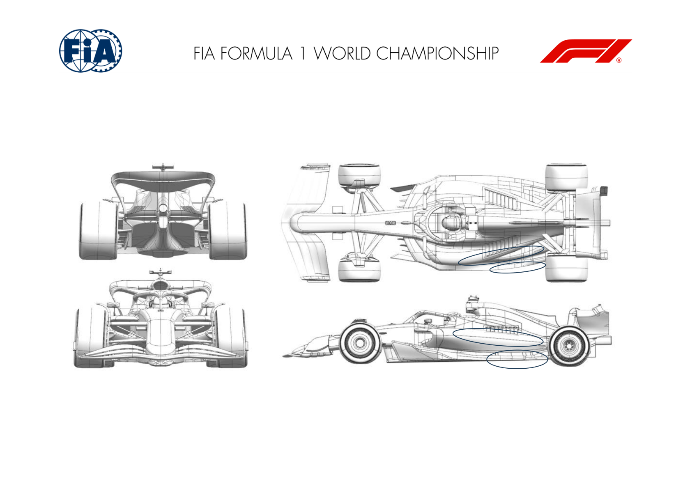
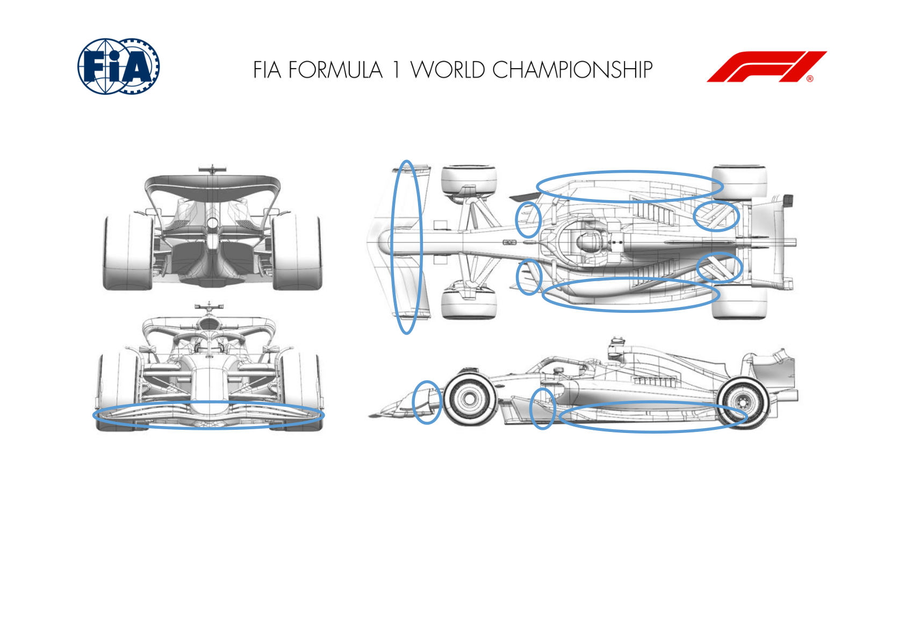
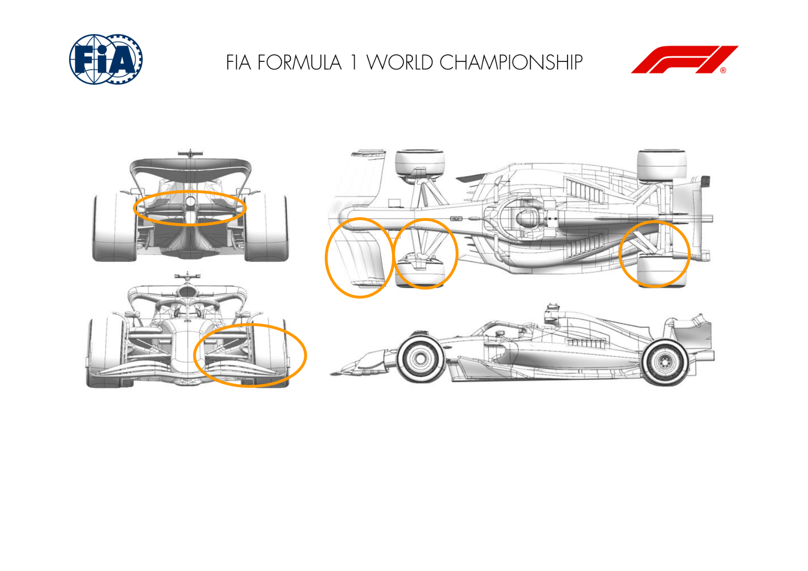
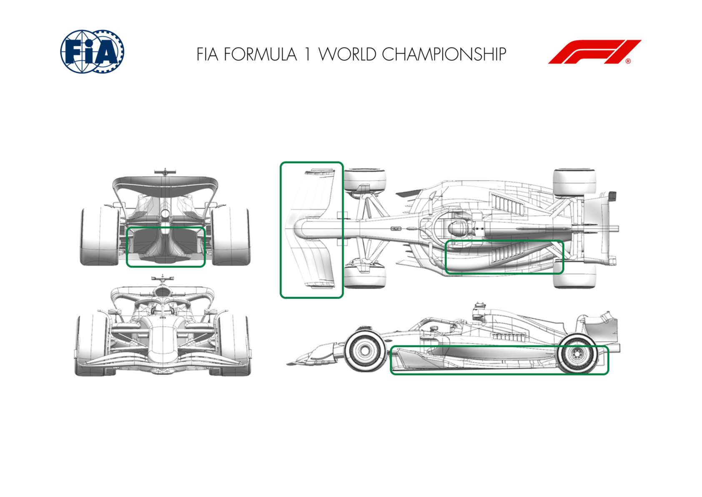
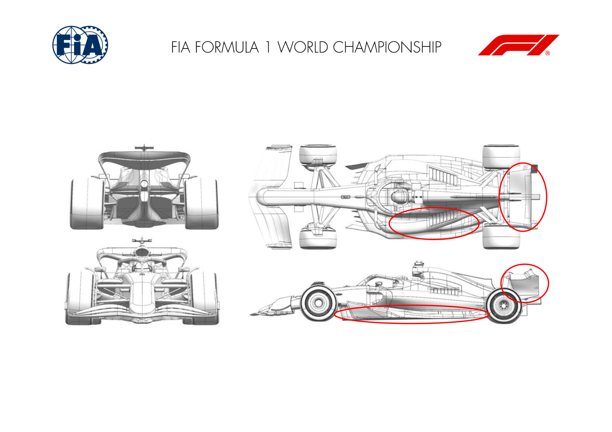
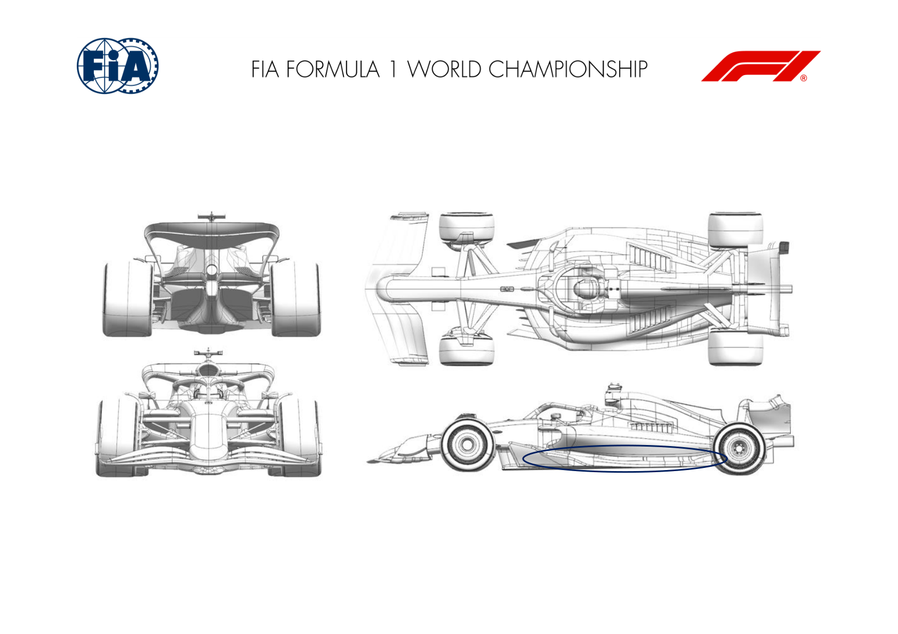
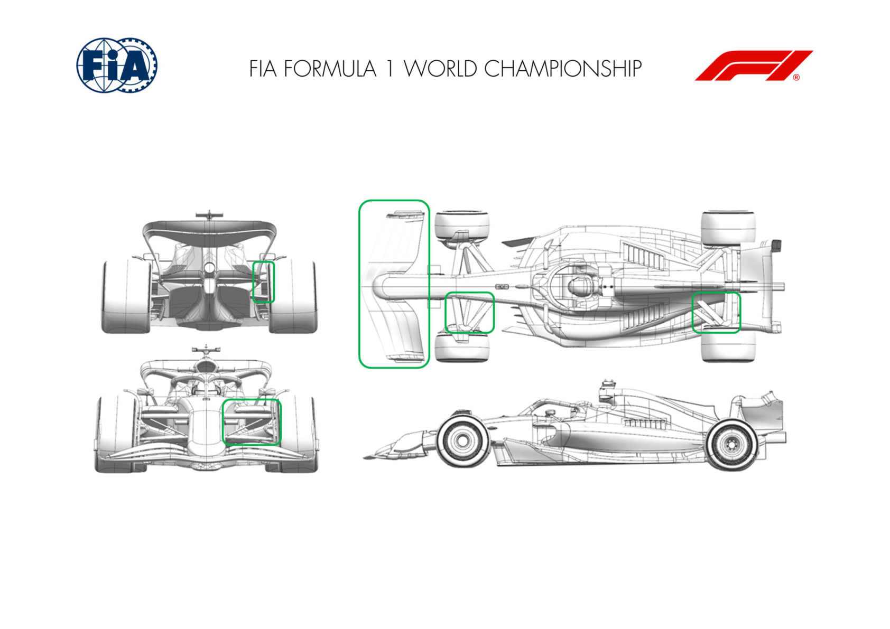
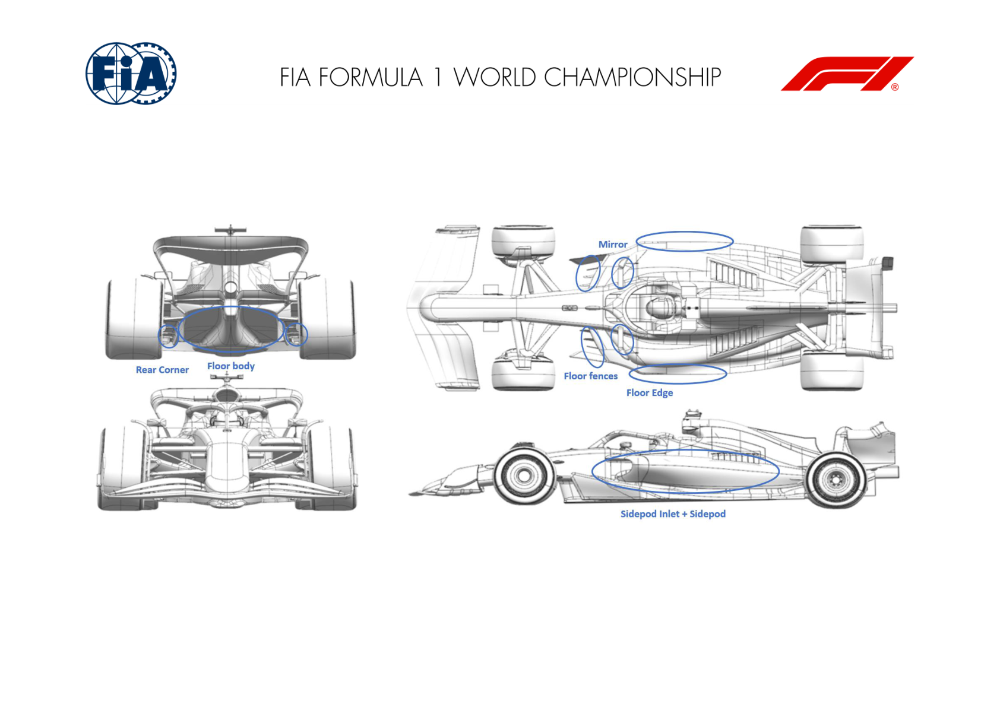

2024 UNITED STATES GRAND PRIX

18 - 20 October 2024

From The FIA Formula One Media Delegate Document 6

To All Teams, All Officials Date 18 October 2024

Time 09:55

Title Car Presentation Submissions

Description Car Presentation Submissions

Enclosed 2024 United States Grand Prix - Car Presentation Submissions.pdf

Roman De Lauw

The FIA Formula One Media Delegate

Car Presentation – USA Austin Grand Prix

Red Bull Racing

| No. | Updated component | Primary reason for update | Geometric differences | Description |
| --- | --- | --- | --- | --- |
| 1 | Floor Edge | Performance - Local Load | Revised edge wing camber over rearward third. | With more local camber in the edge wing over its rearmost third, more local load is generated whilst maintain flow stability |
| 2 | Coke/Engine Cover | Circuit specific - Cooling Range | Sidepod upper surface lower and floor junction curve re-profiled | Continuing the steps previously taken, more efficient cooling can be attained with the geometric changes to minimise the louvre openings. |

Car Presentation – 2024 United States Grand Prix

*Mercedes-AMG PETRONAS F1 Team*

| No. | Updated component | Primary reason for update | Geometric differences | Description |
| --- | --- | --- | --- | --- |
| 1 | Front Wing | Performance - Flow Conditioning | Change in flap twist distribution | Change in flap spanwise twist, reduces front wing wake which improves flow to the rear of the car and rear downforce. |
| 2 | Front Suspension | Performance - Flow Conditioning | Re-profiled upper wishbone fairing. | Re-profiling has improved the attachment of the rear leg through an increased operating range, improving flow to the rear of the car. |
| 3 | Floor Edge | Performance - Local Load | Additional vane element added to floor edge wing. | Additional vane element increases mass flow under forward floor, increasing vorticity shed from the fence system, increasing floor load. |
| 4 | Sidepod Inlet | Circuit specific - Cooling Range | Lower lip of sidepod inlet moved rearwards. | Lower lip geometry change has improved the flow alignment through a increased range of operating conditions and cooling levels - ultimately improving engine cooling. |
| 5 | Coke/Engine Cover | Circuit specific - Cooling Range | Additional cooling exits local to rear suspension legs | Additional cooling exit added local to rear suspension to increase sidepod mass flow whilst minimising wing. |
| 6 | Floor Fences | Performance - Flow Conditioning | Reprofiled inboard fence | New fence profile has improved local pressure distribution and position of vorticity, improving both local and downstream load through better onset flow. |

Car Presentation – United States Grand Prix

*SCUDERIA FERRARI*

No updates submitted for this event.

Car Presentation – Austin Grand Prix

McLaren Formula 1 Team

| No. | Updated component | Primary reason for update | Geometric differences | Description |
| --- | --- | --- | --- | --- |
| 1 | Front Wing | Performance - Flow Conditioning | New Front Wing Geometry | The new front wing geometry improves flow suspension geometry throughout various conditions resulting in improved aerodynamic load. |
| 2 | Front Suspension | Performance - Flow Conditioning | New Front Suspension | The new front suspension is designed around the new front wing geometry aimed at maximising the improved flow characteristics introduced with it. |
| 3 | Front Corner | Performance - Flow Conditioning | Updated Front Brake Duct Furniture | The front brake duct furniture has been updated to complement the changes on front wing and front suspension, resulting in overall improved flow characteristics. |
| 4 | Front Corner | Circuit specific - Cooling Range | Low Cooling Front Brake Duct | Suitable for tracks with low front brake cooling demand, a reduced cooling front brake duct has been designed, improving overall aerodynamic load at the expense of front brake cooling. |
| 5 | Rear Corner | Performance - Flow Conditioning | Modified Rear Suspension Fairing | Small modification of rear suspension fairings with the aim of improving overall flow quality across multiple conditions, enabling aerodynamic load generation. |
| 6 | Rear Corner | Circuit specific - Cooling Range | New RBD Cooling Exit | The reworked rear brake duct cooling exit has been designed with the aim of improving overall cooling performance of the rear corner assembly. |
| 7 | Beam Wing | Circuit specific - Drag Range | Single Element Beamwing for High Downforce Rear Wing | A less loaded, single element beam wing, which efficiently reduces drag in conjunction with the high downforce rear wing assembly, has been brought to this event. |

Car Presentation – United States Grand Prix

Aston Martin Aramco F1 Team

| No. | Updated component | Primary reason for update | Geometric differences | Description |
| --- | --- | --- | --- | --- |
| 1 | Front Wing | Performance - Local Load | A new front wing with revised twist distribution alongside a new flap. | The changes to the front wing and endplate modify the spanwise loading of the wing assembly to improve the performance |
| 2 | Front Wing Endplate | Performance - Local Load | In combination with the front wing the endplate has revised tip details. | The changes to the front wing and endplate modify the spanwise loading of the wing assembly to improve the performance |
| 3 | Coke/Engine Cover | Performance - Local Load | Revised bodywork with a different coke line and simpler upper shoulder. | The bodywork and floor in combination improve the flowfield under the floor increasing the local load generated on the lower surface and hence performance. |
| 4 | Floor Body | Performance - Local Load | The main body of the floor has evolved in most places with the floor edge development. | The bodywork and floor in combination improve the flowfield under the floor increasing the local load generated on the lower surface and hence performance. |
| 5 | Floor Edge | Performance - Local Load | Small changes to the details of the floor edge wing and the main floor inboard of this. | The bodywork and floor in combination improve the flowfield under the floor increasing the local load generated on the lower surface and hence performance. |
| 6 | Diffuser | Performance - Local Load | The roof and sidewall of the diffuser have a slightly modified profile. | The bodywork and floor in combination improve the flowfield under the floor increasing the local load generated on the lower surface and hence performance. |

Car Presentation – United States Grand Prix

BWT Alpine F1 Team

| No. | Updated component | Primary reason for update | Geometric differences | Description |
| --- | --- | --- | --- | --- |
| 1 | Floor Body | Performance – Local Load | Re-profiling of various parts of the main floor | General optimisation of the floor geometry to improve under floor flow quality with the objective of increasing the load generated by the floor. |
| 2 | Floor Edge | Performance – Local Load | Floor Edge Modification | Re-designed floor edge to improve under floor flow quality. This floor edge works in conjunction with the redesigned floor geometry. |
| 3 | Coke/Engine Cover | Performance - Flow Conditioning | New Bodywork Shape The bodywork has been reshaped to improve flow conditioning and to better interact with the floor and the rear of the car. |  |
| 4 | Rear wing | Performance – Local Load | Re-profiled rear wing main plane and flap | This rear wing assembly is introduced to offer a gain in efficiency with more rear wing loading. This constitutes a suitable option for this track. |

Car Presentation – USA Grand Prix

WILLIAMS

No updates submitted for this event.

Car Presentation – United States Grand Prix

Visa Cash App RB

| No. | Updated component | Primary reason for update | Geometric differences | Description |
| --- | --- | --- | --- | --- |
| 1 | Floor Body | Performance - Local Load | Profile changes to the main underfloor and chassis interface. Increased local downforce generation, and loss reduction of underfloor structures. |  |

Car Presentation – United States Grand Prix

Stake F1 Team KICK Sauber

| No. | Updated component | Primary reason for update | Geometric differences | Description |
| --- | --- | --- | --- | --- |
| 1 | Front Wing | Performance - Flow Conditioning | All FW elements have been updated. | tyre flow structures. This has a positive effect to the flow field further downstream on the car, improving both overall downforce of the car and the aero characteristics. |
| 2 | Front Suspension | Performance - Flow Conditioning | Combined with the new FW we have updated the front suspension covers as well - pullrod, track rod and lower wishbone covers. | Together with the new FW the front suspension covers needed to be realigned based on the onset flow field to have clean flow features further downstream on the car. |
| 3 | Rear Suspension | Performance - Flow Conditioning | Revised rear top wishbone cover. | Rear top wishbone fairing upgrade with local flow conditioning improvements. Positive interaction efficiency increase. |
| 4 | Rear Corner | Performance - Flow Conditioning | Combined with the revised rear top wishbone cover the upper rear brake duct deflectors were updated. | The upper deflectors were updated in combination with the top wishbone cover. Improved local flow |

Car Presentation – 2024 USA Grand Prix (Austin)

MONEYGRAM HAAS F1 TEAM

| No. | Updated component | Primary reason for update | Geometric differences | Description |
| --- | --- | --- | --- | --- |
| 1 | Sidepod Inlet | Performance - Flow Conditioning | Deeper Undercut | Increasing the undercut under the sidepod inlet favours clean air flow towards the rear of the car. Combined with the revised floor this allows a more balanced performance increase across the car. |
| 2 | Floor Body | Performance - Local Load | Revised initial floor expansion and diffuser geometry | Increased front floor suction combined with improved rear extraction allows to increase the overall performance of the floor. |
| 3 | Floor Fences | Performance - Flow Conditioning | Revised fence alignment | The improved front floor extraction required a revised alignment of the front floor fences, as they must manage different flow features. |
| 4 | Floor Edge | Performance - Local Load | New Edge Wing design | The revised floor allows greater extraction from the floor edge, hence an improved design allowed to extract higher performance from the car. |
| 5 | Rear Corner | Performance - Local Load | Additional element on the IB cascade | The improved incoming floor to the rear of the car allows higher extraction from the rear corner, which is achieved with an additional upwashing |
| 6 | Coke/Engine Cover | Circuit specific - Cooling Range | Larger engine cover central exit In case of additional cooling requirements, a bigger central exit on the engine cover is available. |  |
| 7 | Cooling Louvres | Circuit specific - Cooling Range | New cooling louver design on sidepod and engine cover | In combination with the new engine cover, additional cooling louver options are available, which increase heat extraction and try to minimize the drag penalty. |

