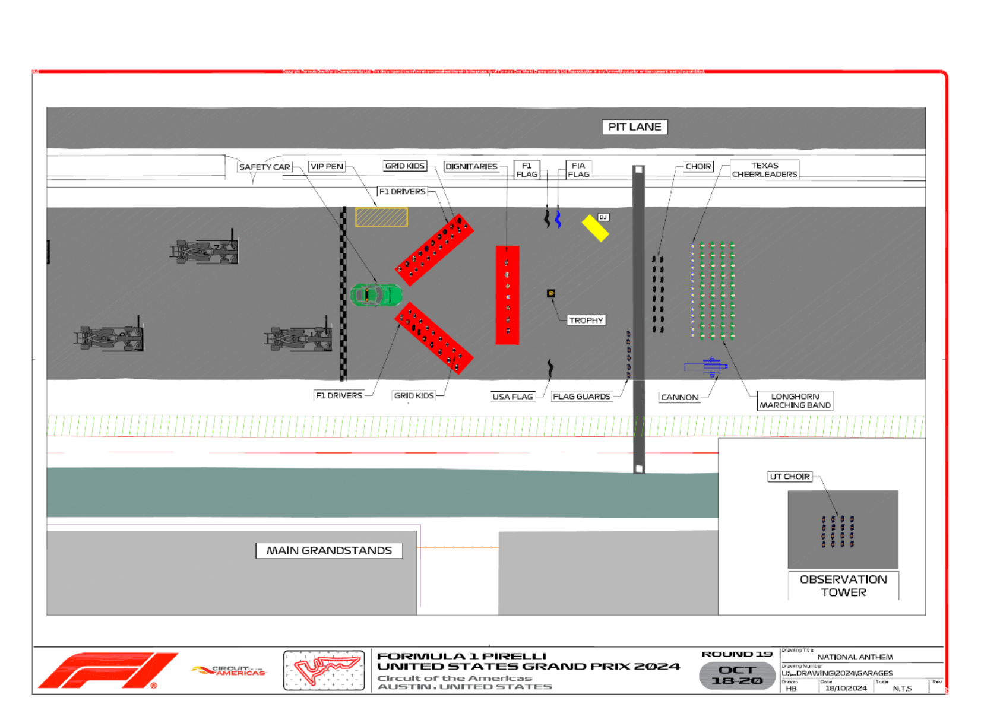

2024 UNITED STATES GRAND PRIX

18 - 20 October 2024

From The FIA Formula One Media Delegate Document 61

To All Teams, All Officials Date 20 October 2024

Time 11:44

Title Pre-Race Procedure

Description Pre-Race Procedure

Enclosed 2024 United States Grand Prix - Pre-Race Procedure.pdf

Roman De Lauw

The FIA Formula One Media Delegate

2024 UNITED STATES GRAND PRIX

18 – 20 October 2024

From The FIA Formula One Media Delegate

To All Officials, All Teams Date 20 October 2024

NOTE TO TEAMS: PRE-RACE PROCEDURE

Please find below a summary of the requirements for the Pre-Race activities and National Anthem, which must be followed in order to ensure the orderly running of these procedures.

13:42:00 Drivers move to National Anthem Position. For the duration of the National Anthem all Drivers must remain attired only in their race suits.

13:44:00 The National Anthem.

Failure to comply with these procedures will be reported to the Stewards. Please see the attached National Anthem Diagram.

Roman De Lauw

The FIA Formula One Media Delegate

