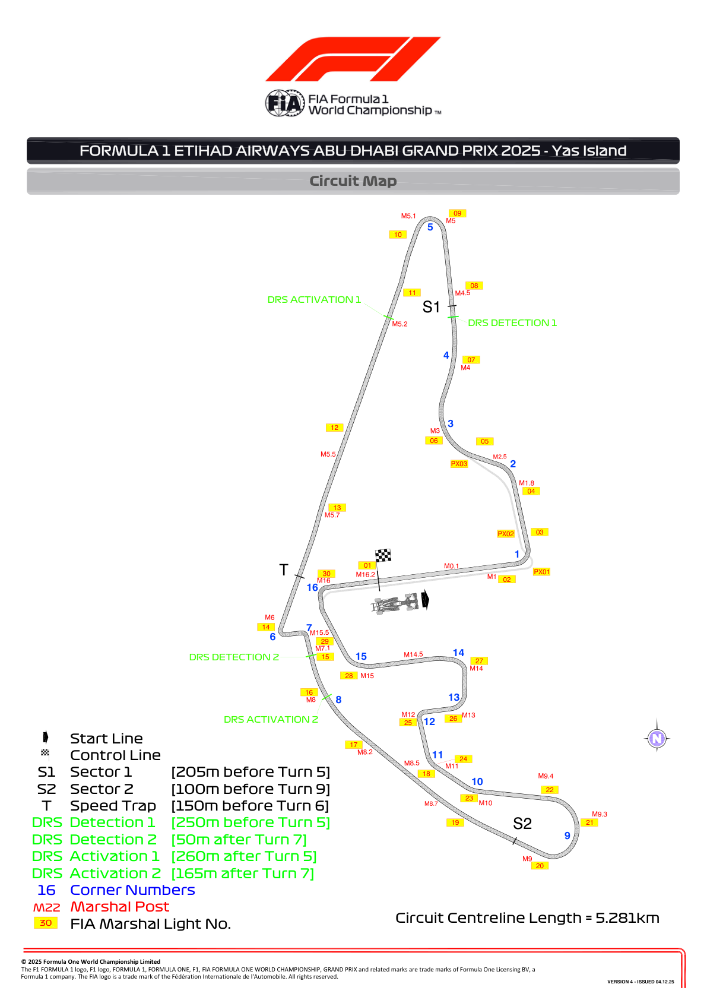
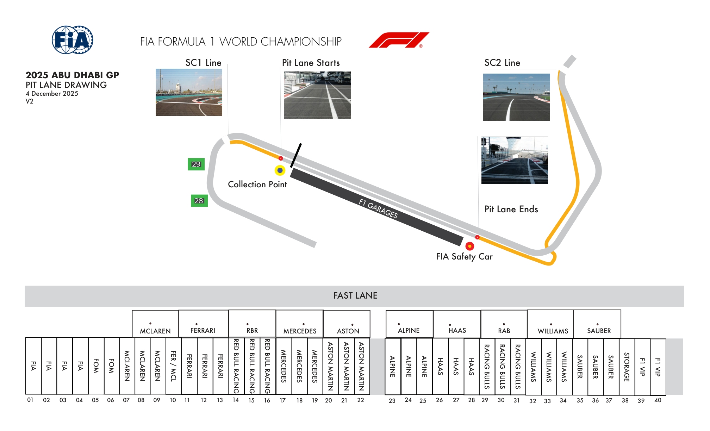
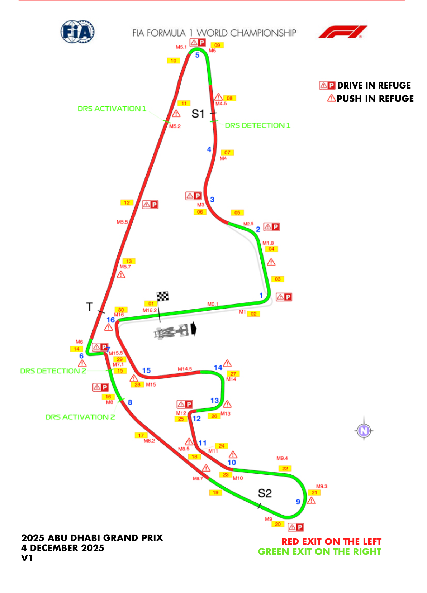
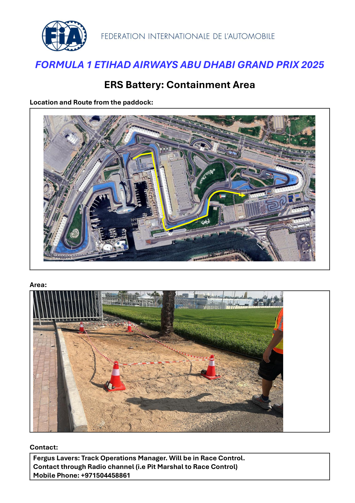
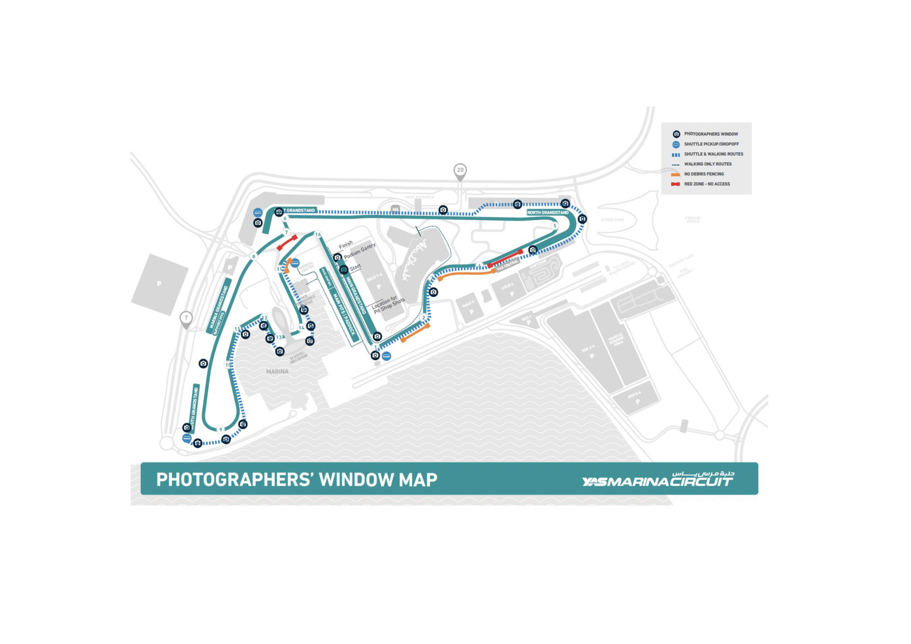

2025 ABU DHABI GRAND PRIX

05 - 07 December 2025

From The FIA Formula One Race Director Document 4

To All Teams, All Officials Date 04 December 2025

Time 19:14

Title Event Notes - Circuit Map, Pit Lane Drawing, Emergency Exits Map, Quarantine Zone and Red Zones

Description Event Notes - Circuit Map, Pit Lane Drawing, Emergency Exits Map, Quarantine Zone and Red Zones

Enclosed Maps.pdf

Rui Marques

The FIA Formula One Race Director

