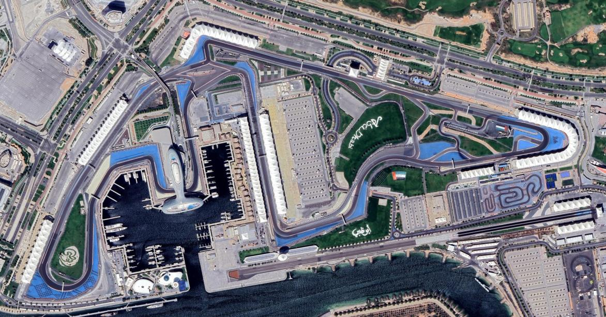
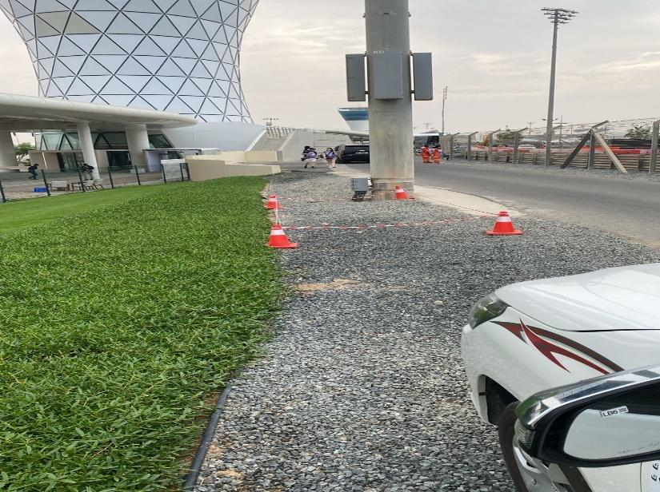

2025 ABU DHABI GRAND PRIX

05 - 07 December 2025

From The FIA Formula One Race Director Document 12

To All Teams, All Officials Date 05 December 2025

Time 18:32

Title Race Director Event Notes - Quarantine Area V2

Description Race Director Event Notes - Quarantine Area V2

Enclosed Abu Dhabi Quarantine Area V2.pdf

Rui Marques

The FIA Formula One Race Director

[PU]

FORMULA 1 ETIHAD AIRWAYS ABU DHABI GRAND PRIX 2025

ERS Battery: Containment Area

Location and Route from the paddock:

Area: Just after Turn 1, accessed via Service road (Not through Pit Exit Tunnel). Approximately

200m from the end of Pit Lane.

Contact:

Fergus Lavers: Track Operations Manager. Will be in Race Control.

Contact through Radio channel (i.e Pit Marshal to Race Control)

Mobile Phone: +971504458861
