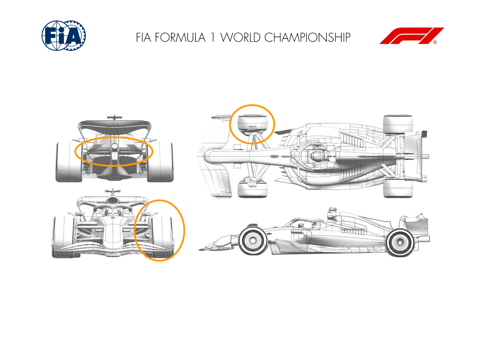
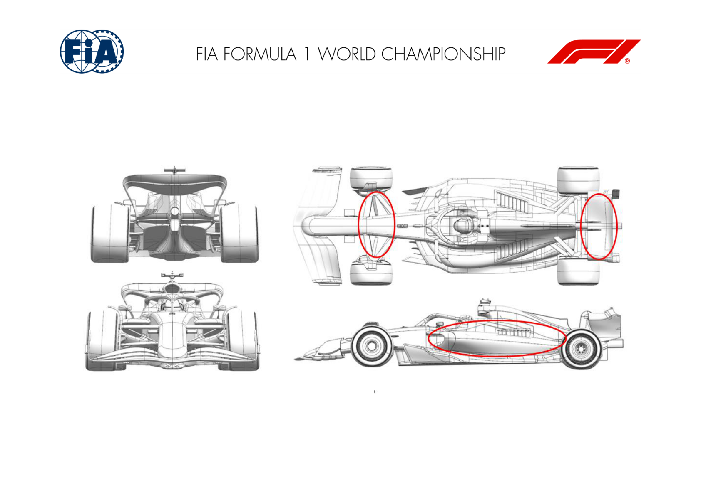
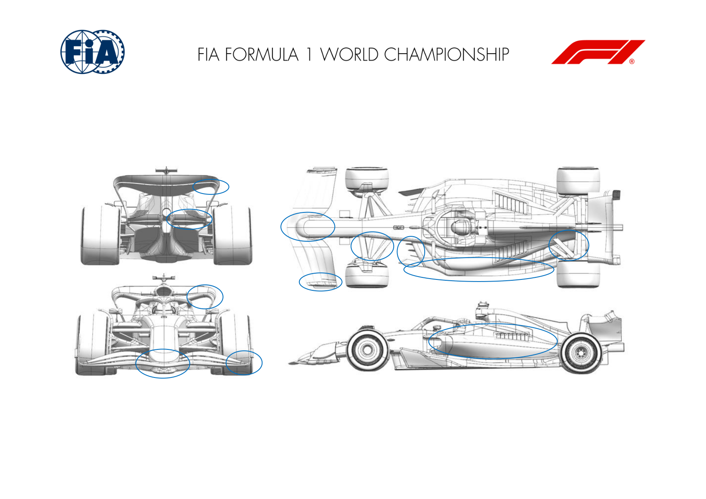
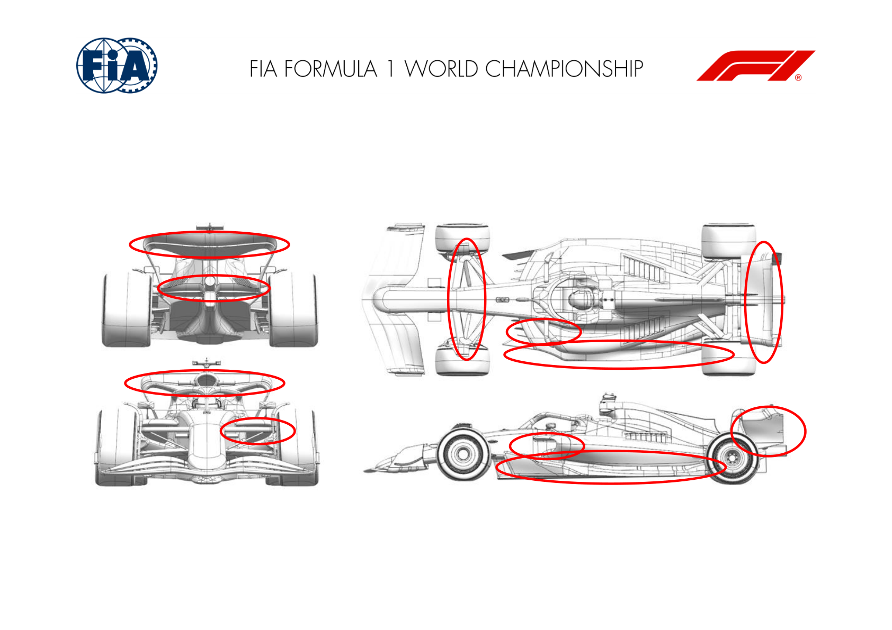
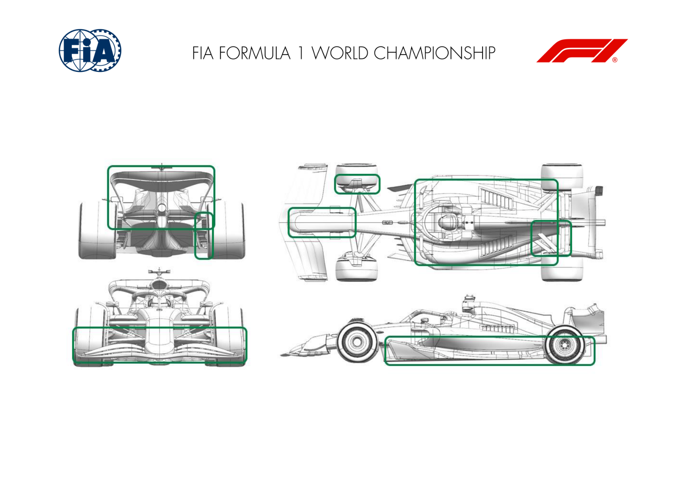
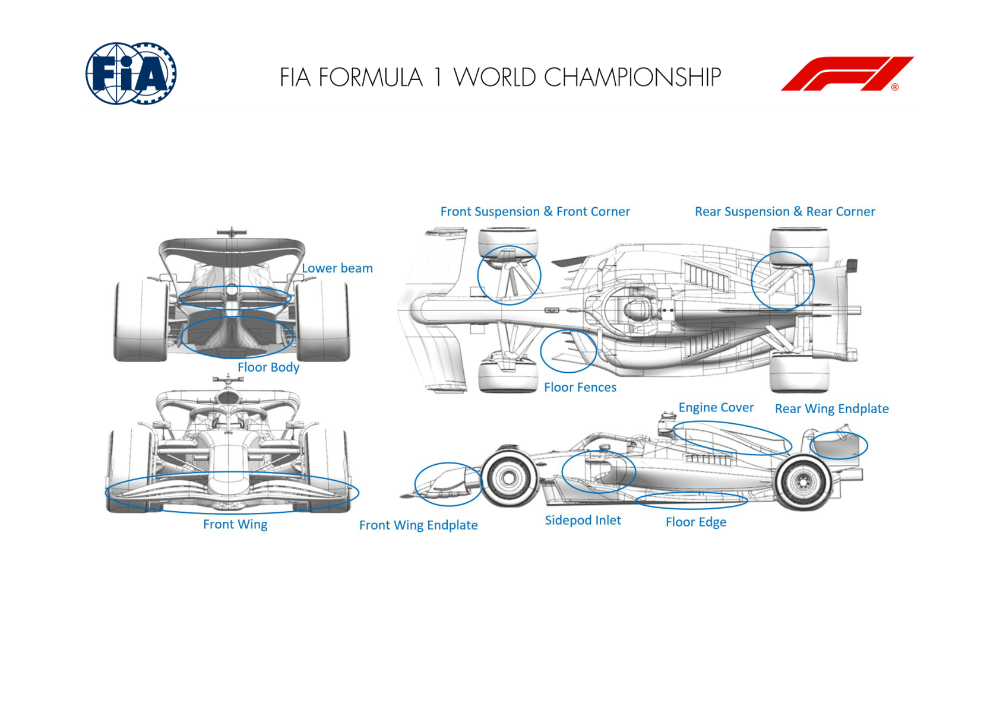
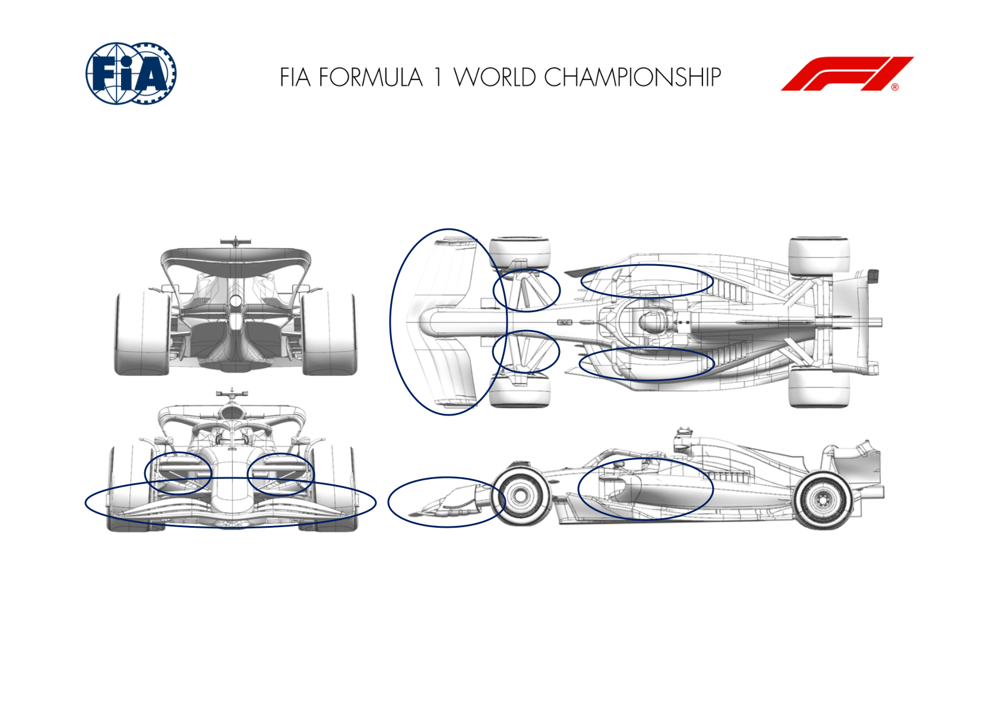
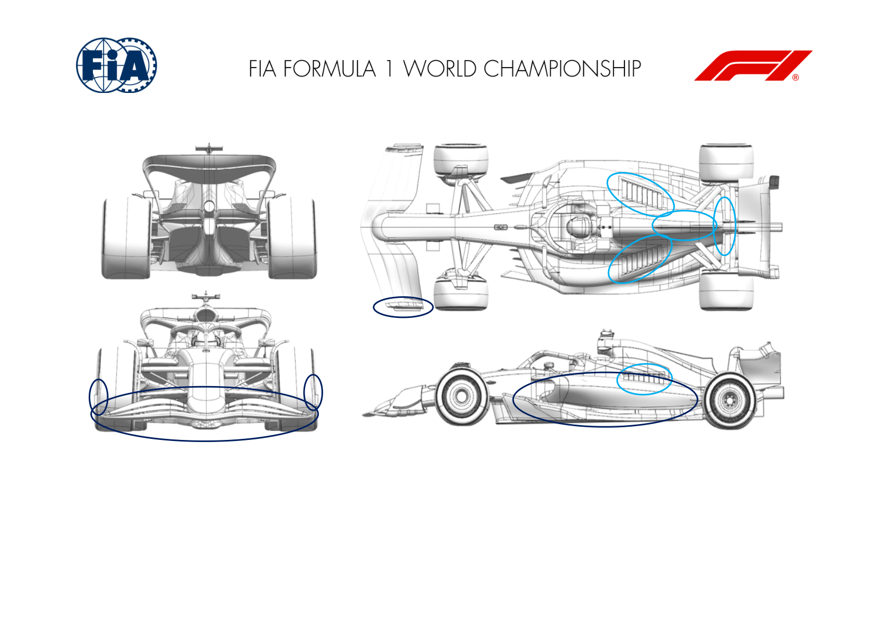
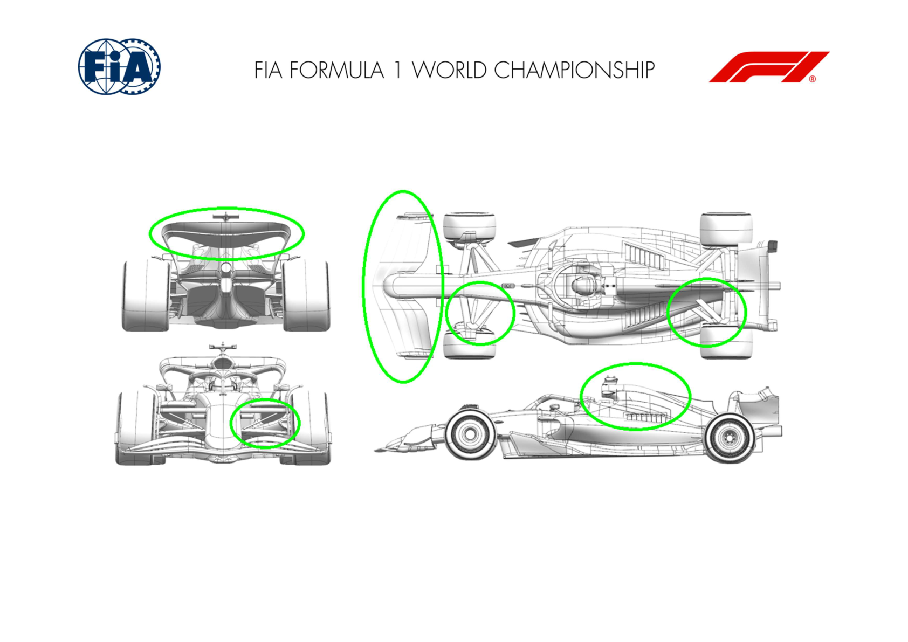

2025 AUSTRALIAN GRAND PRIX

14 - 16 March 2025

From The FIA Formula One Media Delegate Document 7

To All Teams, All Officials Date 14 March 2025

Time 09:55

Title Car Presentation Submissions

Description Car Presentation Submissions

Enclosed 2025 Australian Grand Prix - Car Presentation Submissions.pdf

Roman De Lauw

The FIA Formula One Media Delegate

Car Presentation – Australian Grand Prix

McLaren Formula 1 Team

| No. | Updated component | Primary reason for update | Geometric differences | Description |
| --- | --- | --- | --- | --- |
| 1 | Front Corner | Performance - Flow Conditioning | Revised Front Brake Duct Winglet | Revised Front Brake Duct Winglet geometry resulting in improved flow conditioning, resulting in an improvement of overall aerodynamic performance downstream. |
| 2 | Front Corner | Circuit specific - Cooling Range | Lower Cooling Front Corner Scoop | Low cooling Front Brake Duct option converting reduced brake cooling demand into increased aerodynamic performance achieved via improved flow conditioning. |
| 3 | Beam Wing | Circuit specific - Drag Range | More loaded single element Beamwing | In order to improve both aerodynamic efficiency as well as overall load on the Rear Wing assembly, a more loaded single element Beamwing has been designed. |
| 4 | Beam Wing | Circuit specific - Drag Range | More loaded double element Beamwing | In order to improve both aerodynamic efficiency as well as overall load on the Rear Wing assembly, a more loaded double element Beamwing has been designed. |

Car Presentation – 2025 Australian Grand Prix

*SCUDERIA FERRARI HP*

| No. | Updated component | Primary reason for update | Geometric differences | Description |
| --- | --- | --- | --- | --- |
| 1 | Front Suspension | Performance - Flow Conditioning | Switch from pushrod to pullrod, upper and lower wishbones geometry rearrangement to suite and new front brake duct scoop topology | This new front suspension layout has unlocked several development paths, focused on enhancing interactions with the front wing and maximizing downstream flow quality |
| 2 | Sidepod Inlet / Engine cover | Performance - Flow Conditioning | More compact sidepod in both side and plan views. Reoptimized cooling exits, including engine cover centre line louvres | Benefiting from an improved onset flow quality, the sidepod design has been optimized and made more compact for both improved interactions with the floor / floor edge as well as the rear end of the car |
| 3 | Rear Wing / Beam Wing | Performance - Local Load | New top rear wing profiles and revised lower wing design | Capitalizing on improved upstream flow energy and new cooling exit topology, the rear wing has been deeply redesigned, offering a net gain on car aerodynamic efficiency |

Car Presentation – Australian Grand Prix

Red Bull Racing

| No. | Updated component | Primary reason for update | Geometric differences | Description |
| --- | --- | --- | --- | --- |
| 1 | Front Wing | Performance - Local Load | First element and curls to the endplate revised, other changes consequential to observe regulations Redistributed loadings across the elements seeking improved load whilst maintain flow stability |  |
| 2 | Nose | Performance - Local Load | Revised fairings at the element junctions | A consequences of revising the element junctions, the regulations require areas at specific sections, hence the profile was revised. |
| 3 | Front Suspension | Performance - Local Load | Suspension fairings revised on the trackrod and wishbones | More local load has been extracted from the revised fairings via increased camber whilst maintaining flow stability |
| 6 | Floor Body | Performance - Local Load | Re-profiled surfaces to supplement the changes to the fences and edge wing | Revised shape improves pressure distribution given other changes to the floor to extract more load and maintain flow stability |
| 7 | Floor Fences | Performance - Local Load | Repositioned laterally at the leading edges | Changing the lateral positions allows more overall load to be attained from pressure distributions in the channels |
| 8 | Floor Edge | Performance - Local Load | New surfaces with increased camber locally Given changes upstream, more camber has been applied to the edge wing for more local load. |  |
| 9 | Coke/Engine Cover | Reliability | Mild revision to the sidepod shape to clear components. | Subtle changes to components shrouded by the sidepod have resulted in a new shape giving improved cooling flow with less downstream detriment |
| 10 | Cooling Louvres | Cooling | Reduced span for the medium levels of cooling | Given the sidepod improvements cooling louvres at most circuits will be smaller than last year with less downstream loss |

| No. | Updated component | Primary reason for update | Geometric differences | Description |
| --- | --- | --- | --- | --- |
| 13 | Rear Suspension | Performance - Local Load | Revised fairings | Given bodywork changes upstream, the fairings have been re-optimised gaining locally more load whilst maintaining flow stability |
| 15 | Beam Wing | Performance - Local Load | Revised camber distribution across the span | Less blockage behind the central topbody cooling exit to reduce the louvre count and improve slightly the load extracted across the span |
| 16 | Rear Wing | Performance - Local Load | Revised curl geometry for the mainplane | A revised mainplane tip geometry has extracted more local load by revising the pressure distribution across the span. |
| 17 | Rear Wing Endplate | Performance - Local Load | Tip geometry as a result of changes to the mainplane Consequential change from the tip geometry of the mainplane. |  |

Car Presentation – 2025 Australian Grand Prix

*Mercedes-AMG PETRONAS F1 Team*

| No. | Updated component | Primary reason for update | Geometric differences | Description |
| --- | --- | --- | --- | --- |
| 1 | Sidepod Inlet | Performance - Flow Conditioning | Vertical and horizontal inlet. Improved flow quality to the radiator and rear of the floor, thus increasing floor load. |  |
| 2 | Floor Body | Performance - Local Load | Change in the fence camber and floor tunnel profile. | Increased local load which in turn increases mass flow under the floor; flow quality to the diffuser improved which increases rear floor load. |
| 3 | Coke/Engine Cover | Performance - Flow Conditioning | Increased undercut sidepod. | Improved flow quality to the rear of the car and floor edge – which in turns improves rear floor load. |
| 4 | Beam Wing | Performance - Local Load | Improved section profiling. Improved profiling of both beam wing elements resulting in better wing efficiency. |  |
| 5 | Front Suspension | Performance - Flow Conditioning | Low rear track rod | Increased suspension loading and front tyre wake control, improving flow to the floor. |
| 6 | Rear Wing | Performance - Local Load | Improved section profiling. | Reprofiling has cleaned up the tip flow structures, thus improving tip and wing efficiency without losing wing load. |

Car Presentation – Australian Grand Prix

Aston Martin Aramco F1 Team

| No. | Updated component | Primary reason for update | Geometric differences | Description |
| --- | --- | --- | --- | --- |
| 1 | Nose | Performance - Local Load | Longer nose compared to 2024 connecting to the forward front wing element. | The new longer nose improves the loading distribution of the front wing and interaction with surrounding parts for better performance. |
| 2 | Front Wing | Performance - Local Load | Evolution of the profiles and outboard details. | The modifications to the wing surfaces change the loading distribution and improve the performance of the wing across the different on track conditions. |
| 3 | Front Corner | Performance - Local Load | Scoop inlet and exit topology refined, lower deflector incidence modified. | The changes to the scoop geometry improve the cooling efficiency of the brake ducts. The deflector planview incidence is changed to suit the current car characteristics. |
| 4 | Sidepod Inlet | Performance - Flow Conditioning | The sidepod inlet is now retracted below the upper lip. | The sidepod inlet has been revised to manage the flow to the rear of the car whilst maintaining sufficient flow into the inlet to cool the car. |
| 5 | Coke/Engine Cover | Performance - Local Load | Undercut depth has increased and the engine cover is narrower. | The undercut works in conjunction with the new inlet. The exit of the bodywork is shaped to manage the position of the internal cooling flow downstream. |
| 6 | Cooling Louvres | Performance - Flow Conditioning | Louvres cover a larger area compared to 2024. | The cooling louvres are designed to position the underbody cooling massflow in the most favourable position going rearwards over the car. |
| 7 | Floor Body | Performance - Local Load | Numerous subtle changes in the shape of the floor. | Combined changes to the floor improve the flowfield under the floor increasing the local load generated on the lower surface and hence performance. |

| No. | Updated component | Primary reason for update | Geometric differences | Description |
| --- | --- | --- | --- | --- |
| 8 | Floor Fences | Performance - Local Load | Realignment and repositioning of the four floor fences. | Combined changes to the floor improve the flowfield under the floor increasing the local load generated on the lower surface and hence performance. |
| 9 | Rear Suspension | Performance - Local Load | Fairings have been refined with changes in section and twist. | The revised rear suspension fairings have been evolved to work in conjunction with the changes to the flow at the back of the car. |
| 10 | Rear Corner | Performance - Local Load | Revised exit duct shape and vanes. | The exit duct and vanes have been developed to increase the load generated by the rear corner through the operating envelope. |
| 11 | Beam Wing | Performance - Local Load | Raised OB tips. | In combination with the rear wing the assembly now generates more efficient load, as usual there will be a sweep of wings to cover different circuits. |
| 12 | Rear Wing | Performance - Local Load | Flap tips are swept further forwards. | In combination with the beam wing the assembly now generates more efficient load, as usual there will be a sweep of wings to cover different circuits. |

Car Presentation – Bahrain Grand Prix

BWT Alpine F1 Team

| No. | Updated component | Primary reason for update | Geometric differences | Description |
| --- | --- | --- | --- | --- |
| 1 | Sidepod Inlet | Performance - Flow Conditioning | Raised and reprofiled inlet | The sidepod inlet has been reshaped for a local flow optimisation whilst ensuring sufficient airflow is fed to the cooling system. |
| 2 | Coke/Engine Cover | Performance - Flow Conditioning | Re-designed bodywork and cooling options | This new bodywork has been designed to improve the flow delivery at the rear of the car while also offering sufficient cooling options to cover the range of conditions seen throughout the season. |
| 3 | Floor Body | Performance - Local Load | Complete floor optimisation, including fences, floor edges and diffuser | The floor has been optimised to improve efficient and balanced load generation. This has been achieved by delivering a cleaner loading of the floor and better management of the underfloor structures. |
| 4 | Rear Corner | Performance - Local Load | Revised design of the rear corner | Redesign of the rear drum and its winglets to optimise the flowfield interaction with the floor and generate some efficient local load. |
| 5 | Rear Wing | Performance - Flow Conditioning | Rear wing endplate reprofiled | The rear wing endplates have been reprofiled to improve the flowfield management, offering efficient downforce performance gains in the surrounding elements |
| 6 | Rear Suspension | Performance - Flow Conditioning | Update to rear suspension fairings | The rear suspension legs/fairings have been optimised to the surrounding flowfield, improving the local flow quality, while gaining efficient performance. |

w

Car Presentation – 2025 Australian Grand Prix

MONEYGRAM HAAS F1 TEAM

| No. | Updated component | Primary reason for update | Geometric differences | Description |
| --- | --- | --- | --- | --- |
| 1 | Front Wing Endplate | Performance - Flow Conditioning | Revised Front Wing Endplate | The revised Endplate design allows an improved flow conditioning, enabling better control of the front wheel wake and its impact on the rest of the car. |
| 2 | Front Wing | Performance - Flow Conditioning | New span-wise loading of the profiles | The new design loads the FW in specific areas, where the wake is less detrimental in terms of overall car performance. |
| 3 | Sidepod Inlet | Performance - Drag reduction | More forward sidepod inlet | The Sidepod Inlet is more forward compared to last year, this allows a more efficient cooling performance: the required cooling levels are achieved at a lower drag level. |
| 4 | Floor Body | Performance - Local Load | Increased floor expansion | The new floor increases the overall floor performance, thanks to a higher diffuser expansion and an optimized evolution of the floor geometry. |
| 5 | Floor Fences | Performance - Local Load | The new floor body required a complete re-design of the floor fences. | The fences are optimized for the new floor design, prioritizing higher mass-flow over local load increase. |
| 6 | Floor Edge | Performance - Local Load | Revised floor edge | Due to the increased mass-flow passing through the floor inlet a higher side extraction was possible and required a revision of the geometry. |
| 7 | Coke/Engine Cover | Performance - Flow Conditioning | Increased coke undercut and narrow engine cover | The new design increases the undercut below the sidepod inlet, extending all the way to the rear end of the side body. This allows for a clean flow to feed the rear end of the car. Furthermore, the engine cover was shrunk, favouring undisturbed flow impacting the rear wing. |

| No. | Updated component | Primary reason for update | Geometric differences | Description |
| --- | --- | --- | --- | --- |
| 8 | Rear Wing Endplate | Performance - Drag reduction | Increased cut-out | The increased cut-out on the RWEP enhances load efficiency by allowing the expanding flow underneath the rear wing profiles to move freely without the obstruction of the endplate. |
| 9 | Beam Wing | Performance - Local Load | Increased OB expansion | The new car layout allows to efficiently increase the loading of the lower beam, increasing its support to the OB region of the upper RW. |
| 10 | Front Suspension | Performance - Flow Conditioning | Suspension fairing optimization The new span-wise loading of the FW required an optimization of the suspension fairing. |  |
| 11 | Front Corner | Performance - Flow Conditioning | Updated scoop design | The scoop geometry was narrowed, reducing the frontal impact area and improving the flow impacting on the rest of the car. |
| 12 | Rear Suspension | Performance - Flow Conditioning | Updated rear suspension with revised fairing design | The new floor and bodywork design imply different flow impacting on the rear suspensions: the new fairings are designed to enhance efficiency and condition the corner flow. |
| 13 | Rear Corner | Performance - Local Load | Revised internal and external design | The revised design improves the cooling performance of the rear corner and increases the generated local load, through a complete revision of the ancillaries. |

Car Presentation – Australian Grand Prix

Visa Cash App RB

|  | Updated component |  | Primary reason for update | Geometric differences compared to previous version | Brief description on how the update works (min 20, max 100 words) |  |
| --- | --- | --- | --- | --- | --- | --- |
| 1 | Sidepods | Performance - Flow Conditioning |  | Revised radiator inlet and sidepod curvature. |  | Revised inlet geometry to optimise cooling and make it more efficient, and at the same time improving the downforce provided. |
| 2 | Front Wing | Performance - Flow Conditioning |  | New mainplane elements, flap & endplates. |  | The loading distribution across the front wing is modified to promote better quality flow to the rest of the car. |
| 3 | Front Suspension | Other - Local flow alignment |  | Suspension leg orientations have been modified. |  | Suspension profiles optimised for the new aero package, the aim being to make them more aero friendly while maximizing the aero load |

Car Presentation – AUSTRALIAN Grand Prix

*ATLASSIAN WILLIAMS RACING*

| No. | Updated component | Primary reason for update | Geometric differences | Description |
| --- | --- | --- | --- | --- |
| 1 | Cooling Louvres | Circuit specific - Cooling Range | Compared to the launch car, there are new cooling louvre panels available if required. Compared to the cooling specification used in Bahrain, we have new panels that have more louvres and larger louvres. | The higher cooling louvre panels simply allow more air mass to flow through the cooling system, which keep the PU, Gbox and hydraulic fluids in the correct temperature window to suit the conditions and nature of the Melbourne circuit. |
| 2 | Coke/Engine Cover | Circuit specific - Cooling Range | If a further step of cooling is required, then an optional GF can be fitted to the trailing edge of the central cooling exit. | Like the higher cooling louvre panels, this addition works by drawing more cooling air through the cooling system. It will only be used in the event of very high ambient temperatures. |
| 3 | Front Wing Endplate | Performance - Flow Conditioning | Compared to the car that we raced at the end of the These detailed geometric updates work with the overall profiles of the new front wing elements to offer both direct load from the front wing as well as generating flow structures that help deliver efficient load from the floor. 2024 season, the detail around the tips of the rearmost FWing elements and their connection to the endplate has |  |
| 4 | Front Wing | Performance - Local Load | All four elements of the front wing are updated compared to the assembly that raced in Abu Dhabi at the end of the 2024 season. The relative size of the elements lowered. | These revised profiles work with the detailed changes to the intersection between the wing elements and the endplate to offer both direct load from the front wing as well as from the floor. |
| 5 | Coke/Engine Cover | Performance - Flow Conditioning | Compared to the end-of-season FW46, the new FW47 The geometric changes to the main bodywork components improve local load performance but also supports the flow field around the rear wing elements and floor edge, which supports the generation of load in these components. features a reprofiled sidepod undercut. The overall width of the sidepod is also increased. The central cooling exit is lower and wider with the remainder of the engine cover |  |

Car Presentation – Australian Grand Prix

KICK Sauber F1 Team

| No. | Updated component | Primary reason for update | Geometric differences | Description |
| --- | --- | --- | --- | --- |
| 1 | Coke/Engine Cover | Performance - Flow Conditioning | A full Aerodynamic program for the 2025 car has The redesign better compliments downstream flow and improved management of losses in the upstream flow. resulted in all areas being revised and developed. Much of this work has centered around new directions in upper bodywork design. |  |
| 2 | Floor Body | Performance - Flow Conditioning | Floor redesign. | The floor has been changed significantly over the winter to enable more consistent downforce delivery. |
| 3 | Front Wing | Performance - Flow Conditioning | A new front wing and developments on the rear wing are also introduced at Race 01 to complement the above changes. | The changes work with the upper bodywork and floor updates to optimise aerodynamic flow overall the package. |
| 4 | Rear Wing | Performance - Flow Conditioning | A new front wing and developments on the rear wing are also introduced at Race 01 to complement the above changes. | The changes work with the upper bodywork and floor updates to optimise aerodynamic flow overall the package. |
| 5 | Front Corner | Performance - Mechanical Setup | A full new front suspension design has been This work has been done primarily for improved handling and mechanical grip in the second year of our front pull-rod design. implemented on the C45, both external geometry and associated kinematics and the front suspension |  |
| 6 | Rear Corner | Performance - Mechanical Setup | The cooling system layout has been revised to improve both weight and efficiency of the cooling systems, together with revisions to the gearbox case design and rear suspension outboard components. | The cooling system layout has been revised to improve both weight and efficiency of the cooling systems, when combined with the 2025 cars new bodywork this provides a far more optimal solution than that seen on the 2024 car. In line with this, revisions to the gearbox case design and rear both an efficient weight reduction as well as improved rear axle mechanical grip - particularly in |

high-speed conditions. Similar weight reduction

measures for little compromise have been

successfully initiated in other areas of

the C45 chassis.

