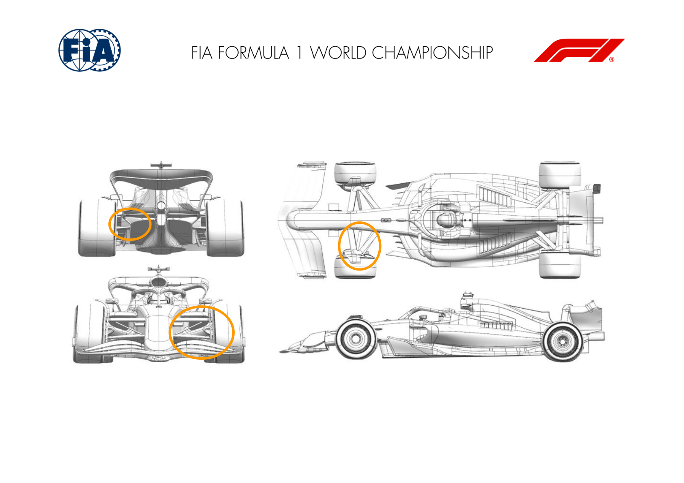
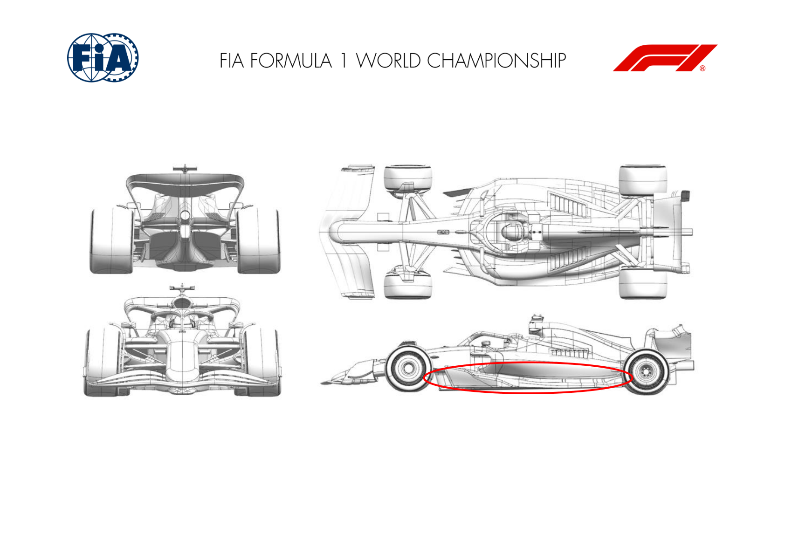
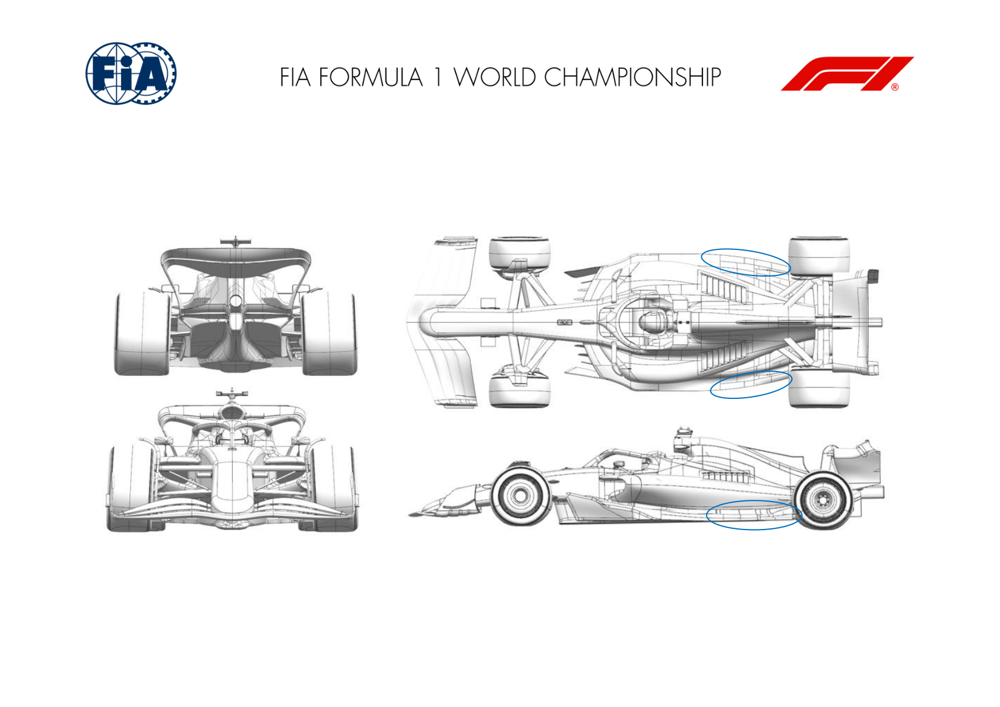
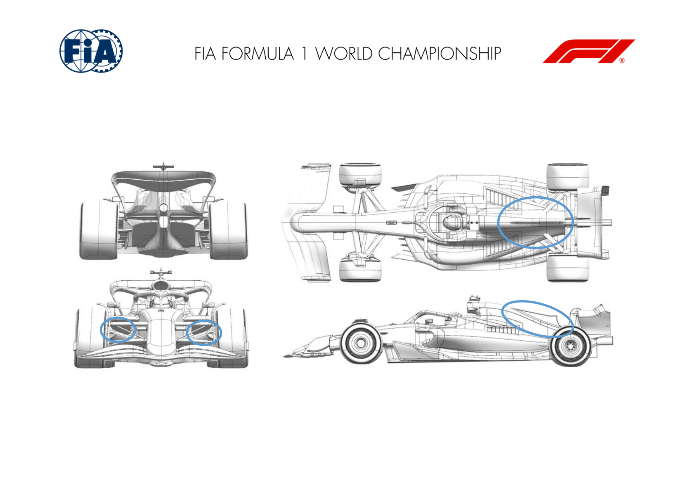
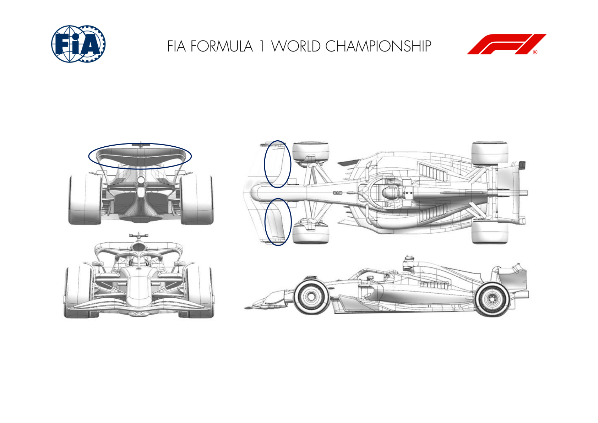
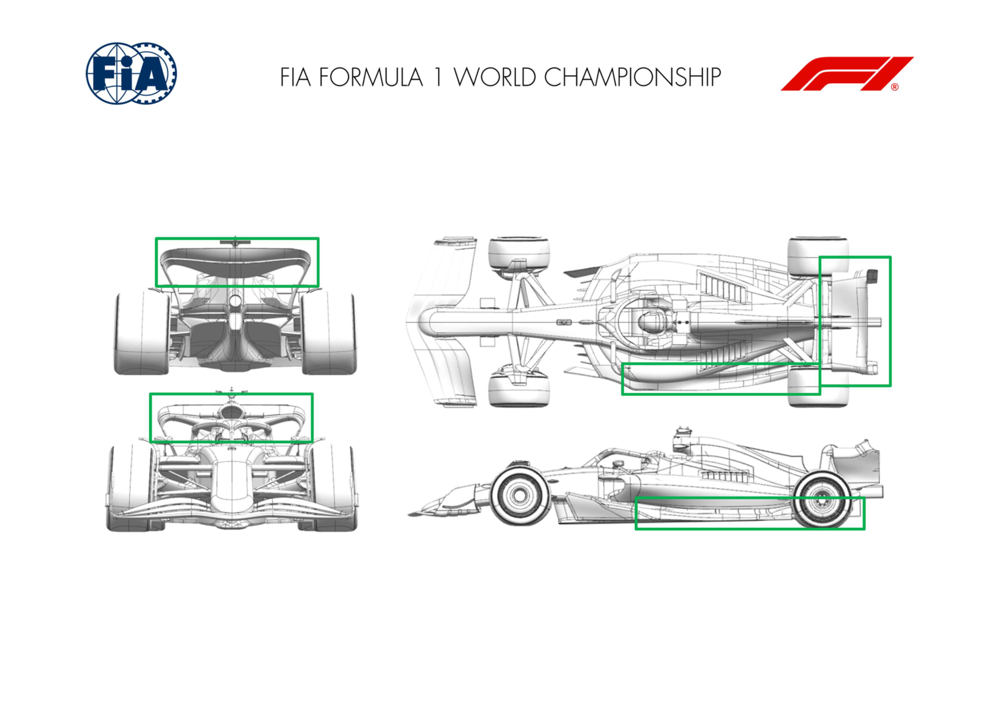

2025 AUSTRIAN GRAND PRIX

27 - 29 June 2025

From The FIA Formula One Media Delegate Document 9

To All Teams, All Officials Date 27 June 2025

Time 10:47

Title Car Presentation Submissions

Description Car Presentation Submissions

Enclosed 2025 Austrian Grand Prix - Car Presentation Submissions.pdf

Roman De Lauw

The FIA Formula One Media Delegate

Car Presentation – Austrian Grand Prix

McLaren Formula 1 Team

| No. | Updated component | Primary reason for update | Geometric differences | Description |
| --- | --- | --- | --- | --- |
| 1 | Front Suspension | Performance - Flow Conditioning | Updated Front Suspension | A revision to the Front Suspension fairings aiming at an overall improvement of flow conditioning which results in an aerodynamic performance gain. |
| 2 | Front Corner | Performance - Flow Conditioning | Modified Front Corner | Complementing the aforementioned Front Suspension changes, the aerodynamic devices on the front corner have been adopted to allow full exploitation of the flow conditioning improvements. |
| 3 | Rear Corner | Performance - Mechanical Setup | Revised Rear Corner | Alternative rear suspension geometry which requires a revision of rear corner aerodynamic surfaces to maintain clearances as well as aerodynamic performance. |

Car Presentation – Austrian Grand Prix

*SCUDERIA FERRARI HP*

| No. | Updated component | Primary reason for update | Geometric differences | Description |
| --- | --- | --- | --- | --- |
| 1 | Floor Fences | Performance Flow Conditioning | Redistribution of fences profiles / camber Not event specific, this floor package features updated front floor fences targeting an enhanced vorticity released downstream. The reshaped boat and tunnel expansion have been subsequently reoptimized, together with the floor edge loading and diffuser volume distribution, leading to an overall load gain across the car operating envelope. |  |
| 2 | Floor Body | Performance Flow Conditioning | Reshaped boat and tunnel expansion |  |
| 3 | Floor Edge | Performance Flow Conditioning | Shorter and re-cambered front floor edge wing |  |
| 4 | Diffuser | Performance Flow Conditioning | Redesigned diffuser volume |  |

Car Presentation – Austrian Grand Prix

Red Bull Racing

| No. | Updated component | Primary reason for update | Geometric differences | Description |
| --- | --- | --- | --- | --- |
| 1 | Floor Edge | Performance - Local Load | New surfaces with a vent ahead of the rear tyre | A new edge wing is being deployed intended to maintain the established flow stability and improve the load extracted from this region of the floor. |

Car Presentation – 2025 Austrian Grand Prix

*Mercedes-AMG PETRONAS F1 Team*

| No. | Updated component | Primary reason for update | Geometric differences | Description |
| --- | --- | --- | --- | --- |
| 1 | Front Corner | Circuit Specific – Cooling Range | Large brake duct inlet and exit. | Increased front brake duct inlet and exit area to cover off the high brake duty that we typically see at this circuit. |
| 2 | Coke/Engine Cover | Circuit Specific – Cooling Range | Large rear bodywork exit. | Increased bodywork exit area designed to increase mass flow through the sidepod radiator and hence provide the additional cooling required for this circuit. |

Car Presentation – Austrian Grand Prix

Aston Martin Aramco F1 Team

No updates submitted for this event.

Car Presentation – Austrian Grand Prix

BWT Alpine F1 Team

No updates submitted for this event.

Car Presentation – Austria Grand Prix

*MoneyGram Haas F1 Team*

No updates submitted for this event.

Car Presentation – Austrian Grand Prix

Visa Cash App Racing Bulls

| No. | Updated component | Primary reason for update | Geometric differences | Description |
| --- | --- | --- | --- | --- |
| 1 | Front Wing | Performance - Flow Conditioning | New front wing flap geometry. | The flap has been changed to improve local flow conditioning and help increase aerodynamic performance across a range of conditions. |
| 2 | Rear Wing | Circuit specific - Drag Range | Updated rear wing profiles. | The upper rear wing has been changed to meet the needs of the target downforce & efficiency level for the circuit. |

Car Presentation – Austrian Grand Prix

*ATLASSIAN WILLIAMS RACING*

No updates submitted for this event.

Car Presentation – Austrian Grand Prix

Stake F1 Team KICK Sauber

| No. | Updated component | Primary reason for update | Geometric differences | Description |
| --- | --- | --- | --- | --- |
| 1 | Floor Body | Performance - Local Load | Changes to mid floor area incl. outboard floor edge and diffuser. | Modifications are targeted at improved flow field conditions for the underfloor from front to back, gaining some efficient downforce. |
| 2 | Rear Wing | Performance - Local Load | New rear wing assembly. | New rear wing assembly suited for higher downforce tracks. Overall reshaped geometry with a more efficient load distribution. Covers a variety of tracks until the end of the season. |

