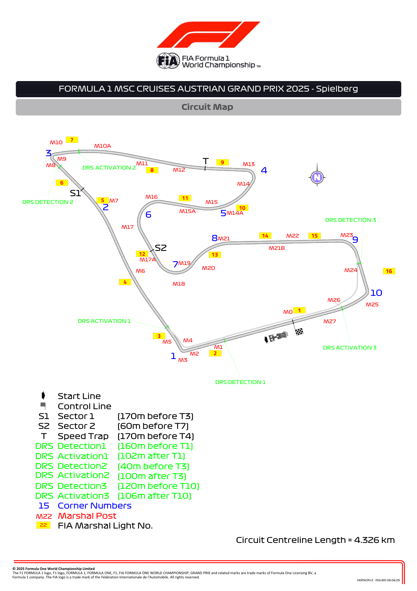
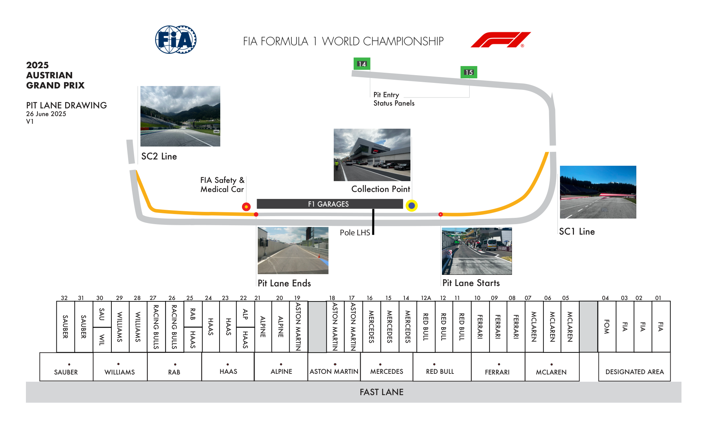
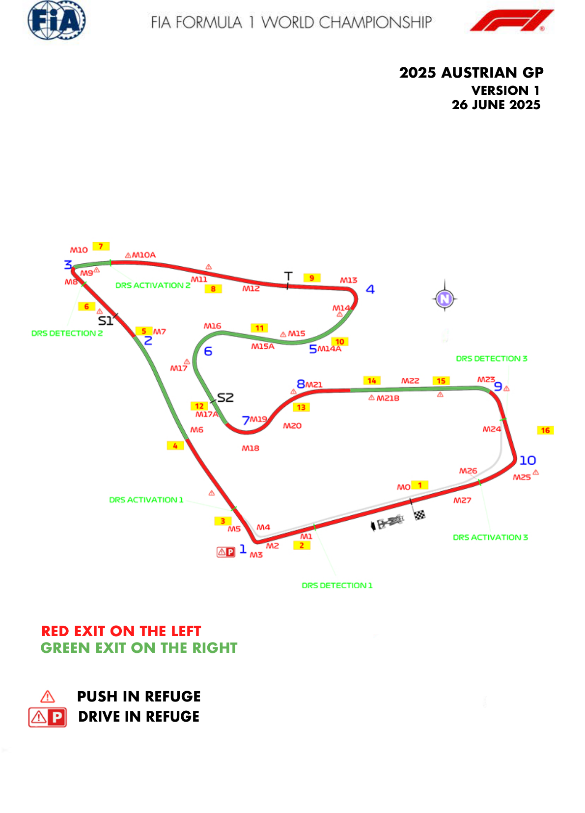
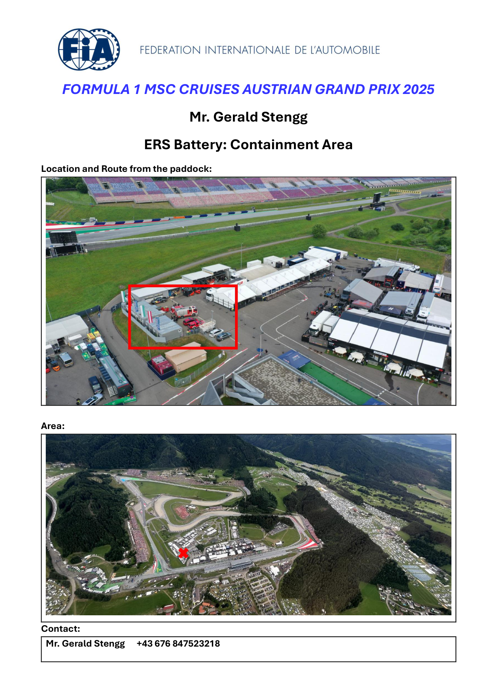
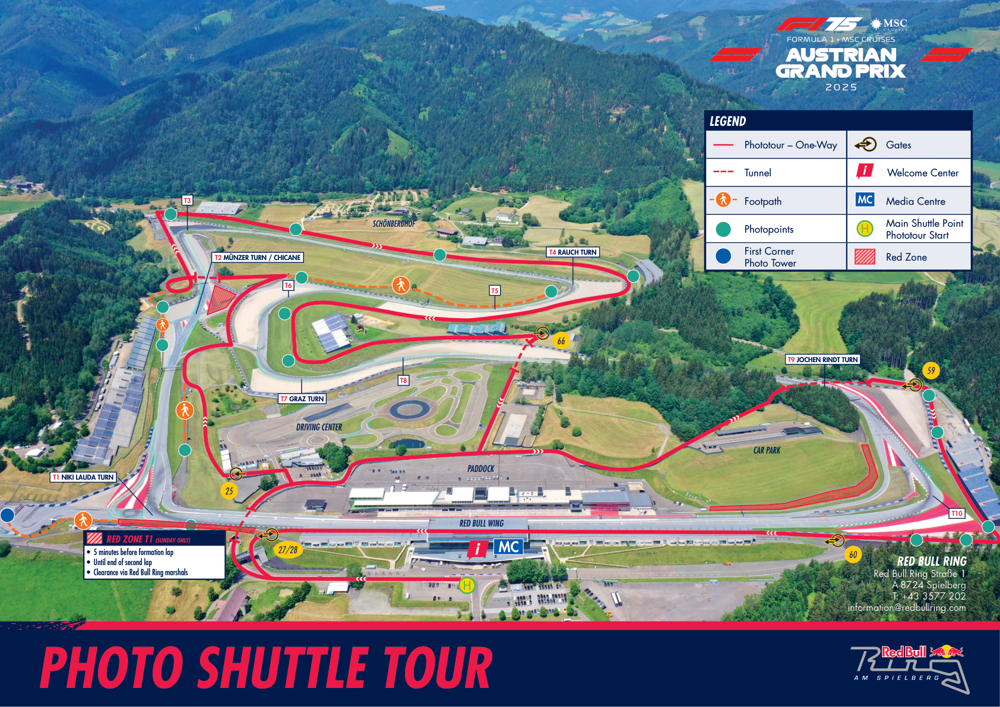

2025 AUSTRIAN GRAND PRIX

27 - 29 June 2025

From The FIA Formula One Race Director Document 6

To All Teams, All Officials Date 26 June 2025

Time 19:16

Title Event Notes - Circuit Map, Pit Lane, Emergency Exit Map, Quarantine Zone, Red Zones

Description Event Notes - Circuit Map, Pit Lane, Emergency Exit Map, Quarantine Zone, Red Zones

Enclosed Maps.pdf

Rui Marques

The FIA Formula One Race Director

