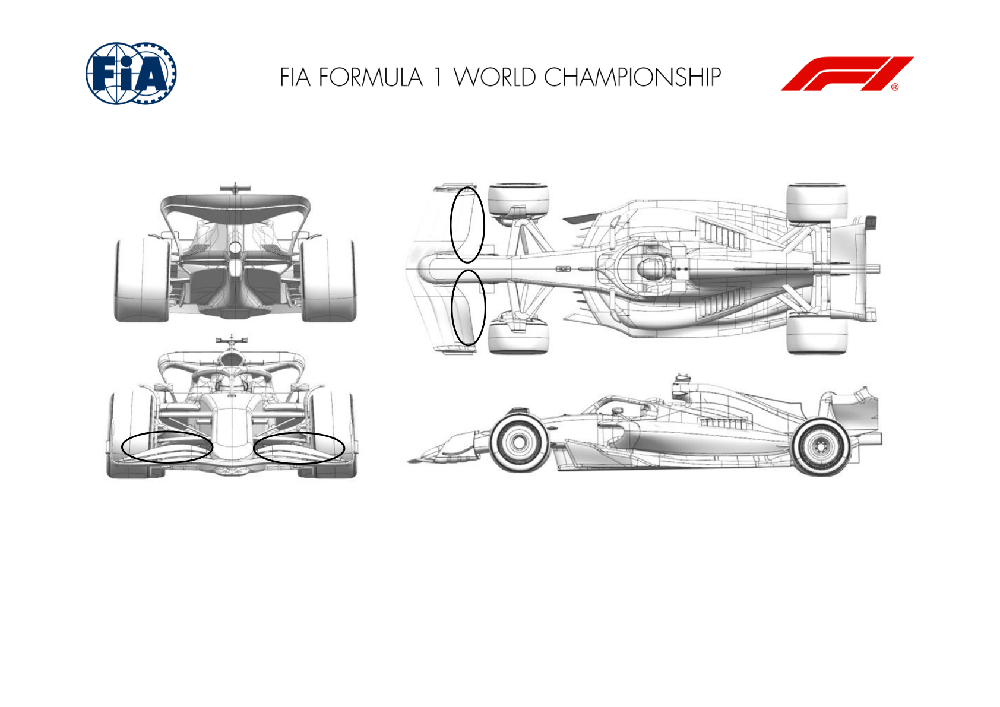
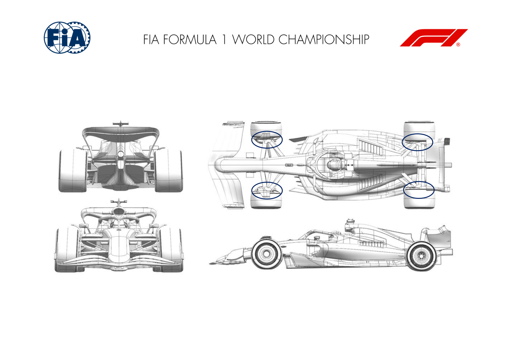

2025 AZERBAIJAN GRAND PRIX

19 - 21 September 2025

From The FIA Formula One Media Delegate Document 8

To All Teams, All Officials Date 19 September 2025

Time 09:45

Title Car Presentation Submissions

Description Car Presentation Submissions

Enclosed 2025 Azerbaijan Grand Prix - Car Presentation Submissions.pdf

Roman De Lauw

The FIA Formula One Media Delegate

Car Presentation – Azerbaijan Grand Prix

McLaren Formula 1 Team

No updates submitted for this event.

Car Presentation – Azerbaijan Grand Prix

*SCUDERIA FERRARI HP*

| No. | Updated component | Primary reason for update | Geometric differences | Description |
| --- | --- | --- | --- | --- |
| 1 | Front Corner | Circuit specific - Cooling Range | Enlarged front brake duct cooling exit | Increased front brake duct cooling exit area to cover off the high duty and requirements of the Baku City Circuit |

Car Presentation – Azerbaijan Grand Prix

Red Bull Racing

| No. | Updated component | Primary reason for update | Geometric differences | Description |
| --- | --- | --- | --- | --- |
| 1 | Rear corner | Performance - Local Load | Re-profiled inboard wing assembly | A mild revision achieved by modularity of the parts to implement a camber increase to the assembly for more local load whilst maintaining the flow stability. |

Car Presentation – 2025 Azerbaijan Grand Prix

*Mercedes-AMG PETRONAS F1 Team*

| No. | Updated component | Primary reason for update | Geometric differences | Description |
| --- | --- | --- | --- | --- |
| 1 | Front Wing | Performance – Local Load | Reduced chord front wing flap. | Reduced chord flap drops local front wing load to enable an appropriate car balance to be achieved with a low downforce rear wing. |

Car Presentation – Azerbaijan Grand Prix

Aston Martin Aramco F1 Team

No updates submitted for this event.

Car Presentation – Azerbaijan Grand Prix

BWT Alpine F1 Team

No updates submitted for this event.

Car Presentation – Baku Grand Prix

*MoneyGram Haas F1 Team*

No updates submitted for this event.

Car Presentation – Azerbaijan Grand Prix

Visa Cash App Racing Bulls

| No. | Updated component | Primary reason for update | Geometric differences | Description |
| --- | --- | --- | --- | --- |
| 1 | Front Corner | Circuit specific - Cooling Range | The geometry of the front brake duct has been updated. | The front brake duct has been modified to increase cooling flow to the front brakes, to suit the requirements of the circuit. |
| 2 | Rear Corner | Circuit specific - Cooling Range | The geometry of the rear brake duct has been updated. | The rear brake duct has been modified to increase cooling flow to the rear brakes, to suit the requirements of the circuit. |

Car Presentation – Azerbaijan Grand Prix

*ATLASSIAN WILLIAMS RACING*

No updates submitted for this event.

Car Presentation – Azerbaijan Grand Prix

Stake F1 Team KICK Sauber

No updates submitted for this event.
