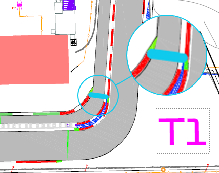
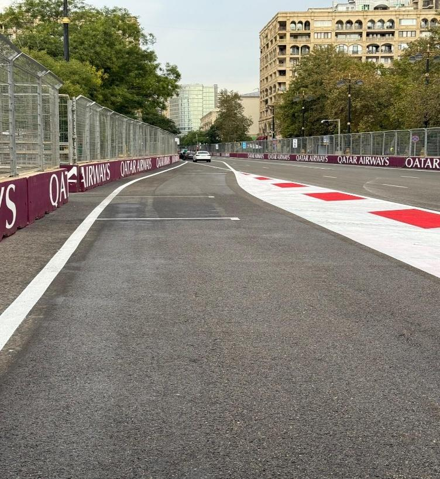
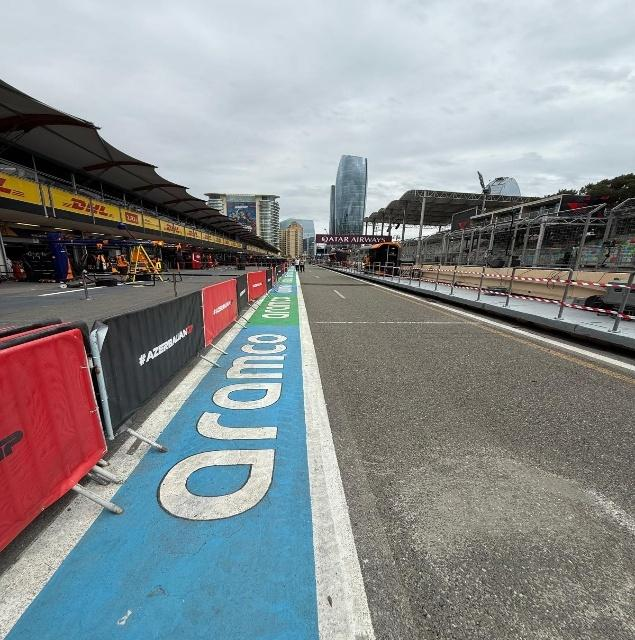
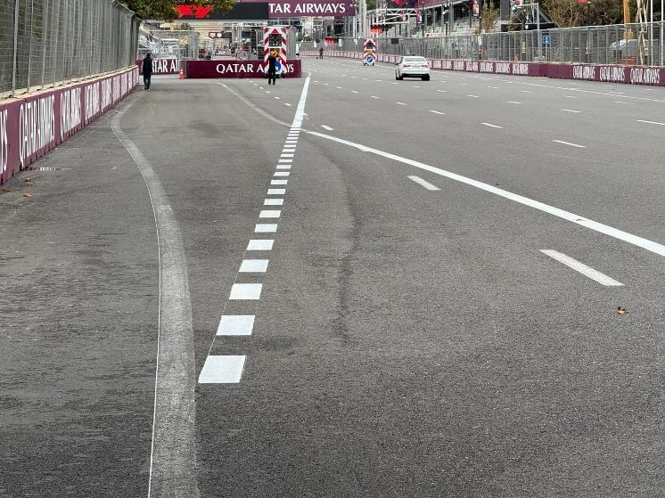

2025 AZERBAIJAN GRAND PRIX

19 - 21 September 2025

From The FIA Formula One Race Director Document 10

To All Teams, All Officials Date 19 September 2025

Time 11:34

Title Race Director's Event Notes V2

Description Race Director's Event Notes V2

Enclosed 2025 Azerbeijan Grand Prix Event Notes V2.pdf

Rui Marques

The FIA Formula One Race Director

2025 A G P ZERBAIJAN RAND RIX

19 – 21 September 2025

From The FIA Formula One Race Director

To All Officials, All Teams Date 19 September 2025

EVENT NOTES V2 General Instructions

1. Laps during Qualifying and Reconnaissance Lap(s), In order to ensure that cars are not driven unnecessarily slowly on in laps during and after the end Qualifying or during reconnaissance laps when the pit exit is opened for the Race, drivers must stay below the maximum time set by the FIA between the Safety Car lines shown on the pit lane map. Teams and Drivers will be informed of the maximum time after the Second Practice Session. For the safe and orderly conduct of the Event, other than in exceptional circumstances accepted as such by the Stewards, any driver that exceeds the maximum time from the Second Safety Car Line to the First Safety Car Line on ANY lap during and after the qualifying session, including in- laps and out-laps or during reconnaissance laps when the pit exit is opened for the race, may be deemed to be going unnecessarily slowly. For the avoidance of doubt, this does not supersede Article 33.4 and Article 37.5 of the FIA Formula One Sporting Regulations, which apply to the entire Circuit, furthermore this includes the pit lane as well. Incidents will normally be investigated after the Qualifying session or the Race.

2. Parc Fermé

The Parc Fermé cameras must be always uncovered and operational during the Event.

3. Lapping during the Race

The ISC requires drivers who are caught by another car to allow the faster driver past at the first available opportunity. The F1 marshalling system will be set to give a pre-warning when the faster car is within 3.0s of the car about to be lapped, this should be used by the team of the slower car to warn their driver he is soon going to be lapped and that allowing the faster car through should be considered a priority. When the faster car is within 1.2s of the car about to be lapped blue light panels will be shown to the slower car (in addition to blue light panels, blue cockpit lights and a message on the timing monitors) and the driver must allow the following driver to overtake at the first available opportunity.

4. Article 55.15 SR

“In order to avoid the likelihood of accidents before the safety car returns to the pits, from the point at which the lights on the car are turned out drivers must proceed at a pace which involves no erratic acceleration or braking nor any manoeuvre which is likely to endanger other drivers or impede the restart”.

1

5. ERS safety check after covers off In accordance with the provisions of Article 40.2 k of the Sporting Regulations, as work required by the Technical Delegate; Each morning, immediately after covers are removed when the cars are under parc fermé conditions (Articles 40.7 & 40.8), all Teams must connect the umbilical to their cars and start a telemetry data logging for the sole purpose of checking the car ERS safety status.

6. Pit Lane Safety Art. 26.3 of the Sporting Regulations states: “Save where these Sporting Regulations require

otherwise, pit lane and track discipline and safety measures will be the same for all Free Practice

sessions, the Qualifying session as for the Race.” Additionally, Article 34.13 of the Sporting

Regulations states: “Team personnel are only allowed in the pit lane immediately before they are

required to work on a car and must withdraw as soon as the work is complete.”

For the safe and orderly conduct of the event, in the context of the race only, the requirements of

Article 34.13 are considered to apply until such time as all cars able to do so have completed the

Race and have entered the designated Parc Ferme area. Following the end-of-session signal,

described in Article 59.1, and when the Race Director considers it safe to do so, the message “ALL

PASS HOLDERS MAY ACCESS THE PIT LANE” will be sent to all competitors using the official

messaging system; this being the signal to all competitors that the requirements of Article 34.13

are no longer applicable, and thus holders of passes not valid for access to the Pit Lane (i.e. passes

other than those marked “Pit Lane” or “Pit Lane All Times”) may enter the pit lane.

Competitors are reminded that in accordance with the International Sporting Code, Article 9.15.1

“The Competitor shall be responsible for all acts or omissions on the part of any person taking part

in, or providing a service in connection with, a Competition or a Championship on their behalf,

including in particular their employees, direct or indirect, their Drivers, mechanics, consultants,

service providers, or passengers, as well as any person to whom the Competitor has allowed

access to the Reserved Areas.

7. Lap times in each Practice Session, Qualifying and Race Only lap times which have been completed on the track will be included for the purpose of any classification.

8. Finishing the Race For the purpose of finishing the Race, pursuant to Article 59.1 of the FIA Formula One Sporting Regulations, the “Line” referred to will be the Control Line on the track and not in the Pit Lane.

Event Specific Instructions

9. Marshalling System 9.1 A car entering the Pit Lane will be subject to the marshalling state (i.e. yellow flag or double yellow flag) of the associated sector until it passes the blue line marked on the image below.

2

9.2 A car leaving the Pit Lane will be subject to the marshalling system state i.e. yellow flag or double yellow flag of the sector into which it is emerging after it passes the blue line marked on the image below.

10. FIA Outside Scales Times Should the outside scales be set up at the pit-lane entrance, these will be available for teams to use at any time outside the curfew times and the Parc Fermé cover-up times, except for the 30 minutes preceding the start of the Qualifying session and if there are support competitions using the pit lane.

11. Specific Technical Procedures

Please note that the FIA have introduced an Appendix Index File which contains all the relevant and active Appendix documents, Technical and Sporting Directives. The latest version of this Index file (“2025 Formula 1 Appendix – iss 11 – 2025-06-30.xlsx”) and all relevant documents can be found on the FIA SFTP site.

Competitors are hereby required to ensure compliance with these directives for the safe and orderly conduct of the Event.

12. Support Races team barrier placement and movements Team barrier placement prior to and during all support category practice sessions and races: No more than four (4) meters from the garages. Please ensure that your pit stop gantry arms are moved back towards the garage during all support category activities. It is not permitted to push cars to the weighing area at any time a support category is in the pit lane. Support Crews and Trolleys will be released into Pit Lane no earlier than 20 minutes prior to the opening of Pit Exit for their respective sessions. Support Category competition vehicles will be released from the marshalling area no earlier than 15 minutes prior to the opening of Pit Exit for their respective sessions.

3

13. Practice starts 13.1 During Free Practice sessions and Reconnaissance Laps, practice starts may be carried out in the pit exit road on the left-hand side using one of the painted grid boxes shown in the image below. Cars queuing to perform a practice must keep to the left-hand side of the Pit Exit Road to allow sufficient space for cars not wishing to do a practice start to pass. Cars NOT wishing to perform a practice start may overtake any car queuing to do a practice start but may not cross (refer to Chapter IV article 6c of the appendix L of the ISC) the white line adjacent to the track edge. (as highlighted in the image bellow with a blue arrow). 13.2 For the avoidance of doubt, practice starts may not be carried out during Qualifying Sessions. (the pit exit white line on the RHS will be painted tonight).

13.3 Practice starts after each Free Practice will be performed according to Article 38.3 of the Sporting Regulations. 13.4 If any Free Practice session is resumed with less than 2 minutes remaining, for the purpose of facilitating practice starts on the grid as provided for in Article 38.3 of the Sporting Regulations, any car wishing to leave the pit lane must proceed down the pit lane without undue delay and exit the pit lane without leaving a significant gap to the car ahead.

14. Article 34.8 SR (…) Any car(s) driven to the end of the pit lane prior to the start or re-start of a Free Practice session or Qualifying session must form up in a line in the fast lane and leave in the order they got there (…) It is noted that a car will be considered to be “in the fast lane” when a tyre has crossed the solid white line separating the fast lane from the inner lane, in this context crossing means that all of a tyre should be beyond the far side, with respect to the garages, of the line separating the fast lane from the inner lane.

4

For the avoidance of doubt, ISC Appendix L, Chapter IV, Article 5b) states that: Once a car has left its garage or pit stop position it should blend into the fast lane as soon as it is safe to do so, and without unnecessarily impeding cars which are already in the fast lane. Thus, after the start or re-start of a Free Practice session or Qualifying session, if there is a suitable gap in a queue of cars in the fast lane, such that a driver can blend into the fast lane safely and without unnecessarily impeding cars already in the fast lane, they are free to do so. Furthermore, it is noted that during a Free Practice session and Qualifying session a car driving in the inner lane, parallel to the fast lane, will not be considered to have blended into the fast lane at the earliest opportunity. Additionally, ISC Appendix L, Chapter IV, Article 5d) states that: Cars in either the fast lane or working lane may not overtake other cars in the fast lane except in exceptional circumstances. In this context a “stopped car” is one which has an obvious mechanical problem.

15. Lines at the Pit Entry and Pit Exit 15.1 In accordance with Chapter 4, Articles 4 and 6 of Appendix L to the ISC drivers must follow the procedures at pit entry and pit exit. 15.2 After SC line 2, there is a continuous white line separating the cars coming from the pits from the cars on the track. For safety reasons, drivers leaving the pits, must stay to the left right of the aforementioned line. 15.3 Pertaining to Chapter 4, Article 4 of Appendix L to the ISC any driver passing on the left hand side of the junction of the dashed white line to the solid white line (as the image bellow) at the pit entry road will be considered as entering the pit lane

5

15.4 During the reconnaissance laps prior to the race drivers are allowed to cross the white line separating the Pit Exit road from the circuit.

16. Stopping Qualifying Sessions For the safe and orderly conduct of the event, should any period of the Qualifying Session be stopped with less than 100 seconds remaining, the Race Director with the agreement of the Stewards may decide that the relevant period of the qualifying session will not be resumed, i.e. that part of the competition will be stopped.

17. Post-Qualifying drivers weighing Any driver who finished participating in the Qualifying Sessions after Q1 and Q2 must proceed through the pit lane directly to the FIA scales immediately after they have returned to their team’s garage. The drivers may not drink anything or do anything which increases their weight before it is recorded by the FIA. Any driver who stops on the track during the Qualifying sessions and is not required to visit the Medical Centre, must proceed to the FIA scales to get his weight recorded before returning to his team. Drivers who finish within the top 10 must proceed to the FIA scales immediately when out of their cars without contact with any other person.

18. DRS during all Free Practice sessions and the race DRS Detection will be automatically disabled in each individual zone if any of the light panels in that zone are displaying yellow.

The zone and corresponding light panels are as follows: a) DRS activation 1: 3, 4, 5 b) DRS activation 2: 20, 21,1, 2 19. DRS during the qualifying sessions DRS Detection will be automatically disabled in each individual zone if any of the light panels in that zone are displaying yellow.

The zone and corresponding light panels are as follows: c) DRS activation 1: 3, 4, 5 d) DRS activation 2: 20, 21, 1

20. Track Limits 20.1 In accordance with the provisions of Article 33.3 of the Sporting Regulations, the white lines define the track edges. During Qualifying and the Race, each time a driver fails to negotiate with the track limits, this will result in that lap time being invalidated by the Stewards.

21. Unsafe or Unknown ERS Status If the status of the ERS changes to unsafe or unknown, the relevant team will be required to send mechanics to the pit entry area near race control. They will then be picked up by car to be brought to their car after the session.

22. Leaving the garage before and during all Practice Sessions 22.1 Before the start of a Practice Session or qualifying session no cars may enter the pit lane to proceed to pit exit until 5 minutes before the start of the session. 22.2 If the Free Practice Session or Qualifying Session is suspended, cars may only enter the Fast Lane after the re-start time is confirmed via the official messaging system.

23. Fire extinguishers around the circuit Indicated by white boards with a red fire extinguisher attached to the debris fences.

24. Places to remove cars from the track Indicated by fluorescent orange panels/paintings on the barriers.

6

25. Removing cars from the grid Cars may be removed from the grid through the gates adjacent to grid position 1 and position 15.

26. Race Suspension or Starting Procedure Suspended In case of race suspension or starting procedure suspended, (except in case of Article 57.2 – stopping on the grid), cars will be stopped in the fast lane with the first car stopped in the vicinity of the last team garage.

27. Car number light panels for the start On the left-hand side of the grid.

28. Changes to the Circuit A few resurfacing patches work:

- From Turn 2 to Turn 3 mainly on the LHS

- Before Turn 4 LHS

- Between Turn 7 and Turn 8 on the LHS

- Turn 12 RHS.

- Turn 14 LHS.

- Between Turn 14 and Turn 15 on the LHS

- Turn 18 LHS.

- Realignment of the TecPro barrier at the exit of Turn 1 RHS

29. Light panels: In case of an incident, the yellow and double yellow light panel will be mirrored on the following panels:

• Panel 8 will be mirrored on panel 7.

• Panel 11 will be mirrored on panel 10.

30. FP1 and FP2 Marshalling System Test Active Test(s):

At the end of FP1, once the last car on track has completed its’ practice start in accordance with

Article 38.3 and crossed the Line:

1. The Virtual Safety Car (VSC) state will be set. This state will remain for approximately 30

seconds.

2. Following the VSC, the Safety Car Deployed state will be set for approximately 30 seconds.

(NB There is no intent to physically deploy the SC in this case.)

3. Following the SC Deployed state, a Red Flag will be displayed.

At the end of FP2, once the last car on track has completed its’ practice start in accordance with

Article 38.3 and crossed the Line:

1. The Safety Car Deployed state will be set. This state will remain for approximately 30

seconds. (NB There is no intent to physically deploy the SC in this case)

2. Following the SC deployed state, the Virtual Safety Car (VSC) state will be deployed. This

will remain for approximately 30 seconds.

3. Following the VSC state, a Red Flag will be displayed.

All drivers must respect the VSC Delta, SC Delta or Red Flag Delta should they encounter it, and

proceed into the pit lane as required by Art. 38.2.

Background Test(s):

Additionally for information only, after the chequered flag in FP1 during the practice start period, in

coordination with Motion Applied and F1, the FIA will be disabling the on-car signal for the control

line loop and main pit entry loop, as well as powering down the relevant lap triggers. This is being

done to functionally test the backup main control line and pit entry loops in preparation for 2026

introduction. This test does not affect any official timing.

7

Rui Marques

The FIA Formula One Race Director

8
