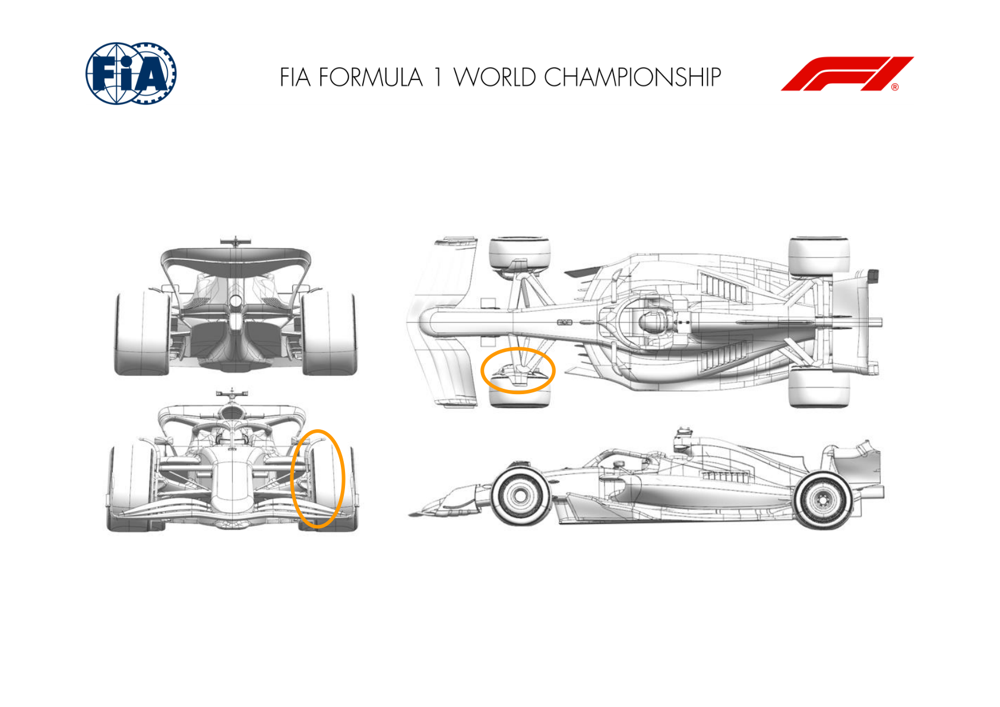
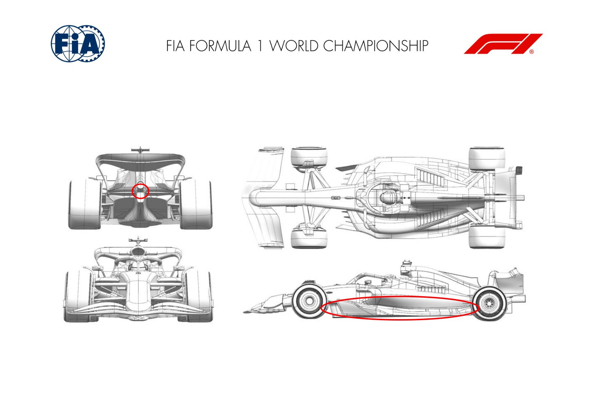
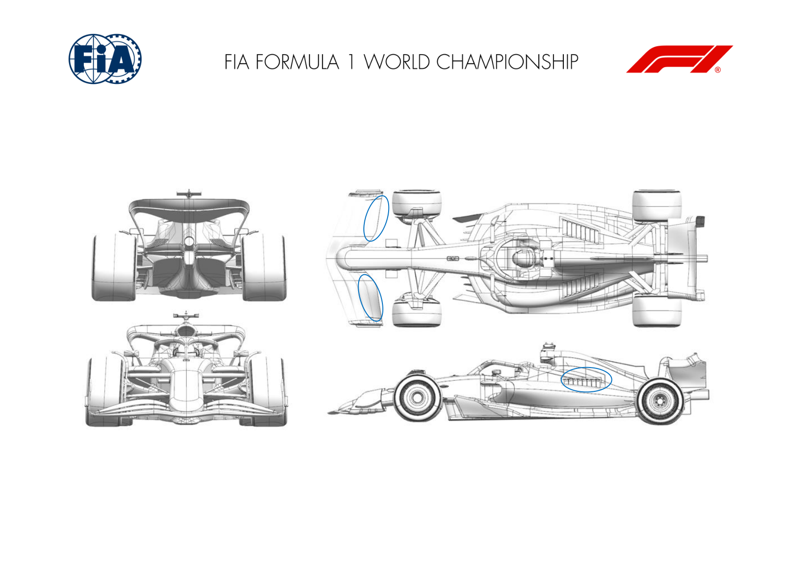
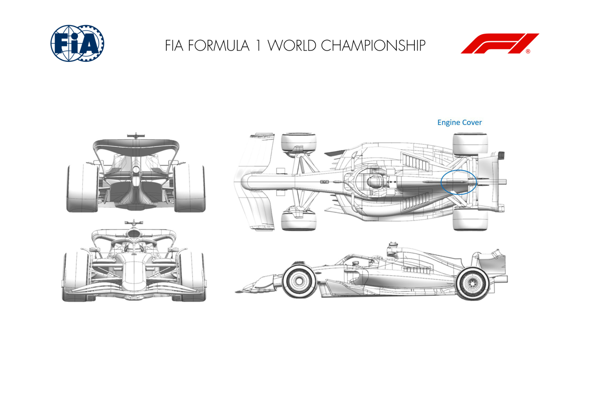

2025 BAHRAIN GRAND PRIX

11 - 13 April 2025

From The FIA Formula One Media Delegate Document 10

To All Teams, All Officials Date 11 April 2025

Time 11:46

Title Car Presentation Submissions

Description Car Presentation Submissions

Enclosed 2025 Bahrain Grand Prix - Car Presentation Submissions.pdf

Cameron Kelleher

The FIA Formula One Media Delegate

Car Presentation – Bahrain Grand Prix

McLaren Formula 1 Team

| No. | Updated component | Primary reason for update | Geometric differences | Description |
| --- | --- | --- | --- | --- |
| 1 | Front Corner | Performance - Flow Conditioning | New Front Brake Duct Winglet | A new Front Brake Duct Winglet geometry has been developed aiming at better flow conditioning, resulting in an improvement of overall aerodynamic performance. |

Car Presentation – Bahrain Grand Prix

*SCUDERIA FERRARI HP*

| No. | Updated component | Primary reason for update | Geometric differences | Description |
| --- | --- | --- | --- | --- |
| 1 | Floor Fences | Performance - Flow Conditioning | Redistribution of fences profiles / camber Not event specific, this floor package features updated front floor / fences targeting an improvement of the losses travelling downstream. The reshaped boat and tunnel expansion have been subsequently reoptimized, together with the floor edge loading and vorticity shedding into the diffuser |  |
| 2 | Floor Body | Performance - Flow Conditioning | Reshaped front floor leading edge and tunnel expansion |  |
| 3 | Floor Edge | Performance - Flow Conditioning | Extended front floor edge wing and reprofiling |  |
| 4 | Diffuser | Performance - Flow Conditioning | Redesigned diffuser expansion |  |
| 5 | Rear Wing | Performance - Local Load | Pillar winglet update | As for the floor, this upgrade is not event specific and aims at a minor improvement of car aerodynamic efficiency |

Car Presentation – Bahrain Grand Prix

Red Bull Racing

| No. | Updated component | Primary reason for update | Geometric differences | Description |
| --- | --- | --- | --- | --- |
| 1 | Front Wing | Performance - Local Load | New longer chord flap | By extending the chord, the wing load potential is lifted giving more scope to attain the targeted aerobalance with the suite of rear wings available. |
| 2 | Cooling Louvres | Cooling | Increased span of louvres | The forecast ambient conditions have necessitated deployment of the wider louvre panels to give the car sufficient cooling capacity for all fluid circuits. |

Car Presentation – 2025 Bahrain Grand Prix

*Mercedes-AMG PETRONAS F1 Team*

No updates submitted for this event.

Car Presentation – Bahrain Grand Prix

Aston Martin Aramco F1 Team

No updates submitted for this event.

Car Presentation – Bahrain Grand Prix

BWT Alpine F1 Team

No updates submitted for this event.

Car Presentation – 2025 Bahrain Grand Prix

MONEYGRAM HAAS F1 TEAM

| No. | Updated component | Primary reason for update | Geometric differences | Description |
| --- | --- | --- | --- | --- |
| 1 | Coke/Engine Cover | Circuit specific - Cooling Range | Wider Engine Cover centre exit | The Engine cover centre exit was enlarged to allow more heat expulsion. This is an option which will only be used in case specific requirement. |

Car Presentation – Bahrain Grand Prix

Visa Cash App Racing Bulls

No updates submitted for this event.

Car Presentation – Bahrain Grand Prix

*Atlassian Williams Racing*

No updates submitted for this event.

Car Presentation – Bahrain Grand Prix

Stake F1 Team KICK Sauber

No updates submitted for this event.
