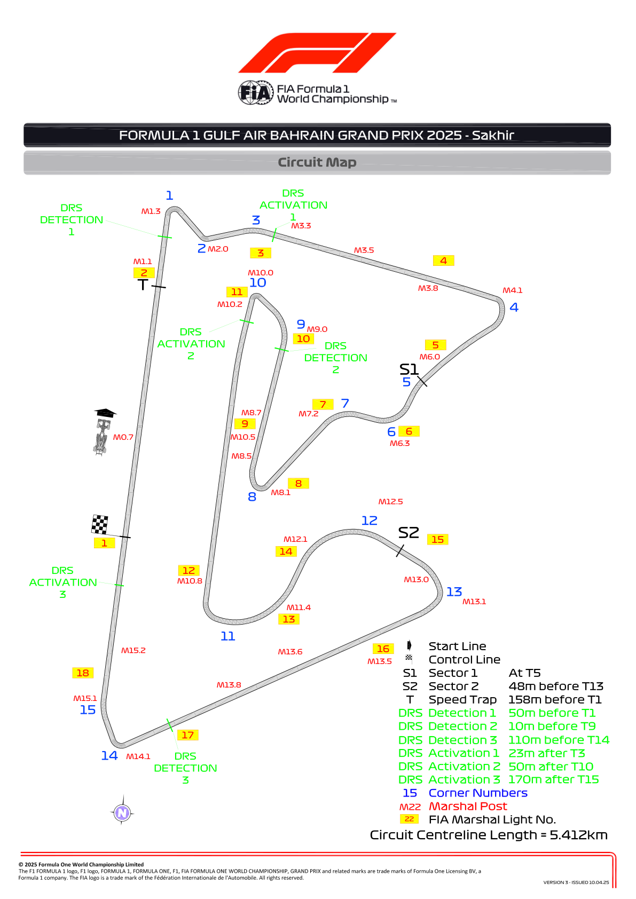
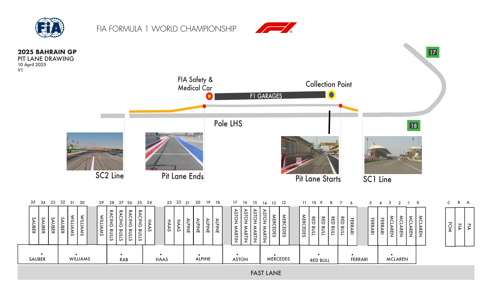
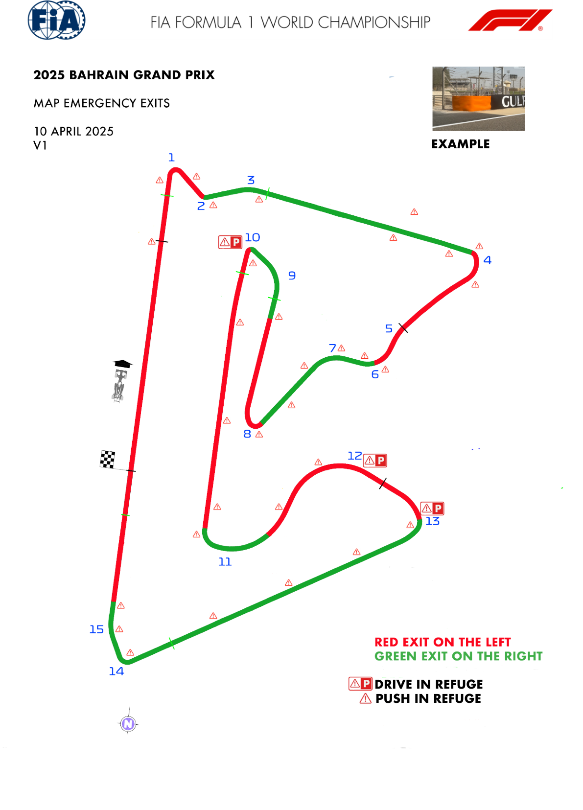
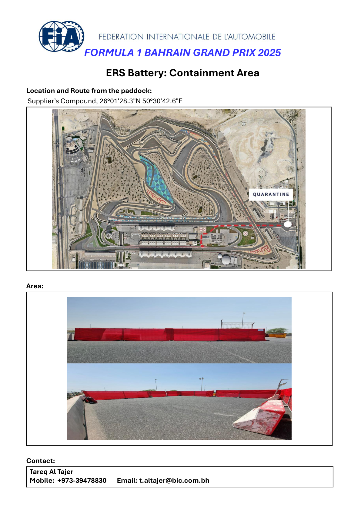
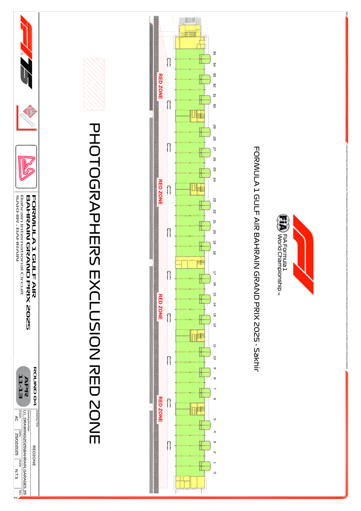

2025 BAHRAIN GRAND PRIX

11 - 13 April 2025

From The FIA Formula One Race Director Document 5

To All Teams, All Officials Date 10 April 2025

Time 18:29

Title Event Notes - Circuit Map, Pit Lane, Quarantine Zone and Red Zones

Description Event Notes - Circuit Map, Pit Lane, Quarantine Zone and Red Zones

Enclosed Maps.pdf

Rui Marques

The FIA Formula One Race Director

