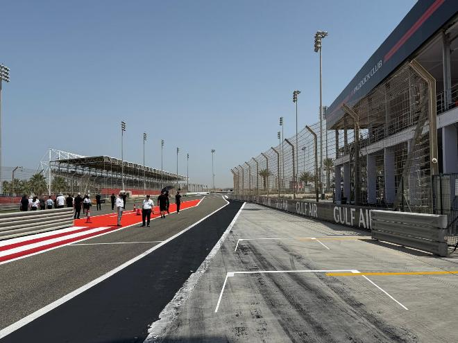
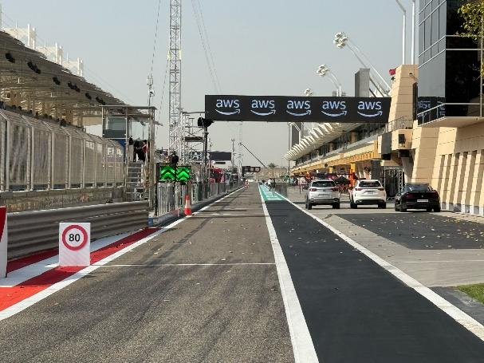
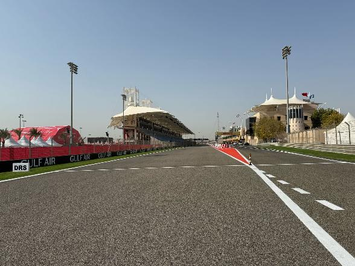
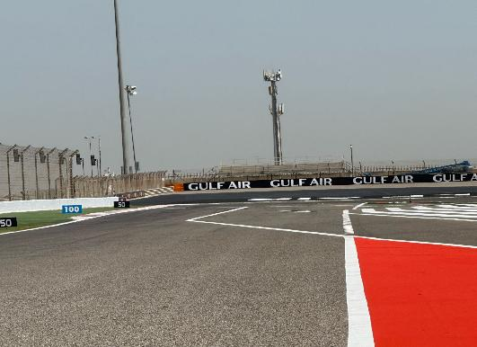

2025 BAHRAIN GRAND PRIX

11 - 13 April 2025

From The FIA Formula One Race Director Document 3

To All Teams, All Officials Date 10 April 2025

Time 15:57

Title Race Director's Event Notes

Description Race Director's Event Notes

Enclosed 2025 Bahrain Grand Prix Event Notes.pdf

Rui Marques

The FIA Formula One Race Director

2025 B G P AHRAIN RAND RIX

11 – 13 April 2025

From The FIA Formula One Race Director

To All Officials, All Teams Date 10 April 2025

EVENT NOTES General Instructions

1) Observing yellow flags

1.1 Single waved: Drivers reduce their speed and be prepared to change direction. It must be clear that a driver has reduced speed and, in order for this to be clear, a driver would be expected to have braked earlier and/or discernibly reduced speed in the relevant marshalling sector.

1.2 Double waved: Any driver passing through a double waved yellow marshalling sector must reduce speed significantly and be prepared to change direction or stop. In order for the stewards to be satisfied that any such driver has complied with these requirements it must be clear that he has not attempted to set a meaningful lap time. Furthermore, during qualifying, any driver in a double yellow sector will have that lap time cancelled.

1.3 Double Waved during VSC or SC: Any driver passing through a double waved yellow marshalling sector during a VSC or SC, in addition to the requirements in 1.2 above, must remain positive of the SECU delta time in the sector concerned.

2) Laps during Qualifying and Reconnaissance Lap(s),

In order to ensure that cars are not driven unnecessarily slowly on in laps during and after the end of qualifying or during reconnaissance laps when the pit exit is opened for the race, drivers must stay below the maximum time set by the FIA between the Safety Car lines shown on the pit lane map.

Teams and Drivers will be informed of the maximum time after the first practice session.

For the safe and orderly conduct of the Event, other than in exceptional circumstances accepted as such by the Stewards, any driver that exceeds the maximum time from the Second Safety Car Line to the First Safety Car Line on ANY lap during and after the end of the qualifying session, including in-laps and out-laps or during reconnaissance laps when the pit exit is opened for the race, may be deemed to be going unnecessarily slowly. For the avoidance of doubt, this does not supersede Article 33.4 and Article 37.5 of the FIA Formula One Sporting Regulations, which apply to the entire Circuit, furthermore this includes the pit lane as well. Incidents will normally be investigated after the qualifying session or the race.

3) Parc Fermé

The Parc Fermé cameras must be always uncovered and operational during the Event.

4) Lapping during the Race

The ISC requires drivers who are caught by another car to allow the faster driver past at the first available opportunity. The F1 marshaling system will be set to give a pre-warning when the faster car is within 3.0s of the car about to be lapped, this should be used by the team of the slower car to warn their driver he

1

is soon going to be lapped and that allowing the faster car through should be considered a priority. When the faster car is within 1.2s of the car about to be lapped blue light panels will be shown to the slower car (in addition to blue light panels, blue cockpit lights and a message on the timing monitors) and the driver must allow the following driver to overtake at the first available opportunity.

5) Article 55.15

“In order to avoid the likelihood of accidents before the safety car returns to the pits, from the point at which the lights on the car are turned out drivers must proceed at a pace which involves no erratic acceleration or braking nor any manoeuvre which is likely to endanger other drivers or impede the restart”.

6) ERS safety check after covers off In accordance with the provisions of Article 40.2 k of the Sporting Regulations, as work required by the Technical Delegate; Each morning, immediately after covers are removed when the cars are under parc fermé conditions (Articles 40.7 & 40.8), all Teams must connect the umbilical to their cars and start a telemetry data logging for the sole purpose of checking the car ERS safety status. Event Specific Instructions

7) FIA Outside Scales Times Should the outside scales be set-up at the pit-lane entrance, these will be available for teams to use at any time outside the curfew times and the Parc Fermé cover-up times, except for the 30 minutes preceding the start of the Sprint Qualifying session or Qualifying session and if there are support competitions using the pit lane.

8) Specific Technical Procedures

Please note that the FIA have introduced an Appendix Index File which contains all the relevant and active Appendix documents, Technical and Sporting Directives. The latest version of this Index file (“2025 Formula 1 Appendix – iss 4 – 2025-03-03.xlsx”) and all relevant documents can be found on the FIA SFTP site.

Competitors are hereby required to ensure compliance with these directives for the safe and orderly conduct of the Event.

9) Support Races team barrier placement and Movements only for F2 and F3 Team barrier placement prior to and during all support category practice sessions and races: No more than (4) four meters from the garages.

Please ensure that your pit stop gantry arms are moved back towards the garage during all support category activities.

It is not permitted to push cars to the weighing area at any time a support category is in the pit lane.

Support Crews and Trolleys will be released into Pit Lane no earlier than 20 minutes prior to the opening of Pit Exit for their respective sessions.

Support Category competition vehicles will be released from the marshalling area no earlier than 15 minutes prior to the opening of Pit Exit for their respective sessions.

2

10) Practice starts

10.1 During free practice sessions and any time, the pit exit is open for the race, practice starts may only be carried out on the concrete apron area on the RHS of the fast lane using one of the painted grid boxes. For the avoidance of doubt, practice starts may not be carried out during Qualifying Sessions.

10.2 Practice starts after each free practice will be done according to article 38.3 of Sporting Regulations.

10.3 If any free practice is resumed with less than 2 minutes remaining, for the purpose of facilitating practice starts on the grid as provided for in Article 38.3 of the Sporting Regulations, any car wishing to leave the pit lane must proceed down the pit lane and the pit exit road without undue delay and without leaving a significant gap to the car ahead.

11) Article 34.8 SR

(…) Any car(s) driven to the end of the pit lane prior to the start or re-start of a free practice session, qualifying session must form up in a line in the fast lane and leave in the order they got there (…)

It is noted that a car will be considered to be “in the fast lane” when a tyre has crossed the solid white line separating the fast lane from the inner lane, in this context crossing means that all of a tyre should be beyond the far side, with respect to the garages, of the line separating the fast lane from the inner lane.

For the avoidance of doubt, ISC Appendix L, Chapter IV, Article 5b) states that:

Once a car has left its garage or pit stop position it should blend into the fast lane as soon as it is safe to do so, and without unnecessarily impeding cars which are already in the fast lane.

Thus, after the start or re-start of a free practice session, qualifying session, if there is a suitable gap in a queue of cars in the fast lane, such that a driver can blend into the fast lane safely and without unnecessarily impeding cars already in the fast lane, they are free to do so.

Furthermore, it is noted that during a free practice session and qualifying session a car driving in

3

the inner lane, parallel to the fast lane, will not be considered to have blended into the fast lane at the earliest opportunity.

Additionally, ISC Appendix L, Chapter IV, Article 5d) states that:

Cars in either the fast lane or working lane may not overtake other cars in the fast lane except in exceptional circumstances.

In this context a “stopped car” is one which has an obvious mechanical problem.

12) Lines at the Pit Entry and Pit Exit

12.1 In accordance with Chapter 4, Article 4 and 6 of Appendix L to the ISC drivers must follow the procedures at pit entry and pit exit.

12.2 Pertaining to Chapter 4, Article 4 of Appendix L to the ISC any driver passing to the right hand side of the bollard at pit entry will be considered as entering the pit lane.

12.3 During the reconnaissance laps prior to the race drivers are allowed to cross the white line separating the pit exit road from the circuit after crossing the dotted white line in the pit exit road.

13) Stopping Qualifying Sessions

For the safe and orderly conduct of the event, should any period of the qualifying session be stopped with less than 90 seconds remaining, the race director with the agreement of the stewards may decide that the relevant period of the qualifying session will not be resumed, i.e. that part of the competition will be stopped.

14) Post-Qualifying drivers weighing

Any driver who finished participating in the qualifying sessions after Q1 and Q2 must proceed through the pit lane directly to the FIA scales immediately after they have returned to their team’s garage. The drivers may not drink anything or do anything which increases their weight before it is recorded by the FIA. Any driver, who stops on the track during the sprint qualifying sessions or qualifying sessions and is not required to visit the Medical Centre, must proceed to the FIA scales to get his weight recorded before returning to his team. Drivers who finish within the top 10 must proceed to the FIA scales immediately when out of their cars without contact with any other person.

15) DRS during all free practice sessions and the race

DRS Detection will be automatically disabled in each individual zone if any of the light panels in that zone are displaying yellow.

The zones and corresponding light panels are as follows: a) DRS activation 1: 3, 4 b) DRS activation 2: 11, 12 c) DRS activation 3: 18, 1, 2

4

16) DRS during qualifying sessions

DRS Detection will be automatically disabled in each individual zone if any of the light panels in that zone are displaying yellow.

The zones and corresponding light panels are as follows: a) DRS activation 1: 3, 4 b) DRS activation 2: 11, 12 c) DRS activation 3: 18, 1

17) Track Limits

17.1 In accordance with the provisions of Article 33.3, the white lines define the track edges. During Qualifying and the Race, each time a driver fails to negotiate with the track limits, this will result in that lap time being invalidated by the Stewards. Additionally, each time a driver fails to respect track limits at the entry or exit of turn 15, will result in that lap time and the immediately following lap time being invalidated by the Stewards.

17.2 The dotted white line across pit exit marks the track edge line.

18) Unsafe or Unknown ERS Status

If the status of the ERS changes to unsafe or unknown, the relevant team will be required to send mechanics to the area in front of race control building after the session. They will then be picked up by car to bring them to their car.

19) Entering Fast Lane during all Practice Sessions

If the Free Practice Session or Qualifying Session is suspended, cars may only enter the Fast Lane after the re-start time is confirmed via the official messaging system.

20) Fire extinguishers around the circuit

Indicated by white boards with a red fire extinguisher attached to the debris fences.

21) Places to remove cars from the track

Indicated by fluorescent orange panels/paintings on the barriers.

22) Removing cars from the grid

Cars may be removed from the grid through the gates adjacent to grid positions 6, 18 and garage 30.

23) Race Suspension

In case of race suspension, (except in case of art 57.2 – stopping on the grid), cars will be stopped in the fast lane with the first car stopped near the pit exit lights.

5

24) Car number light panels for the start

On the right-hand side of the grid.

25) Changes to the Circuit • Exit turn 4 gravel bed has been extended. • U-drains close to the racing line were closed off by cement and moved away from the white line into the runoff areas. • Repair of the bumps at the start line straight and turn 9. • Remove the kerb at turn 3 RHS (another version of the track). • Replace the glasses at the start and finish platforms. • Blue line added behind the white line at the entrance of turns 4 and 6. • Blue line added behind the white line at the exit of turns 2, 4, 10, 11, 13, 14 and 15.

Rui Marques The FIA Formula One Race Director

6
