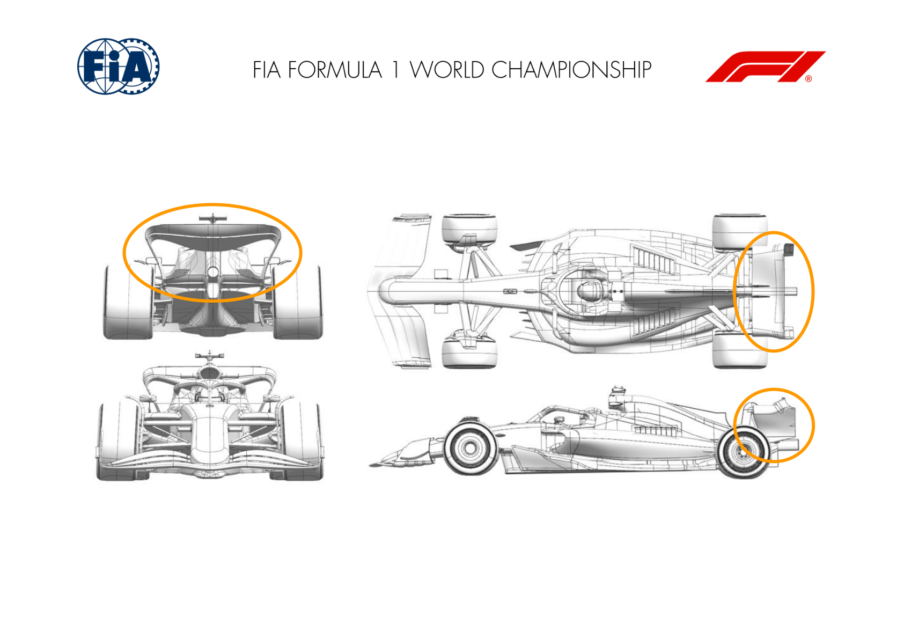
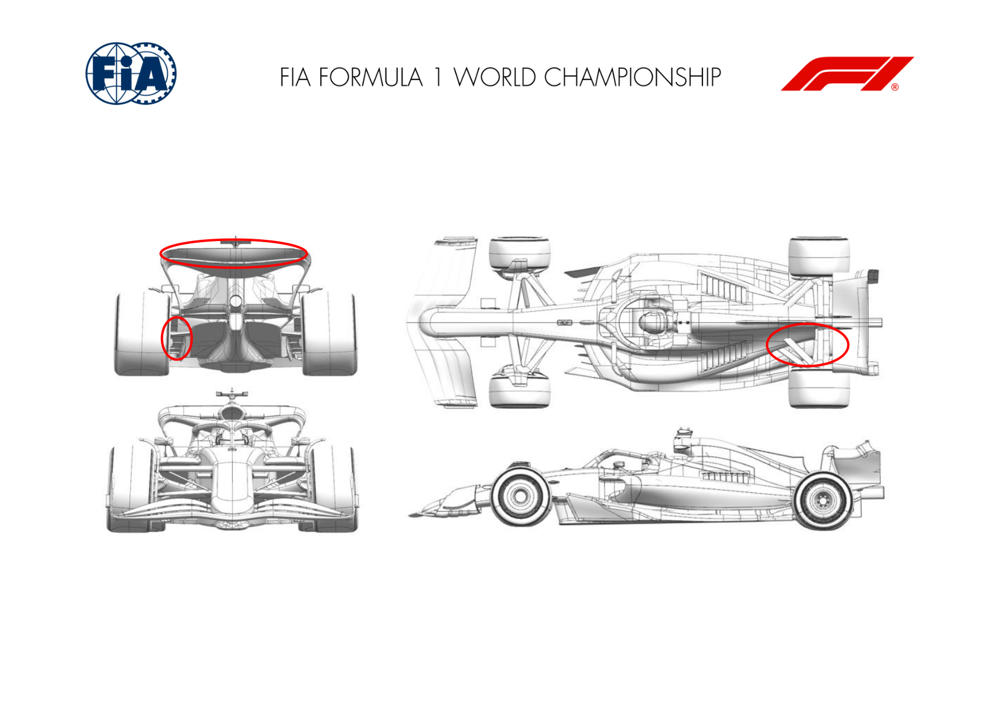
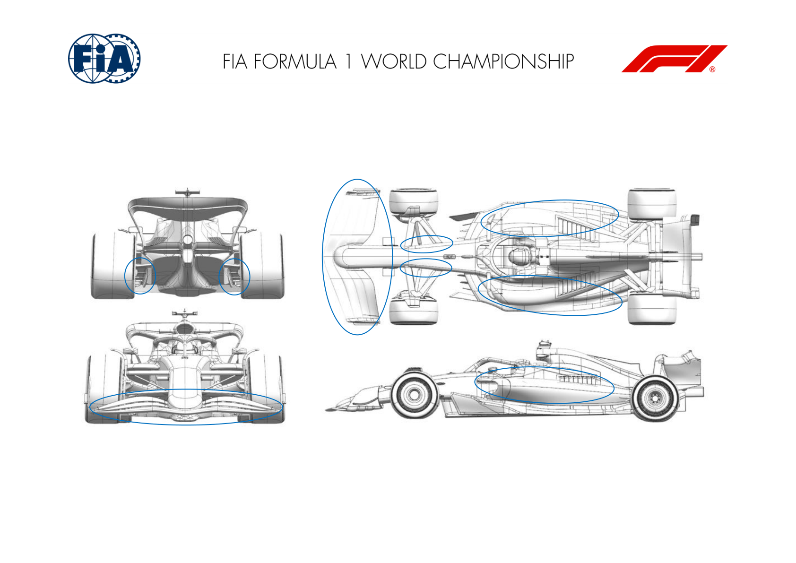
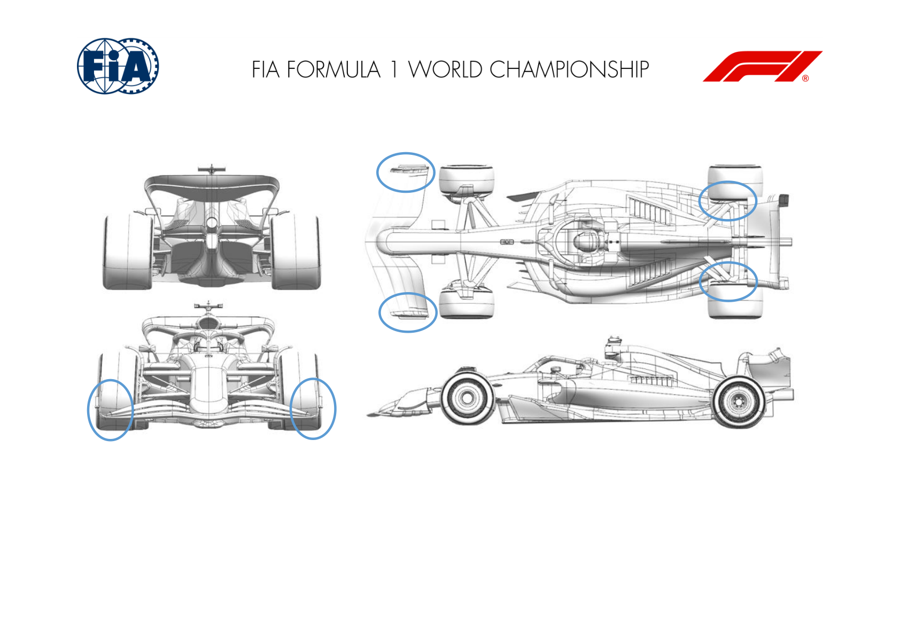
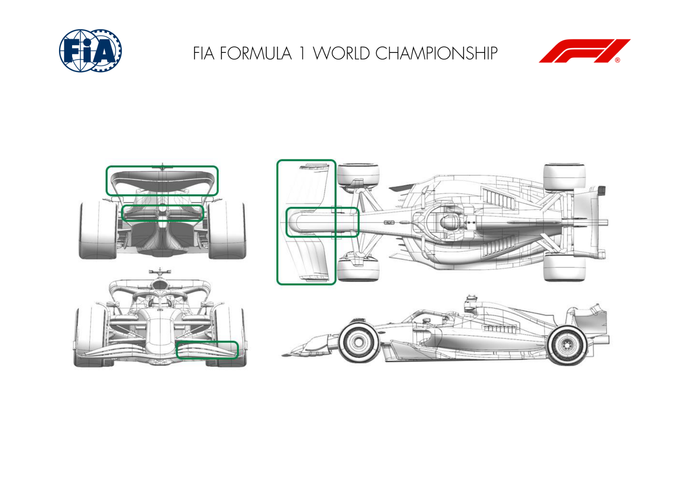
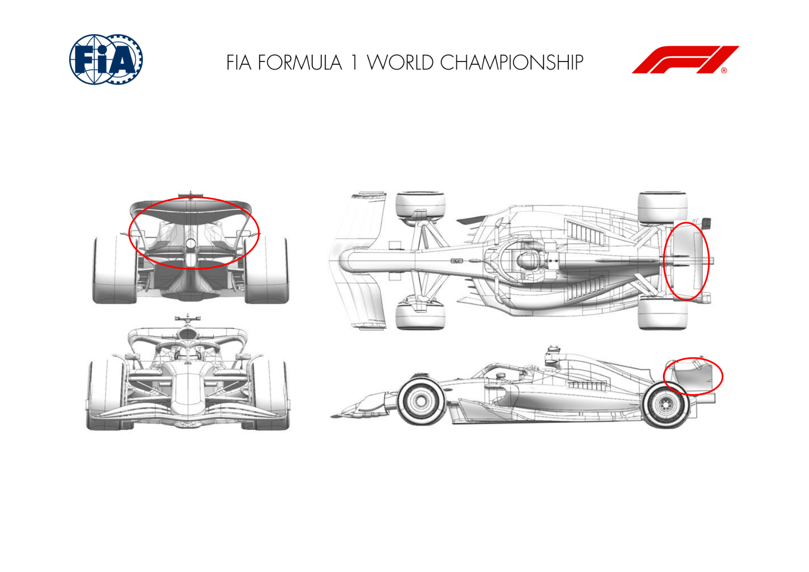
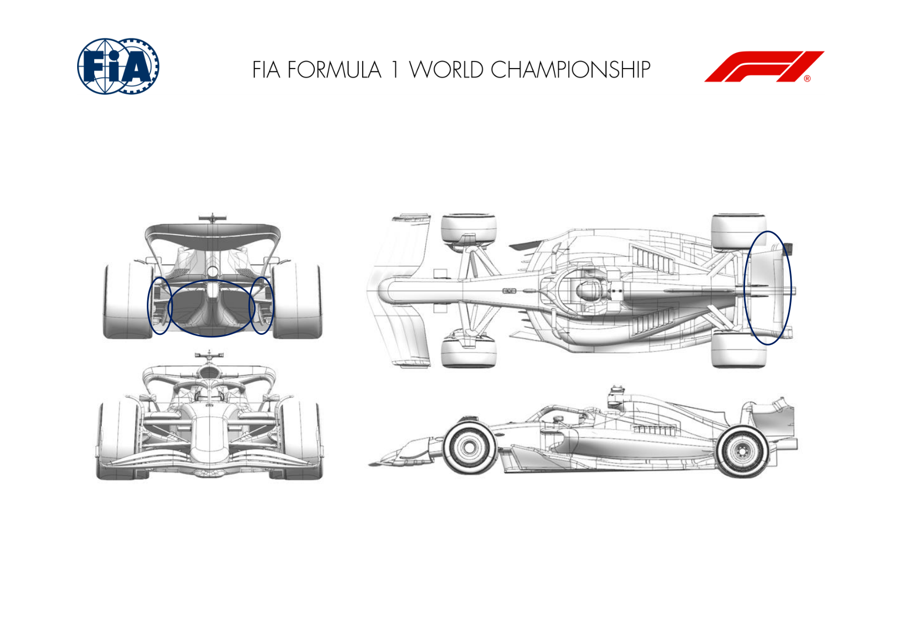
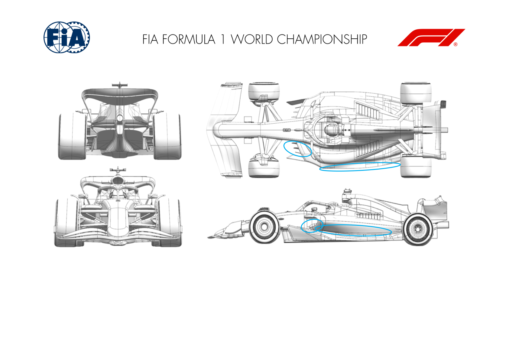

2025 BELGIAN GRAND PRIX

25 - 27 July 2025

From The FIA Formula One Media Delegate Document 6

To All Teams, All Officials Date 25 July 2025

Time 09:50

Title Car Presentation Submissions

Description Car Presentation Submissions

Enclosed 2025 Belgian Grand Prix - Car Presentation Submissions.pdf

Roman De Lauw

The FIA Formula One Media Delegate

Car Presentation – Belgium Grand Prix

McLaren Formula 1 Team

| No. | Updated component | Primary reason for update | Geometric differences | Description |
| --- | --- | --- | --- | --- |
| 1 | Rear Wing | Circuit specific - Drag Range | New Low Downforce Rear Wing | Updated version of the low downforce rear wing assembly, improving overall efficiency across a similar drag range, suitable for multiple circuits. |

Car Presentation – Belgian Grand Prix

*SCUDERIA FERRARI HP*

| No. | Updated component | Primary reason for update | Geometric differences | Description |
| --- | --- | --- | --- | --- |
| 1 | Rear Suspension | Performance - Local Load | Updated Rear Suspension geometry and rear corner winglet elements This revision of the rear suspension geometry triggered a re-optimisation of wishbone fairings as well as lower and upper winglet cascades, with the aim to maximize aerodynamic efficiency |  |
| 2 | Rear Corner | Performance - Local Load |  |  |
| 3 | Rear Wing | Circuit specific - Drag Range | Rear wing flap element trim | Given the aerodynamic efficiency requirements of the Spa-Francorchamps circuit, a lower downforce modulation will be made available, reducing the chord of the rear wing flap element |

Car Presentation – Belgian Grand Prix

Red Bull Racing

| No. | Updated component | Primary reason for update | Geometric differences | Description |
| --- | --- | --- | --- | --- |
| 1 | Front Wing | Performance - Local Load | First and second elements both have revised camber and incidence. As a consequence of the regulations, elements three and four had to be adapted. | The geometric changes revise the pressure distribution across primarily the first two elements of the assembled wing raising the overall load derived from the assembly. |
| 2 | Sidepod Inlet | Reliability | Two inlets merged into one and the upper portion has widened | Noting the tracks approaching which challenge the Power Unit cooling systems, the inlet to the sidepod radiators has been enlarged to exploit better pressure now available. |
| 3 | Coke/Engine Cover | Reliability | Changed by consequence of the sidepod inlet revisions to align and then blend to the floor. | Having changed the sidepod inlet and therefore the split lines to the sidepod part of the topbody, the engine cover has been revised to link the sidepod to the floor, maintaining the same cooling exit louvre options. The inboard rear suspension shrouds have been revised to suit the new topbody despite attaching to the bonded gearbox assembly. |
| 4 | Front suspension | Flow conditioning | Revised inboard fairings on the top wishbone adding more camber | These fairings blending between suspension and chassis surfaces aid the pressure available at the new sidepod inlet, therefore enhancing the cooling. |
| 5 | Rear corner | Performance - Local Load | Mirror changes to the profile of the lower cascade to add camber | The rear wheel bodywork lower cascade wing assembly has locally more camber and a trailing edge trim to the endplate adding load whilst maintaining flow stability. |

Car Presentation – 2025 Belgian Grand Prix

*Mercedes-AMG PETRONAS F1 Team*

| No. | Updated component | Primary reason for update | Geometric differences | Description |
| --- | --- | --- | --- | --- |
| 1 | Front Wing | Performance – Flow Conditioning | Increased chord of endplate second element. | Increasing the chord on the front wing second element local to the endplate (and reducing the forward element chord), redistributes the tip vorticity and improves tyre squirt and lower wake control. |
| 2 | Rear Corner | Performance – Local Load | Drum lip moved inboard. | Moving the drum lip inboard increases vorticity shed off the top edge resulting in more outwash and improved rear tyre upper wake control. |

Car Presentation – Belgian Grand Prix

Aston Martin Aramco F1 Team

| No. | Updated component | Primary reason for update | Geometric differences | Description |
| --- | --- | --- | --- | --- |
| 1 | Front Wing | Circuit specific - Balance Range | Front wing flap for the front wing used at the previous event with reduced chord. | The front wing flap lowers the loading on the front wing to achieve the necessary balance with the lower rear wing expected to be used at this event. |
| 2 | Front Wing | Performance - Local Load | Front wing assy based on a previous version with modified sections to suit the revised nose. At this event it is introduced with a low powered flap. | The front end package improves the flow on the front wing assy generating improved performance through the operating range of the car. |
| 3 | Nose | Performance - Local Load | Shorter nose with the wing mounted from the second element. | The front end package improves the flow on the front wing assy generating improved performance through the operating range of the car. |
| 4 | Rear Wing | Circuit specific - Drag Range | Upper rear wing with smaller sections for reduced front view area. | The rear wing and beam wing are less loaded than previous options to reduce drag in line with the expected setup for this circuit. |
| 5 | Beam Wing | Circuit specific - Drag Range | Single element beam wing. | The rear wing and beam wing are less loaded than previous options to reduce drag in line with the expected setup for this circuit. |

Car Presentation – Belgian Grand Prix

BWT Alpine F1 Team

| No. | Updated component | Primary reason for update | Geometric differences | Description |
| --- | --- | --- | --- | --- |
| 1 | Rear wing | Circuit specific – Drag range | Low downforce top rear wing | The top rear wing has been redesigned and is less loaded. This reduces the drag efficiently and is an option for the upcoming tracks. |
| 2 | Beam wing | Circuit specific – Drag range | Low downforce rear beam wing | The beam wing has also been updated to offer an efficient alternative rear wing assembly, suitable for high efficiency tracks. |

Car Presentation – Belgium Grand Prix

*MoneyGram Haas F1 Team*

No updates submitted for this event.

Car Presentation – Belgian Grand Prix

Visa Cash App Racing Bulls

| No. | Updated component | Primary reason for update | Geometric differences | Description |
| --- | --- | --- | --- | --- |
| 1 | Rear Wing | Circuit specific - Drag Range | Updated rear wing profiles. | The upper rear wing has been changed to meet the needs of the target downforce & efficiency level for the circuit. |
| 2 | Rear Corner | Performance – Flow Conditioning | The geometry of the winglets on the rear corner has been updated. | The rear brake duct winglets have been modified in order to improve the flow conditioning around the rear of the car. |
| 3 | Diffuser | Performance – Flow Conditioning | Diffuser geometry has been updated. | The shape of the diffuser has been revised in order to improve the flow conditioning around the rear of the car. |

Car Presentation – Belgian Grand Prix

*ATLASSIAN WILLIAMS RACING*

| No. | Updated component | Primary reason for update | Geometric differences | Description |
| --- | --- | --- | --- | --- |
| 1 | Floor Fences | Performance - Flow Conditioning | Each of the forward floor fences have been reprofiled to change their camber. The detailed geometry at the trailing edge of each fence has also been updated. | The revised fence geometries redistribute the balance of loading through the floor fence channels. This increases the local front of floor loading as well as improving the potential for the downstream flow. |
| 2 | Floor Edge | Performance - Local Load | The floor edge wing and spat have been reprofiled with a more complex curvature. The lateral hole at the rear of the spat has also been subtly reshaped. | These modified geometries capitalise on the revised local onset flow to not only improve local load along the edge of the floor but also to benefit the inlet condition to the main diffuser. |
| 3 | Sidepod Inlet | Performance - Flow Conditioning | The lower lip of the sidepod cooling inlet has been modified and is now lower at the inboard end and higher at the outboard end. This supports the revisions to the bodywork described below whilst maintaining the same inlet cooling flow. | The revisions to the sidepod inlet work in combination with the downstream changes to the floor edges and sidepod coke line. Whilst maintaining the required level of internal PU cooling flow, we have also improved the level of potential flow energy to the rear of the car. |
| 4 | Coke/Engine Cover | Performance - Flow Conditioning | There is a deeper undercut to the bodywork, which is The changes to the external sidepod-floor undercut help improve the flow distribution to the floor edge and spat region where it is utilised to improve the local floor load. married to a modified floor upstand. This is achieved by raising the lower surface of the main sidepod belly. This in turn is achievable because of the changes to the sidepod inlet described above. |  |

Car Presentation – Belgian Grand Prix

KICK Sauber F1 Team

No updates submitted for this event.
