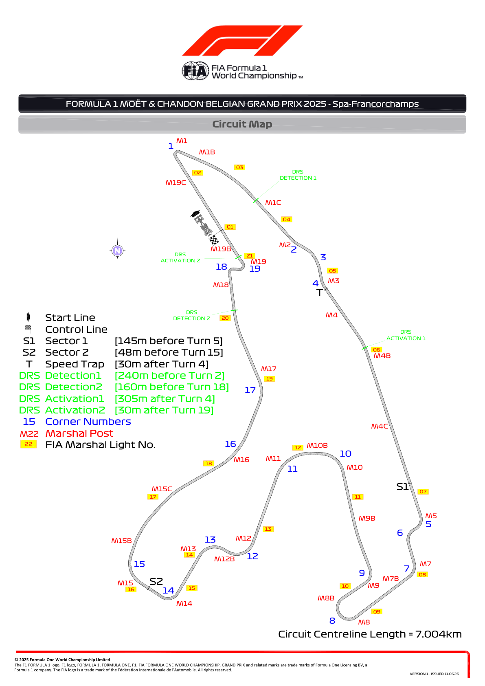
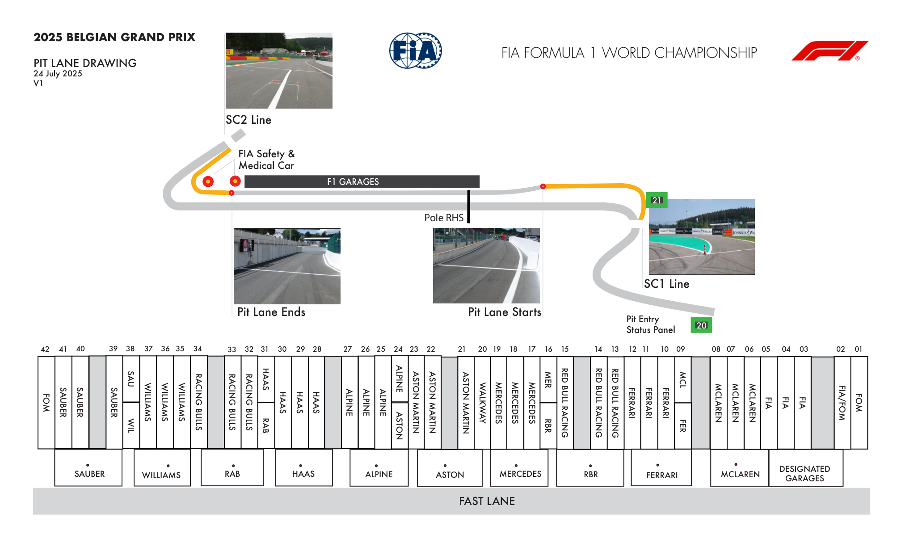
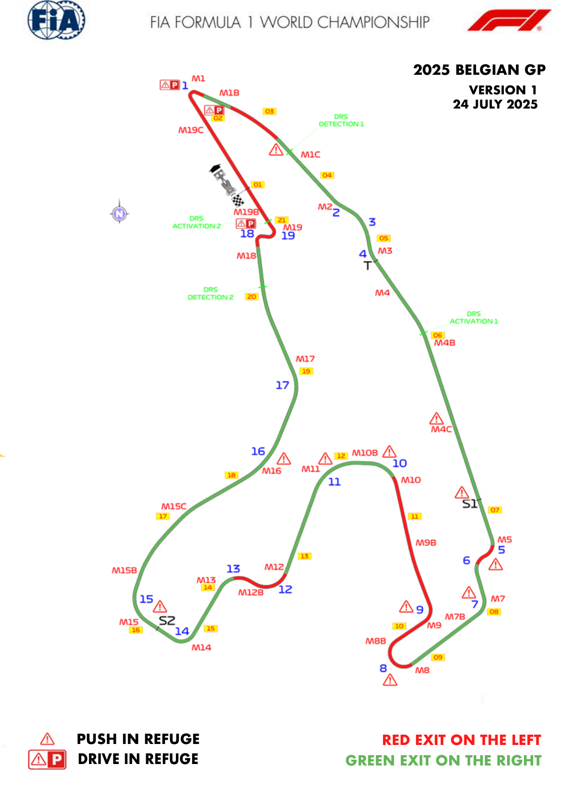
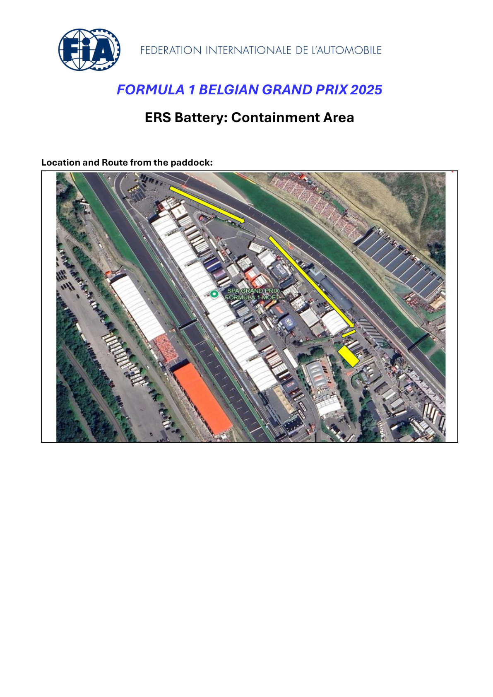
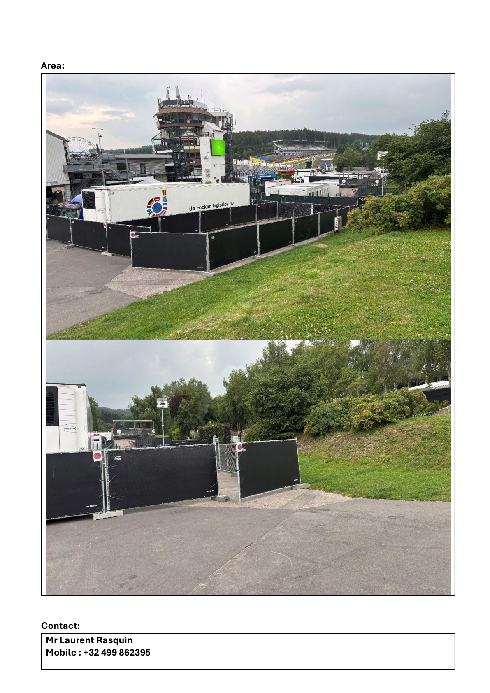
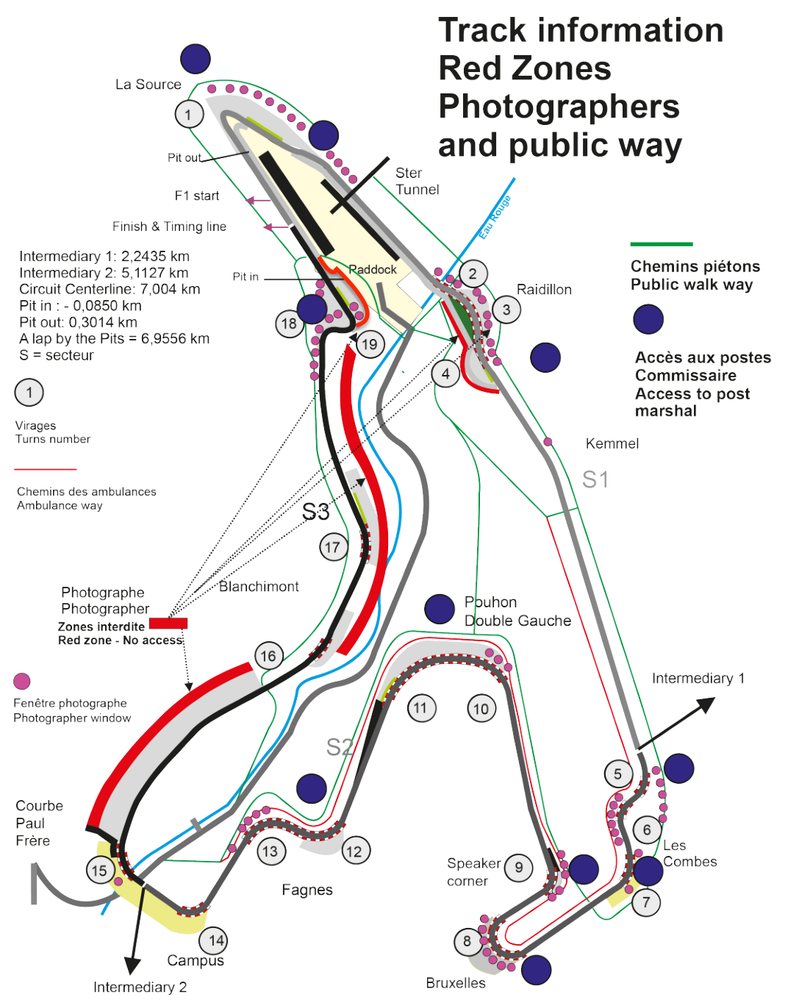

2025 BELGIAN GRAND PRIX

25 - 27 July 2025

From The FIA Formula One Race Director Document 4

To All Teams, All Officials Date 24 July 2025

Time 19:11

Title Event Notes - Circuit Map, Pit Lane, Emergency Exits, Quarantine Zone and Red Zones

Description Event Notes - Circuit Map, Pit Lane, Emergency Exits, Quarantine Zone and Red Zones

Enclosed Maps.pdf

Rui Marques

The FIA Formula One Race Director

