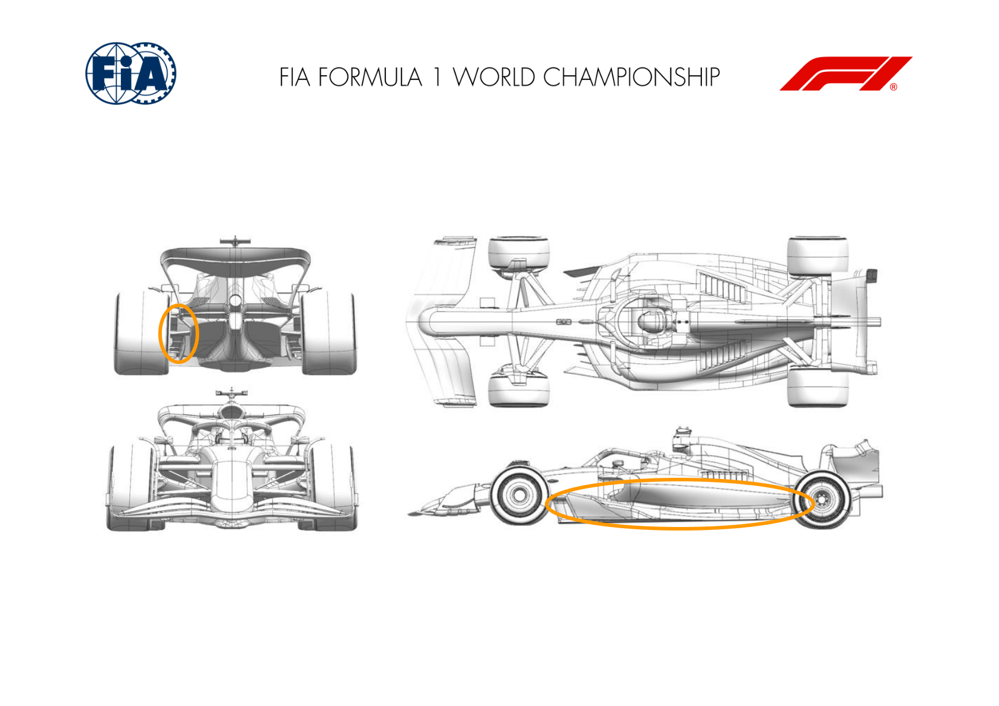
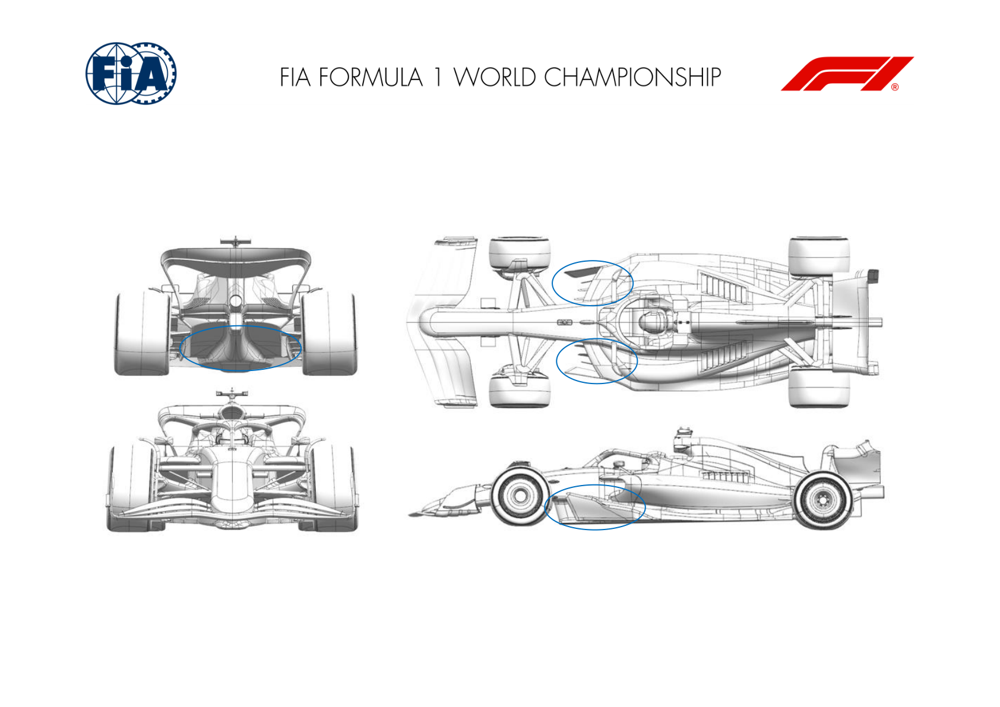
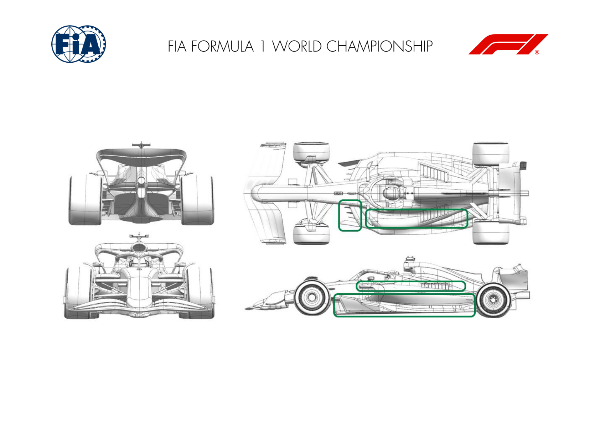
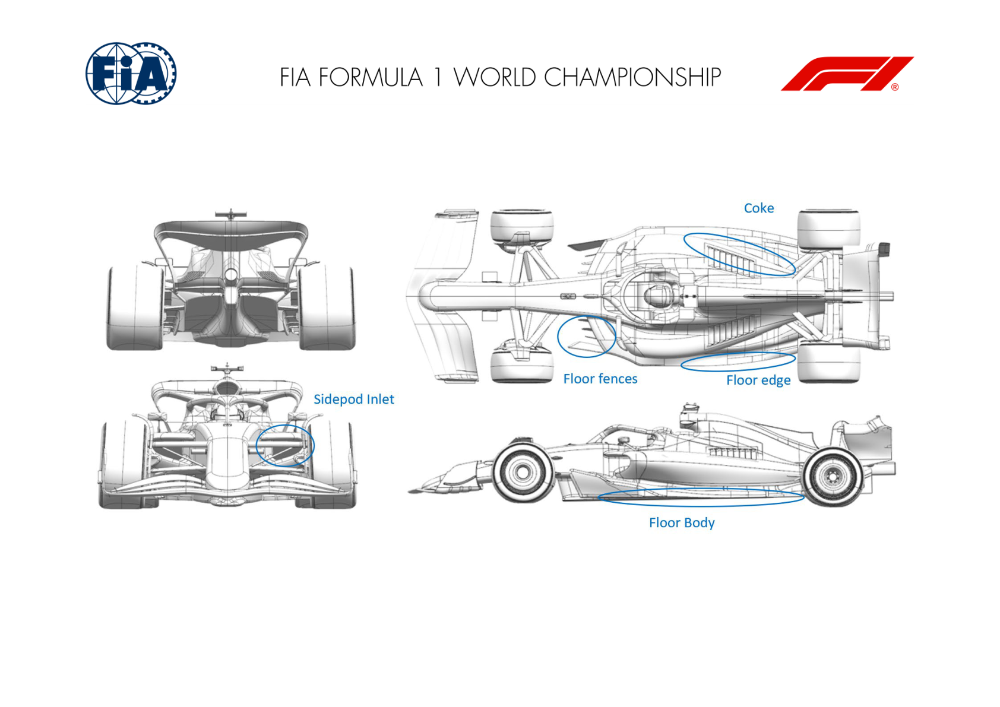
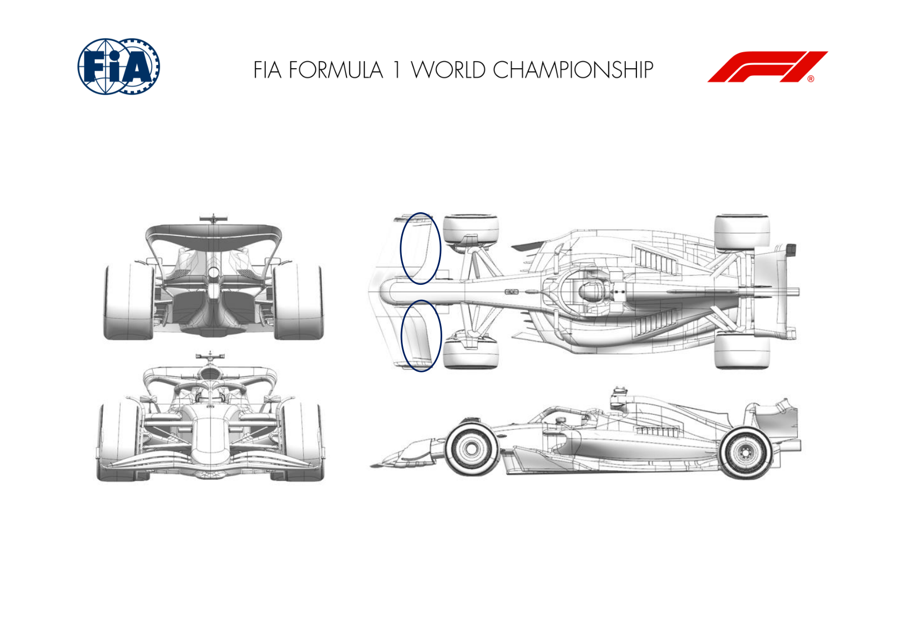
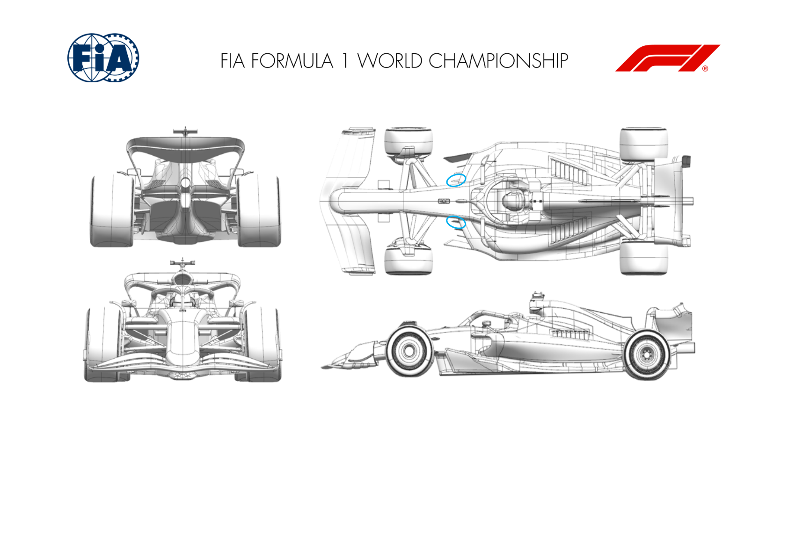
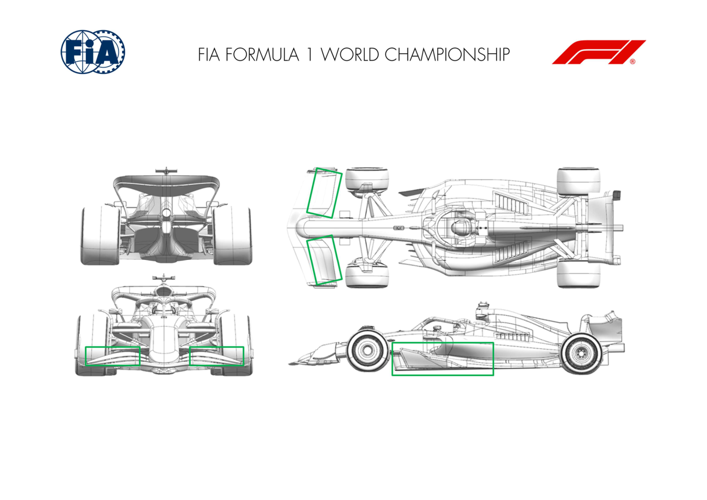

2025 BRITISH GRAND PRIX

04 - 06 July 2025

From The FIA Formula One Media Delegate Document 9

To All Teams, All Officials Date 04 July 2025

Time 09:52

Title Car Presentation Submissions

Description Car Presentation Submissions

Enclosed 2025 British Grand Prix - Car Presentation Submissions.pdf

Cameron Kelleher

The FIA Formula One Media Delegate

Car Presentation – British Grand Prix

McLaren Formula 1 Team

| No. | Updated component | Primary reason for update | Geometric differences | Description |
| --- | --- | --- | --- | --- |
| 1 | Floor Body | Performance - Local Load | Revised floor geometry | The complete floor has been revised resulting in improved flow conditioning and a redistribution of suction to gain overall aerodynamic performance. |
| 2 | Rear Corner | Performance - Flow Conditioning | Revised Rear Corner Inlet | Modification to Rear Brake Duct Inlet aiming at overall improvement in local flow conditioning for improved aerodynamic and brake cooling performance. |

Car Presentation – British Grand Prix

*SCUDERIA FERRARI HP*

No updates submitted for this event.

Car Presentation – British Grand Prix

Red Bull Racing

| No. | Updated component | Primary reason for update | Geometric differences | Description |
| --- | --- | --- | --- | --- |
| 1 | Floor Body Floor Fences | Performance - Local Load | Re-profiled surfaces to supplement the changes to the fences Repositioned laterally at the leading edges | Revised surfaces to improve pressure distribution over the length of the floor allowing more load to be extracted whilst maintaining adequate flow stability. Subtle change to better optimise the pressure distributions, which allows more load to be extracted without harming flow stability downstream. |

Car Presentation – 2025 British Grand Prix

*Mercedes-AMG PETRONAS F1 Team*

No updates submitted for this event.

Car Presentation – British Grand Prix

Aston Martin Aramco F1 Team

| No. | Updated component | Primary reason for update | Geometric differences | Description |
| --- | --- | --- | --- | --- |
| 1 | Floor Body | Performance - Local Load | The shape of the main body of the floor has evolved slightly as part of this update. | The revised surfaces improve the flow structures under the floor increasing the local load on the lower surface and hence improving performance. |
| 2 | Floor Fences | Performance - Local Load | The fences have revised curvature and local details. | The revised surfaces improve the flow structures under the floor increasing the local load on the lower surface and hence improving performance. |
| 3 | Floor Edge | Performance - Local Load | Small changes to the details of the floor edge wing and the main floor inboard of this. | The revised surfaces improve the flow structures under the floor increasing the local load on the lower surface and hence improving performance. |
| 4 | Coke/Engine Cover | Performance - Local Load | Change to the profile of the top deck of the bodywork. | This revised shape is developed alongside the floor edge details to improve the performance of the floor as above. |

Car Presentation – British Grand Prix

BWT Alpine F1 Team

No updates submitted for this event.

Car Presentation – 2025 British Grand Prix

MONEYGRAM HAAS F1 TEAM

| No. | Updated component | Primary reason for update | Geometric differences | Description |
| --- | --- | --- | --- | --- |
| 1 | Floor Body | Performance - Local Load | Expansion rate changed on main floor The updated floor geometry enhances underfloor flow management, increasing ground effect efficiency during lateral load conditions. This results in improved cornering stability, higher mid-corner speeds, and greater driver confidence through more consistent aerodynamic behaviour. |  |
| 2 | Floor Fences | Performance - Local Load | Fences re-aligned |  |
| 3 | Floor Edge | Performance - Local Load | Smaller Floor edge wing |  |
| 4 | Sidepod Inlet | Performance - Flow Conditioning | Profiled Sidepod Inlet geometry and Mirror update | The revised sidepod inlet improves local flow alignment, enabling cleaner airflow delivery to the rear of the car, hence improving overall car performance. |

Car Presentation – British Grand Prix

Visa Cash App Racing Bulls

| No. | Updated component | Primary reason for update | Geometric differences | Description |
| --- | --- | --- | --- | --- |
| 1 | Front Wing | Circuit specific - Balance Range | New front wing flap geometry. | The flap elements have been changed for smaller profiles, to cater for the low balance requirements of this and subsequent events. |

Car Presentation – British Grand Prix

*ATLASSIAN WILLIAMS RACING*

| No. | Updated component | Primary reason for update | Geometric differences | Description |
| --- | --- | --- | --- | --- |
| 1 | Floor Fences | Performance - Flow Conditioning | The inboard floor fence geometry has been revised This revised geometry is designed to improve the flow distribution through the fence system, with the intention of improving the downstream car performance. around the leading edge. The leading edge is located further inboard than the baseline and the geometry has more 3D curvature as it blends back to the original fence profile. |  |

Car Presentation – British Grand Prix

Stake F1 Team KICK Sauber

| No. | Updated component | Primary reason for update | Geometric differences | Description |
| --- | --- | --- | --- | --- |
| 1 | Floor Body | Performance - Local Load | Changes to forward floor area. | In continuation of recent floor development, new forward floor geometry modifications are implemented at this event, gaining some efficient downforce. |
| 2 | Front Wing | Circuit specific - Balance Range | New front wing flap design | New front wing flap design with a reshaped flap geometry to provide a more efficient low balance flap option if lower downforce levels are used at this event. |

