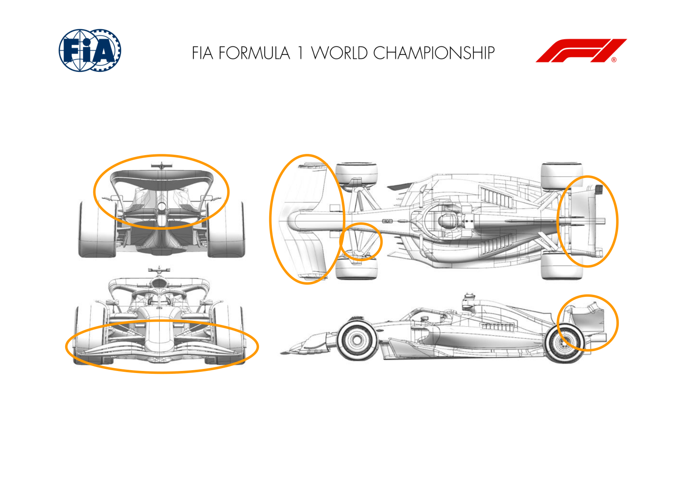
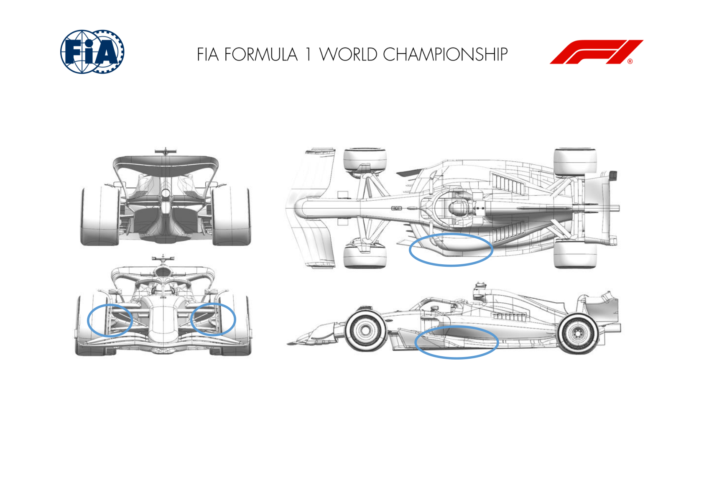
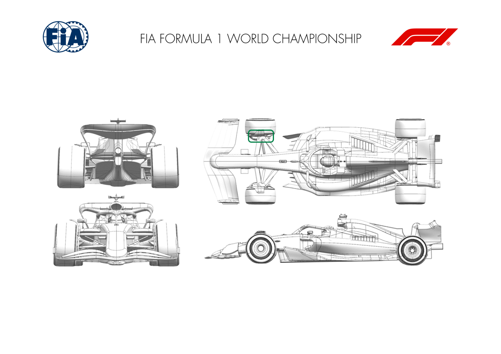
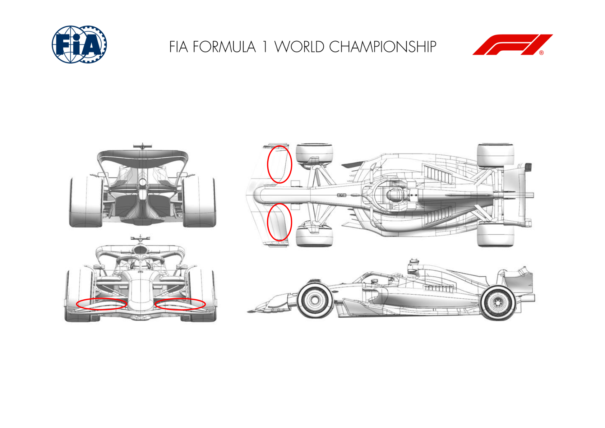

2025 CANADIAN GRAND PRIX

13 - 15 June 2025

From The FIA Formula One Media Delegate Document 8

To All Teams, All Officials Date 13 June 2025

Time 10:51

Title Car Presentation Submissions

Description Car Presentation Submissions

Enclosed 2025 Canadian Grand Prix - Car Presentation Submissions.pdf

Roman De Lauw

The FIA Formula One Media Delegate

Car Presentation – Canada Grand Prix

McLaren Formula 1 Team

| No. | Updated component | Primary reason for update | Geometric differences | Description |
| --- | --- | --- | --- | --- |
| 1 | Front Wing | Performance - Flow Conditioning | New Front Wing geometry | A revised front wing geometry aiming at improved aerodynamic performance across a wide range of attitudes, through a redesign of main elements as well as introduction of 'mermaid tails' to the front wing endplate. |
| 2 | Rear Wing | Circuit specific - Drag Range | Medium Downforce Rear Wing | Updated version of the medium downforce rear wing assembly, enabling a more efficient coverage of a larger drag range, suitable for multiple circuits. |
| 3 | Front Suspension | Performance - Mechanical Setup | Updated Front Suspension Geometry | A small modification to the front suspension aerodynamic surface, to accommodate the geometry change and reoptimize local flow conditioning. |

Car Presentation – Canadian Grand Prix

*SCUDERIA FERRARI HP*

No updates submitted for this event.

Car Presentation – R10 Canadian Grand Prix

Red Bull Racing

No updates submitted for this event.

Car Presentation – 2025 Canadian Grand Prix

*Mercedes-AMG PETRONAS F1 Team*

| No. | Updated component | Primary reason for update | Geometric differences | Description |
| --- | --- | --- | --- | --- |
| 1 | Floor Corner | Circuit Specific – Cooling Range | Large brake duct inlet and exit Increased front brake duct inlet and exit area to cover off high brake duty for this circuit. |  |
| 2 | Floor Edge | Performance - Flow Conditioning | Reduced chord wing element | Reduced flap chord and tweaked vanes, increases mass flow under forward floor and vorticity shed from the fence system, increasing floor load. |

Car Presentation – Canadian Grand Prix

Aston Martin Aramco F1 Team

| No. | Updated component | Primary reason for update | Geometric differences | Description |
| --- | --- | --- | --- | --- |
| 1 | Front Corner | Circuit specific - Cooling Range | Front brake duct with larger exit. | The larger exit area for the front brake duct increases the massflow through the front corner increasing cooling for the characteristics of this circuit. |

Car Presentation – Canadian Grand Prix

BWT Alpine F1 Team

| No. | Updated component | Primary reason for update | Geometric differences | Description |
| --- | --- | --- | --- | --- |
| 1 | Front wing | Circuit specific - Balance Range | Reprofiled and shorter flap | The flap has been shortened and redesigned, generating less load, therefore offering the aero balance range that may be required for the track characteristics. |

Car Presentation – Canada Grand Prix

*MoneyGram Haas F1 Team*

No updates submitted for this event.

Car Presentation – Canadian Grand Prix

Visa Cash App Racing Bulls

| No. | Updated component | Primary reason for update | Geometric differences | Description |
| --- | --- | --- | --- | --- |
| 1 | Front Wing | Circuit specific - Balance Range | The most rearward element of the front flap features a shorter chord length. | At lower rear wing levels, the car must be balanced with reduced front downforce. This reduced-chord flap allows the aerodynamic balance to be lowered beyond the minimum range achievable by the previous flap. It achieves this by reducing the load generated by the front wing at a given flap angle. |
| 2 | Rear Corner | Performance - Flow Conditioning | The shape of the lower winglet endplate has been revised. | The vorticity shed from the brake drum winglet helps to manage the airflow around the tyre and the diffuser. This update improves the quality and consistency of the shed vortex, which in turn increases rear downforce. |

Car Presentation – Canadian Grand Prix

*ATLASSIAN WILLIAMS RACING*

No updates submitted for this event.

Car Presentation – Canadian Grand Prix

Stake F1 Team KICK Sauber

No updates submitted for this event.
