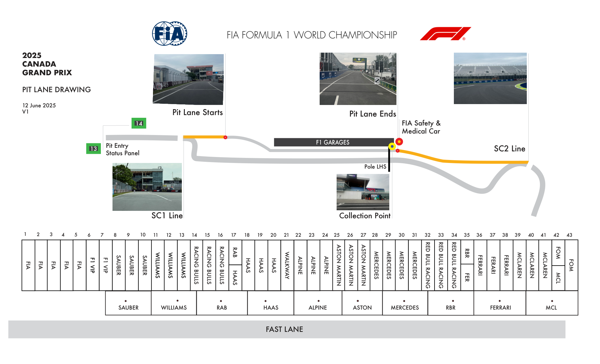
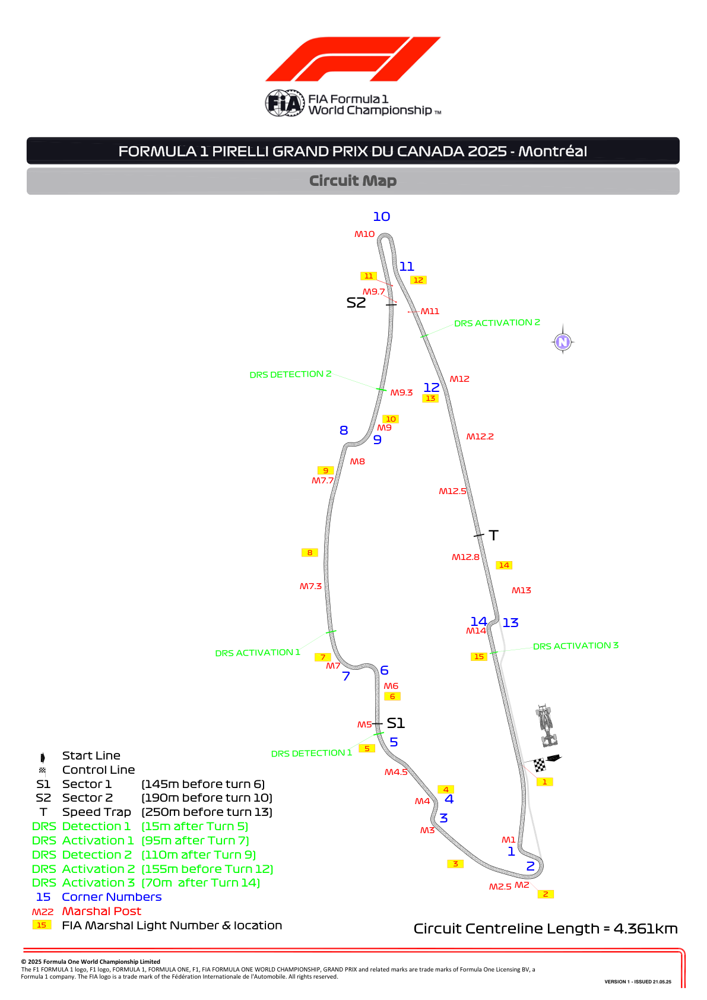
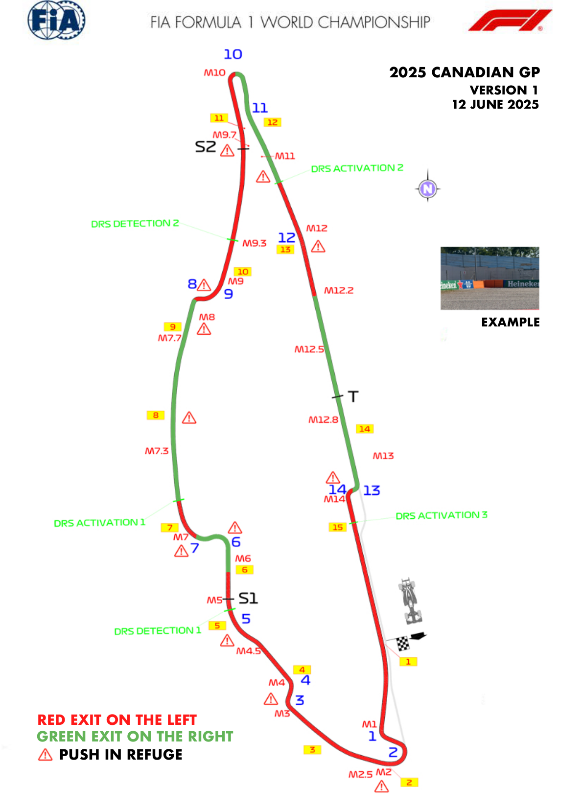
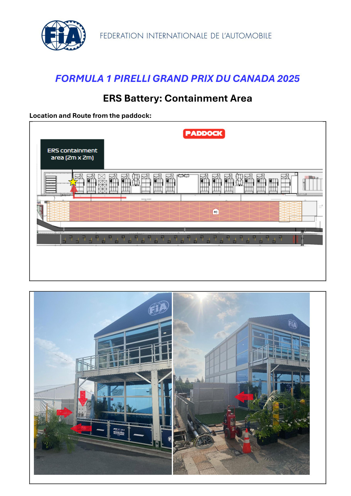
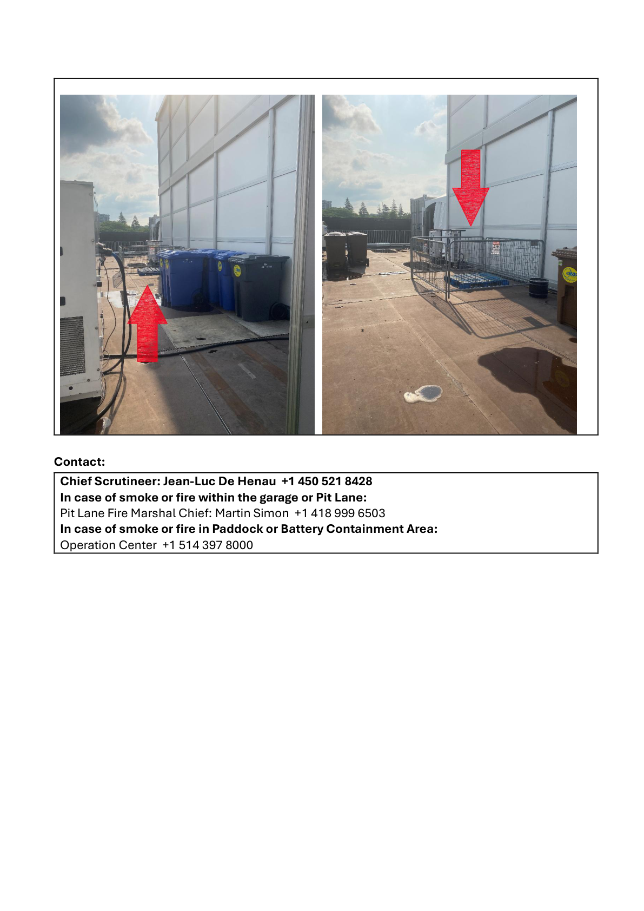
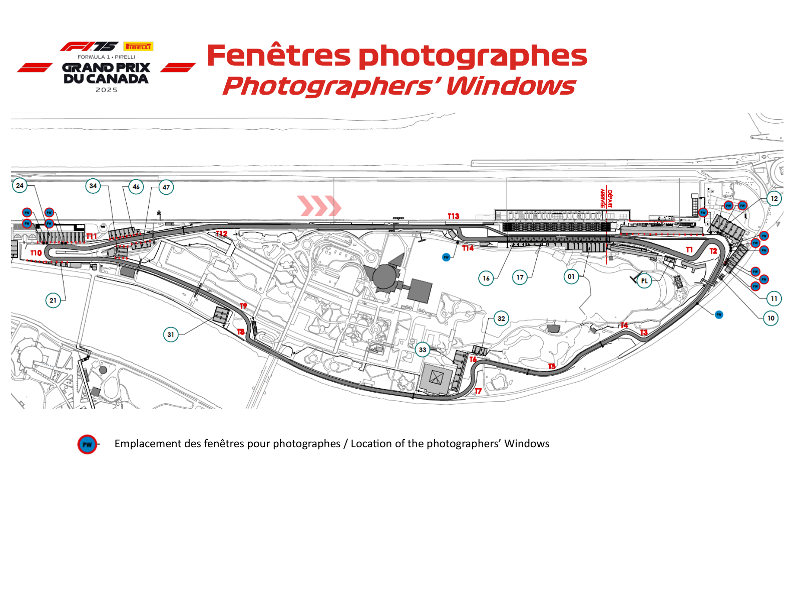

2025 CANADIAN GRAND PRIX

13 - 15 June 2025

From The FIA Formula One Race Director Document 5

To All Teams, All Officials Date 12 June 2025

Time 18:30

Title Event Notes - Circuit Map, Pit Lane, Emergency Exits Map, ERS Battery Containment Area, Red Zones

Description Event Notes - Circuit Map, Pit Lane, Emergency Exits Map, ERS Battery Containment Area, Red Zones

Enclosed Maps Canada.pdf

Rui Marques

The FIA Formula One Race Director

