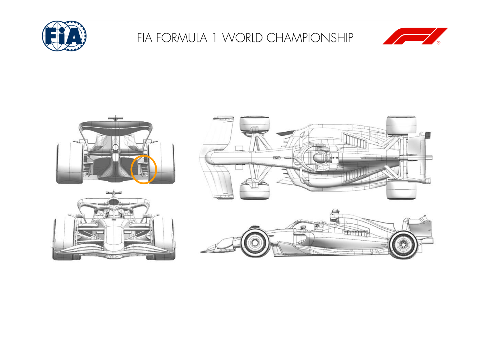
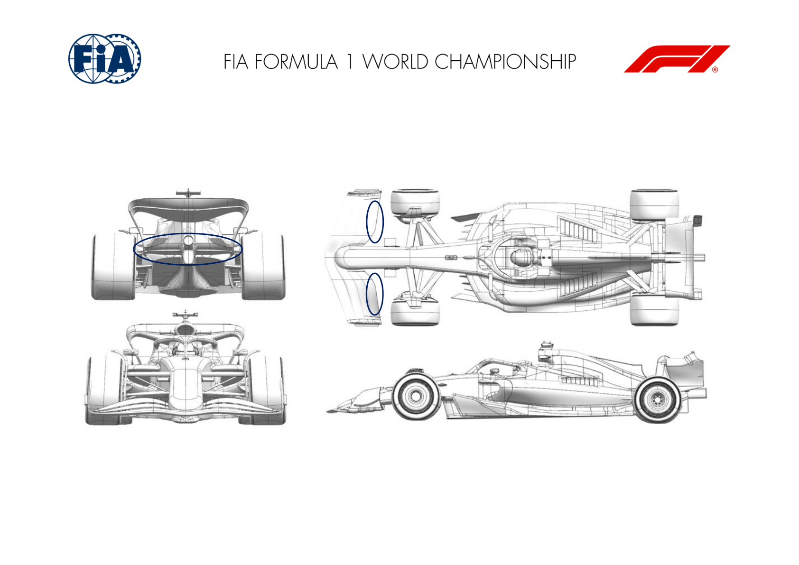
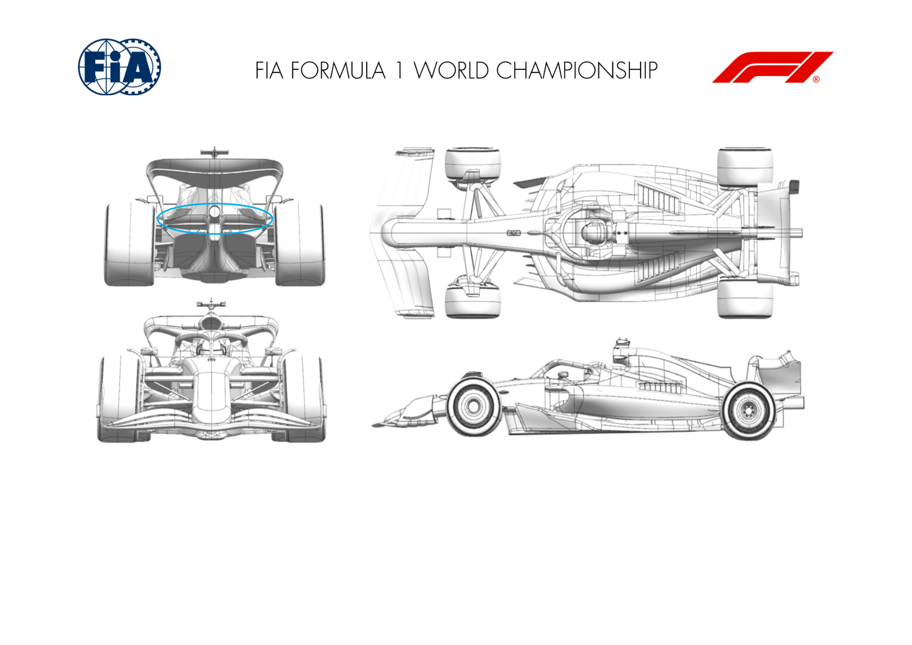
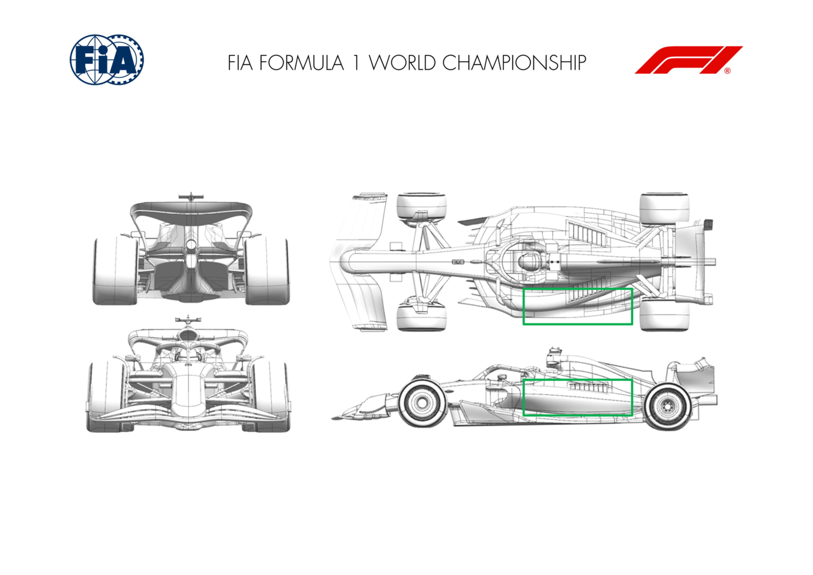

2025 CHINESE GRAND PRIX

21 - 23 March 2025

From The FIA Formula One Media Delegate Document 9

To All Teams, All Officials Date 21 March 2025

Time 08:55

Title Car Presentation Submissions

Description Car Presentation Submissions

Enclosed 2025 Chinese Grand Prix - Car Presentation Submissions.pdf

Roman De Lauw

The FIA Formula One Media Delegate

Car Presentation – Chinese Grand Prix

McLaren Formula 1 Team

| No. | Updated component | Primary reason for update | Geometric differences | Description |
| --- | --- | --- | --- | --- |
| 1 | Rear Corner | Performance - Flow Conditioning | New Rear Brake Duct Winglet | The new Rear Brake Duct Winglet improves local flow physics in interaction with floor and tyre, resulting in an overall gain in aerodynamic performance. |

Car Presentation – Chinese Grand Prix

*SCUDERIA FERRARI HP*

No updates submitted for this event.

Car Presentation – R02 Chinese Grand Prix

Red Bull Racing

No updates submitted for this event.

Car Presentation – 2025 Chinese Grand Prix

*Mercedes-AMG PETRONAS F1 Team*

No updates submitted for this event.

Car Presentation – Chinese Grand Prix

Aston Martin Aramco F1 Team

No updates submitted for this event.

Car Presentation – Chinese Grand Prix

BWT Alpine F1 Team

No updates submitted for this event.

Car Presentation – China Grand Prix

*MoneyGram Haas F1 Team*

No updates submitted for this event.

Car Presentation – Chinese Grand Prix

Visa Cash App RB

| No. | Updated component | Primary reason for update | Geometric differences | Description |
| --- | --- | --- | --- | --- |
| 1 | Front Wing | Circuit specific - Balance Range | Additional FW gurney options available | For circuits with higher aero balance requirements, adding gurneys to the front wing increases the front wing load generated at a given flap angle. |
| 2 | Beam Wing | Circuit specific - Drag Range | Two-element beam wing with greater camber & incidence. | Raising the trailing edge of the beam wing and using a two-element configuration increases the overall load generated by the rear wing assembly but with some additional drag, making it suitable at some higher-downforce circuits. |

Car Presentation – CHINESE Grand Prix

*ATLASSIAN WILLIAMS RACING*

| No. | Updated component | Primary reason for update | Geometric differences | Description |
| --- | --- | --- | --- | --- |
| 1 | Rear Beam Wing | Circuit specific – Drag Level | A new main beam wing is available this weekend. It is a larger span version of the wing raced in Melbourne. There is also an optional forward lower wing that can accompany this main beam wing. | The new beam wing options, which have a larger area than the previous version simply generate more load and drag from rear wing assembly. This gives an efficient increase in load at medium-high downforce circuits. |

Car Presentation – Chinese Grand Prix

Stake F1 Team KICK Sauber

| No. | Updated component | Primary reason for update | Geometric differences | Description |
| --- | --- | --- | --- | --- |
| 1 | Coke/Engine Cover | Performance - Flow Conditioning | Changes to the engine cover design. | This test item has a potentially positive effect to the flow field around the bodywork surfaces, improving both overall downforce of the car and the aero efficiency. |

