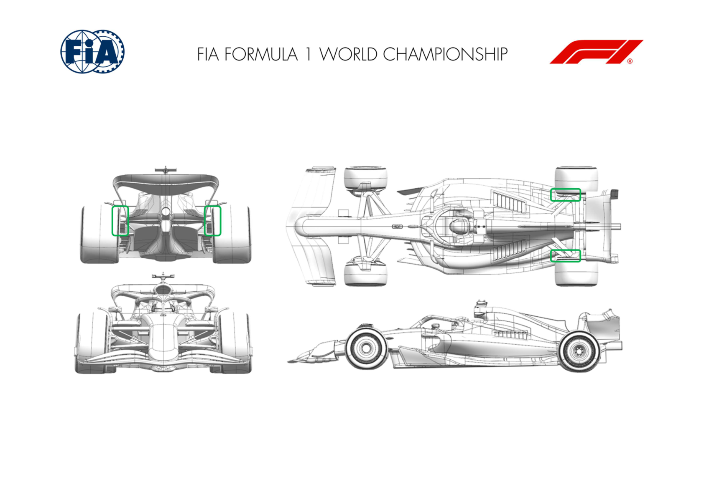

2025 DUTCH GRAND PRIX

29 - 31 August 2025

From The FIA Formula One Media Delegate Document 9

To All Teams, All Officials Date 29 August 2025

Time 09:53

Title Car Presentation Submissions

Description Car Presentation Submissions

Enclosed 2025 Dutch Grand Prix - Car Presentation Submissions.pdf

Roman De Lauw

The FIA Formula One Media Delegate

Car Presentation – Dutch Grand Prix

McLaren Formula 1 Team

No updates submitted for this event.

Car Presentation – Dutch Grand Prix

*SCUDERIA FERRARI HP*

No updates submitted for this event.

Car Presentation – Netherlands Grand Prix

Red Bull Racing

| No. | Updated component | Primary reason for update | Geometric differences | Description |
| --- | --- | --- | --- | --- |
| 1 | Front Wing | Performance - Local Load | Longer chord front wing flaps | The expected demands of the Zandvoort circuit require the flap elements to have extended chords to increase the load available via angle. |

Car Presentation – 2025 Dutch Grand Prix

*Mercedes-AMG PETRONAS F1 Team*

No updates submitted for this event.

Car Presentation – Dutch Grand Prix

Aston Martin Aramco F1 Team

No updates submitted for this event.

Car Presentation – Dutch Grand Prix

BWT Alpine F1 Team

| No. | Updated component | Primary reason for update | Geometric differences | Description |
| --- | --- | --- | --- | --- |
| 1 | Rear Corner | Performance - Flow Conditioning | Rear Brake Duct furniture | Update to the rear brake duct furniture, including a set of reprofiled winglets, designed to improve the rear wheel wake management. |

Car Presentation – Dutch Grand Prix

*MoneyGram Haas F1 Team*

No updates submitted for this event.

Car Presentation – Dutch Grand Prix

Visa Cash App Racing Bulls

No updates submitted for this event.

Car Presentation – Dutch Grand Prix

*ATLASSIAN WILLIAMS RACING*

No updates submitted for this event.

Car Presentation – Dutch Grand Prix

KICK Sauber F1 Team

| No. | Updated component | Primary reason for update | Geometric differences | Description |
| --- | --- | --- | --- | --- |
| 1 | Rear Corner | Performance - Flow Conditioning | Updated rear brake duct vane design. | The changes to the rear brake duct vane affect the flow field around the rear of the car, local to diffuser and rear wheels. |

