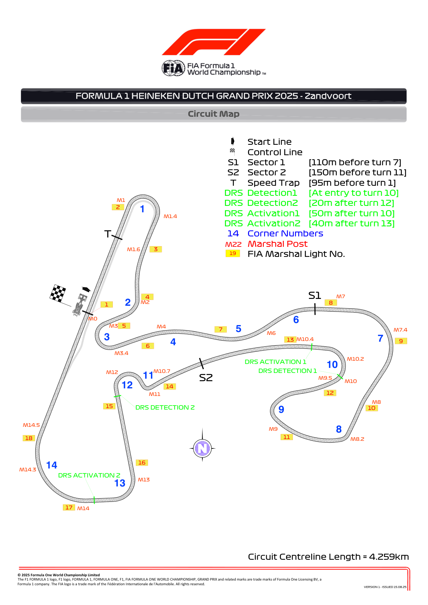
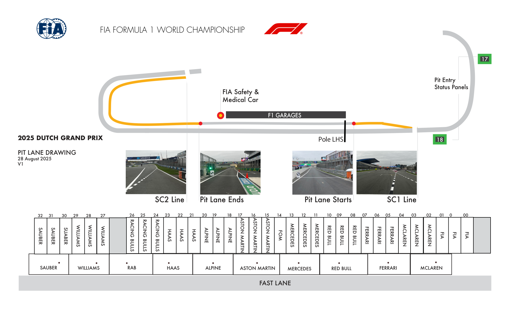
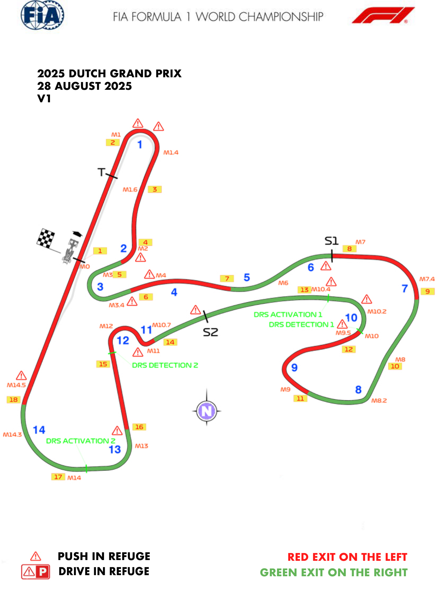
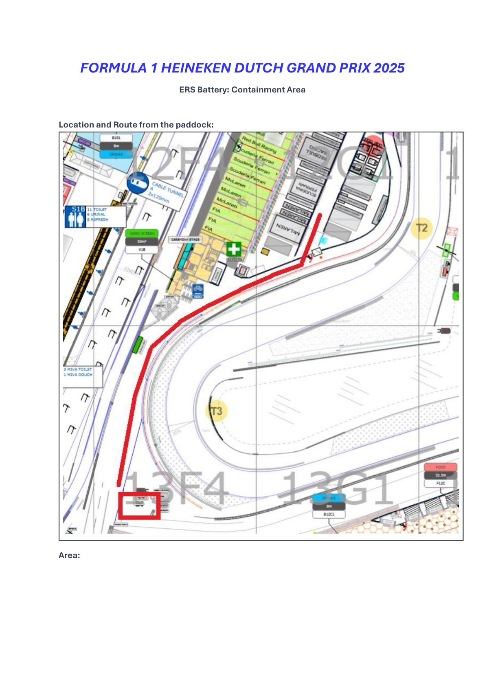
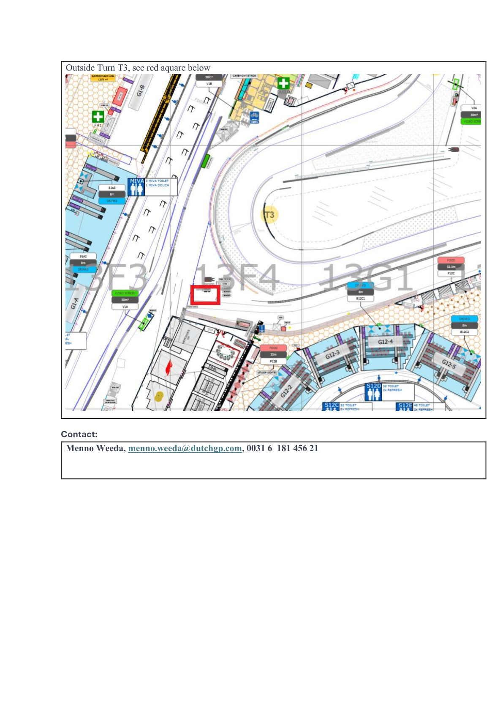
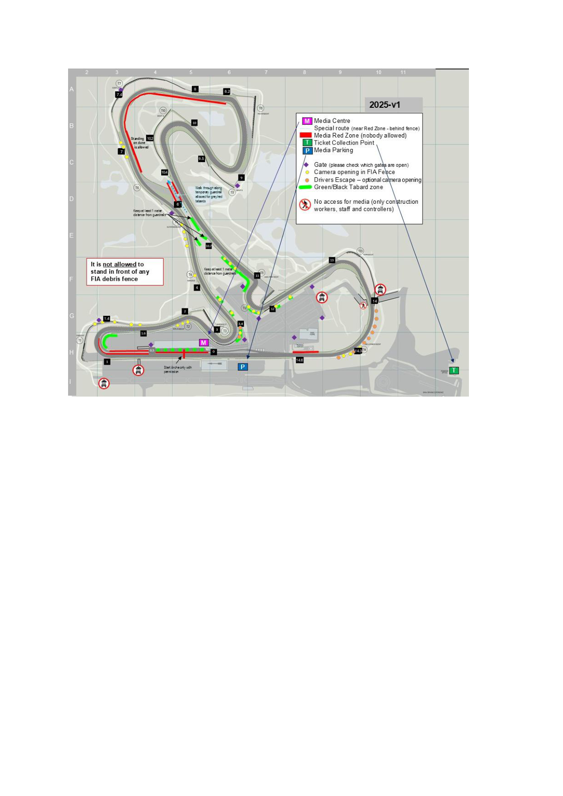

2025 DUTCH GRAND PRIX

29 - 31 August 2025

From The FIA Formula One Race Director Document 3

To All Teams, All Officials Date 28 August 2025

Time 17:00

Title Event Notes - Circuit Mao, Pit Lane Map, Emergency Exit Map, Quarantine Zone and Red Zones

Description Event Notes - Circuit Map, Pit Lane Map, Emergency Exits Map, Quarantine Zone and Red Zone

Enclosed Maps.pdf

Rui Marques

The FIA Formula One Race Director

