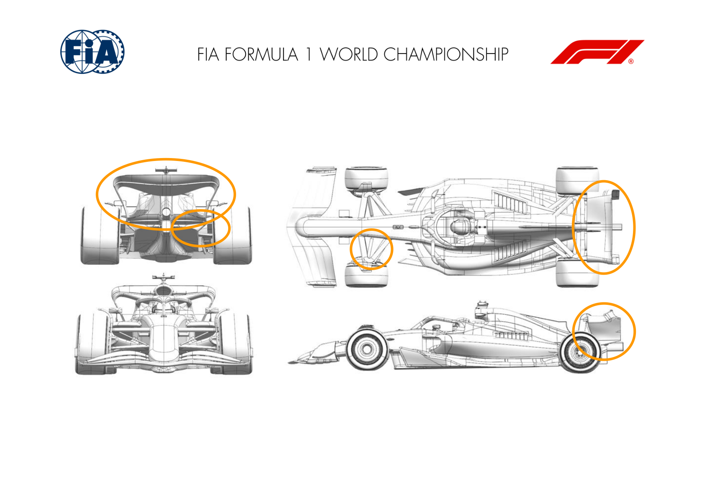
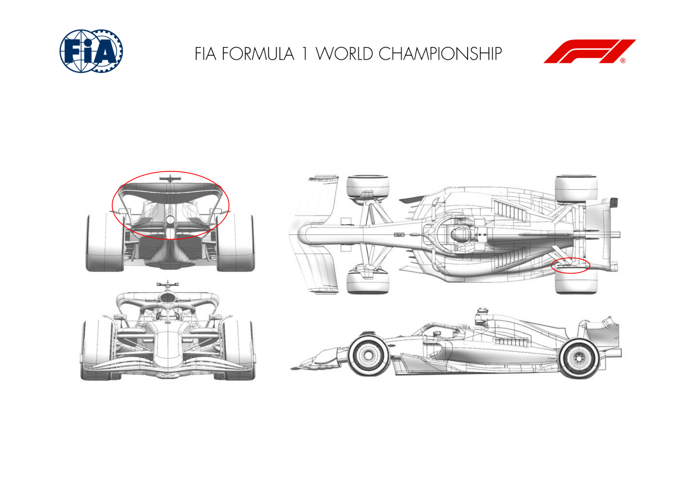
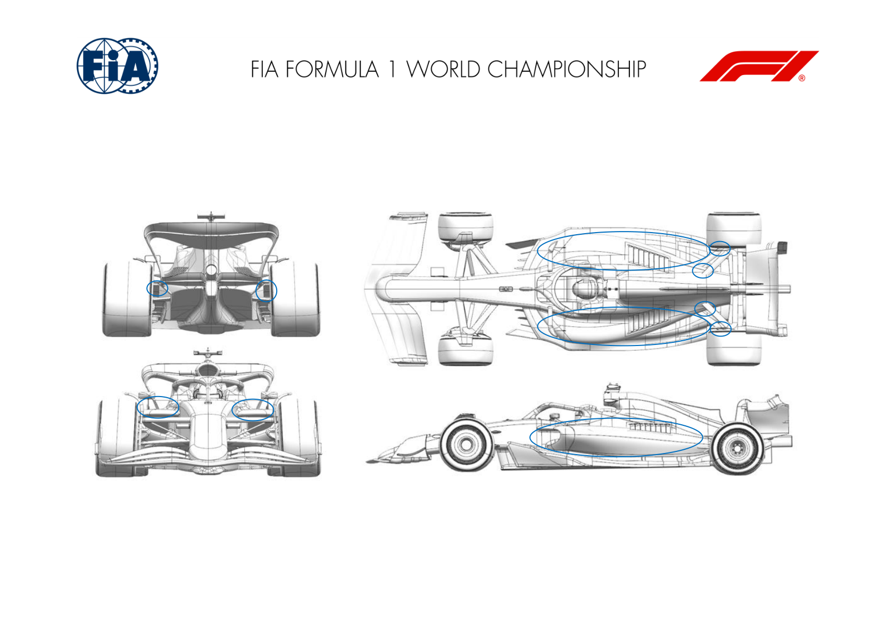
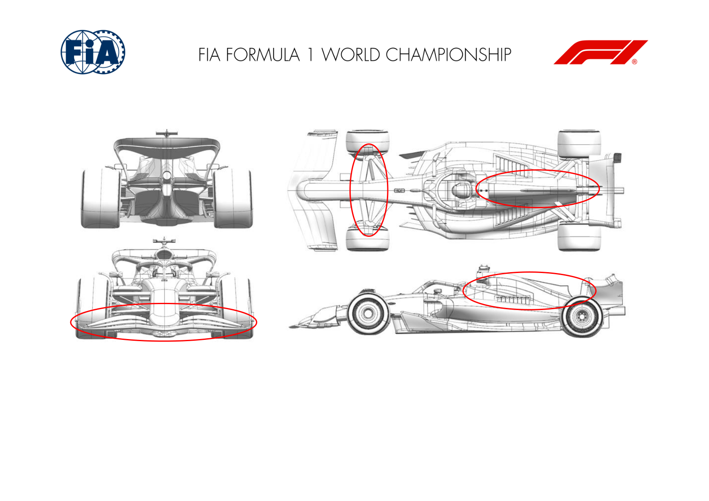
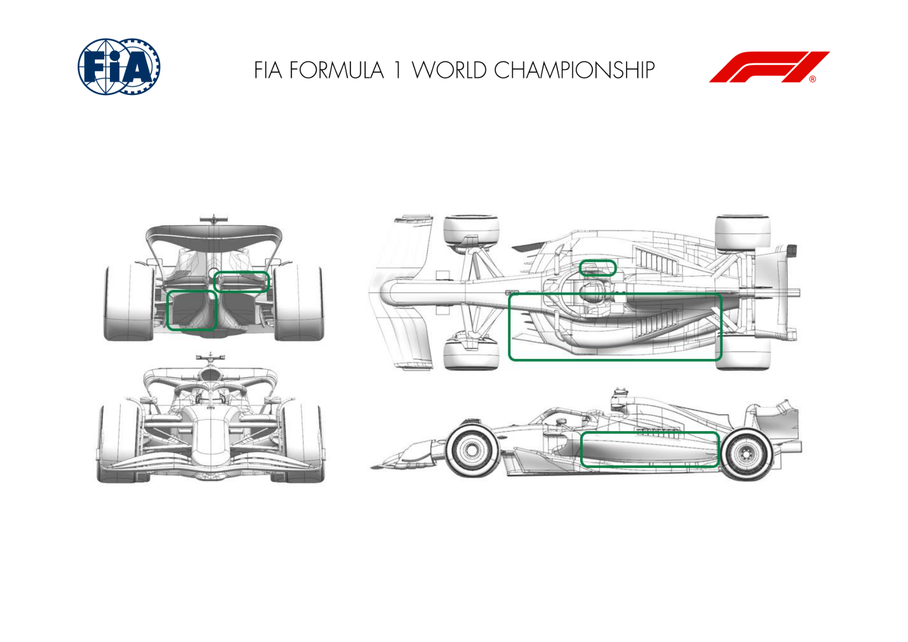
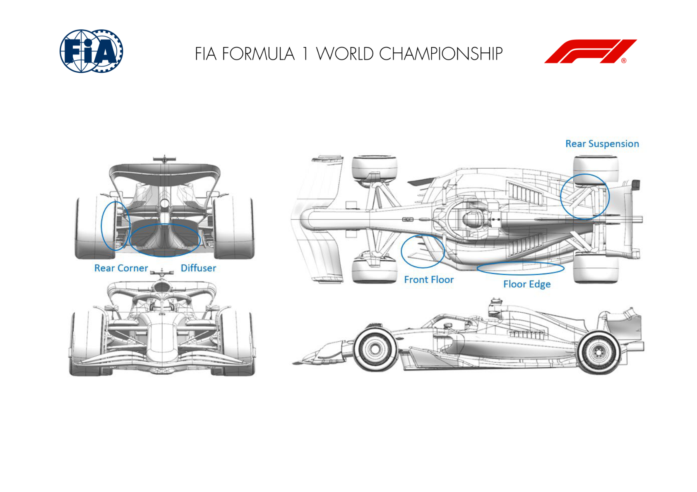
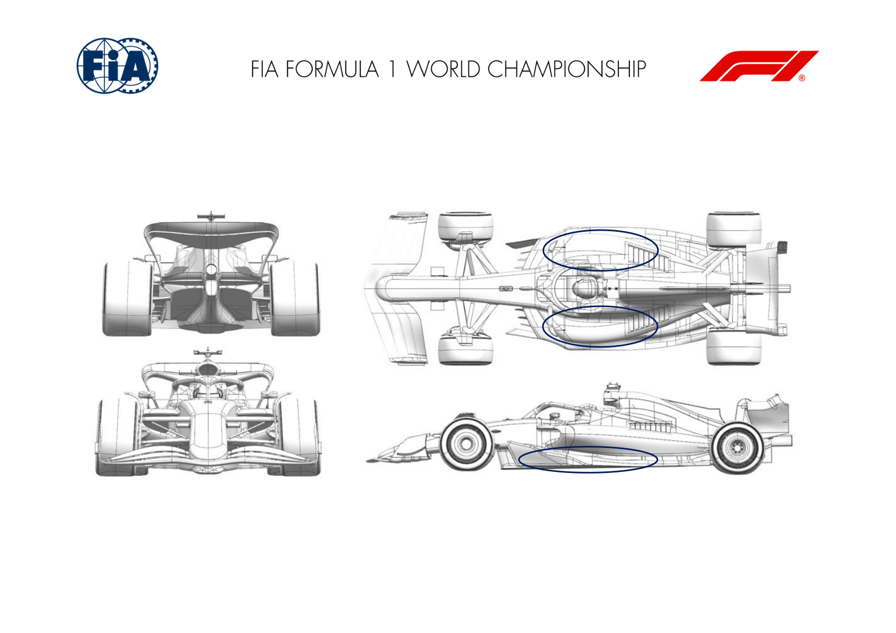

2025 EMILIA ROMAGNA GRAND PRIX

16 - 18 May 2025

From The FIA Formula One Media Delegate Document 8

To All Teams, All Officials Date 16 May 2025

Time 10:58

Title Car Presentation Submissions

Description Car Presentation Submissions

Enclosed 2025 Emilia Romagna Grand Prix - Car Presentation Submissions.pdf

Cameron Kelleher

The FIA Formula One Media Delegate

Car Presentation – Imola Grand Prix

McLaren Formula 1 Team

| No. | Updated component | Primary reason for update | Geometric differences | Description |
| --- | --- | --- | --- | --- |
| 1 | Rear Corner | Performance - Flow Conditioning | Revised Rear Corner | Update to multiple Rear Corner and Suspension conditioning and overall increase in rear aerodynamic load. |
| 2 | Rear Wing | Circuit specific - Drag Range | High Downforce Rear Wing | High Downforce Rear Wing resulting in an efficient increase in aerodynamic load with a more loaded mainplane and flap, suitable for high downforce circuits. |
| 3 | Beam Wing | Circuit specific - Drag Range | High Downforce Beam Wing | In conjunction with the high downforce Rear Wing, a more loaded Beam Wing was developed to efficiently increase aerodynamic load. |
| 4 | Front Suspension | Reliability | Modified Front Suspension | A small modification has been applied to the Front Suspension aiming at increased clearance to other suspension members for improved reliability. |

Car Presentation – Emilia-Romagna Grand Prix

*SCUDERIA FERRARI HP*

| No. | Updated component | Primary reason for update | Geometric differences | Description |
| --- | --- | --- | --- | --- |
| 1 | Rear Corner | Performance - Local Load | Revised scoop geometry and winglet arrangement | This update is not track specific and within the standard development cycle. Geometrical changes are small, nevertheless focused on improving specific flow features, returning local loading benefits. |
| 2 | Rear Wing | Circuit specific - Drag Range | Higher downforce top and lower rear wing profiles This rear wing cluster is carried over from last season and adds up to the pool of available downforce levels. Currently not the prime choice, but covers possible lower grip conditions |  |
| 3 | Beam Wing |  |  |  |

Car Presentation – Imola Grand Prix

Red Bull Racing

| No. | Updated component | Primary reason for update | Geometric differences | Description |
| --- | --- | --- | --- | --- |
| 1 | Coke/Engine Cover | Performance - Local Load | Revised radiator duct inlet and sidepod shape to suit | A re-optimisation of the inlet, surrounding geometry and stays to gain overall aerodynamic efficiency. |
| 2 | Rear Suspension | Performance - Local Load | Revised fairing around one suspension member | Subtle change to better optimise the shape towards the inboard region for a further aerodynamic efficiency gain. |
| 3 | Rear Corner | Performance - Local Load | Revised wheel bodywork inlet and exit ducts Minor changes to tidy up and optimise the local flow fields to gain aerodynamic efficiency |  |

Car Presentation – 2025 Emilia Romagna Grand Prix

*Mercedes-AMG PETRONAS F1 Team*

| No. | Updated component | Primary reason for update | Geometric differences | Description |
| --- | --- | --- | --- | --- |
| 1 | Front Suspension | Performance - Flow Conditioning | Reprofiled suspension fairings | All leg fairings reprofiled to improve aerodynamic robustness in a variety of conditions - improving flow to the rear of the car and consequently floor load. |
| 2 | Front Wing | Performance - Flow Conditioning | Reprofiled front wing elements. | Redistribution of chordwise and spanwise front wing load through element reprofiling, producing a change in upwash field behind the wing resulting in improved onset flow to the rear of the car. |
| 3 | Coke/Engine Cover | Circuit specific - Cooling Range | Subtle change to engine cover shape. | Upper surface geometry change improves onset flow to the rear wing, gaining local load, whilst also improving engine cooling efficiency. |

Car Presentation – Emilia Romagna Grand Prix

Aston Martin Aramco F1 Team

| No. | Updated component | Primary reason for update | Geometric differences | Description |
| --- | --- | --- | --- | --- |
| 1 | Halo | Performance - Local Load | The local detail around the rear halo mounts has been revised with a reduced fin. | Changes to the management of the flow around the cockpit alter the load generated in that area as well as affecting the flow behind this region. |
| 2 | Floor Body | Performance - Local Load | The main body of the floor has evolved slightly with the fences and floor edge. | The revised shapes improve the flowfield under the floor increasing the local load generated on the lower surface and hence performance. |
| 3 | Floor Fences | Performance - Local Load | The fences have revised curvature and local details. | The revised shapes improve the flowfield under the floor increasing the local load generated on the lower surface and hence performance. |
| 4 | Floor Edge | Performance - Local Load | Small changes to the details of the floor edge wing and the main floor inboard of this. | The revised shapes improve the flowfield under the floor increasing the local load generated on the lower surface and hence performance. |
| 5 | Diffuser | Performance - Local Load | The shoulder of the diffuser has been updated. | The revised shapes improve the flowfield under the floor increasing the local load generated on the lower surface and hence performance. |
| 6 | Coke/Engine Cover | Performance - Local Load | Change to the curvature of the coke. | This revised shape is developed alongside the floor edge details to improve the performance of the floor as above. |
| 7 | Beam Wing | Performance - Drag reduction | The beam wing sections are reduced in incidence compared to the previous version. | The reduction in aggression of the beam wing elements reduce downforce but also drag for an overall efficiency improvement at this rear wing level. |

Car Presentation – Emilia Romagna Grand Prix

BWT Alpine F1 Team

| No. | Updated component | Primary reason for update | Geometric differences | Description |
| --- | --- | --- | --- | --- |
| 1 | Front wing | Performance – Local load | Reprofiled front wing and flap | The front wing has been redesigned to redistribute the load across its elements and offer local load gains across its operating range. |
| 2 | Coke/Engine Cover | Performance - Flow Conditioning | Reprofiled rear bodywork panel | The rearward bodywork panel has been reprofiled to improve the flowfield delivery at the rear of the car and gain efficient load. |

w

Car Presentation – 2025 Emilia Romagna Grand Prix

MONEYGRAM HAAS F1 TEAM

| No. | Updated component | Primary reason for update | Geometric differences | Description |
| --- | --- | --- | --- | --- |
| 1 | Floor Body | Performance - Local Load | Front floor contraction shape modified | The new front floor contraction shape facilitates a cleaner flow delivery to the rear end of the car, resulting in higher energy extraction from the floor and, consequently, enhanced performance. |
| 2 | Floor Edge | Performance - Flow Conditioning | Slimmer floor edge | This new floor edge works in conjunction with the front floor contraction to ensure a cleaner flow delivery to the rear. |
| 3 | Diffuser | Performance - Local Load | Expansion rate modified | The altered incoming flow necessitates a new package delivers higher performance across a wide range of ride heights. |
| 4 | Rear Corner | Performance - Local Load | Updated ancillaries and IB drum face shape | The lower element of the rear brake duct now features a revised trim and shape, allowing for local load extraction and better control of the tire wake. Additional load is achieved through a revision of the upper winglets, which now include more elements. |
| 5 | Rear Suspension | Performance - Flow Conditioning | Lower suspension fairing shape | Together with the new top and bottom corner ancillaries also the lower suspension fairing in its surrounding changes. |

Car Presentation – Emilia-Romagna Grand Prix

Visa Cash App Racing Bulls

| No. | Updated component | Primary reason for update | Geometric differences | Description |
| --- | --- | --- | --- | --- |
| 1 | Floor Body | Performance - Local Load | The volume within the underfloor channels has been modified, with subsequent adjustments to the fence camber and floor edge winglet positions. | The channels in the forward floor create local downforce, but also define the downstream flow conditions for the rest of the floor. This update increases local load without degrading this downstream flow. |
| 2 | Coke/Engine Cover | Performance - Flow Conditioning | The undercut shape of the sidepod has been modified, and a chassis winglet added. | The shape of the bodywork undercut has been developed to promote high energy flow towards the back of the car and the floor edge wing. The chassis winglet helps to manage the airflow reaching the rear wing. |

Car Presentation – Emilia - Romagna

*Atlassian Williams Racing*

No updates submitted for this event.

Car Presentation – Emilia Romagna Grand Prix

Stake F1 Team KICK Sauber

No updates submitted for this event.
