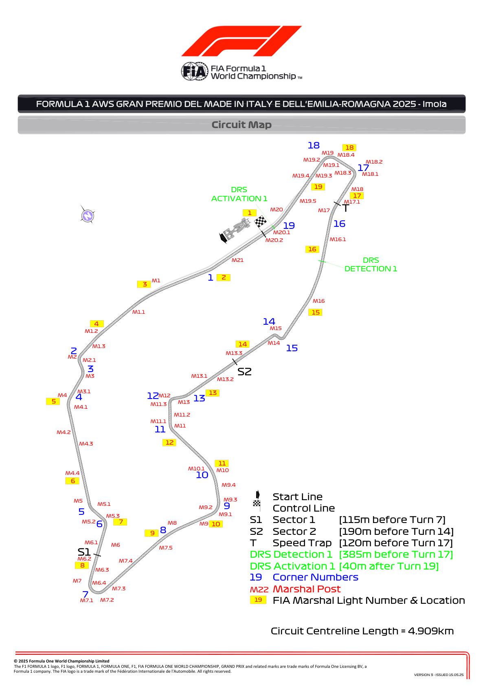
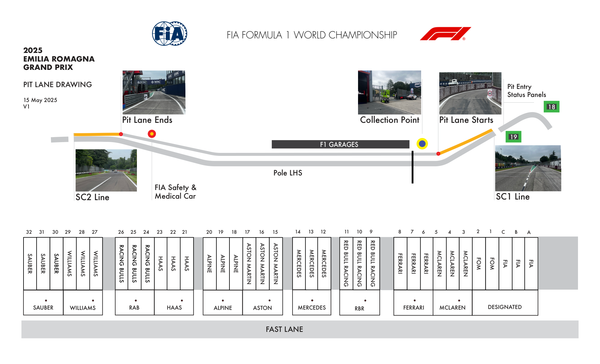
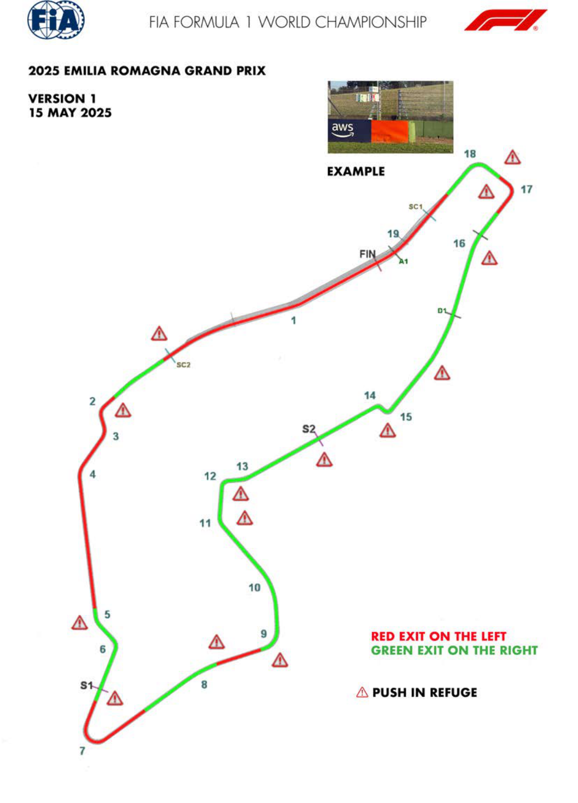
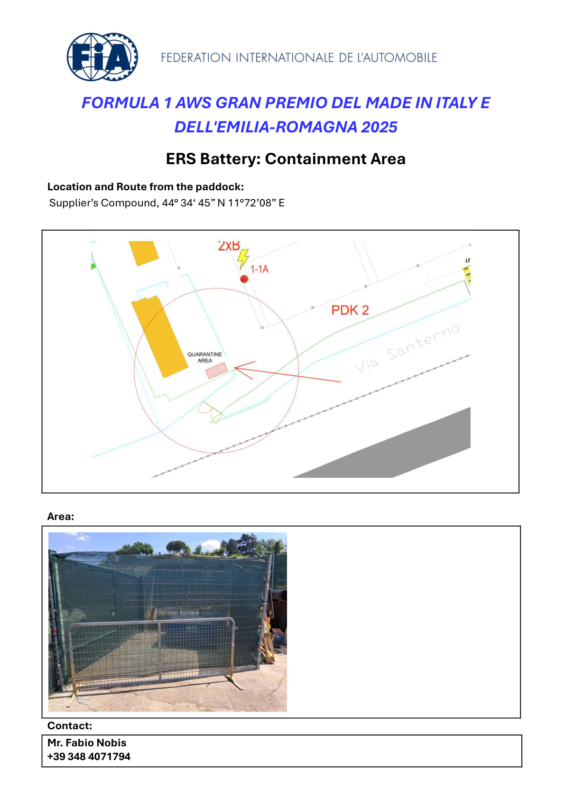
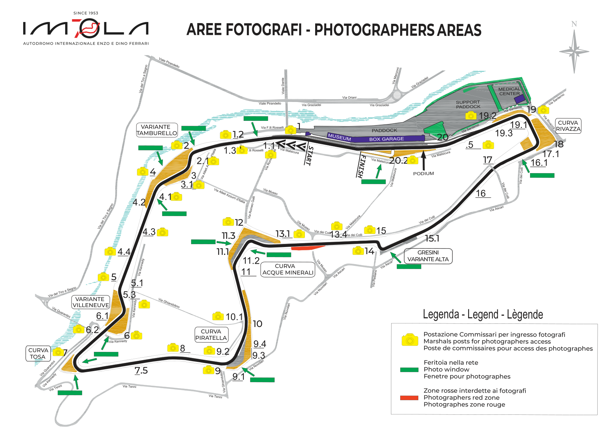

2025 EMILIA ROMAGNA GRAND PRIX

16 - 18 May 2025

From The FIA Formula One Race Director Document 5

To All Teams, All Officials Date 15 May 2025

Time 19:50

Title Race Director Event Notes - Circuit Map, Pit Lane, Emergency Exits, Quarantine Zone and Red Zones

Description Race Director Event Notes - Circuit Map, Pit Lane, Emergency Exits, Quarantine Zone and Red Zones

Enclosed Maps Imola.pdf

Rui Marques

The FIA Formula One Race Director

