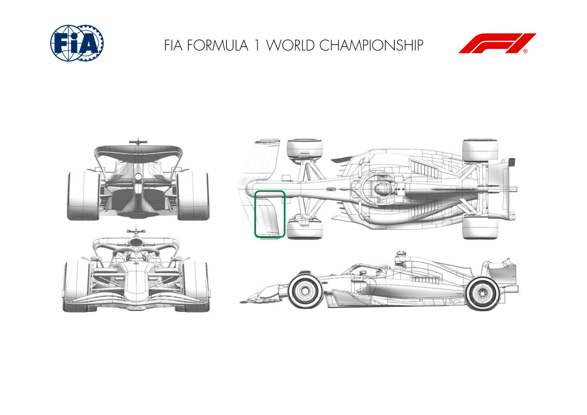
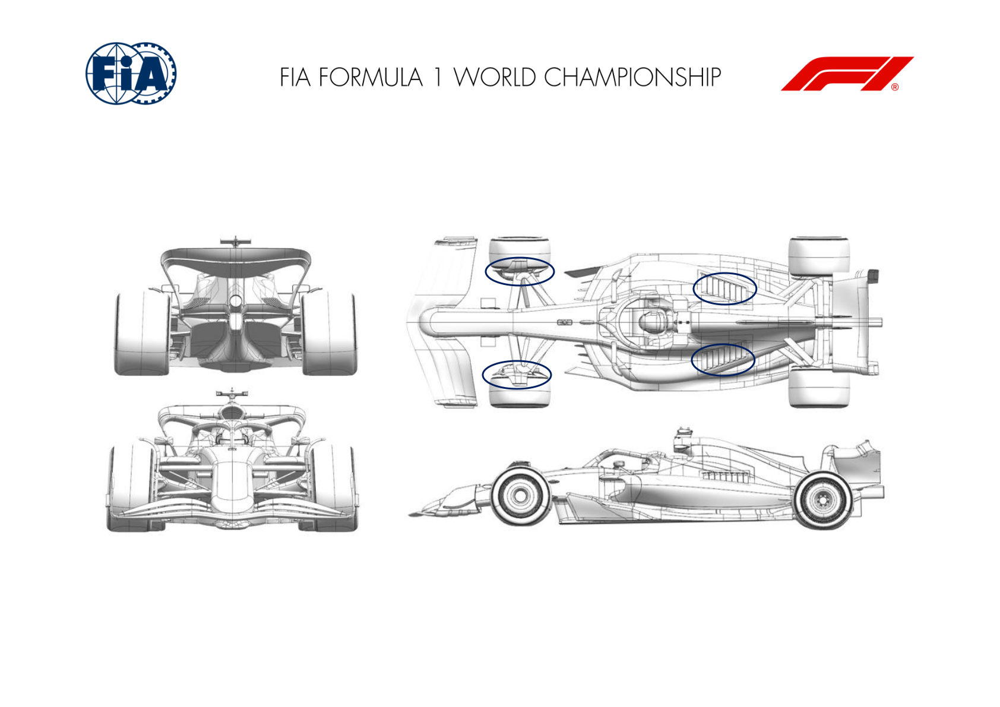

2025 HUNGARIAN GRAND PRIX

01 - 03 August 2025

From The FIA Formula One Media Delegate Document 8

To All Teams, All Officials Date 01 August 2025

Time 10:49

Title Car Presentation Submissions

Description Car Presentation Submissions

Enclosed 2025 Hungarian Grand Prix - Car Presentation Submissions.pdf

Cameron Kelleher

The FIA Formula One Media Delegate

Car Presentation – Hungarian Grand Prix

McLaren Formula 1 Team

No updates submitted for this event.

Car Presentation – Hungarian Grand Prix

*SCUDERIA FERRARI HP*

No updates submitted for this event.

Car Presentation – Hungarian Grand Prix

Red Bull Racing

| No. | Updated component | Primary reason for update | Geometric differences | Description |
| --- | --- | --- | --- | --- |
| 1 | Front Wing | Performance - Local Load | Longer chord front wing flap | Given the expected rear wing level for the Hungaroring circuit, a longer chord second element for the front wing flap has been produced, adding load to the wing. |
| 2 | Front corner | Reliability | Enlarged and re-profiled scoop intake and exit duct | To offer more intake and exit areas to the wheel bodywork for increased brake cooling, the scoop can be larger than previous versions and the exit re profiled to match the inlet. |

Car Presentation – 2025 Hungarian Grand Prix

*Mercedes-AMG PETRONAS F1 Team*

No updates submitted for this event.

Car Presentation – Hungarian Grand Prix

Aston Martin Aramco F1 Team

| No. | Updated component | Primary reason for update | Geometric differences | Description |
| --- | --- | --- | --- | --- |
| 1 | Front Wing | Circuit specific - Balance Range | A new more aggressive front wing flap for the new front wing introduced at the last event. | The more aggressive design increases the total amount of load the wing can generate to be used with the higher downforce rear wing that will be used at this event. |

Car Presentation – Hungarian Grand Prix

BWT Alpine F1 Team

No updates submitted for this event.

Car Presentation – Hungary Grand Prix

*MoneyGram Haas F1 Team*

No updates submitted for this event.

Car Presentation – Hungarian Grand Prix

Visa Cash App Racing Bulls

| No. | Updated component | Primary reason for update | Geometric differences | Description |
| --- | --- | --- | --- | --- |
| 1 | Front Corner | Performance - Flow Conditioning | Updated front corner surfaces. | The shape of the front brake drum components has been modified to improve the flow conditioning of the air passing towards the rear of the car. |
| 2 | Cooling Louvres | Circuit specific - Cooling Range | Larger louvre panel. | The louvre panels used at circuits with high engine cooling requirements have been made larger to increase engine cooling. |

Car Presentation – Hungarian Grand Prix

*ATLASSIAN WILLIAMS RACING*

No updates submitted for this event.

Car Presentation – Hungarian Grand Prix

Stake F1 Team KICK Sauber

No updates submitted for this event.
