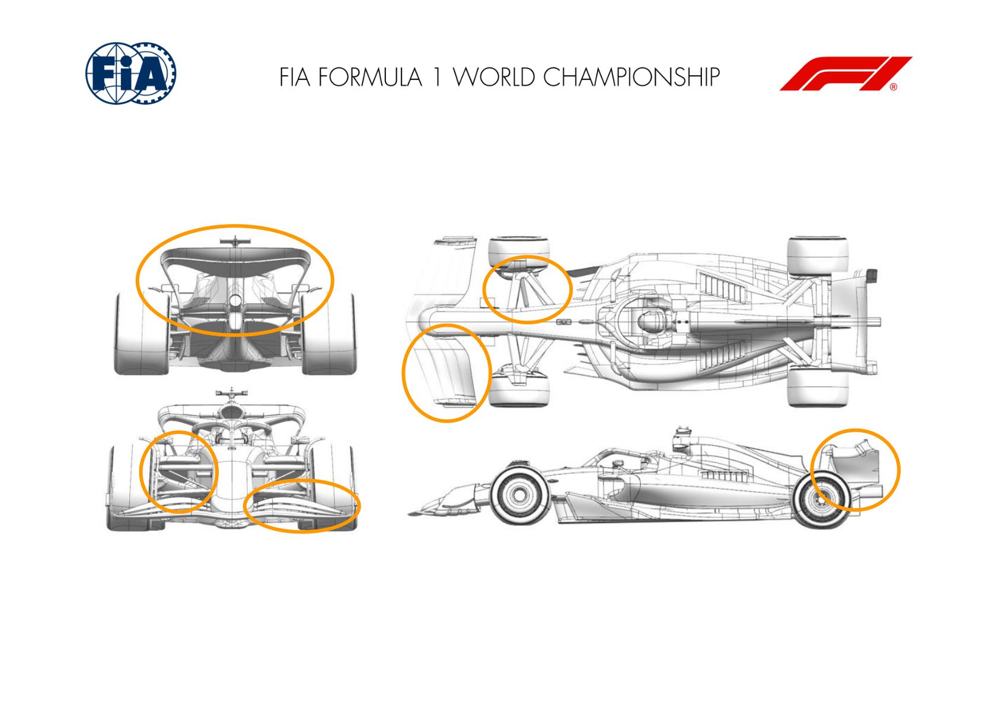
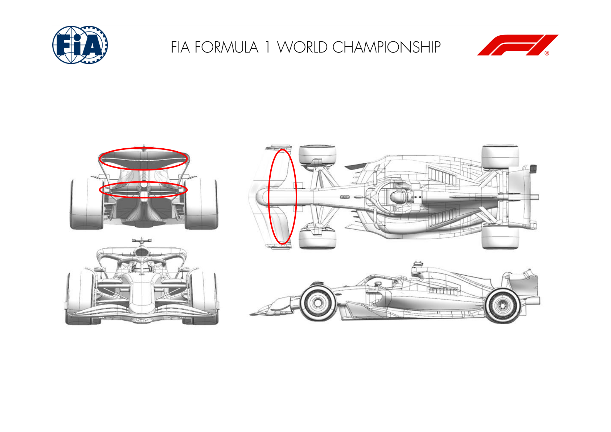
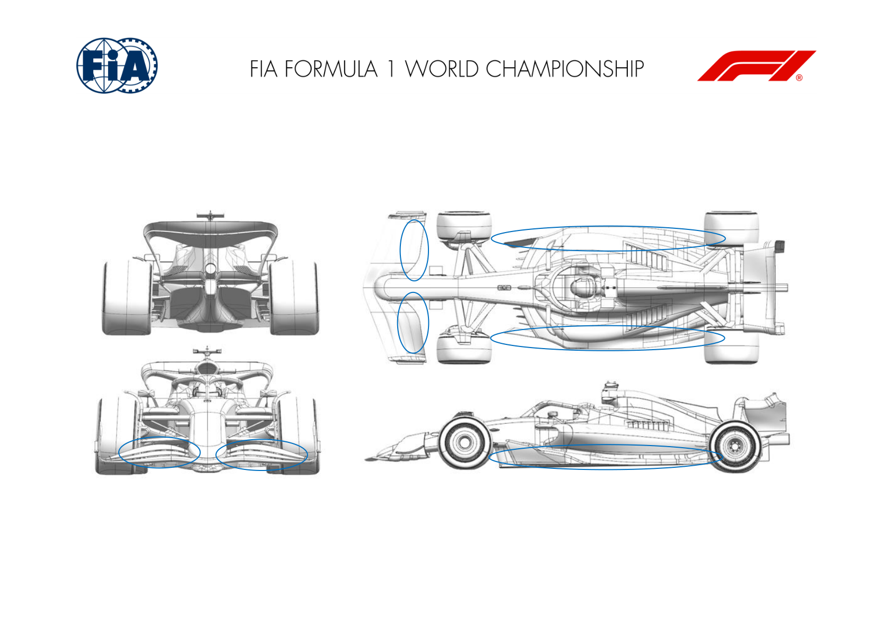
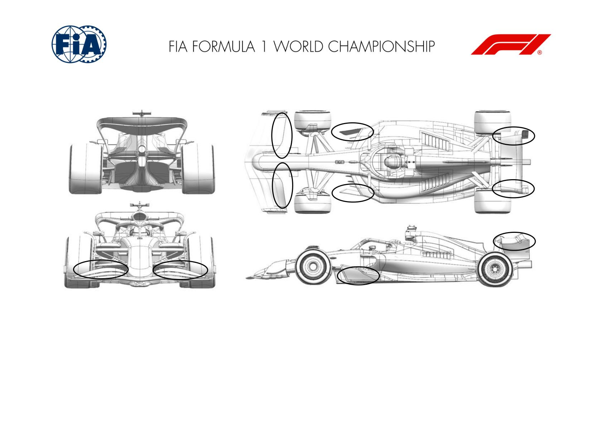
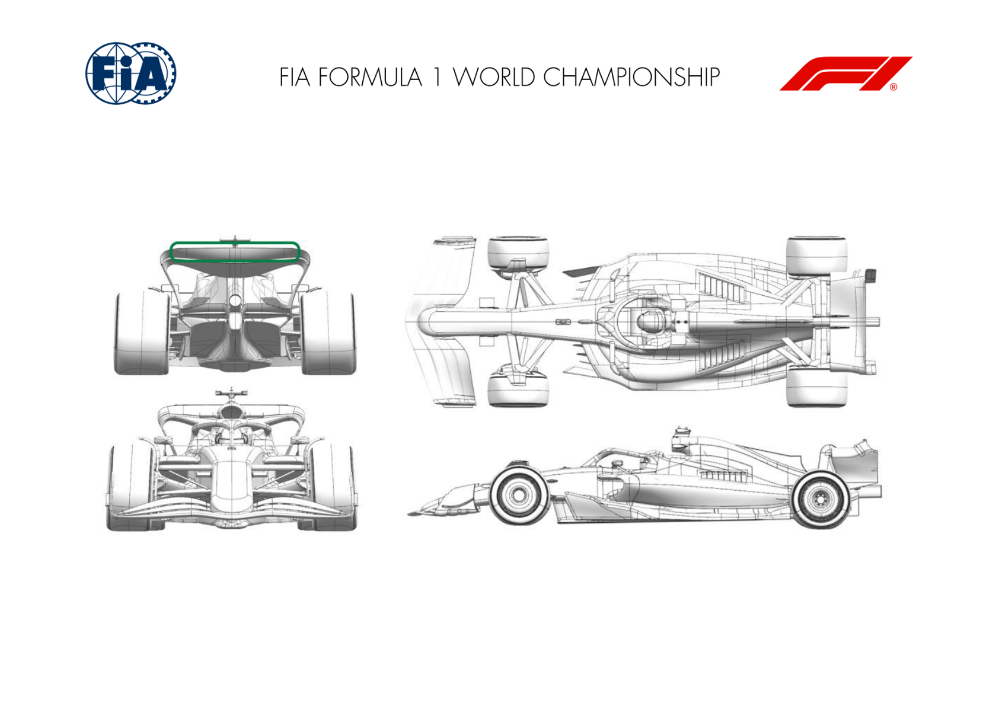
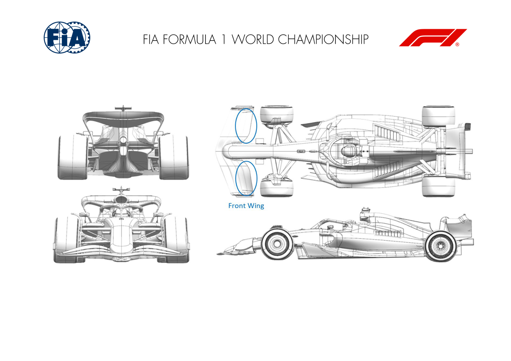
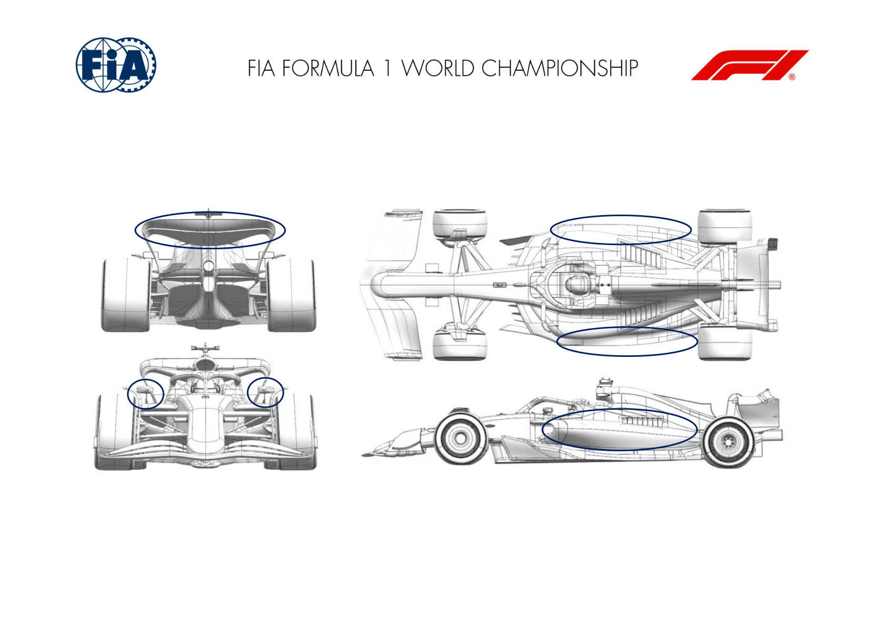
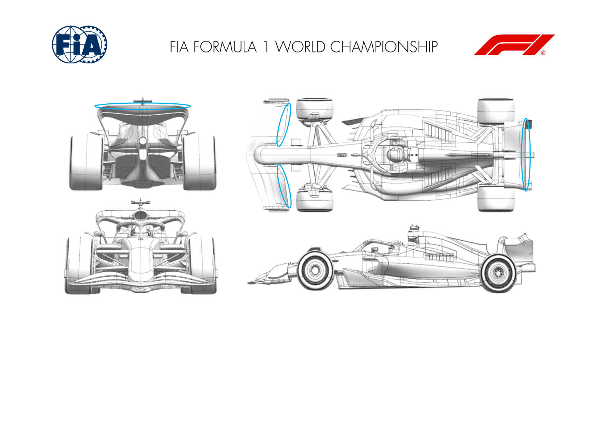

2025 ITALIAN GRAND PRIX

05 - 07 September 2025

From The FIA Formula One Media Delegate Document 8

To All Teams, All Officials Date 05 September 2025

Time 10:56

Title Car Presentation Submissions

Description Car Presentation Submissions

Enclosed 2025 Italian Grand Prix - Car Presentation Submissions.pdf

Cameron Kelleher

The FIA Formula One Media Delegate

Car Presentation – Italian Grand Prix

McLaren Formula 1 Team

| No. | Updated component | Primary reason for update | Geometric differences | Description |
| --- | --- | --- | --- | --- |
| 1 | Front Suspension | Performance - Flow Conditioning | Reprofiled Front Suspension Fairings | The Front Suspension fairings have been reprofiled for improved flow conditioning in combination with the low drag configuration that will be used at this event. |
| 2 | Front Wing | Circuit specific - Balance Range | Trimmed Front Wing Flap | A trim has been applied to the front wing flap in order to extend balance range in combination with the low downforce rear wing. |
| 3 | Rear Wing | Circuit specific - Drag Range | Low Downforce Rear Wing | A new, low downforce rear wing assembly has been developed, efficiently reducing both downforce and drag, suitable for high isochronal circuits. |
| 4 | Rear Wing | Circuit specific - Drag Range | Reduced Chord Rear Wing Flap | Reduced chord rear wing flap providing the ability to reduce drag and downforce further on the aforementioned low downforce assembly. |
| 5 | Beam Wing | Circuit specific - Drag Range | Low Downforce Beam Wing | In conjunction with the new low downforce rear wing assembly, a new, less loaded beam wing has been developed to extend the drag range of this rear wing. |

Car Presentation – Italian Grand Prix

*SCUDERIA FERRARI HP*

| No. | Updated component | Primary reason for update | Geometric differences | Description |
| --- | --- | --- | --- | --- |
| 1 | Front Wing | Circuit specific - Balance Range | Shorter chord front wing flap design | The depowered front wing flap provides the required aero balance range associated to the optimum downforce level anticipated for Monza |
| 2 | Rear Wing | Performance – Drag reduction | Offloaded top rear wing profiles, with flap modulation This top wing and lower beam wing options are carried-over components from last year’s low downforce events. Different top rear wing flap geometries and trim are available, to allow modulation |  |
| 3 | Beam Wing | Performance - Drag reduction | Offloaded single element lower beam wing |  |

Car Presentation – Italian Grand Prix

Red Bull Racing

| No. | Updated component | Primary reason for update | Geometric differences | Description |
| --- | --- | --- | --- | --- |
| 1 | Front Wing | Performance - Local Load | Shorter chord front wing flaps | The nature of the Monza circuit typically sees relatively low levels of rear wing necessitating a consummate change in the front wing. Shortening the chords of the 3rd and 4th elements achieves the target front wing load range |
| 2 | Floor body | Performance - Local Load | Revised floor surfaces. | After a re-optimisation of floor surfaces, subtle changes have been made to extract more load through improved pressure distribution whilst maintaining flow stability |
| 3 | Floor fences | Performance - Local Load | Revised fence geometries | Changed firstly by revisions to the floor body surfaces and then re-optimised for pressure distribution spanwise to extract more load. |
| 4 | Floor edge | Performance - Local Load | Revised floor edge wing profile | Changed to be aligned with the changes to the floor body surfaces which in-turn allowed subtle re profiling to extract locally more load. |

Car Presentation – 2025 Italian Grand Prix

*Mercedes-AMG PETRONAS F1 Team*

| No. | Updated component | Primary reason for update | Geometric differences | Description |
| --- | --- | --- | --- | --- |
| 1 | Rear Wing | Performance – Drag Reduction | A subtle change to the wing tip detail. | Flap tip backed off and camber reduced to drop local downforce and drag; suitable for a high low downforce track such as Monza. |
| 2 | Floor Fences | Performance – Flow Conditioning | Change in camber distribution to outboard fence. | Change in camber distribution redistributes local load and vorticity, resulting in improved onset flow to floor edge and rear floor. |
| 3 | Front Wing | Performance – Local Load | Reduced camber front wing flap. | Reduced camber drops local front wing load to enable an appropriate car balance to be achieved with a low downforce Monza rear wing. |

Car Presentation – Italian Grand Prix

Aston Martin Aramco F1 Team

| No. | Updated component | Primary reason for update | Geometric differences | Description |
| --- | --- | --- | --- | --- |
| 1 | Rear Wing | Circuit specific - Drag Range | A new flap option on an existing rear wing assembly with reduced aggression. | The less aggressive rear wing flap option reduces the load generated by the wing, hence reducing drag to suit the high-speed nature of this circuit. |

Car Presentation – Italian Grand Prix

BWT Alpine F1 Team

No updates submitted for this event.

Car Presentation – 2025 Italian Grand Prix

MONEYGRAM HAAS F1 TEAM

| No. | Updated component | Primary reason for update | Geometric differences | Description |
| --- | --- | --- | --- | --- |
| 1 | Front Wing | Circuit specific - Balance Range | Front Wing Flap with localized shorter chord length | For this low-drag, low-downforce circuit, a front wing flap with slightly reduced chord length will be introduced to achieve the desired aerodynamic balance. |

Car Presentation – Italian Grand Prix

Visa Cash App Racing Bulls

| No. | Updated component | Primary reason for update | Geometric differences | Description |
| --- | --- | --- | --- | --- |
| 1 | Rear Wing | Circuit specific - Drag Range | Updated rear wing profiles. | The upper rear wing has been changed to meet the needs of the target downforce & efficiency level for the circuit. |
| 2 | Floor Body | Performance – Local Load | Underfloor and wing geometry has been updated. | The shape of the underfloor and edge wing has been revised in order to increase the efficient load generated underneath the car. |
| 3 | Coke/Engine Cover | Performance - Flow Conditioning | Bodywork sidepod shape has been updated. | The shape of the bodywork has been revised to improve the flow quality of the air passing around it, and to the rear of the car. |
| 4 | Mirrors | Circuit specific - Drag Range | Updated mirror housing | The mirror geometry has been changed to meet the needs of the target downforce & efficiency level for the circuit. |

Car Presentation – Italian Grand Prix

*ATLASSIAN WILLIAMS RACING*

| No. | Updated component | Primary reason for update | Geometric differences | Description |
| --- | --- | --- | --- | --- |
| 1 | Rear Wing | Performance Drag reduction | There is an optional trim to the trailing edge of the rear wing flap. The reduction in area on the upper flap element leads to lower drag and downforce, which is appropriate for Monza. |  |
| 2 | Front Wing | Circuit specific - Balance Range | There is an optional trim to the trailing edge of the front wing flap. | The reduction in area on the upper flap element leads to lower drag and downforce, which is appropriate for correctly balancing the low drag rear wing options. This front wing trim may be applied irrespective of whether we use the rear wing trim described above. |

Car Presentation – Italian Grand Prix

Stake F1 Team KICK Sauber

No updates submitted for this event.
