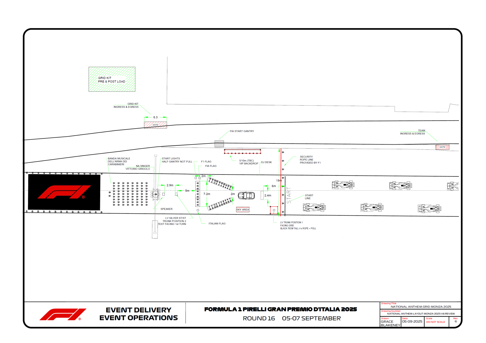

2025 ITALIAN GRAND PRIX

05 - 07 September 2025

From The FIA Formula One Media Delegate Document 32

To All Teams, All Officials Date 07 September 2025

Time 11:23

Title Pre-Race Procedure

Description Pre-Race Procedure

Enclosed 2025 Italian Grand Prix - Pre-Race Procedure.pdf

Cameron Kelleher

The FIA Formula One Media Delegate

2025 I G P TALIAN RAND RIX

5 – 7 September 2025

From The FIA Formula One Media Delegate

To All Officials, All Teams Date 07 September 2025

NOTE TO TEAMS: PRE-RACE PROCEDURE

Please find below a summary of the requirements for the Pre-Race activities and National

Anthem as set out in article 19.4.b) of the FIA Formula One Sporting Regulations: “no less

than sixteen (16) minutes before the scheduled start of the formation lap all drivers must

be present at the front of the grid for the playing of the national anthem.”

14:42:00 Drivers move to National Anthem Position. For the duration of the National

Anthem all Drivers must remain attired only in their race suits.

14:44:00 The National Anthem.

Failure to comply with these procedures will be reported to the Stewards.

Please see the attached National Anthem Diagram.

Cameron Kelleher

The FIA Formula One Media Delegate

